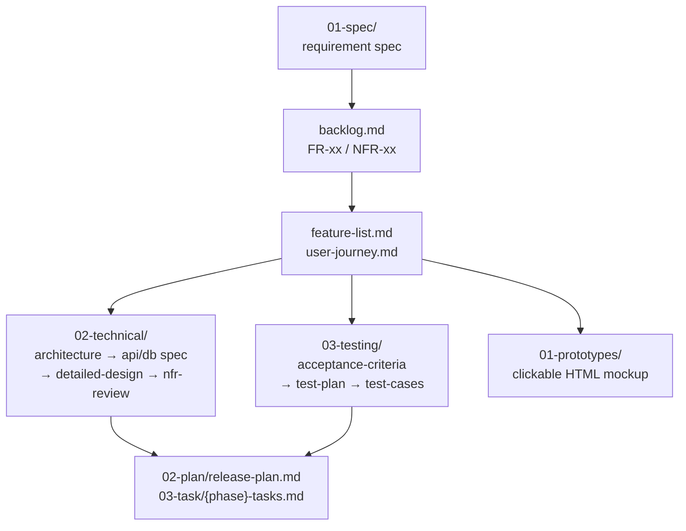

# CrackAI-Field

พื้นที่ทำงานด้าน **requirements & design** สำหรับระบบที่ยังไม่ได้เริ่มพัฒนา — เอกสารทั้งหมดเป็น Markdown ใน [`docs/`](docs/) จัดตามขั้นตอน SDLC และดูแลความสอดคล้องระหว่างชั้นด้วย custom agents/skills ของ Claude Code

> [!NOTE]
> **สถานะปัจจุบัน: ยังไม่มีซอร์สโค้ด** — ไม่มี package manifest, โครงสร้างโค้ด หรือ CI จึงยังไม่มีคำสั่ง build / lint / test ให้รัน
> โครงโฟลเดอร์ `docs/` ถูกวางไว้ครบแล้วแต่ยังว่าง (คงโครงสร้างไว้ด้วยไฟล์ `.gitkeep`) รอเนื้อหาจริงจากขั้นตอน requirement

## ระบบนี้คือระบบอะไร?

**ยังไม่ถูกกำหนด** — ขอบเขต โดเมน และบทบาทผู้ใช้ของระบบถูกนิยามโดยเอกสารใน [`docs/01-requirements/01-spec/`](docs/01-requirements/01-spec/) เท่านั้น ซึ่งตอนนี้ยังไม่มีไฟล์ spec อยู่

เมื่อจะตอบคำถามเกี่ยวกับภาพรวมระบบ ให้เปิดอ่านไฟล์ spec จริงเสมอ **อย่าอนุมานจากชื่อโปรเจกต์หรือจากตัวอย่างโปรเจกต์อื่น** — เอกสารและ agent ในโปรเจกต์นี้ตั้งใจเขียนแบบไม่ผูกกับโดเมนใดโดเมนหนึ่ง เพื่อไม่ให้ล้าสมัยเมื่อขอบเขตเปลี่ยน

## สายงานเอกสาร (documentation pipeline)

เอกสารแต่ละชั้นต้องสอดคล้องกับชั้นก่อนหน้าเสมอ ไล่ตามลำดับนี้:



## โครงสร้างโฟลเดอร์

```
docs/
  00-archived/                  เอกสารที่เลิกใช้/ถูกแทนที่แล้ว
  01-requirements/
    01-spec/                    เอกสารความต้องการ (1 ไฟล์ต่อ 1 หัวข้อ — YYYYMMDD-NN-<slug>.md)
    02-plan/release-plan.md     แผนแบ่ง phase/release ก่อนเริ่ม dev
    03-task/{phase}-tasks.md    การแตกงานย่อยระดับ implementation ต่อ phase
    backlog.md                  สรุป FR/NFR ทั้งหมดจากทุกไฟล์ใน 01-spec/
  02-design/
    01-prototypes/<date>-<n>-<version>/   Clickable HTML prototype
    02-technical/               architecture / api-spec / db-spec / detailed-design / nfr-review
                                technology-stack.md — ยังไม่ตัดสินใจ
    feature-list.md             จัดกลุ่ม FR/NFR เป็นฟีเจอร์ + จัดลำดับความสำคัญแบบ MoSCoW
    user-journey.md             เส้นทางผู้ใช้ตามบทบาท พร้อมแผนภาพ Mermaid
    DESIGN.md                   Design System (สี, ตัวอักษร, ระยะห่าง, UI, accessibility)
  03-testing/
    01-test-plan/               acceptance-criteria / test-plan / test-cases
    02-test-result/             ผลรันทดสอบจริง (รอจนกว่าจะมีซอร์สโค้ด)
  04-retrospectives/
  05-log/{YYYYMMDD}-log.md      บันทึกสรุปงานรายวัน
```

## กติกาที่ใช้ทั้งวอลต์

| หัวข้อ | กติกา |
|---|---|
| รหัสความต้องการ | ทุกข้อมีรหัส `FR-xx` (ฟังก์ชัน) / `NFR-xx` (ไม่ใช่ฟังก์ชัน) — ใช้รหัสนี้อ้างอิงข้ามเอกสารทุกชั้น |
| ระดับความสำคัญ | สูง / กลาง / ต่ำ โดย **"สูง" = ต้องมีใน MVP** — map เป็น MoSCoW ใน `feature-list.md` |
| การอ้างอิงข้ามไฟล์ | ใช้ `[[wikilink]]` แบบ Obsidian และอ้างกลับไปยัง spec ต้นทางเสมอ |
| ชื่อไฟล์ที่มีวันที่ | `YYYYMMDD-NN-<slug>` เพื่อให้เรียงตามลำดับเวลาได้ถูกต้อง |
| ความเป็นกลางทาง tech | เอกสารเทคนิคเขียนแบบ **ไม่ผูก tech stack** จนกว่า `technology-stack.md` จะถูกตัดสินใจ |
| Design System | `DESIGN.md` คือ single source of truth — ถ้าต้องเปลี่ยนสไตล์ ให้แก้ที่นี่ก่อนแล้วค่อยสะท้อนไป prototype |

## การใช้งาน

เปิด [`docs/`](docs/) เป็น **Obsidian vault** เพื่ออ่าน/เขียนแบบเห็น wikilink และ graph view หรือแก้ไขเป็น Markdown ธรรมดาก็ได้

งานเอกสารทำผ่าน [Claude Code](https://claude.com/claude-code) โดยเรียก slash command แทนการแก้ไฟล์เอง เพื่อให้การตรวจ cross-file consistency และการบันทึก log เป็นไปตามรูปแบบเดิม:

| คำสั่ง | หน้าที่ |
|---|---|
| `/capture-requirement` | แปลง requirement ดิบเป็นเอกสาร spec + อัปเดต backlog |
| `/audit-backlog` | ตรวจว่า `backlog.md` ตรงกับ spec ทุกไฟล์หรือไม่ |
| `/sync-feature-journey` | sync `feature-list.md` / `user-journey.md` กับ backlog |
| `/sync-technical-spec` | sync เอกสารเทคนิคทั้งสาย (architecture → nfr-review) |
| `/sync-test-plan` | sync acceptance criteria / test plan / test cases |
| `/build-prototype` | สร้าง/อัปเดต clickable HTML prototype ตาม `DESIGN.md` |
| `/sync-phase-plan` | วางแผนแบ่ง phase + แตก task ก่อนเริ่ม dev |
| `/run-requirements-phase`<br/>`/run-technical-phase`<br/>`/run-prototype-phase` | รวมหลายขั้นตอนในสายเดียวกันไว้ในคำสั่งเดียว |
| `/audit-pipeline` | ตรวจความสอดคล้องทั้งสายงานตั้งแต่ spec ถึงปลายทาง |

รายละเอียดแนวทางการทำงานทั้งหมดอยู่ใน [CLAUDE.md](CLAUDE.md) — agents อยู่ใน [`.claude/agents/`](.claude/agents/) และ skills อยู่ใน [`.claude/skills/`](.claude/skills/)

## เริ่มต้นจากตรงไหน

1. ส่ง requirement ดิบให้ `/capture-requirement` เพื่อสร้างไฟล์ spec แรกใน `docs/01-requirements/01-spec/`
2. รัน `/run-requirements-phase` เพื่อไล่ทำ backlog → feature list → user journey → เอกสารทดสอบ ให้ครบในคำสั่งเดียว
3. เมื่อ requirement นิ่งแล้ว รัน `/run-technical-phase` และ `/sync-phase-plan` ก่อนเริ่มพัฒนาจริง
