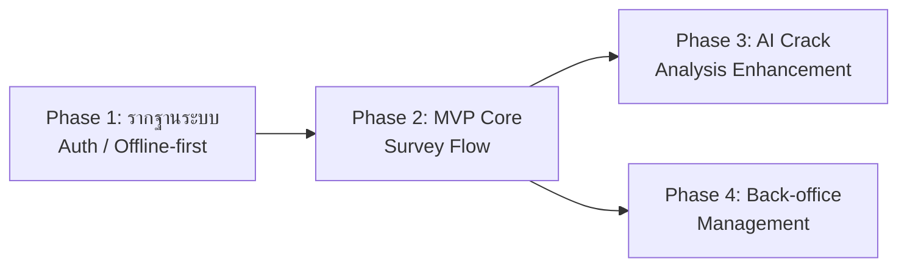

# แผนแบ่ง Phase/Release

เอกสารนี้แปลง [[backlog]] และ [[feature-list]] ให้เป็นแผนแบ่ง phase/release ก่อนเริ่มพัฒนาจริง การจัดกลุ่มอิงจาก [[backlog]] (ระดับความสำคัญ สูง/กลาง/ต่ำ ของแต่ละ FR/NFR) เป็นลำดับตั้งต้น ร่วมกับ [[feature-list]] และ [[user-journey]] (ความสัมพันธ์เชิงธุรกิจระหว่างฟีเจอร์และลำดับการใช้งานจริงของแต่ละบทบาท) เป็นแหล่งอ้างอิงหลักในการปรับลำดับเมื่อพบ dependency ที่บังคับให้บางรหัสต้องทำก่อน-หลังกัน (เช่น การยืนยันตัวตนต้องมาก่อนทุกฟังก์ชันที่ต้องใช้บทบาท หรือสถาปัตยกรรมออฟไลน์ต้องมาก่อนฟีเจอร์ที่พึ่งพาการซิงค์ข้อมูล)

งานย่อยทุกชิ้นในเอกสารนี้และไฟล์ task ที่แตกจากเอกสารนี้เขียนด้วยภาษาเชิงพฤติกรรม/ผลลัพธ์เท่านั้น เพราะเอกสารชั้นนี้เป็นชั้นแผนงานระดับความสามารถ (capability) ไม่ใช่ชั้นออกแบบเชิงเทคนิค — รายละเอียด stack ที่ตัดสินใจแล้วดูได้ที่ `docs/02-design/02-technical/technology-stack.md` และการออกแบบระดับ component ที่ผูกกับ stack นั้นดูได้ที่ `docs/02-design/02-technical/detailed-design/`

อัปเดตล่าสุด: 2026-09-01 (ฉบับแรก แบ่งทั้งหมด 4 phase ครอบคลุม FR-01–FR-31 และ NFR-01–NFR-10 รวม 41 รหัส ครบทุกรายการ ไม่มีรหัสถูกเลื่อนออกนอกแผน)

อัปเดต 2026-09-03: เพิ่ม FR-32, FR-33 (ช่องทางเรียกดู/ค้นหาประวัติการแก้ไข ที่พบว่าขาดหายระหว่าง `/audit-pipeline` ตรวจ NFR-05) เข้า **Phase 4** รวมเป็น **43 รหัส** ครบทุกรายการ ไม่มีรหัสถูกเลื่อนออกนอกแผน

อัปเดต 2026-09-04: เพิ่ม **NFR-11** (Security — PIN Attempt Lockout) เข้า **Phase 1** หลังตรวจพบว่าตกหล่นจากรอบก่อนหน้า แม้ [[backlog]] มีรหัสนี้อยู่แล้วตั้งแต่ 2026-09-03 (เพิ่มพร้อม FR-25–FR-27/NFR-09 ในฟีเจอร์เดียวกันตาม [[feature-list#14. ยืนยันตัวตนและเข้าสู่ระบบ|feature-list ฟีเจอร์ 14]]) รวมเป็น **44 รหัส** ครบทุกรายการ ไม่มีรหัสถูกเลื่อนออกนอกแผน — ดูงานย่อยที่เพิ่มที่ [[phase-1-foundation-auth-offline-tasks]] (แถว T-1-12)

## ภาพรวม

แบ่งเป็น **4 phase** เรียงตามลำดับที่ควรทำก่อน-หลัง:

1. **Phase 1 — รากฐานระบบ: ยืนยันตัวตน สิทธิ์ตามบทบาท และสถาปัตยกรรมออฟไลน์-ซิงค์** (12 รหัส)
2. **Phase 2 — MVP Core: สำรวจและประเมินความเสียหายอาคารแบบออฟไลน์ครบวงจร พร้อมรับรองผลและภาพรวม** (20 รหัส)
3. **Phase 3 — เสริมการวิเคราะห์รอยร้าวด้วย AI และภาพประกอบเพิ่มเติม** (4 รหัส)
4. **Phase 4 — เครื่องมือบริหารจัดการส่วนกลาง: มอบหมายงาน ค้นหา/ส่งออกรายงาน แก้ไขข้อมูลขัดแย้ง และตรวจสอบย้อนหลัง** (8 รหัส)

Phase 3 และ Phase 4 ทั้งคู่ขึ้นกับ Phase 2 เท่านั้น (ไม่ขึ้นกับกันเอง) จึงสามารถทำขนานกันได้หลัง Phase 2 เสร็จ หากทรัพยากรจำกัดและต้องเลือกลำดับ แนะนำทำ Phase 3 ก่อน Phase 4 เพราะ Phase 3 เพิ่มคุณค่าให้ผู้ใช้ภาคสนามที่เป็นบทบาทหลักของระบบโดยตรง ในขณะที่ Phase 4 เป็นเครื่องมือสนับสนุนของบทบาทบริหาร/ส่วนกลาง

**ทุกรหัสใน [[backlog]] (FR-01–FR-33, NFR-01–NFR-11 รวม 44 รายการ) ถูกจัดเข้า phase ใด phase หนึ่งครบถ้วน ไม่มีรหัสใดถูกเสนอให้เลื่อนออกนอกแผน**

## ผังลำดับ Phase

## ตารางสรุป Phase ↔ FR/NFR ↔ เหตุผล

| Phase | รหัสที่ครอบคลุม | เหตุผลการจัดลำดับ |
|---|---|---|
| Phase 1 | FR-21, FR-25, FR-26, FR-27, NFR-01, NFR-02, NFR-03, NFR-04, NFR-07, NFR-08, NFR-09, NFR-11 | FR-25/26/27 (ยืนยันตัวตน+บังคับสิทธิ์) และ FR-21 (จัดการผู้ใช้/บทบาทเพื่อให้ FR-26 มีบทบาทให้ตรวจสอบจริง) เป็นจุดเริ่มต้นของทุก journey ใน [[user-journey]] — NFR-01–04 (offline-first, ประสิทธิภาพ, ตรวจจับ/merge ความขัดแย้งอัตโนมัติ, ใช้งานได้บนอุปกรณ์ภาคสนาม) เป็นข้อจำกัดเชิงสถาปัตยกรรมที่ทั้งระบบต้องออกแบบรอบข้อนี้ตั้งแต่ต้น หากเลื่อนไป phase หลังจะต้องรื้อสถาปัตยกรรมทั้งระบบ จึงดันขึ้นมาก่อนแม้ NFR-07 (scalability) จะเป็นระดับกลางในบทหลัก เพราะเป็นความจุของ sync engine ตัวเดียวกับ NFR-01–04 แยกออกแบบทีหลังไม่ได้จริง — NFR-08/09 ผูกตรงกับกลไก login/RBAC/session หมดอายุขณะออฟไลน์ที่ต้องมีตั้งแต่ phase นี้ — **NFR-11 (เพิ่ม 2026-09-04, ตกหล่นจากรอบก่อนหน้า)** เป็นกลไกเสริมของ FR-27/NFR-09 โดยตรง (จำกัดจำนวนครั้งที่กรอก PIN ผิดก่อนล้าง credential/PIN ที่แคชไว้) ตาม [[feature-list#14. ยืนยันตัวตนและเข้าสู่ระบบ|feature-list ฟีเจอร์ 14]] ที่จัดรหัสนี้ไว้ในหมวดเดียวกัน จึงต้องอยู่ phase เดียวกับ T-1-04/T-1-05 ที่มันพึ่งพาโดยตรง แยกไป phase หลังจะทำให้ช่องโหว่การไล่เดา PIN เปิดอยู่ตลอด Phase 2-4 |
| Phase 2 | FR-01, FR-02, FR-03, FR-04, FR-05, FR-06, FR-07, FR-08, FR-09, FR-10, FR-11, FR-12, FR-16, FR-17, FR-18, FR-19, FR-22, FR-29, NFR-05, NFR-06 | ส่งมอบคุณค่าทางธุรกิจครบวงจรโดยไม่ต้องพึ่ง AI (FR-29 คือเส้นทางปกติของการประเมินรอยร้าวตามที่ spec กำหนด ไม่ใช่ทางสำรอง) — ดึง NFR-06 (ความแม่นยำ GPS/ภาพถ่าย) มาคู่กับ FR-02 เพราะผูกกันโดยตรง — ดึง FR-07/FR-09 (ระดับกลางในบทหลัก) ขึ้นมารวมกับ FR-05/06/08 เพราะเป็นหมวดเดียวกันของแบบฟอร์มประเมิน 10 หมวด และ FR-10 (สรุปผลระดับสี) ต้องพึ่งข้อมูลครบทุกหมวดจึงคำนวณได้ถูกต้อง แยกไปทำทีหลังจะเสี่ยงให้ตรรกะสรุปผลไม่สมบูรณ์ — ดึง FR-17 ขึ้นมาคู่ FR-16 ตามที่ [[feature-list]] เองจัดเป็นฟีเจอร์เดียวกัน — FR-18/19 + NFR-05 (ลายเซ็นดิจิทัล + audit trail) อยู่ phase นี้เพราะเป็นข้อกำหนดที่ย้อนไปเติมทีหลังยาก ต้องออกแบบคู่กับ flow การรับรองผลตั้งแต่ต้น — FR-22 (dashboard) ปิดท้าย phase นี้เพื่อพิสูจน์ว่าข้อมูลไหลจบวงจรได้จริงตั้งแต่กรอกจนถึงภาพรวม |
| Phase 3 | FR-13, FR-14, FR-15, FR-28 | เป็นค่าเสริม (AI ประมาณความกว้างรอยร้าว + human-in-the-loop + fallback เมื่อ AI ล้มเหลว) บน flow ที่ใช้งานได้เต็มรูปแบบแล้วใน Phase 2 (ผ่าน FR-29) จึงเลื่อนมาทีหลังได้อย่างปลอดภัยโดยไม่กระทบความสามารถหลักของระบบ — FR-15 (วาดภาพประกอบเพิ่มเติม, Should have) จัดไว้ phase เดียวกันเพราะเป็นการเสริมหน้าจอบันทึกภาพ/ความเสียหายชุดเดียวกัน เป็น additive ความเสี่ยงต่ำเช่นเดียวกับ AI |
| Phase 4 | FR-20, FR-23, FR-24, FR-30, FR-31, FR-32, FR-33, NFR-10 | งานบริหารจัดการ back-office ของหัวหน้าผู้สำรวจ/ผู้ดูแลระบบ/หน่วยงานส่วนกลาง ต่อยอดจาก dashboard ใน Phase 2 — FR-30/31 (แก้ไขความขัดแย้งด้วยมือ) เกิดขึ้นได้จริงก็ต่อเมื่อมีการซิงค์จากหลายอุปกรณ์ผ่านมาแล้วจริงใน Phase 1-2 จึงเหมาะเป็น phase หลัง — NFR-10 ต้องพึ่งสถานะ "รอแก้ไขความขัดแย้ง" จาก FR-30 โดยตรง (กันระเบียนขัดแย้งไม่ให้ถูกนับใน dashboard/รายงาน) จึงต้องอยู่ phase เดียวกัน และมีผลต่อ FR-23 (ส่งออกรายงาน) ด้วยเช่นกัน — FR-20 (มอบหมายงาน) แม้เชิงตรรกะควรมาก่อนการสำรวจ แต่เป็น Should have ที่ไม่บล็อกการสำรวจแบบ ad hoc จึงจัดไว้ร่วมกับงาน back-office อื่นของบทบาทเดียวกัน — **FR-32/FR-33 (เพิ่ม 2026-09-03, ระดับกลางทั้งคู่)** เป็นกลไก "อ่าน" ประวัติที่คู่กับ NFR-05 (กลไก "เขียน" ที่วางไว้ใน Phase 2 แล้ว) ต้องพึ่งเหตุการณ์ที่เกิดจากแทบทุก phase ก่อนหน้า ได้แก่ การซิงค์สำเร็จ/ตรวจพบความขัดแย้งจาก Phase 1, การรับรอง/ส่งกลับแก้ไข (FR-18/19) จาก Phase 2, การแก้ไขผลวิเคราะห์ AI (FR-14) จาก Phase 3 และการแก้ไขความขัดแย้งด้วยมือ (FR-31) ที่อยู่ phase เดียวกันนี้เอง — เนื่องจาก FR-31 คือชิ้นสุดท้ายของห่วงโซ่ dependency และสิทธิ์การเข้าถึงของทั้งคู่ (หัวหน้าผู้สำรวจเฉพาะทีม/อาคารตน, ผู้ดูแลระบบ, หน่วยงานส่วนกลาง) ตรงกับกลุ่มบทบาท back-office เดียวกับรหัสอื่นใน Phase 4 ทุกประการ จึงจัดไว้ต่อท้าย Phase 4 แทนที่จะตั้ง Phase 5 ใหม่ (ซึ่งจะต้องรอทั้ง Phase 3 และ Phase 4 มาบรรจบ ทำลายคุณสมบัติ "Phase 3/4 ทำขนานกันได้" ของแผนเดิมโดยไม่จำเป็นสำหรับรหัสระดับกลางเพียง 2 รายการ) — FR-33 มีลักษณะเป็นเครื่องมือค้นหา/กรองแบบเดียวกับ FR-24 เพียงเปลี่ยนขอบเขตข้อมูลจากรายการอาคารเป็นประวัติการแก้ไขทั่วทั้งระบบ — **ข้อควรระวังเชิงลำดับ:** หน้าประวัติของ FR-32 จะแสดงเหตุการณ์แก้ไขผล AI ได้ครบก็ต่อเมื่อ Phase 3 ทำเสร็จแล้วเช่นกัน หากทีมเลือกทำ Phase 4 ก่อน Phase 3 (สลับจากลำดับที่แนะนำไว้ด้านบน) หน้าประวัติจะยังไม่มีเหตุการณ์ประเภทนี้ให้ดูจนกว่า Phase 3 จะเสร็จ จึงยิ่งสนับสนุนคำแนะนำเดิมว่าควรทำ Phase 3 ก่อน Phase 4 เมื่อทรัพยากรจำกัด |

## รายละเอียดต่อ Phase

### Phase 1 — รากฐานระบบ: ยืนยันตัวตน สิทธิ์ตามบทบาท และสถาปัตยกรรมออฟไลน์-ซิงค์

รหัสที่ครอบคลุม: FR-21, FR-25, FR-26, FR-27, NFR-01, NFR-02, NFR-03, NFR-04, NFR-07, NFR-08, NFR-09, NFR-11

Exit criteria:
- ทุกบทบาทเข้าสู่ระบบ/ออกจากระบบได้ทั้งขณะออนไลน์และออฟไลน์ (credential/session ที่แคชไว้มีอายุการใช้งานจำกัดตามที่กำหนด และบังคับยืนยันตัวตนใหม่เมื่อครบกำหนดหรือกลับมามีสัญญาณ)
- เมื่อผู้ใช้กรอก PIN ผิดติดต่อกันครบเกณฑ์จำนวนครั้งสูงสุดที่กำหนด (ตัวเลขที่แน่นอนรอการยืนยันจากผู้ใช้ — ดูหมายเหตุใน [[phase-1-foundation-auth-offline-tasks]] แถว T-1-12) ระบบล้าง credential/PIN/เซสชันที่แคชไว้บนอุปกรณ์ทันทีและบังคับให้เข้าสู่ระบบใหม่ด้วยรหัสผ่านเมื่อมีสัญญาณ โดยข้อมูลแบบสำรวจและคิวรอซิงค์ที่บันทึกไว้บนอุปกรณ์เดียวกันต้องไม่ถูกลบหรือกระทบจากการล้างนี้โดยเด็ดขาด
- ผู้ดูแลระบบสร้าง/แก้ไข/ปิดการใช้งานบัญชีผู้ใช้และกำหนดบทบาทได้ และระบบแสดง/อนุญาตเฉพาะฟังก์ชัน-หน้าจอที่ตรงกับบทบาทหลังเข้าสู่ระบบถูกต้อง
- อุปกรณ์ภาคสนามบันทึก/แก้ไขข้อมูลลงที่เก็บข้อมูลบนอุปกรณ์ได้ขณะไม่มีสัญญาณอินเทอร์เน็ต และซิงค์ข้อมูล/ไฟล์ภาพอัตโนมัติเมื่อกลับมามีสัญญาณ ตามเป้าหมายด้านความเร็ว/ความเสถียรที่กำหนด
- ระบบตรวจจับและรวม (merge) ข้อมูลที่แก้ไขจากหลายอุปกรณ์โดยอัตโนมัติเมื่อไม่ขัดแย้งกัน และตั้งสถานะรอแก้ไขด้วยมือเมื่อ merge อัตโนมัติไม่ได้
- ระบบรองรับหลายทีม/อุปกรณ์ซิงค์ข้อมูลพร้อมกันจำนวนมากโดยไม่ลดทอนความเสถียร และจำกัดการเข้าถึงข้อมูลเฉพาะผู้ใช้ที่มีสิทธิ์ตามบทบาท

รายละเอียดงานย่อย: [[phase-1-foundation-auth-offline-tasks]]

### Phase 2 — MVP Core: สำรวจและประเมินความเสียหายอาคารแบบออฟไลน์ครบวงจร พร้อมรับรองผลและภาพรวม

รหัสที่ครอบคลุม: FR-01, FR-02, FR-03, FR-04, FR-05, FR-06, FR-07, FR-08, FR-09, FR-10, FR-11, FR-12, FR-16, FR-17, FR-18, FR-19, FR-22, FR-29, NFR-05, NFR-06

Exit criteria:
- ผู้สำรวจภาคสนามบันทึกข้อมูลอาคาร (ทั่วไป พิกัด GPS ตามเกณฑ์ความแม่นยำที่กำหนด ลักษณะทางกายภาพ อันตรายจากสภาพแวดล้อมโดยรอบ) ได้ครบขณะออฟไลน์
- ผู้สำรวจบันทึกความเสียหายครบทุกหมวดของแบบฟอร์ม (ภายนอกอาคาร โครงสร้างแยกตามวัสดุ/ตำแหน่ง โครงหลังคา ส่วนประกอบอาคาร ระบบไฟฟ้า) และเห็นสรุปผลเป็น 3 ระดับสี (เขียว/เหลือง/แดง) พร้อมเปิดดูเกณฑ์อ้างอิงจากคู่มือประกอบการตัดสินใจได้
- ผู้สำรวจถ่ายภาพประกอบความเสียหายผูกกับตำแหน่ง/บริเวณ และกรอกระดับความเสียหายของรอยร้าวด้วยตนเองได้โดยไม่ต้องพึ่ง AI
- บันทึกข้อมูลผู้สำรวจ/หัวหน้าผู้สำรวจ และเวลาเริ่ม/แล้วเสร็จของการสำรวจแต่ละอาคารได้
- หัวหน้าผู้สำรวจตรวจทานผลการสำรวจของทีม ส่งกลับแก้ไขได้ และลงลายมือชื่อดิจิทัลรับรองผลสรุปได้ พร้อมมีประวัติการแก้ไขผลเก็บไว้ตรวจสอบย้อนหลัง
- หน่วยงานส่วนกลางเห็นภาพรวมจำนวนอาคารที่สำรวจแล้วและสัดส่วนตามระดับสี แยกตามพื้นที่ ใน dashboard ได้
- ถือเป็น MVP ที่ส่งมอบคุณค่าทางธุรกิจได้ครบวงจรโดยไม่ต้องพึ่ง AI

รายละเอียดงานย่อย: [[phase-2-mvp-core-survey-flow-tasks]]

### Phase 3 — เสริมการวิเคราะห์รอยร้าวด้วย AI และภาพประกอบเพิ่มเติม

รหัสที่ครอบคลุม: FR-13, FR-14, FR-15, FR-28

Exit criteria:
- ผู้สำรวจเลือกให้ระบบวิเคราะห์ภาพรอยร้าวเพื่อประมาณความกว้างและเสนอระดับความเสียหายเป็นค่าตั้งต้นได้
- ผู้สำรวจต้องยืนยันหรือแก้ไขผลวิเคราะห์เสมอก่อนบันทึกเป็นผลจริง (human-in-the-loop) ห้ามบันทึกผลสรุปสุดท้ายโดยอัตโนมัติ
- เมื่อการวิเคราะห์ไม่สำเร็จ ระบบแจ้งสาเหตุให้ผู้สำรวจทราบชัดเจนและเสนอทางเลือกถ่ายภาพใหม่ทันทีในหน้างานเดียวกัน หรือกรอกระดับความเสียหายด้วยตนเองแทนได้โดยงานสำรวจไม่หยุดชะงัก
- ผู้สำรวจวาด/เขียนภาพประกอบเพิ่มเติมนอกเหนือจากภาพถ่ายได้

รายละเอียดงานย่อย: [[phase-3-ai-crack-analysis-tasks]]

### Phase 4 — เครื่องมือบริหารจัดการส่วนกลาง: มอบหมายงาน ค้นหา/ส่งออกรายงาน แก้ไขข้อมูลขัดแย้ง และตรวจสอบย้อนหลัง

รหัสที่ครอบคลุม: FR-20, FR-23, FR-24, FR-30, FR-31, FR-32, FR-33, NFR-10

Exit criteria:
- หัวหน้าผู้สำรวจสร้างและมอบหมายรายการอาคาร/พื้นที่ที่ต้องสำรวจให้สมาชิกทีมได้
- ผู้ใช้ค้นหา/กรองรายการอาคารที่สำรวจแล้วตามพื้นที่ ระดับสี ช่วงวันที่ หรือผู้สำรวจได้
- หน่วยงานส่วนกลางส่งออกผลการสำรวจรายอาคารหรือสรุปภาพรวมเป็นไฟล์ได้
- หัวหน้าผู้สำรวจ/ผู้ดูแลระบบเห็นรายการระเบียนที่มีความขัดแย้งของข้อมูลรอการแก้ไขด้วยมือ เปรียบเทียบทุกเวอร์ชันที่ขัดแย้งกันแบบเคียงข้างกัน แล้วเลือกเก็บค่าจากเวอร์ชันใดเวอร์ชันหนึ่งทั้งหมดหรือรวมค่าเป็นรายฟิลด์ก่อนปลดสถานะขัดแย้งได้
- ระเบียนที่ยังค้างสถานะขัดแย้งต้องไม่ถูกนับรวมใน dashboard หรือรายงานที่ส่งออกจนกว่าจะแก้ไขเสร็จ
- หัวหน้าผู้สำรวจ (เฉพาะทีม/อาคารของตน) ผู้ดูแลระบบ และหน่วยงานส่วนกลาง เรียกดูประวัติการแก้ไขผลประเมินรายอาคารเรียงตามลำดับเวลาได้ ครอบคลุมเหตุการณ์แก้ไขผลวิเคราะห์ AI รับรอง/ส่งกลับแก้ไขผล แก้ไขความขัดแย้งด้วยมือ และเหตุการณ์ซิงค์สำเร็จ/ตรวจพบความขัดแย้งที่ระบบบันทึกเอง
- ผู้ดูแลระบบและหน่วยงานส่วนกลางค้นหา/กรองประวัติการแก้ไขทั่วทั้งระบบตามช่วงเวลา ผู้แก้ไข ประเภทการกระทำ หรือพื้นที่ได้

รายละเอียดงานย่อย: [[phase-4-backoffice-management-tasks]]

## อ้างอิง

- [[backlog]] — แหล่งความจริงของ FR/NFR ทั้งหมด
- [[feature-list]] — การจัดกลุ่ม FR/NFR เป็นฟีเจอร์ที่มีความหมายต่อผู้ใช้
