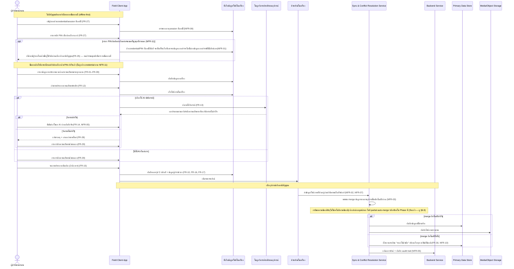
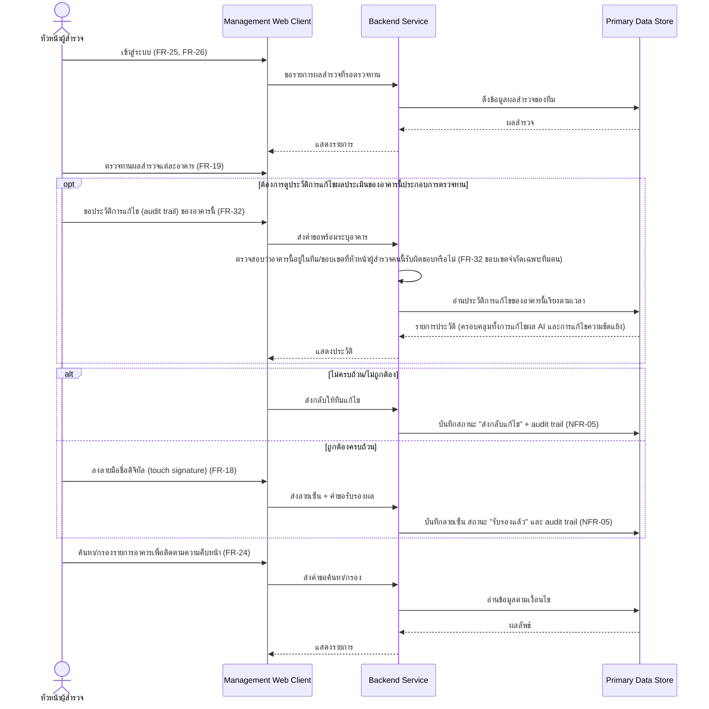
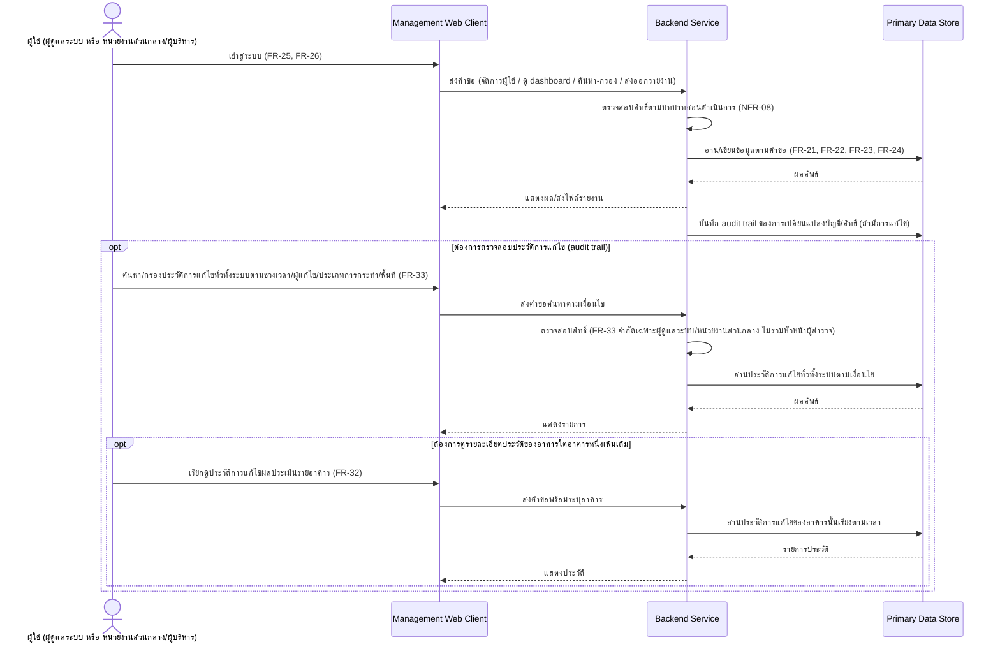
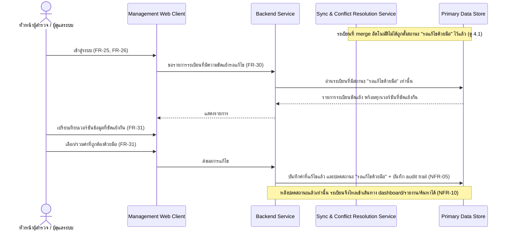

# สถาปัตยกรรมระบบ (Architecture)

เอกสารนี้อธิบายสถาปัตยกรรมระดับ **logical/conceptual** ของระบบสำรวจความเสียหายขั้นต้นของโครงสร้างอาคารหลังอุทกภัย โดยอิงจาก [[feature-list]] และ [[user-journey]] (ซึ่งอิงจาก [[backlog]] และ [[20260828-01-flood-damage-survey]])

> **หมายเหตุสำคัญ (ปรับปรุง 2026-09-03, เพิ่มเติม 2026-09-04)**: `technology-stack.md` มีเนื้อหาแล้ว (ดู [[technology-stack]]) — ตัดสินใจแล้ว 6 ชั้น (Field Client Framework, Local Persistent Store, Server-side Runtime, Primary Data Store, Media/Object Storage, **Protocol/Web Framework → REST over HTTP + Fastify — ปิดเพิ่มเมื่อ 2026-09-04**) เอกสารนี้ยังคง**จงใจ**ใช้ชื่อ **component เชิงตรรกะ** เป็นหลักต่อไป — ไม่ใช่เพราะยังไม่มีการตัดสินใจ tech stack อีกต่อไป แต่เพราะสถาปัตยกรรมระดับนี้ควรอ่านเข้าใจและใช้งานได้ต่อแม้ stack จะเปลี่ยนในอนาคต ชื่อ stack จริงจะถูกอ้างอิงเฉพาะจุดที่การรู้ชื่อจริงเปลี่ยนความเข้าใจของผู้อ่านอย่างมีนัยสำคัญเท่านั้น (ดูรายละเอียดการตัดสินใจแต่ละชั้นและเหตุผลที่ [[technology-stack]]) นอกจากนี้ผู้ใช้ยังปิดการตัดสินใจเชิงสถาปัตยกรรมเพิ่มอีก 3 ข้อเมื่อ 2026-09-04: กลยุทธ์การจัดการความขัดแย้งของข้อมูล (NFR-03 — ดู [[#6.9 กลยุทธ์การจัดการความขัดแย้งของข้อมูล เมื่อ merge อัตโนมัติไม่ได้ (NFR-03)|§6.9]]), ขนาด chunk/เกณฑ์เวลา stale ของรอบอัปโหลดแบบ resumable (NFR-02 — ดู [[#6.10 ขนาด chunk และเกณฑ์เวลา stale ของรอบอัปโหลดแบบ resumable (NFR-02)|§6.10]]) และรูปแบบ token/session ยืนยันตัวตนฝั่งเซิร์ฟเวอร์ (NFR-08, NFR-09 — ดู [[#6.11 รูปแบบ token/session ยืนยันตัวตน — opaque token แบบมีสถานะ ไม่ใช่ JWT แบบไร้สถานะ (NFR-08, NFR-09)|§6.11]]) ส่วนที่ยังไม่ตัดสินใจ (เช่น runtime ของโมเดล AI, hosting/deployment target) ดูที่ [[#8. ประเด็นรอตัดสินใจ|§8 ประเด็นรอตัดสินใจ]]

## 1. ภาพรวมและข้อจำกัดเชิงสถาปัตยกรรมที่สำคัญ

ระบบนี้มีข้อจำกัดเชิงสถาปัตยกรรม 6 ข้อที่กำหนดทิศทางการออกแบบทั้งหมด (สืบเนื่องจาก [[feature-list|ฟีเจอร์ 13, 14, 15, 16 และ 17]]):

1. **ต้องเป็นสถาปัตยกรรมแบบ offline-first ไม่ใช่ client-server ที่ต้องต่อเน็ตตลอด** — ผู้สำรวจภาคสนามต้องเข้าสู่ระบบและกรอกแบบสำรวจได้ครบทุกหมวดในพื้นที่ที่ไม่มีสัญญาณ (NFR-01, FR-27) แล้วจึงซิงค์ภายหลัง
2. **การซิงค์ต้องรองรับไฟล์ภาพขนาดใหญ่และความขัดแย้งของข้อมูลจากหลายอุปกรณ์/หลายทีมพร้อมกัน** (NFR-02, NFR-03, NFR-07)
3. **AI วิเคราะห์รอยร้าวต้องไม่เป็น single point of failure ของกระบวนการสำรวจ** — การกรอกระดับความเสียหายด้วยตนเอง (FR-29) เป็นเส้นทางปกติ ไม่ใช่ทางออกฉุกเฉิน สถาปัตยกรรมจึงต้องรองรับทั้งสองเส้นทางเท่าเทียมกัน
4. **ต้องมี audit trail และรองรับลายมือชื่อดิจิทัลของหัวหน้าผู้สำรวจ** (FR-18, FR-19, NFR-05) เป็นคุณสมบัติ cross-cutting ที่ต้องมีอยู่ในทั้งฝั่ง client และ backend
5. **การ merge ข้อมูลอัตโนมัติต้องมีทางออกเมื่อ merge ไม่ได้ และห้ามให้ข้อมูลที่ยังขัดแย้งไหลเข้าช่องทางรายงาน** (FR-30, FR-31, NFR-10) — เมื่อ Sync & Conflict Resolution Service merge ข้อมูลจากหลายอุปกรณ์โดยอัตโนมัติไม่ได้ ต้องส่งต่อให้มนุษย์ (หัวหน้าผู้สำรวจ/ผู้ดูแลระบบ) ตัดสินใจผ่าน Management Web Client และระเบียนที่ยังอยู่ในสถานะรอแก้ไขต้องถูกกันออกจาก dashboard/รายงาน/ค้นหาจนกว่าจะแก้ไขเสร็จ
6. **ประวัติการแก้ไข (audit trail) ที่ NFR-05 บังคับให้เก็บไว้ ต้องมีช่องทางให้ผู้มีสิทธิ์เรียกดู/ค้นหาได้จริง และต้องควบคุมสิทธิ์การอ่านแบบละเอียดกว่า role อย่างเดียว (ownership-based scoping)** (FR-32, FR-33) — หัวหน้าผู้สำรวจเรียกดูประวัติได้เฉพาะอาคาร/ทีมที่ตนรับผิดชอบเท่านั้น ในขณะที่ผู้ดูแลระบบและหน่วยงานส่วนกลาง/ผู้บริหารเรียกดู/ค้นหาได้ไม่จำกัดขอบเขต (ผู้สำรวจภาคสนามไม่มีสิทธิ์เข้าถึงเลยตาม FR-26) ทำให้ Backend Service ต้องมีกลไกตรวจสอบสิทธิ์ที่ลึกกว่าการตรวจสอบบทบาท (role) แบบเดียวกับ NFR-08 ทั่วไป

## 2. Logical Component

| Component | ขอบเขตความรับผิดชอบ | ใช้โดยบทบาท |
|---|---|---|
| **Field Client App** (แอปภาคสนามแบบออฟไลน์เต็มรูปแบบ) | กรอกแบบสำรวจครบ 10 หมวด, ถ่ายภาพ/วาดภาพประกอบ, คำนวณสรุปผล 3 ระดับสี, เก็บ credential/session ที่แคชไว้สำหรับเข้าสู่ระบบขณะออฟไลน์, **นับจำนวนครั้งที่กรอกรหัส PIN ผิดติดต่อกันขณะออฟไลน์และล้าง credential/PIN ที่แคชไว้ทันทีเมื่อครบจำนวนสูงสุดที่กำหนด (NFR-11) โดยไม่กระทบข้อมูลแบบสำรวจที่ยังไม่ซิงค์**, ทำงานได้ครบทุกฟังก์ชันหลักโดยไม่พึ่งพาเครือข่าย (กรอบการพัฒนาที่เลือกจริงเป็น bare workflow ไม่ใช่ managed workflow — เหตุผลดู [[technology-stack#3. การตัดสินใจรายชั้น|technology-stack §3]]) | ผู้สำรวจภาคสนาม |
| ↳ ที่เก็บข้อมูล/ไฟล์ในเครื่อง (Local Persistent Store) | เก็บข้อมูลแบบสำรวจและไฟล์ภาพ/ภาพวาดบนอุปกรณ์จนกว่าจะซิงค์สำเร็จ **และเก็บ credential/PIN/session ที่แคชไว้ในพื้นที่จัดเก็บที่แยกออกจากข้อมูลแบบสำรวจอย่างชัดเจน (NFR-11) เพื่อให้การล้าง credential เมื่อกรอก PIN ผิดครบจำนวนครั้งไม่มีทางกระทบข้อมูลแบบสำรวจที่ยังไม่ซิงค์ได้เลย (NFR-01) — เหตุผลดู [[#6.8 แยกพื้นที่จัดเก็บ credential/PIN ออกจากข้อมูลแบบสำรวจในเครื่อง (NFR-11)|§6.8]]** (library ที่เลือกจริงสำหรับชั้นนี้ดู [[technology-stack#3. การตัดสินใจรายชั้น|technology-stack §3]]) | (ภายใน Field Client) |
| ↳ โมดูลวิเคราะห์รอยร้าวบนอุปกรณ์ (On-device AI Analysis Module) | รับภาพถ่าย ประมาณความกว้างรอยร้าวและเสนอระดับความเสียหายเป็นค่าตั้งต้น โดยทำงานได้แม้ไม่มีสัญญาณ | (ภายใน Field Client) |
| ↳ คิวรอซิงค์ในเครื่อง (Local Sync Queue) | เก็บรายการข้อมูล/ไฟล์ที่ยังไม่ถูกส่งขึ้นเซิร์ฟเวอร์ และพยายามส่งอัตโนมัติเมื่อกลับมามีสัญญาณ **รองรับการแบ่งส่งไฟล์ภาพเป็นส่วนย่อย (chunk) และทำต่อจากจุดที่ค้างได้ พร้อมติดตามอายุของแต่ละรอบอัปโหลดที่ยังไม่เสร็จเพื่อจัดการรอบที่ค้างนานเกินไป (stale) โดยไม่กระทบข้อมูลต้นฉบับที่ยังไม่ซิงค์ (ปิดแล้ว — รายละเอียดตัวเลขดู [[#6.10 ขนาด chunk และเกณฑ์เวลา stale ของรอบอัปโหลดแบบ resumable (NFR-02)|§6.10]])** | (ภายใน Field Client) |
| **Management Web Client** | ตรวจทาน/ลงลายมือชื่อดิจิทัล/มอบหมายงาน, จัดการผู้ใช้และสิทธิ์, ดู dashboard, ค้นหา/กรอง, ส่งออกรายงาน, **แสดงรายการระเบียนที่มีความขัดแย้งของข้อมูลรอการแก้ไขด้วยมือและให้เปรียบเทียบ/เลือก/รวมค่าด้วยมือ (FR-30, FR-31)**, **เรียกดูประวัติการแก้ไขผลประเมินรายอาคารและค้นหา/กรองประวัติการแก้ไขทั่วทั้งระบบ (audit trail) (FR-32, FR-33)** — ต้องมีสัญญาณอินเทอร์เน็ตในการใช้งาน | หัวหน้าผู้สำรวจ, ผู้ดูแลระบบ, หน่วยงานส่วนกลาง/ผู้บริหาร |
| **Backend Service** | ยืนยันตัวตน/ออก session **(ออก session แบบ opaque token ที่มีสถานะในฐานข้อมูล ตรวจสอบ/เพิกถอนได้ทันที ไม่ใช่ token แบบไร้สถานะ — ปิดแล้ว ดู [[#6.11 รูปแบบ token/session ยืนยันตัวตน — opaque token แบบมีสถานะ ไม่ใช่ JWT แบบไร้สถานะ (NFR-08, NFR-09)|§6.11]])**, บังคับสิทธิ์ตามบทบาท (RBAC), business logic ของทุกฟีเจอร์ (มอบหมายงาน, รับรองผล, จัดการผู้ใช้, dashboard, ส่งออกรายงาน, ค้นหา/กรอง, บันทึกผลการแก้ไขความขัดแย้งด้วยมือ), บันทึก audit trail กลาง, **กรองระเบียนที่ยังมีสถานะ "รอแก้ไขด้วยมือ" ออกจากทุกช่องทางอ่านข้อมูลสำหรับ dashboard/รายงาน/ค้นหา (NFR-10) จนกว่าจะถูกแก้ไขและปลดสถานะแล้ว**, **ให้บริการอ่าน/ค้นหา audit trail พร้อมตรวจสอบขอบเขตสิทธิ์แบบละเอียดกว่า role เพียงอย่างเดียว (FR-32 จำกัดผลลัพธ์เฉพาะอาคาร/ทีมที่หัวหน้าผู้สำรวจรับผิดชอบ, FR-33 ไม่จำกัดขอบเขตสำหรับผู้ดูแลระบบ/หน่วยงานส่วนกลางเท่านั้น)** | ทุกบทบาท (ผ่าน client ทั้งสองฝั่ง) |
| **Sync & Conflict Resolution Service** | รับข้อมูล/ไฟล์ที่ค้างจาก Local Sync Queue ของหลายอุปกรณ์ผ่าน "คิวรับคำขอฝั่งเซิร์ฟเวอร์" ก่อนเสมอ พยายาม merge ข้อมูลจากหลายอุปกรณ์โดยอัตโนมัติก่อน หาก merge อัตโนมัติไม่ได้ ให้ตั้งสถานะระเบียนเป็น **"รอแก้ไขด้วยมือ"** และส่งต่อให้ Management Web Client จัดการ (FR-30, FR-31) — **การ "พยายาม merge อัตโนมัติ" ครอบคลุมเฉพาะกรณีไม่มีความขัดแย้งจริงเกิดขึ้น (เช่น แก้ไขคนละฟิลด์/ค่าตรงกัน) เท่านั้น เมื่อพบความขัดแย้งจริงต้องส่งต่อมนุษย์เสมอ ไม่ทำ auto-merge ระดับฟิลด์ใน Phase นี้ (ปิดแล้ว — ดู [[#6.9 กลยุทธ์การจัดการความขัดแย้งของข้อมูล เมื่อ merge อัตโนมัติไม่ได้ (NFR-03)|§6.9]])** | ระบบภายใน (ไม่มีผู้ใช้เรียกตรง) |
| ↳ คิวรับคำขอฝั่งเซิร์ฟเวอร์ (Server-side Sync Intake Queue) | จัดลำดับ/จำกัดอัตราการประมวลผลคำขอซิงค์ที่เข้ามาพร้อมกันจากหลายอุปกรณ์/หลายทีม แทนการประมวลผลพร้อมกันทั้งหมดทันที เพื่อรองรับรูปแบบโหลดที่กระจุกตัวเป็นช่วงหลังกลับจากพื้นที่ภัยพิบัติ (NFR-07) **รับส่วนย่อย (chunk) ของไฟล์ภาพที่ทยอยส่งมาและประกอบรวมเมื่อครบ พร้อมพิจารณาว่ารอบอัปโหลดใดค้างนานเกินไปแล้ว (stale) ตามเกณฑ์ที่กำหนด (ปิดแล้ว — ดู [[#6.10 ขนาด chunk และเกณฑ์เวลา stale ของรอบอัปโหลดแบบ resumable (NFR-02)|§6.10]])** | (ภายใน Sync & Conflict Resolution Service) |
| **Server-side AI Analysis (เสริม/ทางเลือก)** | วิเคราะห์ภาพซ้ำ/เพิ่มเติมฝั่งเซิร์ฟเวอร์เมื่อข้อมูลถูกซิงค์ขึ้นมาแล้ว (เช่น สำหรับปรับปรุงความแม่นยำภายหลัง หรือกรณีอุปกรณ์ภาคสนามมีข้อจำกัดด้านทรัพยากร) **ไม่ใช่เส้นทางบังคับของกระบวนการสำรวจภาคสนาม** | ระบบภายใน |
| **Primary Data Store** | เก็บข้อมูลเชิงโครงสร้างหลัก: อาคาร, ผลประเมินความเสียหาย, ผู้ใช้/บทบาท, งานมอบหมาย, ผลรับรอง/ลายเซ็น, audit log, **สถานะความขัดแย้งของข้อมูล ("ปกติ" / "รอแก้ไขด้วยมือ") พร้อมทุกเวอร์ชันที่ขัดแย้งกันของระเบียนเดียวกันไว้เปรียบเทียบ (FR-31)** — audit log ต้องรองรับการอ่าน/ค้นหาได้ตามอาคาร ช่วงเวลา ผู้แก้ไข ประเภทการกระทำ และพื้นที่/จังหวัด (FR-32, FR-33) ไม่ใช่เก็บไว้เพื่อเขียนอย่างเดียว | เข้าถึงผ่าน Backend Service เท่านั้น |
| **Media/Object Storage** | เก็บไฟล์ภาพถ่ายและภาพวาดประกอบขนาดใหญ่ แยกจากข้อมูลเชิงโครงสร้าง | เข้าถึงผ่าน Backend Service/Sync Service เท่านั้น |

### เหตุผลการตัดสินใจ: ตำแหน่งการทำงานของ AI วิเคราะห์รอยร้าว

จากข้อจำกัดข้อ 1 และ 3 ใน [[user-journey|journey ผู้สำรวจภาคสนาม]] ขั้นตอนถ่ายภาพและวิเคราะห์รอยร้าว (ขั้นตอนที่ 9–17) เกิดขึ้น**ระหว่างที่อุปกรณ์ยังออฟไลน์อยู่** (หลังขั้นตอนที่ 3 "เปิดแอปทำงานแบบออฟไลน์" และก่อนขั้นตอนที่ 22 "ซิงค์ข้อมูล") ดังนั้น:

- **การวิเคราะห์เบื้องต้น (FR-13) ต้องเกิดขึ้นบนอุปกรณ์ (on-device)** เป็นเส้นทางหลัก มิฉะนั้นฟีเจอร์นี้จะใช้งานไม่ได้เลยขณะออฟไลน์ ซึ่งขัดกับ NFR-01
- **การกรอกระดับความเสียหายด้วยตนเอง (FR-29) เป็นเส้นทางคู่ขนานที่ใช้งานได้เสมอ** ไม่ว่า on-device AI จะวิเคราะห์สำเร็จ ไม่สำเร็จ หรือผู้สำรวจเลือกไม่ใช้ AI ตั้งแต่แรกก็ตาม — ทำให้ AI ไม่ใช่ single point of failure ตามข้อจำกัดข้อ 3
- **Server-side AI Analysis** ถูกวางเป็น component เสริม/ทางเลือกเท่านั้น ทำงานหลังข้อมูลถูกซิงค์ขึ้นเซิร์ฟเวอร์แล้ว (เช่น เพื่อวิเคราะห์ซ้ำด้วยโมเดลที่ใหญ่กว่า/แม่นยำกว่าที่อุปกรณ์พกพารันไม่ไหว) — ไม่ใช่เส้นทางบังคับของกระบวนการสำรวจภาคสนามในสนามจริง
- ทุกครั้งที่ AI วิเคราะห์สำเร็จ ผู้สำรวจต้องยืนยัน/แก้ไขก่อนบันทึกจริง (human-in-the-loop ตาม FR-14) และการแก้ไขต้องถูกบันทึกเป็นประวัติ (NFR-05) — เป็นความรับผิดชอบร่วมของ Field Client (บันทึกเหตุการณ์ ณ จุดเกิด) และ Backend Service/Primary Data Store (เก็บ audit log ถาวรหลังซิงค์)

## 2.1 ระบบภายนอกและจุดเชื่อมต่อ

ตามขอบเขตที่ระบุใน [[20260828-01-flood-damage-survey#2. ขอบเขต|spec หัวข้อ 2 ขอบเขต]] และรายการ FR/NFR ทั้งหมดใน [[backlog]] **ไม่มีระบบภายนอกหรือจุดเชื่อมต่อกับระบบของหน่วยงาน/บริการอื่นใดที่ต้องออกแบบในสถาปัตยกรรมนี้** ระบบทำงานเป็น self-contained ครบวงจรตั้งแต่ภาคสนามถึงส่วนกลางด้วย component ที่ระบุใน §2 เท่านั้น โดยเฉพาะ:

- พิกัด GPS (FR-02) และกล้องถ่ายภาพ (FR-12) เป็น **ความสามารถของฮาร์ดแวร์อุปกรณ์ที่ Field Client App เรียกใช้โดยตรงบนอุปกรณ์เดียวกัน** ไม่ใช่ระบบภายนอกที่ต้องทำสัญญา integration ข้ามระบบ
- เอกสารต้นฉบับของกรมโยธาธิการและผังเมือง (DPT) และคู่มือประกอบ ถูกใช้เป็น**แหล่งอ้างอิงโครงสร้างข้อมูล/เกณฑ์การประเมิน**เท่านั้น (ดู [[20260828-01-flood-damage-survey#6. ข้อสมมติ / ประเด็นค้างพิจารณา|ข้อสมมติข้อ 2]]) ไม่มีการเชื่อมต่อระบบของหน่วยงานนั้นแบบเรียลไทม์ในขอบเขตปัจจุบัน
- หากในอนาคตมีความต้องการเชื่อมต่อระบบภายนอก (เช่น ส่งผลสำรวจเข้าระบบกลางของหน่วยงานรัฐอื่น) ต้องมี FR/NFR ใหม่รองรับก่อนเสมอ — ยังไม่พบความต้องการเช่นนี้ใน spec/backlog ปัจจุบัน (ดู §8 ประเด็นรอตัดสินใจ)

## 3. Component Diagram

```mermaid
flowchart LR
    subgraph FieldSide["หน้างานภาคสนาม (อาจไม่มีสัญญาณอินเทอร์เน็ต)"]
        FC["Field Client App<br/>(ผู้สำรวจภาคสนาม)"]
        FCLocal[("ที่เก็บข้อมูล/ไฟล์ในเครื่อง")]
        FCAI["โมดูลวิเคราะห์รอยร้าวบนอุปกรณ์<br/>(On-device AI)"]
        FCQueue[("คิวรอซิงค์ในเครื่อง")]
        FC --- FCLocal
        FC --- FCAI
        FC --- FCQueue
    end

    subgraph OfficeSide["ฝั่งสำนักงาน/ผู้บริหาร (ต้องมีสัญญาณอินเทอร์เน็ต)"]
        MC["Management Web Client<br/>(หัวหน้าผู้สำรวจ / ผู้ดูแลระบบ / หน่วยงานส่วนกลาง)"]
    end

    subgraph ServerSide["ฝั่งเซิร์ฟเวอร์"]
        INTAKE["คิวรับคำขอซิงค์ฝั่งเซิร์ฟเวอร์<br/>(Server-side Sync Intake Queue)"]
        SYNC["Sync & Conflict Resolution Service"]
        BE["Backend Service<br/>(Auth/RBAC, Business Logic, Audit Trail)"]
        AIS["Server-side AI Analysis<br/>(เสริม/ทางเลือก)"]
        DB[("Primary Data Store")]
        MEDIA[("Media/Object Storage")]
    end

    FCQueue -->|ซิงค์เมื่อมีสัญญาณ| INTAKE
    INTAKE -->|จัดคิว/จำกัดอัตราตามโหลด (NFR-07)| SYNC
    SYNC -->|merge อัตโนมัติสำเร็จ| DB
    SYNC -->|merge อัตโนมัติสำเร็จ| MEDIA
    SYNC -->|merge ไม่ได้: ตั้งสถานะ "รอแก้ไขด้วยมือ" (NFR-03, NFR-10)| DB
    SYNC -.->|ส่งต่อระเบียนขัดแย้งให้ตรวจสอบด้วยมือ (FR-30)| MC
    MC -->|เลือก/รวมค่าด้วยมือแล้วส่งผล (FR-31)| BE
    BE -->|บันทึกผล + ปลดสถานะขัดแย้ง (NFR-05)| DB
    SYNC --> BE
    FC -.->|เข้าสู่ระบบ/ยืนยันตัวตนใหม่เมื่อมีสัญญาณ| BE
    MC -->|เรียกใช้งานทุกฟังก์ชัน (กรองระเบียนขัดแย้งออกจาก dashboard/รายงาน - NFR-10)| BE
    MC -.->|ขอประวัติการแก้ไข (audit trail) รายอาคาร/ค้นหาทั่วทั้งระบบ - ตรวจสอบขอบเขตสิทธิ์ก่อนเสมอ (FR-32, FR-33)| BE
    BE --> DB
    BE --> MEDIA
    BE -.->|ส่งภาพไปวิเคราะห์ซ้ำ (ถ้ามี)| AIS
    AIS -.-> DB
```

## 4. Data Flow Diagram ต่อ Journey หลัก

อ้างอิง journey เต็มที่ [[user-journey]] — เลือกทำ diagram สำหรับ 4 รูปแบบ flow ที่มีผลต่อสถาปัตยกรรมชัดเจนและแตกต่างกัน (journey ผู้ดูแลระบบและหน่วยงานส่วนกลางมี flow เชิงสถาปัตยกรรมแบบเดียวกัน คือ "เรียก Management Web Client → Backend Service → Primary Data Store แบบออนไลน์" จึงรวมเป็น diagram เดียว) เพิ่ม diagram ที่ 4 สำหรับฟีเจอร์ 15 (แก้ไขความขัดแย้งของข้อมูลจากการซิงค์ด้วยมือ) ซึ่งเป็น flow ใหม่ที่ทั้งหัวหน้าผู้สำรวจและผู้ดูแลระบบใช้ร่วมกันผ่าน Management Web Client

### 4.1 ผู้สำรวจภาคสนามลงพื้นที่สำรวจอาคาร (ออฟไลน์ + AI + ซิงค์)



### 4.2 หัวหน้าผู้สำรวจตรวจทานและรับรองผลด้วยลายเซ็นดิจิทัล



### 4.3 ผู้ดูแลระบบ / หน่วยงานส่วนกลาง ใช้งานผ่านเว็บแบบออนไลน์ (จัดการผู้ใช้ / dashboard / ค้นหา / ส่งออกรายงาน)



### 4.4 หัวหน้าผู้สำรวจ / ผู้ดูแลระบบ แก้ไขความขัดแย้งของข้อมูลจากการซิงค์ด้วยมือ



## 4.5 ตารางความครอบคลุม Journey

ตรวจสอบย้อนกลับได้ว่าทั้ง 4 journey ใน [[user-journey]] มี Data Flow Diagram รองรับครบทุกอันจริง (ไม่มี journey ใดตกหล่น):

| Journey (ตาม [[user-journey]]) | Diagram ที่ครอบคลุม | หมายเหตุ |
|---|---|---|
| ผู้สำรวจภาคสนามลงพื้นที่สำรวจอาคาร | §4.1 | ครอบคลุมเต็ม journey เดียวจบในหนึ่ง diagram (เข้าสู่ระบบออฟไลน์ → กรอกข้อมูล → AI/กรอกเอง → สรุปผล → ซิงค์) — ปรับปรุงเมื่อ 2026-09-03: เพิ่ม `opt` block ของ decision node NFR-11 (กรอก PIN ผิดครบจำนวนครั้งสูงสุด → ล้าง credential โดยไม่กระทบข้อมูลสำรวจ) แทรกหลังขั้นตอนปลดล็อกด้วย PIN เดิม ไม่ได้สร้างไดอะแกรมใหม่ เพราะเป็นกิ่งย่อยของ flow เข้าสู่ระบบเดิมที่มีอยู่แล้ว |
| หัวหน้าผู้สำรวจตรวจทานและรับรองผลสำรวจ | §4.2 (ส่วนตรวจทาน/รับรอง/ค้นหา + ส่วนเรียกดูประวัติการแก้ไขรายอาคาร) + §4.4 (ส่วนท้าย journey เมื่อมีระเบียนขัดแย้งรอแก้ไข) | journey นี้มีสอง flow เชิงสถาปัตยกรรมต่างกันจึงใช้ 2 diagram ร่วมกัน: การตรวจทาน/รับรอง/ค้นหา (รวมขั้นตอนเรียกดูประวัติการแก้ไขของฟีเจอร์ 16 — FR-32 ที่แทรกเป็น `opt` block ใน §4.2 เมื่อ 2026-09-02 เพราะเป็น pattern การอ่านข้อมูลแบบเดียวกับขั้นตอนอื่นในไดอะแกรมนี้ทุกประการ ต่างกันเพียงต้องตรวจสอบขอบเขตทีม/อาคารก่อนอ่าน จึงไม่จำเป็นต้องแยกไดอะแกรมใหม่) เป็น flow ปกติผ่าน §4.2 ส่วน decision node ท้าย journey (มีระเบียนขัดแย้งหรือไม่) ใช้ §4.4 ร่วมกับ journey ผู้ดูแลระบบ เพราะเป็น flow เดียวกันทุกประการไม่ว่าบทบาทใดเป็นผู้ทำ |
| ผู้ดูแลระบบจัดการผู้ใช้และสิทธิ์ | §4.3 (ส่วนจัดการผู้ใช้/ตรวจสอบสิทธิ์ + ส่วนค้นหาประวัติทั่วทั้งระบบและเรียกดูรายอาคาร) + §4.4 (ส่วนท้าย journey เมื่อมีระเบียนขัดแย้งรอแก้ไข) | รวม flow ส่วนจัดการผู้ใช้เข้ากับ journey หน่วยงานส่วนกลางใน diagram เดียว (§4.3) เพราะทั้งคู่เป็นรูปแบบ "เรียก Management Web Client → Backend Service → Primary Data Store แบบออนไลน์" เหมือนกันทุกประการ (เหตุผลเดียวกับที่ระบุไว้ในหัวข้อนำของ §4) — ขั้นตอนฟีเจอร์ 17/16 (FR-33 ค้นหาทั่วทั้งระบบ + FR-32 ดูรายละเอียดรายอาคาร) แทรกเป็น `opt` block ซ้อนกันท้าย §4.3 เมื่อ 2026-09-02 ด้วยเหตุผลเดียวกับหัวหน้าผู้สำรวจ (ไม่ใช่ flow ใหม่เชิงสถาปัตยกรรม เพียงแต่ FR-33 ไม่จำกัดขอบเขตต่างจาก FR-32 ของหัวหน้าผู้สำรวจ) ส่วนท้าย journey ใช้ §4.4 ร่วมกับหัวหน้าผู้สำรวจ |
| หน่วยงานส่วนกลาง/ผู้บริหารติดตามภาพรวมผลสำรวจ | §4.3 | รวมกับ journey ผู้ดูแลระบบใน diagram เดียวกัน เพราะ flow เชิงสถาปัตยกรรมเหมือนกันทุกประการ (ดูเหตุผลในหัวข้อนำของ §4) รวมถึงขั้นตอนฟีเจอร์ 16/17 (FR-32, FR-33) ที่แทรกใน §4.3 เมื่อ 2026-09-02 ด้วย เพราะ actor "U" ในไดอะแกรมนี้แทนทั้งผู้ดูแลระบบและหน่วยงานส่วนกลาง/ผู้บริหารอยู่แล้ว — journey นี้ไม่มีสิทธิ์เข้าถึงหน้าจอแก้ไขความขัดแย้ง (§4.4) ตาม [[feature-list#15. แก้ไขความขัดแย้งของข้อมูลจากการซิงค์ด้วยมือ (Manual Conflict Resolution)|feature-list ฟีเจอร์ 15]] จึงไม่มีแถวอ้างถึง §4.4 |

สรุป: **4/4 journey มี diagram รองรับครบ** ไม่มี journey ใดขาดหาย (ปรับปรุงเมื่อ 2026-09-02: เพิ่มขั้นตอนของฟีเจอร์ 16/17 — FR-32, FR-33 — เข้า §4.2 และ §4.3 เดิม ไม่ได้สร้างไดอะแกรมใหม่ เพราะเป็น read-only flow ที่มี pattern เดียวกับขั้นตอนอื่นในไดอะแกรมเดิมทุกประการ ต่างกันเฉพาะกฎการตรวจสอบขอบเขตสิทธิ์ก่อนอ่าน ซึ่งบันทึกเหตุผลเต็มไว้ที่ [[#6.7 ไม่มี component ใหม่และไม่มีไดอะแกรมใหม่สำหรับความสามารถเรียกดู/ค้นหาประวัติการแก้ไข (FR-32, FR-33)|§6.7]]) — ปรับปรุงเพิ่มเติมเมื่อ 2026-09-03: เพิ่ม decision node ของ NFR-11 (PIN attempt lockout) เข้า §4.1 เป็น `opt` block ไม่ได้สร้างไดอะแกรมใหม่ ด้วยเหตุผลเดียวกัน (เป็นกิ่งย่อยของ flow เข้าสู่ระบบที่มีอยู่แล้วในไดอะแกรมเดิม)

## 5. Mapping NFR ไปยัง Component

| NFR | คำอธิบายสั้น | Component ที่รับผิดชอบหลัก | แนวทางเชิงหลักการ |
|---|---|---|---|
| NFR-01 | ทำงานออฟไลน์ได้เต็มรูปแบบที่หน้างาน | Field Client App | ฟังก์ชันหลักทั้งหมด (กรอกฟอร์ม, ถ่ายภาพ, AI วิเคราะห์เบื้องต้น, สรุปผล) ต้องทำงานได้สมบูรณ์โดยไม่ต้องพึ่งพาการเชื่อมต่อเครือข่ายเลย |
| NFR-02 | ซิงค์ข้อมูลและไฟล์ภาพขนาดใหญ่ | Sync & Conflict Resolution Service, Media/Object Storage | ต้องรองรับการส่งไฟล์ขนาดใหญ่แบบแบ่งส่วน/ทำต่อได้เมื่อสัญญาณขาดหาย โดยไม่บล็อกการทำงานอื่นของ Field Client — ขนาดส่วนที่แบ่งส่งและเกณฑ์เวลาที่ถือว่ารอบอัปโหลดค้างนานเกินไปปิดแล้ว (เพิ่มเข้ามา 2026-09-04 — ดู [[#6.10 ขนาด chunk และเกณฑ์เวลา stale ของรอบอัปโหลดแบบ resumable (NFR-02)|§6.10]]) |
| NFR-03 | จัดการความขัดแย้งของข้อมูลเมื่อหลายอุปกรณ์แก้ไขชุดเดียวกัน | Sync & Conflict Resolution Service | ต้องมีกลไกตรวจจับความขัดแย้ง (เช่น การเทียบ version/เวลาแก้ไขล่าสุด) และกฎการ merge/แจ้งเตือนที่ชัดเจนก่อนบันทึกเป็นข้อมูลจริง — กลยุทธ์เมื่อ merge อัตโนมัติไม่ได้ปิดแล้วว่าต้องส่งต่อมนุษย์ตัดสินใจทุกครั้งที่พบความขัดแย้งจริง ไม่ทำ auto-merge บางส่วนระดับฟิลด์ใน Phase นี้ (เพิ่มเข้ามา 2026-09-04 — ดู [[#6.9 กลยุทธ์การจัดการความขัดแย้งของข้อมูล เมื่อ merge อัตโนมัติไม่ได้ (NFR-03)|§6.9]]) |
| NFR-04 | ใช้งานได้ดีบนมือถือ/แท็บเล็ตกลางแจ้ง | Field Client App | ออกแบบการทำงานและการตอบสนองของแอปให้เหมาะกับสภาพแวดล้อมกลางแจ้งและอุปกรณ์พกพา |
| NFR-05 | Auditability — ประวัติการแก้ไขผล AI และการรับรองผล | Field Client App (บันทึกเหตุการณ์ ณ จุดเกิด) + Backend Service/Primary Data Store (เก็บ audit log ถาวร) + **Management Web Client (ให้ผู้มีสิทธิ์เรียกดู/ค้นหาประวัติที่เก็บไว้จริง — FR-32, FR-33 — เพิ่มเข้ามา 2026-09-02)** | ทุกการแก้ไขผลวิเคราะห์ของ AI และทุกการรับรอง/ส่งกลับแก้ไขต้องถูกบันทึกเป็น audit entry แยกจากค่าปัจจุบัน ตรวจสอบย้อนหลังได้ **และต้องมีช่องทางให้ผู้มีสิทธิ์เรียกดู/ค้นหาประวัตินั้นได้จริง (ไม่ใช่เก็บไว้เฉยๆ) ผ่าน Backend Service ที่ให้บริการอ่านตามขอบเขตสิทธิ์ที่กำหนด (FR-32 รายอาคาร, FR-33 ค้นหาทั่วทั้งระบบ)** |
| NFR-06 | ความแม่นยำของพิกัด GPS และภาพถ่าย | Field Client App | ต้องตรวจสอบคุณภาพสัญญาณ GPS และความคมชัดของภาพก่อนยอมรับการบันทึกข้อมูล |
| NFR-07 | รองรับหลายทีมซิงค์พร้อมกันจำนวนมากหลังเกิดเหตุ | Server-side Sync Intake Queue (ส่วนหนึ่งของ Sync & Conflict Resolution Service), Backend Service | ต้องมีคิวรับคำขอฝั่งเซิร์ฟเวอร์ที่จัดลำดับ/จำกัดอัตราการประมวลผลคำขอซิงค์ที่เข้ามาพร้อมกันจากหลายอุปกรณ์/หลายทีม แทนการประมวลผลพร้อมกันทั้งหมดทันที เพื่อรองรับรูปแบบโหลดที่กระจุกตัวเป็นช่วง (ไม่ใช่โหลดสม่ำเสมอ) หลังทีมกลับจากพื้นที่ภัยพิบัติ โดยไม่ทำให้ข้อมูลเสียหายหรือระบบล่ม |
| NFR-08 | Security — เข้าถึงข้อมูลได้เฉพาะผู้มีสิทธิ์ตามบทบาท | Backend Service | ต้องตรวจสอบสิทธิ์ (RBAC) ทุก request ก่อนอนุญาตให้เข้าถึง/แก้ไขข้อมูลใดๆ — **สำหรับ audit trail (FR-32) ต้องตรวจสอบขอบเขตที่ละเอียดกว่า role เพียงอย่างเดียวด้วย (ownership-based scoping): หัวหน้าผู้สำรวจเห็นได้เฉพาะทีม/อาคารที่ตนรับผิดชอบ ในขณะที่ผู้ดูแลระบบ/หน่วยงานส่วนกลางเห็นได้ไม่จำกัดขอบเขต (เพิ่มเข้ามา 2026-09-02)** — รูปแบบ session ที่ใช้ตรวจสอบสิทธิ์ปิดแล้วว่าเป็น opaque token แบบมีสถานะที่ตรวจสอบ/เพิกถอนผ่าน Primary Data Store ได้ทันที ไม่ใช่ token แบบไร้สถานะ (เพิ่มเข้ามา 2026-09-04 — ดู [[#6.11 รูปแบบ token/session ยืนยันตัวตน — opaque token แบบมีสถานะ ไม่ใช่ JWT แบบไร้สถานะ (NFR-08, NFR-09)|§6.11]]) |
| NFR-09 | อายุ credential/session ที่แคชไว้ขณะออฟไลน์มีจำกัด | Field Client App (บังคับหมดอายุในเครื่อง) + Backend Service (ออก session ใหม่เมื่อกลับมาออนไลน์) | session ที่แคชไว้ต้องมีอายุจำกัดที่ตั้งค่าได้ และบังคับยืนยันตัวตนใหม่กับ Backend Service ทันทีที่ครบกำหนดหรือกลับมามีสัญญาณ |
| NFR-10 | Data Integrity (Reporting Consistency) — ห้ามระเบียนที่ยังขัดแย้งค้างอยู่ไหลเข้า dashboard/รายงานก่อนแก้ไข | Backend Service, Primary Data Store | Backend Service ต้องกรองระเบียนที่มีสถานะ "รอแก้ไขด้วยมือ" (ที่ Sync & Conflict Resolution Service ตั้งไว้) ออกจากทุกช่องทางอ่านข้อมูลสำหรับ dashboard/รายงาน/ค้นหาเสมอ จนกว่าระเบียนนั้นจะถูกแก้ไขและปลดสถานะผ่าน FR-30/FR-31 แล้วเท่านั้น |
| NFR-11 | Security (PIN Attempt Lockout) — จำกัดจำนวนครั้งที่กรอก PIN ผิดติดต่อกันขณะปลดล็อกออฟไลน์ ก่อนบังคับล้าง credential/PIN ที่แคชไว้และบังคับเข้าสู่ระบบใหม่ด้วยรหัสผ่าน — เพิ่มเข้ามา 2026-09-03 | Field Client App (รวมที่เก็บข้อมูล/ไฟล์ในเครื่อง — Local Persistent Store) | ต้องนับจำนวนครั้งที่กรอก PIN ผิดติดต่อกันทั้งหมดบนอุปกรณ์เอง โดยไม่พึ่งพาเซิร์ฟเวอร์ เพราะเหตุการณ์นี้เกิดขึ้นขณะออฟไลน์เสมอ เมื่อครบจำนวนสูงสุดที่กำหนด (ยืนยันแล้วเป็น **5 ครั้ง** ติดต่อกัน — ปิดข้อสมมติที่ 7 ใน [[#7. ข้อสมมติ|§7]] เมื่อ 2026-09-04) ต้องล้างเฉพาะพื้นที่จัดเก็บ credential/PIN/session ที่แคชไว้ทันที โดยพื้นที่จัดเก็บนี้ต้องแยกออกจากข้อมูลแบบสำรวจ/คิวรอซิงค์อย่างชัดเจนตั้งแต่ต้น (ดู [[#6.8 แยกพื้นที่จัดเก็บ credential/PIN ออกจากข้อมูลแบบสำรวจในเครื่อง (NFR-11)|§6.8]]) เพื่อไม่ให้การล้าง credential กระทบข้อมูลแบบสำรวจที่ยังไม่ซิงค์ได้เลย (NFR-01) แล้วบังคับกลับไปเส้นทางเข้าสู่ระบบด้วยรหัสผ่านใหม่ (FR-25) ทันทีที่กลับมามีสัญญาณ |

NFR ครบทั้ง 11 ตัวถูก map ไปยัง component แล้ว ไม่มีตัวใดขาดหาย (ปรับปรุงเมื่อ 2026-09-03: เพิ่ม NFR-11)

## 5.5 Cross-cutting concerns

ประเด็นต่อไปนี้พาดผ่านหลาย component พร้อมกัน ไม่ใช่ความรับผิดชอบของ component ใด component เดียว:

- **การยืนยันตัวตนและบังคับสิทธิ์ (FR-25, FR-26, FR-27, NFR-08, NFR-09, NFR-11 — เพิ่ม NFR-11 เมื่อ 2026-09-03)** — เป็นความรับผิดชอบร่วมของ **Field Client App** (ตรวจสอบอายุ session ที่แคชไว้ในเครื่อง, **นับจำนวนครั้งที่กรอกรหัส PIN ผิดติดต่อกันขณะออฟไลน์และล้าง credential/PIN ที่แคชไว้ทันทีเมื่อครบจำนวนสูงสุดที่กำหนดโดยไม่แตะข้อมูลแบบสำรวจ — NFR-11**, บังคับเข้าสู่ระบบใหม่เมื่อครบกำหนด/กลับมามีสัญญาณ) และ **Backend Service** (ออก session จริง, ตรวจสอบสิทธิ์ RBAC ทุก request) — **Management Web Client** เรียกใช้ผลจาก Backend Service เสมอ ไม่ตัดสินใจสิทธิ์เอง **(เพิ่มเข้ามา 2026-09-04)** รูปแบบ token/session ที่ Backend Service ออกให้ปิดแล้วว่าเป็น opaque token แบบมีสถานะ (stateful) ที่ตรวจสอบ/เพิกถอนได้ทันทีผ่าน Primary Data Store ไม่ใช่ token แบบไร้สถานะ — ดู [[#6.11 รูปแบบ token/session ยืนยันตัวตน — opaque token แบบมีสถานะ ไม่ใช่ JWT แบบไร้สถานะ (NFR-08, NFR-09)|§6.11]]
- **Audit trail / Auditability (NFR-05, FR-32, FR-33)** — เป็นความรับผิดชอบร่วมของ **Field Client App** (บันทึกเหตุการณ์การแก้ไขผล AI ณ จุดเกิดเหตุขณะออฟไลน์), **Sync & Conflict Resolution Service** (แนบผลการซิงค์เข้า audit trail), **Backend Service + Primary Data Store** (เก็บ audit log ถาวรที่ตรวจสอบย้อนหลังได้ รวมการรับรองผล/ส่งกลับแก้ไข/การแก้ไขความขัดแย้ง **และให้บริการอ่าน/ค้นหาประวัติที่เก็บไว้ตามขอบเขตสิทธิ์ — เพิ่มเข้ามา 2026-09-02**) และ **Management Web Client** (**เป็นช่องทางเดียวที่ผู้มีสิทธิ์ใช้เรียกดูประวัติรายอาคาร (FR-32) และค้นหาประวัติทั่วทั้งระบบ (FR-33) — เพิ่มเข้ามา 2026-09-02**) — เดิมหัวข้อนี้ครอบคลุมเฉพาะฝั่ง**เขียน**ประวัติเท่านั้น ตอนนี้ครอบคลุมฝั่ง**อ่าน**ด้วยแล้ว
- **การควบคุมสิทธิ์อ่านข้อมูลแบบละเอียดกว่า role อย่างเดียว / Ownership-based Scoping (FR-32, NFR-08) — เพิ่มเข้ามา 2026-09-02** — เป็นความรับผิดชอบร่วมของ **Backend Service** (ตรวจสอบว่าอาคาร/ทีมที่ร้องขอดูประวัติอยู่ในขอบเขตความรับผิดชอบของผู้ร้องขอหรือไม่ ก่อนส่งคืนผลลัพธ์ทุกครั้ง — ไม่ใช่แค่ตรวจ role เหมือน NFR-08 ทั่วไป) และ **Primary Data Store** (ต้องมีความสัมพันธ์ระหว่างอาคาร/ทีม/หัวหน้าผู้สำรวจที่เพียงพอให้ตรวจสอบขอบเขตนี้ได้ — ดูข้อสมมติที่เกี่ยวข้องใน §7) หัวหน้าผู้สำรวจเห็นได้เฉพาะทีม/อาคารของตน ในขณะที่ผู้ดูแลระบบและหน่วยงานส่วนกลาง/ผู้บริหารเห็นได้ไม่จำกัดขอบเขต
- **การควบคุมสถานะข้อมูลขัดแย้งไม่ให้ไหลเข้ารายงาน (NFR-10, FR-30, FR-31)** — เป็นความรับผิดชอบร่วมของ **Sync & Conflict Resolution Service** (ตั้งสถานะ "รอแก้ไขด้วยมือ" ตั้งแต่ต้นทาง), **Primary Data Store** (เก็บสถานะและทุกเวอร์ชันที่ขัดแย้ง), **Backend Service** (กรองสถานะนี้ออกจากทุกช่องทางอ่านข้อมูล) และ **Management Web Client** (แสดง/รับผลการแก้ไขจากมนุษย์) **(เพิ่มเข้ามา 2026-09-04)** กลยุทธ์ merge อัตโนมัติปิดแล้วว่าต้องส่งต่อมนุษย์ทุกครั้งที่พบความขัดแย้งจริง ไม่ทำ auto-merge บางส่วนระดับฟิลด์ใน Phase นี้ — ดู [[#6.9 กลยุทธ์การจัดการความขัดแย้งของข้อมูล เมื่อ merge อัตโนมัติไม่ได้ (NFR-03)|§6.9]]
- **การจัดการข้อผิดพลาดกรณี AI วิเคราะห์ไม่สำเร็จ (FR-28)** — เป็นความรับผิดชอบร่วมของ **โมดูลวิเคราะห์รอยร้าวบนอุปกรณ์** (ตรวจจับและรายงานสาเหตุที่วิเคราะห์ไม่สำเร็จ) และ **Field Client App** (แสดงข้อความแจ้งเตือนและเสนอทางเลือกถ่ายภาพใหม่/กรอกเองในหน้างานเดียวกันโดยไม่ต้องออกจากขั้นตอน)
- **ความทนทานของข้อมูลขณะออฟไลน์ (NFR-01, NFR-02)** — เป็นความรับผิดชอบร่วมของ **ที่เก็บข้อมูล/ไฟล์ในเครื่อง**, **คิวรอซิงค์ในเครื่อง** (ทั้งสองภายใน Field Client App) และ **คิวรับคำขอฝั่งเซิร์ฟเวอร์** (ภายใน Sync & Conflict Resolution Service) ที่ต้องประสานกันให้ไม่มีข้อมูลสูญหายตลอดเส้นทางจากอุปกรณ์ถึงเซิร์ฟเวอร์ **รวมถึงต้องไม่ถูกลบโดยไม่ตั้งใจเมื่อกลไกล็อก PIN ของ NFR-11 ล้าง credential/PIN ที่แคชไว้ (ที่เก็บข้อมูล/ไฟล์ในเครื่องต้องแยกพื้นที่จัดเก็บ credential ออกจากข้อมูลแบบสำรวจอย่างชัดเจนเพื่อการนี้ — ดู [[#6.8 แยกพื้นที่จัดเก็บ credential/PIN ออกจากข้อมูลแบบสำรวจในเครื่อง (NFR-11)|§6.8]]) — เพิ่มเข้ามา 2026-09-03** **(เพิ่มเข้ามา 2026-09-04)** ขนาด chunk และเกณฑ์เวลา stale ของรอบอัปโหลดแบบ resumable ปิดแล้ว — ดู [[#6.10 ขนาด chunk และเกณฑ์เวลา stale ของรอบอัปโหลดแบบ resumable (NFR-02)|§6.10]]

## 6. เหตุผลการตัดสินใจเชิงสถาปัตยกรรม

หัวข้อนี้รวบรวมการตัดสินใจเชิงสถาปัตยกรรมที่ไม่ชัดเจนในตัวเองทั้งหมดของเอกสารนี้ไว้ในที่เดียว โดยไม่ลบเหตุผลที่เคยบันทึกไว้แล้ว

### 6.1 ตำแหน่งการทำงานของ AI วิเคราะห์รอยร้าว

ดูรายละเอียดเต็มที่ [[#เหตุผลการตัดสินใจ: ตำแหน่งการทำงานของ AI วิเคราะห์รอยร้าว]] (บันทึกไว้ใต้ §2 ตั้งแต่แรก) สรุปสั้น: พิจารณา (1) วิเคราะห์บนอุปกรณ์เป็นหลัก + server-side เป็นทางเลือกเสริม (เลือก) (2) วิเคราะห์บนเซิร์ฟเวอร์เป็นหลัก (3) วิเคราะห์บนอุปกรณ์เท่านั้นไม่มี server-side — เลือกแบบ (1) เพราะ NFR-01 บังคับว่าฟังก์ชันหลักต้องทำงานได้ขณะออฟไลน์เต็มรูปแบบ ตัดตัวเลือก (2) ทิ้งเพราะขัดกับ NFR-01 โดยตรง ส่วนตัวเลือก (3) ถูกตัดเพราะปิดโอกาสปรับปรุงความแม่นยำด้วยโมเดลที่ใหญ่กว่าในอนาคตโดยไม่มีเหตุผลอะไรมาห้ามไว้ใน spec

**หมายเหตุเพิ่มเติม (2026-09-03)**: การตัดสินใจนี้ยังไม่เปลี่ยนแปลง เพราะยังไม่ถึง Phase 3 และยังไม่มีโมเดล AI จริง แต่ [[technology-stack]] บันทึกไว้แล้วว่า Field Client Framework ที่เลือกไว้ (ดู [[technology-stack#3. การตัดสินใจรายชั้น|technology-stack §3]]) เป็น cross-platform framework ที่การรัน on-device AI inference ทำได้ยากกว่าทางเลือกที่คอมไพล์เป็น native โดยตรง เมื่อถึงเวลาตัดสิน runtime ของโมเดล AI จริงใน Phase 3 ให้กลับมาทบทวนการตัดสินใจในหัวข้อนี้อีกครั้งตามเกณฑ์ที่บันทึกไว้ใน [[technology-stack#6. เกณฑ์ที่จะทำให้ต้องทบทวนการตัดสินใจนี้ใหม่|technology-stack §6 ข้อ 3]] ก่อนสรุปว่าตำแหน่งการทำงานยังคงเดิม

### 6.2 แยก Field Client App และ Management Web Client เป็นคนละ component

ทางเลือกที่พิจารณา: (1) client เดียวที่ปรับ UI ตามอุปกรณ์ (responsive เดียวกัน) (2) แยกเป็น 2 client ตามบทบาทการใช้งาน (**เลือก**) (3) client เดียวที่มี "โหมดออฟไลน์" สลับได้ในแอปเดียว — เลือกแบบ (2) เพราะความต้องการเชิงคุณภาพของทั้งสองฝั่งต่างกันมากพอที่จะแยกขอบเขตความรับผิดชอบ: ฝั่งภาคสนามต้องรองรับ NFR-01/NFR-04/FR-27 (ออฟไลน์เต็มรูปแบบ, on-device AI, เก็บข้อมูล/ไฟล์ในเครื่อง) ซึ่งเป็นภาระด้าน resource ของอุปกรณ์พกพาโดยเฉพาะ ส่วนฝั่งบริหาร (Management Web Client) ต้องออนไลน์เสมอและเน้นการอ่าน/เขียนข้อมูลสดจาก Backend Service (dashboard, ค้นหา, รับรองผล, แก้ไขความขัดแย้ง) ไม่มี FR/NFR ใดต้องการให้สองฝั่งนี้ทำงานแบบเดียวกัน การแยก component ทำให้ออกแบบ/ทดสอบแต่ละฝั่งตาม NFR ที่ต่างกันได้อิสระ ไม่ต้องประนีประนอมสถาปัตยกรรมเดียวให้ตอบทั้งสองความต้องการที่ขัดกัน

### 6.3 แยก Sync & Conflict Resolution Service ออกจาก Backend Service

ทางเลือกที่พิจารณา: (1) รวม sync/conflict logic เข้าไปเป็นส่วนหนึ่งของ Backend Service เดียว (2) แยกเป็น service ต่างหาก (**เลือก**) (3) ให้อุปกรณ์ภาคสนาม sync กันเอง (peer-to-peer) โดยไม่ผ่านเซิร์ฟเวอร์กลาง — เลือกแบบ (2) เพราะ NFR-07 ต้องการกลไกจัดคิว/จำกัดอัตรารับคำขอที่กระจุกตัวเป็นช่วงเวลาสั้นๆ (หลายทีมกลับจากพื้นที่ภัยพิบัติพร้อมกัน) ซึ่งเป็นรูปแบบโหลดที่ต่างจาก request ปกติของ Management Web Client (กระจายสม่ำเสมอ) การแยก service ทำให้ปรับกลยุทธ์รองรับโหลดของ sync ได้โดยไม่กระทบการตอบสนองของฟังก์ชันอื่น ตัดตัวเลือก (1) ทิ้งเพราะจะทำให้ Backend Service ต้องรับภาระ 2 รูปแบบโหลดที่ต่างกันมากในโค้ด/ทรัพยากรชุดเดียว ตัดตัวเลือก (3) ทิ้งเพราะ FR-30/FR-31 กำหนดชัดเจนว่าหัวหน้าผู้สำรวจ/ผู้ดูแลระบบเป็นผู้ตัดสินใจ conflict ผ่านหน้าจอกลาง ไม่ใช่ให้อุปกรณ์ตัดสินใจกันเองแบบกระจายศูนย์

### 6.4 แยก Primary Data Store และ Media/Object Storage เป็นคนละที่เก็บข้อมูล

ทางเลือกที่พิจารณา: (1) เก็บข้อมูลเชิงโครงสร้างและไฟล์ภาพไว้ในที่เดียวกัน (2) แยกเป็นที่เก็บข้อมูลเชิงโครงสร้างกับที่เก็บไฟล์/สื่อคนละส่วน (**เลือก**) — เลือกแบบ (2) เพราะ NFR-02 ต้องการรองรับไฟล์ภาพขนาดใหญ่แบบทยอยอัปโหลด/ทำต่อจากจุดที่ค้างได้ ซึ่งเป็น access pattern ต่างจากข้อมูลเชิงโครงสร้างที่ต้องรองรับการค้นหา/กรองแบบมีเงื่อนไข (FR-24) และการอ่านสรุปภาพรวม (FR-22) การแยกที่เก็บข้อมูลทำให้ปรับกลยุทธ์รองรับแต่ละรูปแบบการเข้าถึงได้อิสระในอนาคตโดยไม่กระทบอีกฝั่ง โดยไม่ต้องประนีประนอมโครงสร้างเดียวให้ตอบสนองสองรูปแบบการใช้งานที่ต่างกัน

### 6.5 เก็บสถานะ "รอแก้ไขด้วยมือ" เป็นสถานะ/เวอร์ชันในระเบียนเดิม แทนการแยกออกไปเป็นที่เก็บชั่วคราวต่างหาก

ทางเลือกที่พิจารณา: (1) เก็บสถานะ "รอแก้ไขด้วยมือ" พร้อมทุกเวอร์ชันที่ขัดแย้งไว้ในระเบียนเดียวกับข้อมูลจริงใน Primary Data Store (**เลือก**) (2) แยกระเบียนที่ขัดแย้งออกไปเก็บใน store ชั่วคราวต่างหากจนกว่าจะแก้ไขเสร็จแล้วค่อยย้ายกลับ — เลือกแบบ (1) เพราะ NFR-10 กำหนดเพียงว่าต้อง "กันระเบียนที่ยังขัดแย้งออกจาก dashboard/รายงาน" ไม่ได้กำหนดว่าห้ามเก็บอยู่ใน store หลัก และ FR-31 ต้องการเปรียบเทียบทุกเวอร์ชันแบบเคียงข้างกัน (ค่าเดิม/ค่าใหม่/อุปกรณ์/ผู้แก้ไข/เวลา) ซึ่งทำได้ตรงไปตรงมากว่าถ้าอยู่ในบริบทเดียวกับระเบียนปกติ ตัดตัวเลือก (2) ทิ้งเพราะการแยก store ชั่วคราวต้องเพิ่มกลไก sync สถานะระหว่างสอง store (ย้ายเข้า-ย้ายออก) ซึ่งเพิ่มความซับซ้อนโดยไม่มี FR/NFR ใดต้องการเช่นนั้น

### 6.6 ไม่มีระบบภายนอกในสถาปัตยกรรมนี้

ดูเหตุผลเต็มที่ [[#2.1 ระบบภายนอกและจุดเชื่อมต่อ]] — สรุปสั้น: ตรวจสอบ [[20260828-01-flood-damage-survey#2. ขอบเขต|ขอบเขต spec]] และ [[backlog]] แล้วไม่พบ FR/NFR ใดกำหนดให้เชื่อมต่อระบบภายนอก จึงไม่ออกแบบจุดเชื่อมต่อใดๆ ไว้ล่วงหน้าโดยไม่มีความต้องการรองรับ (หลีกเลี่ยงการออกแบบเกินความจำเป็น)

### 6.7 ไม่มี component ใหม่และไม่มีไดอะแกรมใหม่สำหรับความสามารถเรียกดู/ค้นหาประวัติการแก้ไข (FR-32, FR-33)

**บริบท**: FR-32 (เรียกดูประวัติการแก้ไขผลประเมินรายอาคาร) และ FR-33 (ค้นหา/กรองประวัติการแก้ไขทั่วทั้งระบบ) ถูกเพิ่มเข้า [[backlog]] เมื่อ 2026-09-02 หลัง `prototype-auditor` พบว่า NFR-05 กำหนดให้เก็บประวัติ "เพื่อการตรวจสอบย้อนหลัง" แต่ไม่เคยมี FR ใดให้ช่องทางอ่านประวัตินั้นจริง (มีแต่ operation สร้างระเบียน)

**ทางเลือกที่พิจารณาสำหรับ component**: (1) ขยายความรับผิดชอบของ Management Web Client + Backend Service + Primary Data Store ที่มีอยู่แล้วให้รองรับการอ่าน/ค้นหา audit trail เพิ่มเติม (**เลือก**) (2) สร้าง component ใหม่ "Audit Trail Service" แยกต่างหาก (3) แยกที่เก็บข้อมูลสำหรับอ่าน (read replica/reporting store) ออกจาก Primary Data Store เฉพาะสำหรับ audit trail — เลือกแบบ (1) เพราะ FR-32/FR-33 เป็นเพียงการ**อ่าน**ข้อมูลที่มีโครงสร้างอยู่แล้วใน Primary Data Store (audit log ที่ NFR-05 กำหนดให้บันทึกไว้ตั้งแต่แรก) ไม่มี NFR ใดบังคับ throughput/availability/scaling profile ที่ต่างจากการอ่านข้อมูลอื่นๆ ที่ Backend Service ให้บริการอยู่แล้ว (ต่างจากกรณี Sync & Conflict Resolution Service ที่แยกออกมาเพราะ NFR-07 ต้องการรูปแบบโหลดที่กระจุกตัวต่างจากปกติอย่างชัดเจน — ดู §6.3) ตัดตัวเลือก (2) ทิ้งเพราะจะเพิ่มความซับซ้อนของระบบโดยไม่มี FR/NFR ใดต้องการคุณสมบัติเฉพาะที่ Backend Service เดิมให้ไม่ได้ ตัดตัวเลือก (3) ทิ้งด้วยเหตุผลเดียวกับ (2) และเพราะปริมาณ/ความถี่การอ่าน audit trail ไม่ถูกระบุไว้ใน spec ว่าสูงจนต้องแยก read path พิเศษ (ถ้าในอนาคตพบว่าปริมาณการค้นหาของ FR-33 สูงมากจนกระทบประสิทธิภาพ ให้ทบทวนตัวเลือก (3) ใหม่ — บันทึกไว้เป็นประเด็นเปิดใน §8)

**ทางเลือกที่พิจารณาสำหรับ diagram**: (1) เพิ่มขั้นตอน FR-32/FR-33 เป็น `opt` block แทรกเข้าไดอะแกรม §4.2/§4.3 เดิม (**เลือก**) (2) สร้าง sequence diagram ใหม่ (เช่น §4.6) แยกต่างหากสำหรับ audit trail โดยเฉพาะ — เลือกแบบ (1) เพราะ flow ของ FR-32/FR-33 คือรูปแบบ "MC → BE (ตรวจสอบขอบเขตสิทธิ์) → DB (อ่าน) → BE → MC" ซึ่งเป็น pattern เดียวกับขั้นตอนอ่านข้อมูลอื่นที่มีอยู่แล้วในทั้งสองไดอะแกรมทุกประการ ต่างกันเพียงกฎการตรวจสอบขอบเขตสิทธิ์ก่อนอ่าน (ownership-based scoping ตามที่บันทึกไว้ใน §5.5) ซึ่งเป็นรายละเอียดระดับ business logic ไม่ใช่ flow เชิงสถาปัตยกรรมที่ต่างกัน การสร้างไดอะแกรมใหม่จะซ้ำซ้อนกับ §4.2/§4.3 โดยไม่ได้ให้ข้อมูลใหม่เชิงสถาปัตยกรรม ตัดตัวเลือก (2) ทิ้งด้วยเหตุผลนี้ — ตรงข้ามกับกรณีฟีเจอร์ 15 (Manual Conflict Resolution) ที่ได้ไดอะแกรมใหม่ (§4.4) เพราะเป็น flow เขียนข้อมูลที่มี state transition ("รอแก้ไขด้วยมือ" → "ปกติ") ซึ่งต่างจาก flow อ่านอย่างเดียวของ FR-32/FR-33 อย่างมีนัยสำคัญ

### 6.8 แยกพื้นที่จัดเก็บ credential/PIN ออกจากข้อมูลแบบสำรวจในเครื่อง (NFR-11)

**บริบท**: NFR-11 (เพิ่มเข้า [[backlog]] เมื่อ 2026-09-03 หลัง `test-writer` พบว่า NFR-09 ไม่บรรลุเจตนารมณ์ถ้าไม่จำกัดจำนวนครั้งที่กรอก PIN ผิด) กำหนดเงื่อนไข 2 ข้อพร้อมกันที่ดูเผินๆ อาจขัดกัน: (ก) ต้อง "ล้าง credential/PIN ที่แคชไว้ทันที" เมื่อกรอกผิดครบจำนวน และ (ข) "ข้อมูลแบบสำรวจที่ยังไม่ซิงค์ต้องไม่ถูกลบเด็ดขาด" (อ้าง NFR-01) เพราะเป็นข้อมูลภาคสนามที่เก็บได้ครั้งเดียวหน้างานจริง

**ทางเลือกที่พิจารณา**: (1) แยกพื้นที่จัดเก็บ credential/PIN/session ที่แคชไว้ออกจากพื้นที่จัดเก็บข้อมูลแบบสำรวจ/คิวรอซิงค์ภายในที่เก็บข้อมูล/ไฟล์ในเครื่องอย่างชัดเจนตั้งแต่ต้น ให้การ "ล้าง" เป็นการลบเฉพาะพื้นที่ credential เท่านั้นโดยธรรมชาติของขอบเขตการจัดเก็บ (**เลือก**) (2) เก็บ credential และข้อมูลแบบสำรวจปนกันในโครงสร้างเดียว แล้วเขียน logic คัดกรองว่าฟิลด์ใดคือ credential ตอน runtime เพื่อลบเฉพาะฟิลด์นั้น (3) เมื่อ lockout ให้ล้างข้อมูลทั้งหมดในเครื่องรวมถึงข้อมูลแบบสำรวจที่ยังไม่ซิงค์ไปด้วย (รีเซ็ตอุปกรณ์ทั้งหมด)

เลือกแบบ (1) เพราะเป็นวิธีเดียวที่ทำให้เงื่อนไข "ห้ามลบข้อมูลแบบสำรวจเด็ดขาด" ของ NFR-11/NFR-01 เป็นจริง**โดยโครงสร้าง** ไม่ใช่พึ่งพาความถูกต้องของ logic คัดกรองที่ยังมีโอกาสเกิดบั๊ก — ตัดตัวเลือก (2) ทิ้งเพราะถ้า logic คัดกรองฟิลด์ผิดพลาด (เช่น เพิ่มฟิลด์ credential ใหม่ในอนาคตแล้วลืมเพิ่มเข้าเงื่อนไขคัดกรอง) จะเสี่ยงลบข้อมูลแบบสำรวจที่กู้คืนไม่ได้โดยไม่ตั้งใจ ซึ่งเป็นความเสี่ยงที่ NFR-11 ระบุไว้ชัดเจนว่า "ต้องไม่ถูกลบหรือสูญหายจากการล้าง credential นี้โดยเด็ดขาด" ตัดตัวเลือก (3) ทิ้งเพราะขัดกับข้อความของ NFR-11 โดยตรงและขัดกับเจตนารมณ์ของ NFR-01 อย่างสิ้นเชิง (ทำลายงานภาคสนามที่เก็บซ้ำไม่ได้เพียงเพราะโดนไล่เดา PIN)

ผลกระทบต่อการออกแบบ: ที่เก็บข้อมูล/ไฟล์ในเครื่อง (Local Persistent Store) ต้องมีขอบเขตจัดเก็บ 2 ส่วนที่แยกจากกันตั้งแต่ระดับโครงสร้าง (credential/PIN/session กับ ข้อมูลแบบสำรวจ+คิวรอซิงค์) แม้ทั้งสองจะยังอยู่ภายใต้ component เดียวกัน (ไม่ถึงขั้นต้องแยกเป็นคนละ component หรือคนละ diagram เพราะ NFR-11 ไม่ได้ต้องการคุณสมบัติเชิง throughput/availability ที่ต่างจากเดิม เป็นเพียงข้อกำหนดเรื่องขอบเขตข้อมูลภายในเท่านั้น) — ดู §2 (แถว Local Persistent Store), §5 (NFR-11), §5.5 (ความทนทานของข้อมูลขณะออฟไลน์) ที่ปรับปรุงตามการตัดสินใจนี้แล้ว

### 6.9 กลยุทธ์การจัดการความขัดแย้งของข้อมูล เมื่อ merge อัตโนมัติไม่ได้ (NFR-03)

**บริบท (ปิดแล้วเมื่อ 2026-09-04)**: §6.3 เคยตัดสินใจแยก Sync & Conflict Resolution Service ออกจาก Backend Service แต่ยังไม่เคยปิดว่ากลยุทธ์ "merge อัตโนมัติ" ที่กล่าวถึงในระดับแนวคิด (§2, §4.1) มีขอบเขตแค่ไหน — โดยเฉพาะกรณีข้อมูลชุดเดียวกันถูกแก้ไขจากหลายอุปกรณ์จนเกิดความขัดแย้งจริง (ค่าต่างกันในฟิลด์เดียวกัน) ระบบควรพยายามรวม (merge) ค่าบางส่วนโดยอัตโนมัติแบบ field-level ก่อนหรือไม่ ก่อนจะส่งต่อให้มนุษย์

**ทางเลือกที่พิจารณา**: (1) ทุกครั้งที่ตรวจพบความขัดแย้งจริง (ไม่ใช่กรณีไม่มีความขัดแย้งเลย) ส่งต่อให้มนุษย์ตัดสินใจเสมอ ไม่ทำ auto-merge ระดับฟิลด์ใดๆ ใน Phase นี้ (**เลือก**) (2) พยายาม auto-merge บางส่วนก่อนด้วยกฎที่กำหนดไว้ล่วงหน้า (เช่น ฟิลด์ที่ไม่ทับซ้อนกันให้ merge อัตโนมัติ เหลือเฉพาะฟิลด์ที่ทับซ้อนจริงส่งต่อมนุษย์) (3) ให้ระบบเลือกอัตโนมัติเสมอโดยใช้กฎ "แก้ไขล่าสุดชนะ" (last-write-wins) โดยไม่ต้องพึ่งมนุษย์เลย

เลือกแบบ (1) เพราะข้อมูลความเสียหายของอาคารมีผลต่อความปลอดภัยของผู้คน การ merge ผิดพลาดเงียบๆ โดยไม่มีใครรู้ตัวเป็นความเสี่ยงที่ไม่คุ้มกับความสะดวกที่ได้ ตัดตัวเลือก (3) ทิ้งทันทีเพราะขัดกับ FR-30/FR-31 ที่กำหนดชัดเจนว่าต้องให้หัวหน้าผู้สำรวจ/ผู้ดูแลระบบเป็นผู้ตัดสินใจกรณีขัดแย้ง ไม่ใช่ให้ระบบเลือกฝ่ายใดฝ่ายหนึ่งเงียบๆ ตัดตัวเลือก (2) ทิ้งในรอบนี้ (ไม่ใช่ตัดถาวร) เพราะกรณีอาคารหลังเดียวถูกสำรวจพร้อมกันโดยสองทีมเกิดขึ้นน้อยอยู่แล้วในทางปฏิบัติ คิวรอแก้ไขด้วยมือจึงไม่น่าจะยาวจนเป็นปัญหา และการเพิ่ม auto-merge บางส่วนตอนนี้จะเพิ่มความซับซ้อนของ logic โดยยังไม่มีข้อมูลจริงมายืนยันว่าคุ้มค่า — เก็บเป็นช่องทางเพิ่มเติมในอนาคตเมื่อมีข้อมูลปริมาณความขัดแย้งจริงจาก Phase 1 แล้ว

**ผลกระทบต่อการออกแบบ**: ไม่กระทบ §2/§3/§4.1 ในเชิงโครงสร้าง เพราะ diagram/component เดิมที่มีอยู่แล้ว ("พยายาม merge อัตโนมัติก่อน" → แยกสาขา "merge สำเร็จ" กับ "merge ไม่ได้ → ส่งมนุษย์") สอดคล้องกับการตัดสินใจนี้อยู่แล้ว — "merge สำเร็จ" หมายถึงกรณีไม่มีความขัดแย้งจริงเกิดขึ้นเลย (เช่น แก้ไขคนละฟิลด์ หรือค่าตรงกัน) ไม่ใช่การ auto-merge ค่าที่ขัดแย้งกันจริงแบบ field-level ปรับเฉพาะถ้อยคำใน §2 (แถว Sync & Conflict Resolution Service), §5 (NFR-03) และ §5.5 (การควบคุมสถานะข้อมูลขัดแย้งไม่ให้ไหลเข้ารายงาน) ให้ชัดเจนขึ้นว่าไม่มี partial auto-merge ระดับฟิลด์ใน Phase นี้

### 6.10 ขนาด chunk และเกณฑ์เวลา stale ของรอบอัปโหลดแบบ resumable (NFR-02)

**บริบท (ปิดแล้วเมื่อ 2026-09-04)**: NFR-02 กำหนดให้ซิงค์ไฟล์ภาพขนาดใหญ่แบบทยอยอัปโหลด/ทำต่อจากจุดที่ค้างได้ (resumable upload) แต่สถาปัตยกรรมเดิมยังไม่เคยปิดตัวเลขที่เป็นรูปธรรม 2 ค่า: ขนาดของแต่ละส่วนที่แบ่งส่ง (chunk) และเกณฑ์เวลาที่ถือว่ารอบอัปโหลดหนึ่งค้างนานเกินไปจนต้องพิจารณาว่า "เสีย" (stale)

**ทางเลือกขนาด chunk ที่พิจารณา**: (1) chunk ขนาดเล็ก เน้นความทนทานต่อสัญญาณขาดหาย (**เลือก**) (2) chunk ขนาดใหญ่กว่ามาก เน้นประสิทธิภาพ/จำนวนคำขอน้อยกว่า (3) ไม่แบ่ง chunk เลย ส่งไฟล์ทั้งไฟล์ในคำขอเดียว — เลือกแบบ (1) เพราะทั้งโปรเจกต์สร้างบนสมมติฐานว่าสัญญาณที่หน้างานไม่นิ่ง (NFR-01) สัญญาณหลุดกลางคันจึงเสียข้อมูลที่ต้องส่งซ้ำน้อยที่สุดเมื่อ chunk เล็ก ตัดตัวเลือก (3) ทิ้งทันทีเพราะขัดกับ NFR-02 โดยตรง (ไม่ใช่ resumable) ตัดตัวเลือก (2) ทิ้งเพราะแม้ประสิทธิภาพต่อคำขอจะดีกว่า แต่ภาระคำขอที่เพิ่มขึ้นจาก chunk เล็กมีคิวรับคำขอฝั่งเซิร์ฟเวอร์ (Server-side Sync Intake Queue) ที่ NFR-07 บังคับให้มีอยู่แล้วรองรับอยู่แล้ว จึงไม่ใช่ข้อเสียที่มีน้ำหนักพอจะเปลี่ยนใจ — ตัวเลขที่ยืนยันจริงคือ **256 KB** ต่อ chunk

**ทางเลือกเกณฑ์เวลา stale ที่พิจารณา**: (1) กรอบเวลาที่สั้นกว่าอายุ credential/session ที่แคชไว้ตาม NFR-09 (**เลือก**) (2) สั้นกว่านี้มาก ไม่อิงกับอายุ session (3) ไม่กำหนดเกณฑ์ตายตัว ปล่อยให้รอบอัปโหลดค้างได้ไม่จำกัดเวลา — เลือกแบบ (1) เพราะผู้สำรวจภาคสนามอาจอยู่นอกพื้นที่สัญญาณต่อเนื่องหลายวันหลังภัยพิบัติ ถ้าตั้งเกณฑ์สั้นกว่านี้มาก ไฟล์ที่ส่งไปได้เพียงบางส่วนจะถูกพิจารณาว่า stale และทิ้งไปทั้งที่ผู้สำรวจยังไม่กลับมามีสัญญาณจริง ขัดกับเจตนารมณ์ของ NFR-02 ตัดตัวเลือก (3) ทิ้งเพราะจะทำให้มีรอบอัปโหลดที่ค้างสถานะไม่จบสิ้นสะสมอยู่ใน Server-side Sync Intake Queue/Local Sync Queue ตลอดไปโดยไม่มีทางเคลียร์ ส่วนเหตุผลที่เลือกกรอบเวลาให้สั้นกว่าอายุ session 7 วันตาม NFR-09 (ดูข้อสมมติที่ 2 ใน [[#7. ข้อสมมติ|§7]]) โดยเจตนา คือเพื่อให้รอบอัปโหลดหนึ่งไม่มีทางมีอายุยืนกว่า session ที่เป็นเจ้าของรอบนั้นได้เลย ลดความซับซ้อนของกรณีขอบ (edge case) ที่ session หมดอายุไปแล้วแต่รอบอัปโหลดยังค้างอยู่ — ตัวเลขที่ยืนยันจริงคือ **72 ชั่วโมง**

**ผลกระทบต่อการออกแบบ**: **คิวรอซิงค์ในเครื่อง (Local Sync Queue)** และ **คิวรับคำขอฝั่งเซิร์ฟเวอร์ (Server-side Sync Intake Queue)** ต้องมีกลไกติดตามอายุของแต่ละรอบอัปโหลดที่ยังไม่เสร็จสมบูรณ์ (ไม่ใช่แค่เก็บรายการรอส่งเฉยๆ) และต้องมีทางจัดการรอบที่ถูกพิจารณาว่า stale แล้ว (เช่น ให้เริ่มรอบใหม่) โดยไม่กระทบไฟล์ภาพต้นฉบับที่ยังไม่ซิงค์บนอุปกรณ์ (สอดคล้องกับหลักการเดียวกับ §6.8 ที่ห้ามการจัดการ state ใดๆ ไปลบข้อมูลภาคสนามที่เก็บซ้ำไม่ได้) — ตัวเลขที่แน่นอน (256 KB, 72 ชั่วโมง) บันทึกไว้เฉพาะที่นี่และใน §8 เท่านั้น ไม่ฝังลงในตาราง/diagram หลักของเอกสารนี้ตาม pattern เดิม (เทียบ NFR-09 ที่ไม่ฝัง "7 วัน" ลงใน §2/§5)

### 6.11 รูปแบบ token/session ยืนยันตัวตน — opaque token แบบมีสถานะ ไม่ใช่ JWT แบบไร้สถานะ (NFR-08, NFR-09)

**บริบท (ปิดแล้วเมื่อ 2026-09-04)**: กลไกยืนยันตัวตนที่เป็นรูปธรรมเคยถูกเปิดไว้ใน §8 ว่ายังไม่ปิด สิ่งที่ปิดในรอบนี้คือ**ประเภทของ token/session ที่ Backend Service ออกให้ Management Web Client** (ไม่ใช่กลไกแคช PIN/credential บนอุปกรณ์ของ Field Client App ที่ยังเปิดอยู่ — ดู §6.8 และ §8)

**ทางเลือกที่พิจารณา**: (1) opaque token ที่จับคู่กับ Session ที่เก็บสถานะไว้ในฐานข้อมูลกลาง (stateful) (**เลือก**) (2) JWT แบบไร้สถานะ (stateless) ที่ backend ตรวจสอบด้วยลายเซ็นโดยไม่ต้องสอบถามฐานข้อมูลทุกครั้ง (3) JWT แบบไร้สถานะร่วมกับ blocklist/revocation list แยกต่างหาก

เลือกแบบ (1) เพราะ [[db-spec]] กำหนดให้ Session มีสถานะ "ถูกเพิกถอน" ได้ และ [[api-spec]] สั่งว่าเมื่อปิดบัญชีผู้ใช้ต้องเพิกถอน session ที่ยัง "ใช้งานอยู่" ทั้งหมดของผู้ใช้นั้น**ทันที** ซึ่งเป็นความต้องการที่ผูกกับ NFR-08 (บังคับสิทธิ์ตามบทบาททุก request) โดยตรง — JWT แบบไร้สถานะล้วน (ตัวเลือก 2) ทำสิ่งนี้ไม่ได้ในตัวเอง เพราะ token ที่ออกไปแล้วยังคงผ่านการตรวจสอบลายเซ็นได้จนกว่าจะหมดอายุเอง แม้บัญชีจะถูกปิดไปแล้วก็ตาม ตัดตัวเลือก (3) ทิ้งเพราะการเพิ่ม blocklist ที่ต้องตรวจสอบทุก request ทำให้สูญเสียข้อได้เปรียบหลักของ JWT (ไม่ต้องแตะฐานข้อมูลทุก request) ไปจนหมด กลายเป็นซับซ้อนกว่าตัวเลือก (1) โดยไม่ได้ประโยชน์เพิ่มเติมใดๆ

**ผลกระทบต่อการออกแบบ**: **Backend Service** ต้องมีกลไกตรวจสอบ session ที่มีสถานะ (เพิกถอนได้/ตรวจสอบอายุได้) กับ **Primary Data Store** ทุกครั้งที่มีการยืนยันตัวตนต่อคำขอ (ไม่ใช่ตรวจสอบด้วยลายเซ็นล้วนๆ แบบไม่พึ่งฐานข้อมูล) — คุณสมบัตินี้ยังคงสอดคล้องกับสถาปัตยกรรมเดิมที่ §2/§4 ออกแบบไว้อยู่แล้ว (Backend Service เป็นผู้ออก/ตรวจสอบ session เสมอ) เพียงแต่ตอนนี้ปิดแล้วว่าเป็นรูปแบบ stateful ไม่ใช่ stateless — ไม่กระทบ component diagram หรือ data flow diagram ที่มีอยู่ เพราะทั้งสองไม่เคยระบุประเภท token มาตั้งแต่แรก (คงความเป็น conceptual)

## 7. ข้อสมมติ

ข้อสมมติต่อไปนี้หยิบมาจาก [[20260828-01-flood-damage-survey#6. ข้อสมมติ / ประเด็นค้างพิจารณา|ข้อสมมติ/ประเด็นค้างพิจารณาของ spec]] เฉพาะข้อที่กระทบการออกแบบสถาปัตยกรรมโดยตรง พร้อมขยายผลกระทบหากสมมติผิด:

1. **เกณฑ์ตัดสินว่า AI "วิเคราะห์ไม่สำเร็จ" ยังไม่กำหนด (spec ข้อสมมติ 8, FR-28)** — สถาปัตยกรรมนี้สมมติว่า**โมดูลวิเคราะห์รอยร้าวบนอุปกรณ์สามารถประกาศผล "วิเคราะห์ไม่สำเร็จ" ได้ด้วยตัวเองขณะออฟไลน์** โดยไม่ต้องพึ่งการประเมินจากเซิร์ฟเวอร์ ถ้าสมมตินี้ผิด (เช่น ต้องส่งภาพไปประเมินที่เซิร์ฟเวอร์ก่อนจึงจะรู้ว่าสำเร็จหรือไม่) จะกระทบ NFR-01 โดยตรง เพราะ FR-28 ต้องทำงานได้ครบขณะไม่มีสัญญาณ ต้องทบทวนตำแหน่งของ Server-side AI Analysis ใหม่ทั้งหมด
2. **ระยะเวลาหมดอายุของ credential/session ที่แคชไว้ (spec ข้อสมมติ 6, NFR-09) — ปิดแล้วเมื่อ 2026-09-03**: ผู้ใช้ยืนยันตัวเลขเป็น **7 วัน** นับจากการเข้าสู่ระบบด้วยรหัสผ่านครั้งล่าสุดที่เชื่อมต่อสำเร็จ (NFR-09 ระบุตัวเลขนี้แล้ว) — เดิมสถาปัตยกรรมนี้เคยสมมติไว้ก่อนที่จะมีตัวเลขจริงว่า Field Client App ต้องมีกลไก**อายุ session ที่ตั้งค่าได้ (configurable)** ไม่ hardcode ค่าคงที่ ซึ่งยังคงเป็นจริงอยู่ (7 วันเป็นค่าที่ต้องตั้งค่าได้ ไม่ผูกติดโค้ด) ผลกระทบเดิมที่เคยระบุไว้ ("ถ้าสมมติผิดจะกระทบที่เก็บข้อมูล/ไฟล์ในเครื่องที่ต้องเก็บ metadata อายุ session เพิ่มเติม") **ไม่จำเป็นอีกต่อไปในส่วนที่ว่าตัวเลขไม่แน่นอน** เพราะตัวเลขถูกยืนยันแล้ว แต่ยังมีผลกระทบเหลืออยู่เฉพาะกรณีในอนาคตต้องมี policy ซับซ้อนกว่าตัวเลขคงที่ค่าเดียว (เช่นอายุ session ต่างกันตามบทบาท/พื้นที่เสี่ยง) ซึ่งยังไม่มี FR/NFR ใดกำหนดไว้ ณ ตอนนี้ ถ้าเกิดขึ้นจริงจะกระทบการออกแบบที่เก็บข้อมูล/ไฟล์ในเครื่องที่ต้องเก็บ metadata อายุ session เพิ่มเติม และอาจต้องเพิ่ม logic เฉพาะใน Field Client App เช่นเดิม
3. **ไม่มี SLA บังคับสำหรับการแก้ไขความขัดแย้งของข้อมูล (spec ข้อสมมติ 9, FR-30/FR-31)** — สถาปัตยกรรมนี้สมมติว่าไม่จำเป็นต้องมีกลไก auto-escalation หรือแจ้งเตือนอัตโนมัติเมื่อระเบียนค้างสถานะนานเกินไป ถ้าสมมติผิด (ต้องมี SLA จริงในอนาคต) จะกระทบ Backend Service ที่ต้องเพิ่มกลไกติดตาม/แจ้งเตือนตามเวลา และอาจต้องเพิ่ม NFR ใหม่รองรับ
4. **จำนวนภาพสูงสุดต่อบริเวณและขนาด/ความละเอียดภาพ (spec ข้อสมมติ 5, FR-12/NFR-02) — ปิดบางส่วนแล้วเมื่อ 2026-09-03**: ผู้ใช้ยืนยันจำนวนภาพถ่ายสูงสุดต่อบริเวณเป็น **5 ภาพ** แล้ว (FR-12/NFR-02 ระบุตัวเลขนี้แล้ว) — **ส่วนขนาด/ความละเอียดของแต่ละภาพยังไม่ปิด** เพราะผูกกับเกณฑ์ที่ FR-13 (AI ประมาณความกว้างรอยแตกร้าว) ต้องการ ซึ่งยังไม่มีโมเดล/เกณฑ์เฉพาะอุทกภัยที่ชัดเจน (ดูข้อสมมติ 1 และ 5 ของหัวข้อนี้ที่ยังเปิดอยู่เช่นกัน) สถาปัตยกรรมนี้จึงยังคงสมมติสำหรับส่วนที่ยังเปิดอยู่ (ขนาด/ความละเอียดภาพ) ว่าปริมาณอยู่ในระดับที่ที่เก็บข้อมูล/ไฟล์ในเครื่องของอุปกรณ์พกพาทั่วไปรองรับได้โดยไม่ต้องมีที่เก็บข้อมูลเสริมภายนอกที่หน้างาน ถ้าสมมตินี้ผิด (เช่นต้องรองรับภาพความละเอียดสูงมากต่อภาพเมื่อกำหนดเกณฑ์ AI เสร็จ) จะยังกระทบความจุที่เก็บข้อมูล/ไฟล์ในเครื่องและประสิทธิภาพของคิวรอซิงค์ในเครื่องตาม NFR-02 อยู่ ส่วนความเสี่ยงด้านจำนวนภาพ (เคยเป็นส่วนหนึ่งของข้อสมมตินี้) ไม่มีอีกต่อไปเพราะตัวเลข 5 ภาพถูกยืนยันแล้วและอยู่ในระดับที่ประมาณความจุได้แน่นอน
5. **เกณฑ์ AI (ความกว้างรอยร้าว) อ้างอิงคู่มือแผ่นดินไหวไปพลางก่อน (spec ข้อสมมติ 2, FR-13)** — สถาปัตยกรรมนี้สมมติว่าโมดูลวิเคราะห์รอยร้าวบนอุปกรณ์ถูกออกแบบให้**เกณฑ์/threshold เป็นค่าที่ปรับปรุง/อัปเดตได้แยกจาก logic หลักของโมดูล** ไม่ hardcode ค่าคงที่ ถ้าสมมติผิดและต้องเปลี่ยนเกณฑ์/โมเดลทั้งหมดในภายหลังเมื่อมีเกณฑ์เฉพาะอุทกภัยที่ชัดเจนกว่า ผลกระทบควรจำกัดอยู่เฉพาะโมดูลนี้เท่านั้น ไม่กระทบ component อื่น (เป็นผลจากการแยกขอบเขตความรับผิดชอบตาม §2)
6. **ระยะเวลาเก็บรักษาประวัติการแก้ไข (audit trail) ยังไม่กำหนดตัวเลข (spec ข้อสมมติ 10, FR-32/FR-33) — เพิ่มเข้ามา 2026-09-02** — สถาปัตยกรรมนี้สมมติตามที่ spec ระบุไว้ว่า "เก็บไว้ตลอดอายุของระเบียนที่เกี่ยวข้อง ไม่มีการลบอัตโนมัติในเฟสนี้" จึงยังไม่ออกแบบกลไก archive/purge ใดๆ ใน Primary Data Store ถ้าสมมติผิด (เช่นมีนโยบายราชการกำหนดระยะเวลาเก็บรักษา/ลบข้อมูลที่ชัดเจนในภายหลัง) จะกระทบการออกแบบ Primary Data Store ที่ต้องเพิ่มกลไก archive/purge ตามนโยบาย และอาจกระทบประสิทธิภาพการค้นหาของ FR-33 เมื่อข้อมูลสะสมมากขึ้นเรื่อยๆ โดยไม่มีการลบ
7. **จำนวนครั้งสูงสุดที่ยอมให้กรอกรหัส PIN ผิดติดกันก่อนบังคับล้าง credential (spec ข้อสมมติ 11, NFR-11) — ปิดแล้วเมื่อ 2026-09-04**: ผู้ใช้ยืนยันตัวเลขเป็น **5 ครั้ง** ติดต่อกัน (NFR-11 ระบุตัวเลขนี้แล้ว) — เดิมสถาปัตยกรรมนี้เคยสมมติไว้ก่อนที่จะมีตัวเลขจริงว่า Field Client App ต้องมีค่าจำนวนครั้งสูงสุดที่**ตั้งค่าได้ (configurable)** เช่นเดียวกับอายุ session ของ NFR-09 (ข้อสมมติ 2) ไม่ hardcode ตัวเลขคงที่ไว้ในโค้ด ซึ่งยังคงเป็นจริงอยู่ (5 ครั้งเป็นค่าที่ต้องตั้งค่าได้ ไม่ผูกติดโค้ด) ผลกระทบเดิมที่เคยระบุไว้ (กรณีต้องปรับจำนวนครั้งตามบทบาท/ระดับความเสี่ยงของพื้นที่ปฏิบัติงานที่ต่างกัน) **ไม่จำเป็นอีกต่อไปในส่วนที่ว่าตัวเลขไม่แน่นอน** เพราะตัวเลขถูกยืนยันแล้ว แต่ยังมีผลกระทบเหลืออยู่เฉพาะกรณีในอนาคตต้องมี policy ซับซ้อนกว่าตัวเลขคงที่ค่าเดียว (เช่นจำนวนครั้งต่างกันตามบทบาท/พื้นที่เสี่ยง) ซึ่งยังไม่มี FR/NFR ใดกำหนดไว้ ณ ตอนนี้ ถ้าเกิดขึ้นจริงจะกระทบเฉพาะค่า config และ logic นับจำนวนภายใน Field Client App เท่านั้น ไม่กระทบ component อื่น
8. **การกำหนดขอบเขต "ทีม/อาคารที่หัวหน้าผู้สำรวจรับผิดชอบ" สำหรับ FR-32 อ้างอิงทีมสำรวจที่บันทึกไว้จริง ณ เวลาที่ลงพื้นที่ (FR-32 อ้างอิง FR-16 ไม่ใช่ FR-20) — แก้ไขเมื่อ 2026-09-02 ตามที่ `nfr-reviewer` พบว่าขัดกับ api-spec/db-spec/detailed-design** — สถาปัตยกรรมนี้สมมติว่า Primary Data Store มีความสัมพันธ์ระหว่างอาคาร ↔ ทีมสำรวจ ↔ หัวหน้าผู้สำรวจที่เพียงพอสำหรับให้ Backend Service ใช้ตรวจสอบขอบเขตสิทธิ์ก่อนตอบผลการค้นหา audit trail ได้ทุกครั้ง (ต่อยอดจากรายชื่อทีมสำรวจ (`SurveyParticipant`) ของ[[feature-list#6. บันทึกข้อมูลผู้สำรวจและระยะเวลาการสำรวจ|ฟีเจอร์ 6/FR-16]] ที่บันทึกไว้ขณะลงมือสำรวจอาคารนั้นจริง โดยหัวหน้าผู้สำรวจคือผู้ที่มี `role_in_team = หัวหน้าผู้สำรวจ` ในทีมนั้น — **ยึดทีมที่ลงมือสำรวจจริงแทนงานที่วางแผนมอบหมายไว้ล่วงหน้าของ[[feature-list#8. มอบหมายงานสำรวจให้ทีม|ฟีเจอร์ 8/FR-20]] โดยเจตนา** เพราะทีมที่ลงพื้นที่จริงอาจต่างจากแผนที่มอบหมายไว้ (เช่น เปลี่ยนทีมกะทันหันหน้างาน) สำหรับการควบคุมสิทธิ์เข้าถึงประวัติ การยึดทีมที่ทำงานจริงจึงถูกต้องกว่าการยึดแผนที่วางไว้ก่อนลงพื้นที่ — สอดคล้องกับที่ api-spec 15.5.1/db-spec 4.2/detailed-design ออกแบบไว้แล้ว) ถ้าสมมติผิด (เช่น หัวหน้าผู้สำรวจคนหนึ่งดูแลได้มากกว่า 1 ทีม หรือทีมเปลี่ยนหัวหน้าระหว่างทาง ทำให้ความสัมพันธ์ซับซ้อนกว่าที่คาดไว้) จะกระทบทั้งโมเดลข้อมูลใน Primary Data Store และ logic การตรวจสอบขอบเขตสิทธิ์ใน Backend Service ที่ระบุไว้ใน §5.5

## 8. ประเด็นรอตัดสินใจ

**ปรับปรุง 2026-09-03**: [[technology-stack]] มีเนื้อหาแล้วและตัดสินใจไปแล้ว 5 ชั้น (Field Client Framework → bare React Native ไม่ใช่ Expo managed workflow, Local Persistent Store → SQLite ผ่าน library `op-sqlite`, Server-side Runtime → Node.js/TypeScript, Primary Data Store → MySQL/MariaDB, Media/Object Storage → Local filesystem บนเซิร์ฟเวอร์ — ยังไม่กำหนดเวอร์ชันของทุกชั้น) ทั้ง framework ระดับ workflow (bare vs managed) และ library เฉพาะตัวของ Local Persistent Store ถูกตัดสินใจครบแล้วในรอบนี้ (เดิมหัวข้อนี้เคยมีรายการ "Library เฉพาะตัวสำหรับ SQLite บน React Native" ค้างอยู่ — ตัดออกแล้วเพราะปิดไปแล้วจริง อ้างอิงรายละเอียดที่ [[technology-stack#3. การตัดสินใจรายชั้น|technology-stack §3]])

**ปรับปรุงเพิ่มเติม 2026-09-04**: ปิดเพิ่มอีก 1 ชั้นเป็น 6 ชั้นรวม — **Protocol/Web Framework → REST over HTTP + Fastify** (ปิดแล้ว ดู [[technology-stack#3. การตัดสินใจรายชั้น|technology-stack §3]]) ทั้ง framework ระดับ workflow, library ของ Local Persistent Store และ Protocol/Web Framework ถูกตัดสินใจครบแล้วในรอบนี้ นอกจากนี้ผู้ใช้ยังยืนยันการตัดสินใจเชิงสถาปัตยกรรมเพิ่มอีก 3 ข้อในรอบเดียวกัน ได้แก่ กลยุทธ์การจัดการความขัดแย้งของข้อมูล (NFR-03 — ดู [[#6.9 กลยุทธ์การจัดการความขัดแย้งของข้อมูล เมื่อ merge อัตโนมัติไม่ได้ (NFR-03)|§6.9]]), ขนาด chunk และเกณฑ์เวลา stale ของรอบอัปโหลดแบบ resumable (NFR-02 — ดู [[#6.10 ขนาด chunk และเกณฑ์เวลา stale ของรอบอัปโหลดแบบ resumable (NFR-02)|§6.10]]) และรูปแบบ token/session ยืนยันตัวตนฝั่งเซิร์ฟเวอร์ (NFR-08, NFR-09 — ดู [[#6.11 รูปแบบ token/session ยืนยันตัวตน — opaque token แบบมีสถานะ ไม่ใช่ JWT แบบไร้สถานะ (NFR-08, NFR-09)|§6.11]]) รายการที่เคยเปิดไว้เรื่อง "รูปแบบ/โปรโตคอลการซิงค์ข้อมูลระหว่าง Field Client กับ Sync Service (รวมถึงกลยุทธ์ merge conflict)" จึงปิดไปแล้วทั้งหมดในระดับที่สถาปัตยกรรมนี้ต้องพูดถึง (รายละเอียด wire-level/schema ของแต่ละ chunk เป็นระดับ operation contract ของ [[api-spec]] ไม่ใช่ระดับสถาปัตยกรรมนี้อีกต่อไป) และรายการ "กลไกยืนยันตัวตน/ออก session ที่เป็นรูปธรรม" ปิดไปแล้วบางส่วน (ดูรายละเอียดในรายการย่อยด้านล่าง) รายการที่เหลือด้านล่างคือสิ่งที่**ยังไม่มีคำตอบจริง**แม้ tech stack หลักและการตัดสินใจเชิงสถาปัตยกรรมรอบนี้จะถูกปิดไปแล้วบางส่วน:

- **Runtime ของโมเดล AI วิเคราะห์รอยร้าว + รูปแบบไฟล์โมเดล** (บล็อกเฉพาะ Phase 3 เพราะยังไม่มีโมเดลจริง ไม่บล็อก Phase 1-2) — ดู [[technology-stack#4.1 Runtime ของโมเดล AI วิเคราะห์รอยร้าว + รูปแบบไฟล์โมเดล|technology-stack §4.1]] และดู [[#6.1 ตำแหน่งการทำงานของ AI วิเคราะห์รอยร้าว|§6.1]] ของเอกสารนี้ประกอบ เพราะ Field Client Framework ที่เลือกไว้ (bare React Native) มีข้อจำกัดด้าน on-device inference ที่ต้องพิจารณาซ้ำเมื่อถึงเวลาตัดสิน
- **กลไกยืนยันตัวตน/ออก session ที่เป็นรูปธรรม** — **ปิดบางส่วนแล้วเมื่อ 2026-09-04**: รูปแบบ token/session ฝั่งเซิร์ฟเวอร์ปิดแล้วว่าเป็น opaque token แบบมีสถานะ (stateful) พร้อม Session ที่เก็บในฐานข้อมูลกลาง ไม่ใช่ JWT แบบไร้สถานะ (ดู [[#6.11 รูปแบบ token/session ยืนยันตัวตน — opaque token แบบมีสถานะ ไม่ใช่ JWT แบบไร้สถานะ (NFR-08, NFR-09)|§6.11]]) — **ส่วนที่ยังไม่ปิด**: รูปแบบการเก็บ credential/PIN ที่แคชไว้บนอุปกรณ์อย่างปลอดภัยตาม NFR-09 (เช่น library/API เฉพาะสำหรับเข้าถึง secure storage ระดับ OS) และกลไกนับจำนวนครั้ง/ล้าง credential ที่แยกพื้นที่จัดเก็บออกจากข้อมูลแบบสำรวจตาม NFR-11 ในระดับ implementation จริง (การออกแบบเชิงโครงสร้างปิดแล้วที่ [[#6.8 แยกพื้นที่จัดเก็บ credential/PIN ออกจากข้อมูลแบบสำรวจในเครื่อง (NFR-11)|§6.8]] แต่ library ที่ใช้จริงบนอุปกรณ์ยังไม่ตัดสินใจ) — Field Client Framework, Local Persistent Store และ Server-side Runtime ถูกเลือกแล้ว แต่กลไก/library เฉพาะสำหรับส่วนนี้ระดับ implementation ยังไม่ตัดสินใจ
- **รูปแบบไฟล์ที่ใช้ส่งออกรายงาน (FR-23)** — ยังไม่ปรากฏใน [[technology-stack]]
- **Hosting/Deployment target** (ยังไม่ได้คุยกับหน่วยงานเรื่อง data residency/on-premise/งบประมาณ) — ดู [[technology-stack#4.2 Hosting/Deployment target|technology-stack §4.2]] ไม่บล็อกการเริ่มพัฒนา Phase 1 แต่กระทบวิธี deploy จริงของ Server-side Runtime, Primary Data Store และ Media/Object Storage ที่เลือกชื่อ stack ไปแล้ว (ชื่อเทคโนโลยีที่เลือกไม่จำเป็นต้องเปลี่ยนเพราะเลือกได้ทั้ง on-prem และ cloud)
- **รูปแบบการจัดทำดัชนี/กลยุทธ์การค้นหาที่มีประสิทธิภาพสำหรับการค้นหา/กรองประวัติทั่วทั้งระบบ (FR-33)** เมื่อปริมาณ audit log สะสมมากขึ้นเรื่อยๆ โดยไม่มีการลบอัตโนมัติ (ดูข้อสมมติที่ 6 ใน §7) — เพิ่มเข้ามา 2026-09-02 — ดู [[technology-stack#6. เกณฑ์ที่จะทำให้ต้องทบทวนการตัดสินใจนี้ใหม่|technology-stack §6 ข้อ 6]] ประกอบ ยังไม่มีคำตอบแม้ Primary Data Store ถูกเลือกเป็น MySQL/MariaDB แล้ว

## เอกสารที่เกี่ยวข้อง

- [[feature-list]] — รายการฟีเจอร์ทั้ง 17 รายการที่สถาปัตยกรรมนี้ต้องรองรับ (รวมฟีเจอร์ 16/17 การเรียกดู/ค้นหาประวัติการแก้ไข — FR-32, FR-33 — เพิ่มเข้ามา 2026-09-02)
- [[user-journey]] — flow การใช้งานจริงตามบทบาทที่ใช้เป็นฐานในการออกแบบ Data Flow Diagram
- [[backlog]] — รายการ FR/NFR ต้นทางทั้งหมด
- [[20260828-01-flood-damage-survey]] — spec ต้นทาง
