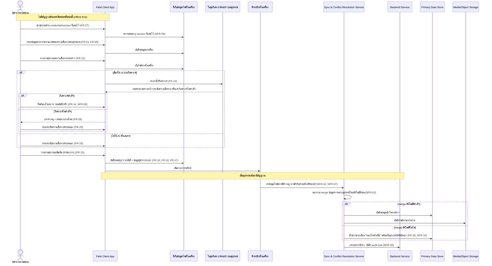
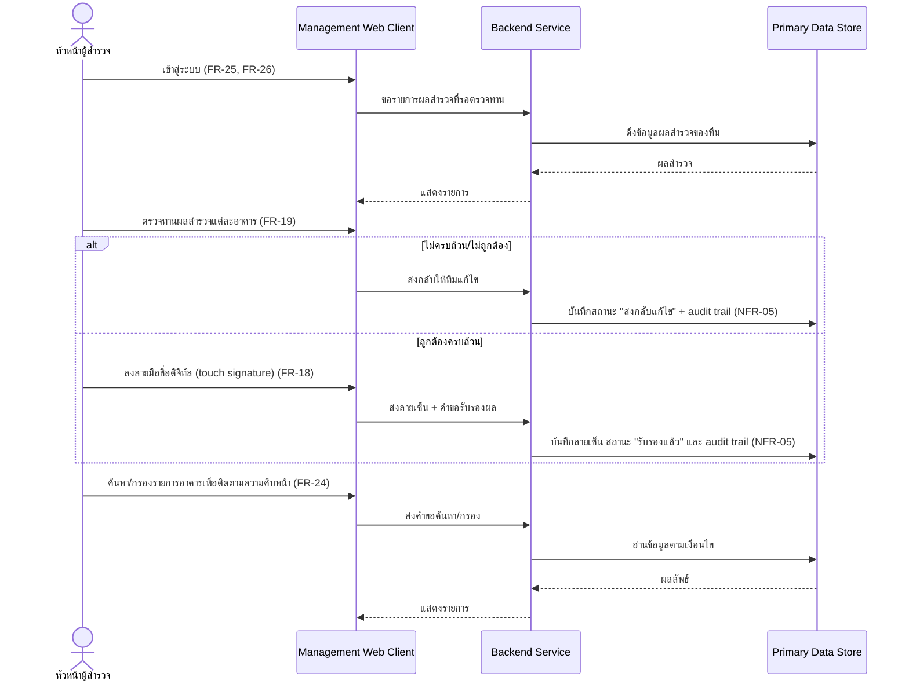
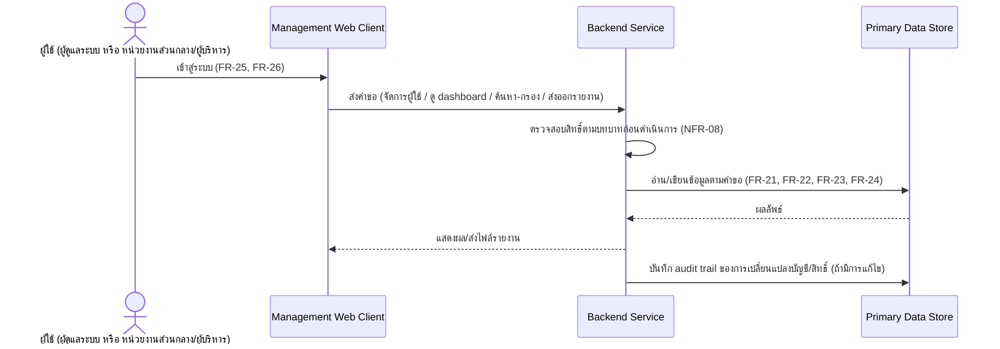
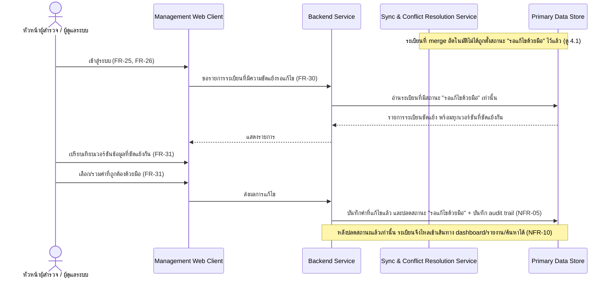

# สถาปัตยกรรมระบบ (Architecture)

เอกสารนี้อธิบายสถาปัตยกรรมระดับ **logical/conceptual** ของระบบสำรวจความเสียหายขั้นต้นของโครงสร้างอาคารหลังอุทกภัย โดยอิงจาก [[feature-list]] และ [[user-journey]] (ซึ่งอิงจาก [[backlog]] และ [[20260828-01-flood-damage-survey]])

> **หมายเหตุสำคัญ**: `technology-stack.md` ยังไม่มีการตัดสินใจ (ไฟล์ยังไม่ถูกสร้าง) เอกสารนี้จึงจงใจไม่ระบุชื่อ framework/ภาษาโปรแกรม/database engine/cloud provider ใดๆ ทั้งสิ้น ใช้เฉพาะชื่อ **component เชิงตรรกะ** และอธิบายด้วยคุณสมบัติที่ต้องการแทน เมื่อ `technology-stack.md` มีเนื้อหาแล้วในอนาคต ให้กลับมาทบทวนเอกสารนี้อีกครั้งเพื่ออ้างอิงชื่อ stack จริงในจุดที่เหมาะสม

## 1. ภาพรวมและข้อจำกัดเชิงสถาปัตยกรรมที่สำคัญ

ระบบนี้มีข้อจำกัดเชิงสถาปัตยกรรม 5 ข้อที่กำหนดทิศทางการออกแบบทั้งหมด (สืบเนื่องจาก [[feature-list|ฟีเจอร์ 13, 14 และ 15]]):

1. **ต้องเป็นสถาปัตยกรรมแบบ offline-first ไม่ใช่ client-server ที่ต้องต่อเน็ตตลอด** — ผู้สำรวจภาคสนามต้องเข้าสู่ระบบและกรอกแบบสำรวจได้ครบทุกหมวดในพื้นที่ที่ไม่มีสัญญาณ (NFR-01, FR-27) แล้วจึงซิงค์ภายหลัง
2. **การซิงค์ต้องรองรับไฟล์ภาพขนาดใหญ่และความขัดแย้งของข้อมูลจากหลายอุปกรณ์/หลายทีมพร้อมกัน** (NFR-02, NFR-03, NFR-07)
3. **AI วิเคราะห์รอยร้าวต้องไม่เป็น single point of failure ของกระบวนการสำรวจ** — การกรอกระดับความเสียหายด้วยตนเอง (FR-29) เป็นเส้นทางปกติ ไม่ใช่ทางออกฉุกเฉิน สถาปัตยกรรมจึงต้องรองรับทั้งสองเส้นทางเท่าเทียมกัน
4. **ต้องมี audit trail และรองรับลายมือชื่อดิจิทัลของหัวหน้าผู้สำรวจ** (FR-18, FR-19, NFR-05) เป็นคุณสมบัติ cross-cutting ที่ต้องมีอยู่ในทั้งฝั่ง client และ backend
5. **การ merge ข้อมูลอัตโนมัติต้องมีทางออกเมื่อ merge ไม่ได้ และห้ามให้ข้อมูลที่ยังขัดแย้งไหลเข้าช่องทางรายงาน** (FR-30, FR-31, NFR-10) — เมื่อ Sync & Conflict Resolution Service merge ข้อมูลจากหลายอุปกรณ์โดยอัตโนมัติไม่ได้ ต้องส่งต่อให้มนุษย์ (หัวหน้าผู้สำรวจ/ผู้ดูแลระบบ) ตัดสินใจผ่าน Management Web Client และระเบียนที่ยังอยู่ในสถานะรอแก้ไขต้องถูกกันออกจาก dashboard/รายงาน/ค้นหาจนกว่าจะแก้ไขเสร็จ

## 2. Logical Component

| Component | ขอบเขตความรับผิดชอบ | ใช้โดยบทบาท |
|---|---|---|
| **Field Client App** (แอปภาคสนามแบบออฟไลน์เต็มรูปแบบ) | กรอกแบบสำรวจครบ 10 หมวด, ถ่ายภาพ/วาดภาพประกอบ, คำนวณสรุปผล 3 ระดับสี, เก็บ credential/session ที่แคชไว้สำหรับเข้าสู่ระบบขณะออฟไลน์, ทำงานได้ครบทุกฟังก์ชันหลักโดยไม่พึ่งพาเครือข่าย | ผู้สำรวจภาคสนาม |
| ↳ ที่เก็บข้อมูล/ไฟล์ในเครื่อง (Local Persistent Store) | เก็บข้อมูลแบบสำรวจและไฟล์ภาพ/ภาพวาดบนอุปกรณ์จนกว่าจะซิงค์สำเร็จ | (ภายใน Field Client) |
| ↳ โมดูลวิเคราะห์รอยร้าวบนอุปกรณ์ (On-device AI Analysis Module) | รับภาพถ่าย ประมาณความกว้างรอยร้าวและเสนอระดับความเสียหายเป็นค่าตั้งต้น โดยทำงานได้แม้ไม่มีสัญญาณ | (ภายใน Field Client) |
| ↳ คิวรอซิงค์ในเครื่อง (Local Sync Queue) | เก็บรายการข้อมูล/ไฟล์ที่ยังไม่ถูกส่งขึ้นเซิร์ฟเวอร์ และพยายามส่งอัตโนมัติเมื่อกลับมามีสัญญาณ | (ภายใน Field Client) |
| **Management Web Client** | ตรวจทาน/ลงลายมือชื่อดิจิทัล/มอบหมายงาน, จัดการผู้ใช้และสิทธิ์, ดู dashboard, ค้นหา/กรอง, ส่งออกรายงาน, **แสดงรายการระเบียนที่มีความขัดแย้งของข้อมูลรอการแก้ไขด้วยมือและให้เปรียบเทียบ/เลือก/รวมค่าด้วยมือ (FR-30, FR-31)** — ต้องมีสัญญาณอินเทอร์เน็ตในการใช้งาน | หัวหน้าผู้สำรวจ, ผู้ดูแลระบบ, หน่วยงานส่วนกลาง/ผู้บริหาร |
| **Backend Service** | ยืนยันตัวตน/ออก session, บังคับสิทธิ์ตามบทบาท (RBAC), business logic ของทุกฟีเจอร์ (มอบหมายงาน, รับรองผล, จัดการผู้ใช้, dashboard, ส่งออกรายงาน, ค้นหา/กรอง, บันทึกผลการแก้ไขความขัดแย้งด้วยมือ), บันทึก audit trail กลาง, **กรองระเบียนที่ยังมีสถานะ "รอแก้ไขด้วยมือ" ออกจากทุกช่องทางอ่านข้อมูลสำหรับ dashboard/รายงาน/ค้นหา (NFR-10) จนกว่าจะถูกแก้ไขและปลดสถานะแล้ว** | ทุกบทบาท (ผ่าน client ทั้งสองฝั่ง) |
| **Sync & Conflict Resolution Service** | รับข้อมูล/ไฟล์ที่ค้างจาก Local Sync Queue ของหลายอุปกรณ์ผ่าน "คิวรับคำขอฝั่งเซิร์ฟเวอร์" ก่อนเสมอ พยายาม merge ข้อมูลจากหลายอุปกรณ์โดยอัตโนมัติก่อน หาก merge อัตโนมัติไม่ได้ ให้ตั้งสถานะระเบียนเป็น **"รอแก้ไขด้วยมือ"** และส่งต่อให้ Management Web Client จัดการ (FR-30, FR-31) | ระบบภายใน (ไม่มีผู้ใช้เรียกตรง) |
| ↳ คิวรับคำขอฝั่งเซิร์ฟเวอร์ (Server-side Sync Intake Queue) | จัดลำดับ/จำกัดอัตราการประมวลผลคำขอซิงค์ที่เข้ามาพร้อมกันจากหลายอุปกรณ์/หลายทีม แทนการประมวลผลพร้อมกันทั้งหมดทันที เพื่อรองรับรูปแบบโหลดที่กระจุกตัวเป็นช่วงหลังกลับจากพื้นที่ภัยพิบัติ (NFR-07) | (ภายใน Sync & Conflict Resolution Service) |
| **Server-side AI Analysis (เสริม/ทางเลือก)** | วิเคราะห์ภาพซ้ำ/เพิ่มเติมฝั่งเซิร์ฟเวอร์เมื่อข้อมูลถูกซิงค์ขึ้นมาแล้ว (เช่น สำหรับปรับปรุงความแม่นยำภายหลัง หรือกรณีอุปกรณ์ภาคสนามมีข้อจำกัดด้านทรัพยากร) **ไม่ใช่เส้นทางบังคับของกระบวนการสำรวจภาคสนาม** | ระบบภายใน |
| **Primary Data Store** | เก็บข้อมูลเชิงโครงสร้างหลัก: อาคาร, ผลประเมินความเสียหาย, ผู้ใช้/บทบาท, งานมอบหมาย, ผลรับรอง/ลายเซ็น, audit log, **สถานะความขัดแย้งของข้อมูล ("ปกติ" / "รอแก้ไขด้วยมือ") พร้อมทุกเวอร์ชันที่ขัดแย้งกันของระเบียนเดียวกันไว้เปรียบเทียบ (FR-31)** | เข้าถึงผ่าน Backend Service เท่านั้น |
| **Media/Object Storage** | เก็บไฟล์ภาพถ่ายและภาพวาดประกอบขนาดใหญ่ แยกจากข้อมูลเชิงโครงสร้าง | เข้าถึงผ่าน Backend Service/Sync Service เท่านั้น |

### เหตุผลการตัดสินใจ: ตำแหน่งการทำงานของ AI วิเคราะห์รอยร้าว

จากข้อจำกัดข้อ 1 และ 3 ใน [[user-journey|journey ผู้สำรวจภาคสนาม]] ขั้นตอนถ่ายภาพและวิเคราะห์รอยร้าว (ขั้นตอนที่ 9–17) เกิดขึ้น**ระหว่างที่อุปกรณ์ยังออฟไลน์อยู่** (หลังขั้นตอนที่ 3 "เปิดแอปทำงานแบบออฟไลน์" และก่อนขั้นตอนที่ 22 "ซิงค์ข้อมูล") ดังนั้น:

- **การวิเคราะห์เบื้องต้น (FR-13) ต้องเกิดขึ้นบนอุปกรณ์ (on-device)** เป็นเส้นทางหลัก มิฉะนั้นฟีเจอร์นี้จะใช้งานไม่ได้เลยขณะออฟไลน์ ซึ่งขัดกับ NFR-01
- **การกรอกระดับความเสียหายด้วยตนเอง (FR-29) เป็นเส้นทางคู่ขนานที่ใช้งานได้เสมอ** ไม่ว่า on-device AI จะวิเคราะห์สำเร็จ ไม่สำเร็จ หรือผู้สำรวจเลือกไม่ใช้ AI ตั้งแต่แรกก็ตาม — ทำให้ AI ไม่ใช่ single point of failure ตามข้อจำกัดข้อ 3
- **Server-side AI Analysis** ถูกวางเป็น component เสริม/ทางเลือกเท่านั้น ทำงานหลังข้อมูลถูกซิงค์ขึ้นเซิร์ฟเวอร์แล้ว (เช่น เพื่อวิเคราะห์ซ้ำด้วยโมเดลที่ใหญ่กว่า/แม่นยำกว่าที่อุปกรณ์พกพารันไม่ไหว) — ไม่ใช่เส้นทางบังคับของกระบวนการสำรวจภาคสนามในสนามจริง
- ทุกครั้งที่ AI วิเคราะห์สำเร็จ ผู้สำรวจต้องยืนยัน/แก้ไขก่อนบันทึกจริง (human-in-the-loop ตาม FR-14) และการแก้ไขต้องถูกบันทึกเป็นประวัติ (NFR-05) — เป็นความรับผิดชอบร่วมของ Field Client (บันทึกเหตุการณ์ ณ จุดเกิด) และ Backend Service/Primary Data Store (เก็บ audit log ถาวรหลังซิงค์)

## 3. Component Diagram

```mermaid
flowchart LR
    subgraph FieldSide["หน้างานภาคสนาม (อาจไม่มีสัญญาณอินเทอร์เน็ต)"]
        FC["Field Client App<br/>(ผู้สำรวจภาคสนาม)"]
        FCLocal[("ที่เก็บข้อมูล/ไฟล์ในเครื่อง")]
        FCAI["โมดูลวิเคราะห์รอยร้าวบนอุปกรณ์<br/>(On-device AI)"]
        FCQueue[("คิวรอซิงค์ในเครื่อง")]
        FC --- FCLocal
        FC --- FCAI
        FC --- FCQueue
    end

    subgraph OfficeSide["ฝั่งสำนักงาน/ผู้บริหาร (ต้องมีสัญญาณอินเทอร์เน็ต)"]
        MC["Management Web Client<br/>(หัวหน้าผู้สำรวจ / ผู้ดูแลระบบ / หน่วยงานส่วนกลาง)"]
    end

    subgraph ServerSide["ฝั่งเซิร์ฟเวอร์"]
        INTAKE["คิวรับคำขอซิงค์ฝั่งเซิร์ฟเวอร์<br/>(Server-side Sync Intake Queue)"]
        SYNC["Sync & Conflict Resolution Service"]
        BE["Backend Service<br/>(Auth/RBAC, Business Logic, Audit Trail)"]
        AIS["Server-side AI Analysis<br/>(เสริม/ทางเลือก)"]
        DB[("Primary Data Store")]
        MEDIA[("Media/Object Storage")]
    end

    FCQueue -->|ซิงค์เมื่อมีสัญญาณ| INTAKE
    INTAKE -->|จัดคิว/จำกัดอัตราตามโหลด (NFR-07)| SYNC
    SYNC -->|merge อัตโนมัติสำเร็จ| DB
    SYNC -->|merge อัตโนมัติสำเร็จ| MEDIA
    SYNC -->|merge ไม่ได้: ตั้งสถานะ "รอแก้ไขด้วยมือ" (NFR-03, NFR-10)| DB
    SYNC -.->|ส่งต่อระเบียนขัดแย้งให้ตรวจสอบด้วยมือ (FR-30)| MC
    MC -->|เลือก/รวมค่าด้วยมือแล้วส่งผล (FR-31)| BE
    BE -->|บันทึกผล + ปลดสถานะขัดแย้ง (NFR-05)| DB
    SYNC --> BE
    FC -.->|เข้าสู่ระบบ/ยืนยันตัวตนใหม่เมื่อมีสัญญาณ| BE
    MC -->|เรียกใช้งานทุกฟังก์ชัน (กรองระเบียนขัดแย้งออกจาก dashboard/รายงาน - NFR-10)| BE
    BE --> DB
    BE --> MEDIA
    BE -.->|ส่งภาพไปวิเคราะห์ซ้ำ (ถ้ามี)| AIS
    AIS -.-> DB
```

## 4. Data Flow Diagram ต่อ Journey หลัก

อ้างอิง journey เต็มที่ [[user-journey]] — เลือกทำ diagram สำหรับ 4 รูปแบบ flow ที่มีผลต่อสถาปัตยกรรมชัดเจนและแตกต่างกัน (journey ผู้ดูแลระบบและหน่วยงานส่วนกลางมี flow เชิงสถาปัตยกรรมแบบเดียวกัน คือ "เรียก Management Web Client → Backend Service → Primary Data Store แบบออนไลน์" จึงรวมเป็น diagram เดียว) เพิ่ม diagram ที่ 4 สำหรับฟีเจอร์ 15 (แก้ไขความขัดแย้งของข้อมูลจากการซิงค์ด้วยมือ) ซึ่งเป็น flow ใหม่ที่ทั้งหัวหน้าผู้สำรวจและผู้ดูแลระบบใช้ร่วมกันผ่าน Management Web Client

### 4.1 ผู้สำรวจภาคสนามลงพื้นที่สำรวจอาคาร (ออฟไลน์ + AI + ซิงค์)



### 4.2 หัวหน้าผู้สำรวจตรวจทานและรับรองผลด้วยลายเซ็นดิจิทัล



### 4.3 ผู้ดูแลระบบ / หน่วยงานส่วนกลาง ใช้งานผ่านเว็บแบบออนไลน์ (จัดการผู้ใช้ / dashboard / ค้นหา / ส่งออกรายงาน)



### 4.4 หัวหน้าผู้สำรวจ / ผู้ดูแลระบบ แก้ไขความขัดแย้งของข้อมูลจากการซิงค์ด้วยมือ



## 5. Mapping NFR ไปยัง Component

| NFR | คำอธิบายสั้น | Component ที่รับผิดชอบหลัก | แนวทางเชิงหลักการ |
|---|---|---|---|
| NFR-01 | ทำงานออฟไลน์ได้เต็มรูปแบบที่หน้างาน | Field Client App | ฟังก์ชันหลักทั้งหมด (กรอกฟอร์ม, ถ่ายภาพ, AI วิเคราะห์เบื้องต้น, สรุปผล) ต้องทำงานได้สมบูรณ์โดยไม่ต้องพึ่งพาการเชื่อมต่อเครือข่ายเลย |
| NFR-02 | ซิงค์ข้อมูลและไฟล์ภาพขนาดใหญ่ | Sync & Conflict Resolution Service, Media/Object Storage | ต้องรองรับการส่งไฟล์ขนาดใหญ่แบบแบ่งส่วน/ทำต่อได้เมื่อสัญญาณขาดหาย โดยไม่บล็อกการทำงานอื่นของ Field Client |
| NFR-03 | จัดการความขัดแย้งของข้อมูลเมื่อหลายอุปกรณ์แก้ไขชุดเดียวกัน | Sync & Conflict Resolution Service | ต้องมีกลไกตรวจจับความขัดแย้ง (เช่น การเทียบ version/เวลาแก้ไขล่าสุด) และกฎการ merge/แจ้งเตือนที่ชัดเจนก่อนบันทึกเป็นข้อมูลจริง |
| NFR-04 | ใช้งานได้ดีบนมือถือ/แท็บเล็ตกลางแจ้ง | Field Client App | ออกแบบการทำงานและการตอบสนองของแอปให้เหมาะกับสภาพแวดล้อมกลางแจ้งและอุปกรณ์พกพา |
| NFR-05 | Auditability — ประวัติการแก้ไขผล AI และการรับรองผล | Field Client App (บันทึกเหตุการณ์ ณ จุดเกิด) + Backend Service/Primary Data Store (เก็บ audit log ถาวร) | ทุกการแก้ไขผลวิเคราะห์ของ AI และทุกการรับรอง/ส่งกลับแก้ไขต้องถูกบันทึกเป็น audit entry แยกจากค่าปัจจุบัน ตรวจสอบย้อนหลังได้ |
| NFR-06 | ความแม่นยำของพิกัด GPS และภาพถ่าย | Field Client App | ต้องตรวจสอบคุณภาพสัญญาณ GPS และความคมชัดของภาพก่อนยอมรับการบันทึกข้อมูล |
| NFR-07 | รองรับหลายทีมซิงค์พร้อมกันจำนวนมากหลังเกิดเหตุ | Server-side Sync Intake Queue (ส่วนหนึ่งของ Sync & Conflict Resolution Service), Backend Service | ต้องมีคิวรับคำขอฝั่งเซิร์ฟเวอร์ที่จัดลำดับ/จำกัดอัตราการประมวลผลคำขอซิงค์ที่เข้ามาพร้อมกันจากหลายอุปกรณ์/หลายทีม แทนการประมวลผลพร้อมกันทั้งหมดทันที เพื่อรองรับรูปแบบโหลดที่กระจุกตัวเป็นช่วง (ไม่ใช่โหลดสม่ำเสมอ) หลังทีมกลับจากพื้นที่ภัยพิบัติ โดยไม่ทำให้ข้อมูลเสียหายหรือระบบล่ม |
| NFR-08 | Security — เข้าถึงข้อมูลได้เฉพาะผู้มีสิทธิ์ตามบทบาท | Backend Service | ต้องตรวจสอบสิทธิ์ (RBAC) ทุก request ก่อนอนุญาตให้เข้าถึง/แก้ไขข้อมูลใดๆ |
| NFR-09 | อายุ credential/session ที่แคชไว้ขณะออฟไลน์มีจำกัด | Field Client App (บังคับหมดอายุในเครื่อง) + Backend Service (ออก session ใหม่เมื่อกลับมาออนไลน์) | session ที่แคชไว้ต้องมีอายุจำกัดที่ตั้งค่าได้ และบังคับยืนยันตัวตนใหม่กับ Backend Service ทันทีที่ครบกำหนดหรือกลับมามีสัญญาณ |
| NFR-10 | Data Integrity (Reporting Consistency) — ห้ามระเบียนที่ยังขัดแย้งค้างอยู่ไหลเข้า dashboard/รายงานก่อนแก้ไข | Backend Service, Primary Data Store | Backend Service ต้องกรองระเบียนที่มีสถานะ "รอแก้ไขด้วยมือ" (ที่ Sync & Conflict Resolution Service ตั้งไว้) ออกจากทุกช่องทางอ่านข้อมูลสำหรับ dashboard/รายงาน/ค้นหาเสมอ จนกว่าระเบียนนั้นจะถูกแก้ไขและปลดสถานะผ่าน FR-30/FR-31 แล้วเท่านั้น |

NFR ครบทั้ง 10 ตัวถูก map ไปยัง component แล้ว ไม่มีตัวใดขาดหาย

## 6. ประเด็นรอตัดสินใจ

รายการต่อไปนี้เป็นการตัดสินใจเชิงเทคนิคที่**จงใจไม่ระบุในเอกสารนี้** เนื่องจาก [[technology-stack.md]] ยังไม่มีเนื้อหา ให้ผู้ตัดสินใจ tech stack พิจารณาในลำดับถัดไป:

- เทคโนโลยี/แพลตฟอร์มของ Field Client App (native / cross-platform) และกลไกเก็บข้อมูล/ไฟล์ในเครื่องแบบ persistent
- รูปแบบ/โปรโตคอลการซิงค์ข้อมูลระหว่าง Field Client กับ Sync Service (รวมถึงกลยุทธ์ merge conflict ที่เป็นรูปธรรม)
- รูปแบบโมเดล AI วิเคราะห์รอยร้าวที่ใช้บนอุปกรณ์ (ขนาดโมเดล, รูปแบบไฟล์, วิธี inference) และว่าจะมี Server-side AI Analysis จริงหรือไม่ในเวอร์ชันแรก
- เทคโนโลยีของ Backend Service, Primary Data Store, และ Media/Object Storage
- กลไกยืนยันตัวตน/ออก session (รวมถึงรูปแบบการเก็บ credential ที่แคชไว้บนอุปกรณ์อย่างปลอดภัยตาม NFR-09)
- รูปแบบไฟล์ที่ใช้ส่งออกรายงาน (FR-23)
- แนวทาง hosting/deployment และการรองรับ concurrent load ตาม NFR-07 ในทางปฏิบัติ

## เอกสารที่เกี่ยวข้อง

- [[feature-list]] — รายการฟีเจอร์ทั้ง 15 รายการที่สถาปัตยกรรมนี้ต้องรองรับ
- [[user-journey]] — flow การใช้งานจริงตามบทบาทที่ใช้เป็นฐานในการออกแบบ Data Flow Diagram
- [[backlog]] — รายการ FR/NFR ต้นทางทั้งหมด
- [[20260828-01-flood-damage-survey]] — spec ต้นทาง
