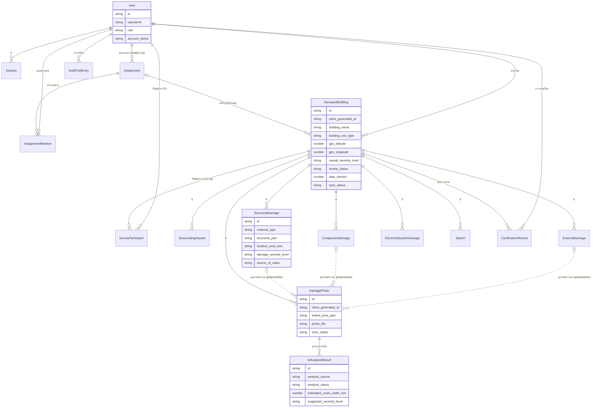

# โมเดลข้อมูล (Data Specification)

เอกสารนี้อธิบายโมเดลข้อมูลระดับ **logical/conceptual** (entity, attribute, ความสัมพันธ์) ของระบบสำรวจความเสียหายขั้นต้นของโครงสร้างอาคารหลังอุทกภัย โดยอิงจาก [[architecture]] (7 logical component), [[feature-list]] (14 ฟีเจอร์ / 38 รหัส FR-NFR) และ [[backlog]]

> **หมายเหตุสำคัญ**: [[technology-stack.md|technology-stack]] ยังไม่มีเนื้อหา เอกสารนี้จึงจงใจไม่ระบุชนิดข้อมูลแบบ SQL (เช่น `VARCHAR`, `INT`, `TIMESTAMP`) และไม่ระบุว่าเป็น SQL/NoSQL/ชื่อ database engine ใดๆ ทั้งสิ้น ใช้เฉพาะ **ชนิดข้อมูลเชิงตรรกะ** ตามที่นิยามในหัวข้อ 0 เท่านั้น ประเด็นเชิงเทคนิคที่ยังไม่ตัดสินใจถูกรวบรวมไว้ในหัวข้อ 8

คู่กับเอกสารนี้เสมอ: [[api-spec]] — operation ทุกตัวที่รับ/คืนค่าของ entity ใดในเอกสารนี้ ต้องใช้ชื่อ attribute (canonical name) ตรงกันทุกประการ

## 0. ชนิดข้อมูลเชิงตรรกะที่ใช้ในเอกสารนี้

| ชนิด | ความหมาย |
|---|---|
| ตัวระบุเฉพาะ | ค่าที่ใช้อ้างอิงระเบียนแบบไม่ซ้ำกัน (ไม่ระบุรูปแบบ/อัลกอริทึมการสร้าง) |
| ข้อความ | ข้อความอิสระความยาวไม่จำกัดตายตัว |
| ตัวเลข | จำนวนเต็มหรือทศนิยม (ไม่ระบุความละเอียด/ขนาด) |
| วันที่-เวลา | ค่าวันที่และเวลา |
| จริง/เท็จ | ค่าความจริงสองสถานะ |
| ค่าเลือกจากรายการ | ค่าที่จำกัดอยู่ในชุดตัวเลือกที่กำหนดไว้ล่วงหน้า (แจกแจงตัวเลือกไว้ในวงเล็บ) |
| ไฟล์อ้างอิง | ตัวชี้ไปยังไฟล์สื่อ (ภาพถ่าย/ภาพวาด/ลายเซ็น) ที่เก็บแยกจากข้อมูลเชิงโครงสร้าง |
| อ้างอิงถึง Entity อื่น | ความสัมพันธ์ไปยังระเบียนของ entity อื่น |

## 1. ภาพรวมกลุ่ม Entity

| กลุ่ม | Entity | ฟีเจอร์/FR-NFR ที่เกี่ยวข้อง |
|---|---|---|
| ผู้ใช้และการเข้าสู่ระบบ | [[#2.1 User\|User]], [[#2.2 Session\|Session]] | [[feature-list#9. จัดการผู้ใช้และสิทธิ์การเข้าถึง\|ฟีเจอร์ 9]], [[feature-list#14. ยืนยันตัวตนและเข้าสู่ระบบ\|ฟีเจอร์ 14]] |
| การมอบหมายงาน | [[#3.1 Assignment\|Assignment]], [[#3.2 AssignmentMember\|AssignmentMember]] | [[feature-list#8. มอบหมายงานสำรวจให้ทีม\|ฟีเจอร์ 8]] |
| แกนกลางการสำรวจ | [[#4.1 SurveyedBuilding\|SurveyedBuilding]], [[#4.2 SurveyParticipant\|SurveyParticipant]] | [[feature-list#1. บันทึกข้อมูลอาคารและสภาพแวดล้อม\|ฟีเจอร์ 1]], [[feature-list#6. บันทึกข้อมูลผู้สำรวจและระยะเวลาการสำรวจ\|ฟีเจอร์ 6]] |
| ความเสียหายแยกหมวด | [[#5.1 SurroundingHazard\|SurroundingHazard]], [[#5.2 ExternalDamage\|ExternalDamage]], [[#5.3 StructuralDamage\|StructuralDamage]], [[#5.4 ComponentDamage\|ComponentDamage]], [[#5.5 ElectricalSystemDamage\|ElectricalSystemDamage]] | [[feature-list#2. ประเมินความเสียหายโครงสร้างและส่วนประกอบอาคารแยกตามหมวด\|ฟีเจอร์ 2]], [[feature-list#3. สรุปผลประเมินเป็น 3 ระดับสีพร้อมเกณฑ์อ้างอิงคู่มือ\|ฟีเจอร์ 3]] |
| ภาพประกอบและ AI | [[#6.1 DamagePhoto\|DamagePhoto]], [[#6.2 AIAnalysisResult\|AIAnalysisResult]], [[#6.3 Sketch\|Sketch]] | [[feature-list#4. ถ่ายภาพและประเมินรอยร้าวด้วย AI พร้อมทางเลือกกรอกเอง (Human-in-the-loop)\|ฟีเจอร์ 4]], [[feature-list#5. วาดภาพประกอบเพิ่มเติม\|ฟีเจอร์ 5]] |
| การรับรองผลและ audit | [[#7.1 CertificationRecord\|CertificationRecord]], [[#7.2 AuditTrailEntry\|AuditTrailEntry]] | [[feature-list#7. ตรวจทานและรับรองผลสำรวจด้วยลายเซ็นดิจิทัล\|ฟีเจอร์ 7]] |

รวม **16 entity** ครอบคลุมทั้ง 14 ฟีเจอร์ (ฟีเจอร์ 10 "Dashboard", 11 "ส่งออกรายงาน", 12 "ค้นหา/กรอง", 13 "ออฟไลน์และซิงค์" เป็นการ**อ่าน/ประมวลผลข้อมูลของ entity ที่มีอยู่แล้ว** ไม่ต้องมี entity เฉพาะเพิ่ม ยกเว้น attribute ด้าน sync/conflict ที่ฝังอยู่ใน `SurveyedBuilding`/`DamagePhoto`/`Sketch` ตามหัวข้อ 9)

## 2. ผู้ใช้และการเข้าสู่ระบบ

### 2.1 User

รองรับ [[feature-list#9. จัดการผู้ใช้และสิทธิ์การเข้าถึง|FR-21]], [[feature-list#14. ยืนยันตัวตนและเข้าสู่ระบบ|FR-25, FR-26]], [[architecture#5. Mapping NFR ไปยัง Component|NFR-08]]

| Attribute | ชนิด | จำเป็น | คำอธิบาย |
|---|---|---|---|
| id | ตัวระบุเฉพาะ | ใช่ | รหัสผู้ใช้ |
| username | ข้อความ | ใช่ | ชื่อบัญชีที่ใช้เข้าสู่ระบบ ไม่ซ้ำกัน |
| full_name | ข้อความ | ใช่ | ชื่อ-นามสกุล |
| credential_secret | ข้อความ | ใช่ | ข้อมูลยืนยันตัวตน (เก็บในรูปแบบเข้ารหัส — วิธีเข้ารหัสเป็นประเด็นรอตัดสินใจ ดูหัวข้อ 8) |
| phone_number | ข้อความ | ไม่ | เบอร์โทรศัพท์ |
| agency_name | ข้อความ | ไม่ | หน่วยงาน/สังกัด |
| position | ข้อความ | ไม่ | ตำแหน่ง |
| role | ค่าเลือกจากรายการ (ผู้สำรวจภาคสนาม / หัวหน้าผู้สำรวจ / ผู้ดูแลระบบ / หน่วยงานส่วนกลาง-ผู้บริหาร) | ใช่ | บทบาทที่กำหนดสิทธิ์การเข้าถึง (FR-21, NFR-08) |
| account_status | ค่าเลือกจากรายการ (ใช้งานได้ / ปิดใช้งาน) | ใช่ | สถานะบัญชี |
| created_by_user_id | อ้างอิงถึง Entity อื่น (User) | ไม่ | ผู้ดูแลระบบที่สร้างบัญชีนี้ |
| created_at | วันที่-เวลา | ใช่ | เวลาที่สร้างบัญชี |

### 2.2 Session

รองรับ [[feature-list#14. ยืนยันตัวตนและเข้าสู่ระบบ|FR-25, FR-27, NFR-09]]

| Attribute | ชนิด | จำเป็น | คำอธิบาย |
|---|---|---|---|
| id | ตัวระบุเฉพาะ | ใช่ | รหัส session |
| user_id | อ้างอิงถึง Entity อื่น (User) | ใช่ | เจ้าของ session |
| device_id | ข้อความ | ใช่ | ตัวระบุอุปกรณ์ที่ออก session นี้ |
| issued_at | วันที่-เวลา | ใช่ | เวลาที่ออก session |
| expires_at | วันที่-เวลา | ใช่ | เวลาหมดอายุ (NFR-09 — โดยเฉพาะ session แบบแคชไว้ออฟไลน์ต้องมีอายุจำกัด) |
| is_offline_cached | จริง/เท็จ | ใช่ | เป็น session ที่แคชไว้ใช้ขณะออฟไลน์หรือไม่ (FR-27) |
| last_verified_online_at | วันที่-เวลา | ไม่ | ครั้งล่าสุดที่ยืนยันตัวตนกับฝั่งเซิร์ฟเวอร์สำเร็จ |
| status | ค่าเลือกจากรายการ (ใช้งานอยู่ / หมดอายุ / ถูกเพิกถอน) | ใช่ | สถานะ session ปัจจุบัน |

## 3. การมอบหมายงาน

### 3.1 Assignment

รองรับ [[feature-list#8. มอบหมายงานสำรวจให้ทีม|FR-20]]

| Attribute | ชนิด | จำเป็น | คำอธิบาย |
|---|---|---|---|
| id | ตัวระบุเฉพาะ | ใช่ | รหัสงานมอบหมาย |
| created_by_user_id | อ้างอิงถึง Entity อื่น (User) | ใช่ | หัวหน้าผู้สำรวจที่มอบหมายงาน |
| title_text | ข้อความ | ใช่ | ชื่อ/หัวข้องาน |
| target_area_description | ข้อความ | ใช่ | คำอธิบายอาคาร/พื้นที่ที่ต้องสำรวจ |
| status | ค่าเลือกจากรายการ (มอบหมายแล้ว / กำลังดำเนินการ / เสร็จสิ้น) | ใช่ | สถานะความคืบหน้า |
| due_date | วันที่-เวลา | ไม่ | กำหนดวันที่ควรสำรวจให้แล้วเสร็จ |
| created_at | วันที่-เวลา | ใช่ | เวลาที่สร้างงานมอบหมาย |

### 3.2 AssignmentMember

Junction entity ระหว่าง Assignment และ User (N:M) — รองรับ FR-20

| Attribute | ชนิด | จำเป็น | คำอธิบาย |
|---|---|---|---|
| id | ตัวระบุเฉพาะ | ใช่ | รหัสระเบียน |
| assignment_id | อ้างอิงถึง Entity อื่น (Assignment) | ใช่ | งานที่ถูกมอบหมาย |
| user_id | อ้างอิงถึง Entity อื่น (User) | ใช่ | ผู้สำรวจภาคสนามที่ได้รับมอบหมาย |

## 4. แกนกลางการสำรวจ

### 4.1 SurveyedBuilding

Aggregate root ของแบบสำรวจ 1 ฉบับ (1 อาคาร) รวมข้อมูลทั่วไป+กายภาพ (ฟีเจอร์ 1) และผลสรุป (ฟีเจอร์ 3) รองรับ [[feature-list#1. บันทึกข้อมูลอาคารและสภาพแวดล้อม|FR-01–FR-04]], [[feature-list#3. สรุปผลประเมินเป็น 3 ระดับสีพร้อมเกณฑ์อ้างอิงคู่มือ|FR-10]], [[architecture#5. Mapping NFR ไปยัง Component|NFR-01, NFR-02, NFR-03, NFR-06]]

**เป็น entity ที่ต้องรองรับ offline-first/sync/conflict ตามข้อจำกัดสถาปัตยกรรมข้อ 1-2 ใน [[architecture]] โดยตรง** ดูหลักการเต็มที่หัวข้อ 9

| Attribute | ชนิด | จำเป็น | คำอธิบาย |
|---|---|---|---|
| id | ตัวระบุเฉพาะ | ไม่ (จำเป็นหลังซิงค์สำเร็จ) | รหัสที่ฝั่งเซิร์ฟเวอร์กำหนดให้หลังซิงค์สำเร็จ |
| client_generated_id | ตัวระบุเฉพาะ | ใช่ | รหัสที่สร้างบนอุปกรณ์ขณะกรอกแบบสำรวจ (ก่อนซิงค์) ใช้เป็น natural key เพื่อกันระเบียนซ้ำเมื่อซิงค์ (NFR-01–NFR-03) |
| device_id | ข้อความ | ใช่ | อุปกรณ์ที่สร้าง/แก้ไขระเบียนนี้ล่าสุด |
| assignment_id | อ้างอิงถึง Entity อื่น (Assignment) | ไม่ | งานมอบหมายที่นำมาสู่การสำรวจนี้ (ถ้ามี) |
| created_by_user_id | อ้างอิงถึง Entity อื่น (User) | ใช่ | ผู้สำรวจที่เริ่มต้นแบบสำรวจนี้ |
| building_name | ข้อความ | ใช่ | ชื่ออาคาร/สถานที่ |
| owner_name | ข้อความ | ไม่ | ชื่อเจ้าของอาคาร |
| address_text | ข้อความ | ใช่ | ที่อยู่ |
| sub_district / district / province | ข้อความ | ใช่ | เขตการปกครอง |
| building_use_type | ค่าเลือกจากรายการ (13 ประเภทตามแบบฟอร์ม DPT) | ใช่ | การใช้สอยอาคาร |
| ownership_type | ค่าเลือกจากรายการ | ไม่ | ประเภทกรรมสิทธิ์ |
| gps_latitude / gps_longitude | ตัวเลข | ใช่ | พิกัด GPS |
| gps_accuracy_meters | ตัวเลข | ไม่ | ความแม่นยำของพิกัดขณะบันทึก (NFR-06) |
| floor_count | ตัวเลข | ไม่ | จำนวนชั้น |
| total_floor_area_sqm | ตัวเลข | ไม่ | พื้นที่ใช้สอยรวม |
| primary_structure_type | ค่าเลือกจากรายการ (ไม้ / คอนกรีตเสริมเหล็ก / เหล็กรูปพรรณ / อื่นๆ) | ไม่ | ชนิดโครงสร้างหลัก |
| wall_material | ค่าเลือกจากรายการ | ไม่ | วัสดุผนัง |
| survey_start_at | วันที่-เวลา | ไม่ | เวลาเริ่มสำรวจ (FR-17) |
| survey_completed_at | วันที่-เวลา | ไม่ | เวลาสำรวจแล้วเสร็จ (FR-17) |
| overall_severity_level | ค่าเลือกจากรายการ (เขียว / เหลือง / แดง) | ไม่ (จำเป็นก่อนส่งตรวจทาน) | ผลสรุป 3 ระดับสี (FR-10) |
| severity_recommendation_note | ข้อความ | ไม่ | ข้อแนะนำเพิ่มเติมประกอบผลสรุป (FR-10) |
| review_status | ค่าเลือกจากรายการ (ฉบับร่าง / รอตรวจทาน / ส่งกลับแก้ไข / รับรองแล้ว) | ใช่ | สถานะการตรวจทาน/รับรอง (FR-19) |
| data_version | ตัวเลข | ใช่ | เพิ่มค่าทุกครั้งที่มีการแก้ไข ใช้เทียบเวอร์ชันตรวจจับความขัดแย้ง (NFR-03) |
| last_modified_at | วันที่-เวลา | ใช่ | เวลาที่แก้ไขล่าสุด (ไม่ว่าจากอุปกรณ์ใด) ใช้ตรวจจับความขัดแย้ง (NFR-03) |
| last_modified_by_device_id | ข้อความ | ใช่ | อุปกรณ์ที่แก้ไขล่าสุด |
| sync_status | ค่าเลือกจากรายการ (ยังไม่ซิงค์ / กำลังซิงค์ / ซิงค์สำเร็จ / มีความขัดแย้งรอแก้ไข) | ใช่ | สถานะการซิงค์ปัจจุบัน (NFR-01, NFR-02) |
| synced_at | วันที่-เวลา | ไม่ | เวลาที่ซิงค์สำเร็จล่าสุด |
| created_on_device_at | วันที่-เวลา | ใช่ | เวลาที่สร้างระเบียนบนอุปกรณ์ (ก่อนซิงค์) |

### 4.2 SurveyParticipant

Junction entity ระหว่าง SurveyedBuilding และ User แทนรายชื่อผู้สำรวจ/หัวหน้าของแบบสำรวจแต่ละฉบับ — รองรับ [[feature-list#6. บันทึกข้อมูลผู้สำรวจและระยะเวลาการสำรวจ|FR-16]]

| Attribute | ชนิด | จำเป็น | คำอธิบาย |
|---|---|---|---|
| id | ตัวระบุเฉพาะ | ใช่ | รหัสระเบียน |
| surveyedbuilding_id | อ้างอิงถึง Entity อื่น (SurveyedBuilding) | ใช่ | แบบสำรวจที่เกี่ยวข้อง |
| user_id | อ้างอิงถึง Entity อื่น (User) | ใช่ | ผู้สำรวจ |
| role_in_team | ค่าเลือกจากรายการ (หัวหน้าผู้สำรวจ / ผู้สำรวจร่วม) | ใช่ | บทบาทในทีมสำรวจครั้งนี้ |
| sequence_order | ตัวเลข | ใช่ | ลำดับ (1-3 ตามข้อจำกัดฟอร์ม — บังคับที่ระดับ business rule ไม่ใช่โครงสร้างข้อมูล) |

**กฎทางธุรกิจ**: แต่ละ `SurveyedBuilding` ต้องมี `SurveyParticipant` ที่ `role_in_team = หัวหน้าผู้สำรวจ` อย่างน้อย 1 คนก่อนเข้าสถานะ "รอตรวจทาน" และมีจำนวนผู้สำรวจรวมไม่เกิน 3 คน (ตรวจสอบระดับ operation ใน [[api-spec]] ไม่ใช่ constraint เชิงโครงสร้าง)

## 5. ความเสียหายแยกหมวด

### 5.1 SurroundingHazard

รองรับ [[feature-list#1. บันทึกข้อมูลอาคารและสภาพแวดล้อม|FR-01–FR-04]]

| Attribute | ชนิด | จำเป็น | คำอธิบาย |
|---|---|---|---|
| id | ตัวระบุเฉพาะ | ใช่ | รหัสระเบียน |
| surveyedbuilding_id | อ้างอิงถึง Entity อื่น (SurveyedBuilding) | ใช่ | อาคารที่เกี่ยวข้อง |
| hazard_type | ค่าเลือกจากรายการ (อาคารข้างเคียงเสี่ยง / ลาดเชิงเขา / ดินทรุดตัว / อื่นๆ) | ใช่ | ประเภทอันตรายโดยรอบ |
| description | ข้อความ | ไม่ | รายละเอียดเพิ่มเติม |

### 5.2 ExternalDamage

รองรับ [[feature-list#2. ประเมินความเสียหายโครงสร้างและส่วนประกอบอาคารแยกตามหมวด|FR-05–FR-09]]

| Attribute | ชนิด | จำเป็น | คำอธิบาย |
|---|---|---|---|
| id | ตัวระบุเฉพาะ | ใช่ | รหัสระเบียน |
| surveyedbuilding_id | อ้างอิงถึง Entity อื่น (SurveyedBuilding) | ใช่ | อาคารที่เกี่ยวข้อง |
| location_area_text | ข้อความ | ใช่ | "บริเวณ" ตำแหน่งความเสียหายภายนอกที่พบ |
| damage_description | ข้อความ | ไม่ | รายละเอียดความเสียหาย |
| damage_severity_level | ค่าเลือกจากรายการ (ตามเกณฑ์คู่มืออ้างอิง) | ไม่ | ระดับความรุนแรง |

### 5.3 StructuralDamage

รองรับ [[feature-list#2. ประเมินความเสียหายโครงสร้างและส่วนประกอบอาคารแยกตามหมวด|FR-05–FR-09]] — เป็น entity ที่ต้องแยก **"ผลที่ AI เสนอ" ออกจาก "ผลที่ผู้สำรวจยืนยัน"** ตามหลัก human-in-the-loop (ดูหัวข้อ 9)

| Attribute | ชนิด | จำเป็น | คำอธิบาย |
|---|---|---|---|
| id | ตัวระบุเฉพาะ | ใช่ | รหัสระเบียน |
| surveyedbuilding_id | อ้างอิงถึง Entity อื่น (SurveyedBuilding) | ใช่ | อาคารที่เกี่ยวข้อง |
| material_type | ค่าเลือกจากรายการ (ไม้ / คอนกรีตเสริมเหล็ก / เหล็กรูปพรรณ) | ใช่ | ชนิดวัสดุโครงสร้าง |
| structural_part | ค่าเลือกจากรายการ (พื้น / คาน / เสา / กำแพง / โครงหลังคา) | ใช่ | ส่วนของโครงสร้างที่ประเมิน |
| location_area_text | ข้อความ | ใช่ | "บริเวณ" ตำแหน่งเฉพาะของความเสียหาย |
| damage_severity_level | ค่าเลือกจากรายการ (ตามเกณฑ์คู่มืออ้างอิง) | ใช่ (ก่อนบันทึกจริง) | **ระดับความเสียหายที่ยืนยันแล้ว** — ค่าจริงที่ใช้สรุปผล ไม่ใช่ค่าที่ AI เสนอโดยตรง |
| source_of_value | ค่าเลือกจากรายการ (กรอกเอง / ยืนยันผลจาก AI ตรงตามที่เสนอ / แก้ไขจากผลที่ AI เสนอ) | ใช่ | ที่มาของ `damage_severity_level` — ใช้แยกเส้นทาง FR-13/14 ออกจาก FR-29 |
| damage_description | ข้อความ | ไม่ | รายละเอียดเพิ่มเติม |

### 5.4 ComponentDamage

รองรับ FR-05–FR-09 — โครงสร้าง attribute เหมือน `StructuralDamage` แต่สำหรับส่วนประกอบอาคาร

| Attribute | ชนิด | จำเป็น | คำอธิบาย |
|---|---|---|---|
| id | ตัวระบุเฉพาะ | ใช่ | รหัสระเบียน |
| surveyedbuilding_id | อ้างอิงถึง Entity อื่น (SurveyedBuilding) | ใช่ | อาคารที่เกี่ยวข้อง |
| component_type | ค่าเลือกจากรายการ (ผนัง / ฝ้าเพดาน / วัสดุมุงหลังคา) | ใช่ | ชนิดส่วนประกอบ |
| location_area_text | ข้อความ | ใช่ | "บริเวณ" ตำแหน่งเฉพาะ |
| damage_severity_level | ค่าเลือกจากรายการ | ใช่ (ก่อนบันทึกจริง) | ระดับความเสียหายที่ยืนยันแล้ว |
| source_of_value | ค่าเลือกจากรายการ (กรอกเอง / ยืนยันผลจาก AI ตรงตามที่เสนอ / แก้ไขจากผลที่ AI เสนอ) | ใช่ | ที่มาของค่า |
| damage_description | ข้อความ | ไม่ | รายละเอียดเพิ่มเติม |

### 5.5 ElectricalSystemDamage

รองรับ FR-05–FR-09

| Attribute | ชนิด | จำเป็น | คำอธิบาย |
|---|---|---|---|
| id | ตัวระบุเฉพาะ | ใช่ | รหัสระเบียน |
| surveyedbuilding_id | อ้างอิงถึง Entity อื่น (SurveyedBuilding) | ใช่ | อาคารที่เกี่ยวข้อง |
| issue_location_text | ข้อความ | ไม่ | จุด/ตำแหน่งที่พบปัญหา |
| issue_description | ข้อความ | ไม่ | ลักษณะความเสียหาย |
| risk_level | ค่าเลือกจากรายการ | ไม่ | ระดับความเสี่ยง |

## 6. ภาพประกอบและ AI

### 6.1 DamagePhoto

รองรับ [[feature-list#4. ถ่ายภาพและประเมินรอยร้าวด้วย AI พร้อมทางเลือกกรอกเอง (Human-in-the-loop)|FR-12]], [[architecture#5. Mapping NFR ไปยัง Component|NFR-02, NFR-06]]

| Attribute | ชนิด | จำเป็น | คำอธิบาย |
|---|---|---|---|
| id | ตัวระบุเฉพาะ | ไม่ (จำเป็นหลังซิงค์) | รหัสฝั่งเซิร์ฟเวอร์ |
| client_generated_id | ตัวระบุเฉพาะ | ใช่ | รหัสที่สร้างบนอุปกรณ์ขณะถ่ายภาพ (natural key กันซ้ำเมื่อซิงค์) |
| surveyedbuilding_id | อ้างอิงถึง Entity อื่น (SurveyedBuilding) | ใช่ | อาคารที่เกี่ยวข้อง |
| linked_area_type | ค่าเลือกจากรายการ (ความเสียหายโครงสร้าง / ความเสียหายส่วนประกอบ / ความเสียหายภายนอก / ทั่วไป) | ใช่ | ประเภทบริเวณที่ภาพนี้ผูกอยู่ (FR-12) |
| linked_area_id | อ้างอิงถึง Entity อื่น (StructuralDamage / ComponentDamage / ExternalDamage ตามค่า `linked_area_type` — polymorphic) | ไม่ | ระเบียนความเสียหายเฉพาะที่ภาพนี้ผูกอยู่ |
| area_description_text | ข้อความ | ไม่ | คำอธิบายบริเวณสำรอง กรณีไม่ผูกกับระเบียนใดโดยตรง |
| photo_file | ไฟล์อ้างอิง | ใช่ | ไฟล์ภาพถ่าย |
| captured_at | วันที่-เวลา | ใช่ | เวลาที่ถ่ายภาพ |
| gps_latitude / gps_longitude | ตัวเลข | ไม่ | พิกัดขณะถ่ายภาพ (NFR-06) |
| image_quality_check_status | ค่าเลือกจากรายการ (ผ่าน / ไม่ผ่าน-ภาพเบลอ / ไม่ผ่าน-แสงไม่พอ) | ไม่ | ผลตรวจสอบคุณภาพภาพก่อนยอมรับ (NFR-06) |
| sync_status | ค่าเลือกจากรายการ (ยังไม่ซิงค์ / กำลังซิงค์ / ซิงค์สำเร็จ / มีความขัดแย้งรอแก้ไข) | ใช่ | สถานะการซิงค์ไฟล์ภาพ (NFR-02) |

### 6.2 AIAnalysisResult

รองรับ [[feature-list#4. ถ่ายภาพและประเมินรอยร้าวด้วย AI พร้อมทางเลือกกรอกเอง (Human-in-the-loop)|FR-13, FR-14, FR-28]] — **entity นี้เป็น append-only/snapshot ห้ามแก้ไขค่าเดิม** เพื่อรักษาความแตกต่างระหว่าง "ผลที่ AI เสนอ" กับ "ผลที่ผู้สำรวจยืนยัน" (ค่ายืนยันจริงอยู่ที่ `StructuralDamage.damage_severity_level` / `ComponentDamage.damage_severity_level`)

| Attribute | ชนิด | จำเป็น | คำอธิบาย |
|---|---|---|---|
| id | ตัวระบุเฉพาะ | ใช่ | รหัสระเบียน |
| damagephoto_id | อ้างอิงถึง Entity อื่น (DamagePhoto) | ใช่ | ภาพที่ถูกวิเคราะห์ |
| analysis_source | ค่าเลือกจากรายการ (on-device / server-side) | ใช่ | แหล่งที่ทำการวิเคราะห์ (อ้างอิง [[architecture#2. Logical Component\|โมดูลวิเคราะห์รอยร้าวบนอุปกรณ์ / Server-side AI Analysis]]) |
| analysis_status | ค่าเลือกจากรายการ (สำเร็จ / ไม่สำเร็จ) | ใช่ | ผลการวิเคราะห์ (FR-13) |
| failure_reason | ข้อความ | ไม่ | สาเหตุที่วิเคราะห์ไม่สำเร็จ เช่น ภาพเบลอ/แสงไม่พอ/ไม่พบรอยร้าว (FR-28) |
| estimated_crack_width_mm | ตัวเลข | ไม่ | ความกว้างรอยร้าวที่ AI ประมาณ (หน่วยมิลลิเมตร) |
| suggested_severity_level | ค่าเลือกจากรายการ | ไม่ | ระดับความเสียหายที่ AI **เสนอ** เป็นค่าตั้งต้น (ไม่ใช่ค่าที่บันทึกจริง) |
| analyzed_at | วันที่-เวลา | ใช่ | เวลาที่วิเคราะห์ |

### 6.3 Sketch

รองรับ [[feature-list#5. วาดภาพประกอบเพิ่มเติม|FR-15]]

| Attribute | ชนิด | จำเป็น | คำอธิบาย |
|---|---|---|---|
| id | ตัวระบุเฉพาะ | ไม่ (จำเป็นหลังซิงค์) | รหัสฝั่งเซิร์ฟเวอร์ |
| client_generated_id | ตัวระบุเฉพาะ | ใช่ | รหัสที่สร้างบนอุปกรณ์ |
| surveyedbuilding_id | อ้างอิงถึง Entity อื่น (SurveyedBuilding) | ใช่ | อาคารที่เกี่ยวข้อง |
| sketch_file | ไฟล์อ้างอิง | ใช่ | ไฟล์ภาพวาดประกอบ |
| caption_text | ข้อความ | ไม่ | คำอธิบายภาพวาด |
| created_on_device_at | วันที่-เวลา | ใช่ | เวลาที่สร้างบนอุปกรณ์ |
| sync_status | ค่าเลือกจากรายการ (ยังไม่ซิงค์ / กำลังซิงค์ / ซิงค์สำเร็จ / มีความขัดแย้งรอแก้ไข) | ใช่ | สถานะการซิงค์ (NFR-02) |

## 7. การรับรองผลและ audit trail

### 7.1 CertificationRecord

รองรับ [[feature-list#7. ตรวจทานและรับรองผลสำรวจด้วยลายเซ็นดิจิทัล|FR-18, FR-19]]

| Attribute | ชนิด | จำเป็น | คำอธิบาย |
|---|---|---|---|
| id | ตัวระบุเฉพาะ | ใช่ | รหัสระเบียน |
| surveyedbuilding_id | อ้างอิงถึง Entity อื่น (SurveyedBuilding) | ใช่ | อาคารที่ถูกตรวจทาน |
| reviewed_by_user_id | อ้างอิงถึง Entity อื่น (User) | ใช่ | หัวหน้าผู้สำรวจที่ตรวจทาน (FR-19) |
| review_result | ค่าเลือกจากรายการ (รับรอง / ส่งกลับแก้ไข) | ใช่ | ผลการตรวจทาน |
| review_comment | ข้อความ | ไม่ | ความเห็นประกอบ (จำเป็นในทางปฏิบัติเมื่อ `review_result = ส่งกลับแก้ไข`) |
| digital_signature_file | ไฟล์อ้างอิง | ไม่ (จำเป็นเมื่อ `review_result = รับรอง`) | ลายมือชื่อดิจิทัล (FR-18) |
| reviewed_at | วันที่-เวลา | ใช่ | เวลาที่ดำเนินการ |

### 7.2 AuditTrailEntry

รองรับ [[architecture#5. Mapping NFR ไปยัง Component|NFR-05]] — บันทึกทุกการแก้ไขผล AI (FR-14), การรับรอง/ส่งกลับแก้ไข (FR-18, FR-19) และการเปลี่ยนแปลงบัญชีผู้ใช้ (FR-21)

| Attribute | ชนิด | จำเป็น | คำอธิบาย |
|---|---|---|---|
| id | ตัวระบุเฉพาะ | ใช่ | รหัสระเบียน |
| related_entity_name | ค่าเลือกจากรายการ (ชื่อ entity ที่เกี่ยวข้อง เช่น StructuralDamage, ComponentDamage, SurveyedBuilding, User) | ใช่ | entity ที่ถูกกระทำ |
| related_entity_id | อ้างอิงถึง Entity อื่น (ขึ้นกับ `related_entity_name` — polymorphic) | ใช่ | ระเบียนที่ถูกกระทำ |
| action_type | ค่าเลือกจากรายการ (แก้ไขผลประเมินความเสียหาย / รับรองผล / ส่งกลับแก้ไข / สร้างบัญชีผู้ใช้ / แก้ไขบัญชีผู้ใช้ / ปิดการใช้งานบัญชีผู้ใช้ / อื่นๆ) | ใช่ | ประเภทการกระทำ |
| performed_by_user_id | อ้างอิงถึง Entity อื่น (User) | ใช่ | ผู้กระทำ |
| value_before | ข้อความ | ไม่ | ค่าก่อนแก้ไข |
| value_after | ข้อความ | ไม่ | ค่าหลังแก้ไข |
| performed_at | วันที่-เวลา | ใช่ | เวลาที่กระทำ |
| note | ข้อความ | ไม่ | หมายเหตุเพิ่มเติม |

## 8. ER Diagram

หมายเหตุ: ความสัมพันธ์แบบ `polymorphic` (เส้นประระหว่าง `DamagePhoto` กับ `StructuralDamage`/`ComponentDamage`/`ExternalDamage`) เป็นข้อจำกัดที่ตั้งใจของโมเดลเชิง logical — attribute `linked_area_type` เป็นตัวกำหนดว่า `linked_area_id` อ้างอิงไปยัง entity ใดจริง ไม่ใช่ foreign key คงที่เพียง entity เดียว

## 9. กฎทางธุรกิจที่กระทบโครงสร้างข้อมูล

1. **แยก "ผลที่ AI เสนอ" ออกจาก "ผลที่ผู้สำรวจยืนยัน" เสมอ (human-in-the-loop, FR-13/14/28/29)**: `AIAnalysisResult.suggested_severity_level` เป็น snapshot ที่เขียนครั้งเดียว (append-only) ไม่ถูกแก้ไขย้อนหลัง ส่วนค่าที่ใช้บันทึกผลจริงคือ `StructuralDamage.damage_severity_level` / `ComponentDamage.damage_severity_level` เท่านั้น พร้อม attribute `source_of_value` ระบุที่มา (กรอกเอง/ยืนยันตรงตาม AI/แก้ไขจาก AI) — ทุกครั้งที่ `source_of_value = แก้ไขจากผลที่ AI เสนอ` ต้องมี `AuditTrailEntry` คู่กันเสมอ (NFR-05) เทียบเคียงกับหลัก "Price Snapshot" ในระบบทั่วไป คือค่าที่ผูกกับผลลัพธ์จริงต้องไม่ใช่ reference ไปยังค่าที่เปลี่ยนแปลงได้ของ AI
2. **Offline-first + การกันข้อมูลซ้ำเมื่อซิงค์ (NFR-01, NFR-02)**: ทุก entity ที่ถูกสร้างบนอุปกรณ์ (`SurveyedBuilding`, `DamagePhoto`, `Sketch`) มี `client_generated_id` เป็น natural key ที่สร้างขึ้นตอนออฟไลน์ แยกจาก `id` ที่ฝั่งเซิร์ฟเวอร์ยืนยันให้หลังซิงค์สำเร็จ — Sync & Conflict Resolution Service ใช้ `client_generated_id` ในการตรวจว่าระเบียนนี้เคยถูกส่งมาแล้วหรือไม่ (idempotency)
3. **การตรวจจับ/แก้ไขความขัดแย้ง (NFR-03, NFR-07)**: `SurveyedBuilding` มี `data_version`, `last_modified_at`, `last_modified_by_device_id` ให้ Sync Service เทียบเวอร์ชันจากหลายอุปกรณ์ก่อนตัดสินใจ merge/แจ้งเตือน และมี `sync_status = มีความขัดแย้งรอแก้ไข` เป็นสถานะกลางที่ยังไม่ถือเป็นข้อมูลจริงจนกว่าจะแก้ไข
4. **ความสมบูรณ์ก่อนรับรองผล (FR-18/19)**: `CertificationRecord.review_result = รับรอง` ต้องมี `digital_signature_file` เสมอ และ `SurveyedBuilding.review_status` ต้องเป็น "รับรองแล้ว" ก็ต่อเมื่อมี `CertificationRecord` ที่ผลเป็น "รับรอง" อย่างน้อย 1 รายการ
5. **ทีมสำรวจ 1-3 คน + หัวหน้า (FR-16)**: บังคับที่ระดับ operation ใน [[api-spec]] ว่า `SurveyParticipant` ต่อ `SurveyedBuilding` หนึ่งชุดต้องมีอย่างน้อย 1 รายการที่ `role_in_team = หัวหน้าผู้สำรวจ` และรวมไม่เกิน 3 รายการ
6. **ภาพถ่ายผูกกับบริเวณที่ตรวจสอบ (FR-12)**: `DamagePhoto.linked_area_type` + `linked_area_id` ต้องสอดคล้องกัน (เช่นถ้า `linked_area_type = ความเสียหายโครงสร้าง` ต้องอ้างอิงระเบียนใน `StructuralDamage` เท่านั้น) — ถ้าไม่ผูกกับบริเวณใดโดยตรง ให้ใช้ `linked_area_type = ทั่วไป` และ `area_description_text` แทน

## 10. ประเด็นรอตัดสินใจ

รอ [[technology-stack.md|technology-stack]] ก่อนตัดสินใจในรายการต่อไปนี้:

- อัลกอริทึม/รูปแบบการสร้าง `client_generated_id` (เช่น UUID v4 หรือรูปแบบอื่น) และวิธีเข้ารหัส `credential_secret`
- กลไก merge จริงเมื่อพบ `sync_status = มีความขัดแย้งรอแก้ไข` (last-write-wins / field-level merge / ให้มนุษย์ตัดสินใจ) — ปัจจุบันโมเดลข้อมูลเตรียม attribute ไว้รองรับได้ทุกแนวทาง แต่ยังไม่เลือกกลยุทธ์
- ขนาด/ความละเอียดของชนิด "ตัวเลข" และ "ข้อความ" แต่ละ attribute (เช่น ทศนิยมกี่ตำแหน่งของ GPS)
- รูปแบบการจัดเก็บ `credential_secret` และ mechanism ของ RBAC จริง (ตาราง permission แยกหรือฝังในตัว `role`)

## เอกสารที่เกี่ยวข้อง

- [[api-spec]] — operation contract ที่ใช้ entity/attribute ชุดนี้ทั้งหมด
- [[architecture]] — component ที่เป็นเจ้าของ entity แต่ละกลุ่ม (Primary Data Store, Media/Object Storage)
- [[feature-list]] — ฟีเจอร์ทั้ง 14 รายการที่โมเดลนี้ต้องรองรับ
- [[backlog]] — รายการ FR/NFR ต้นทาง
