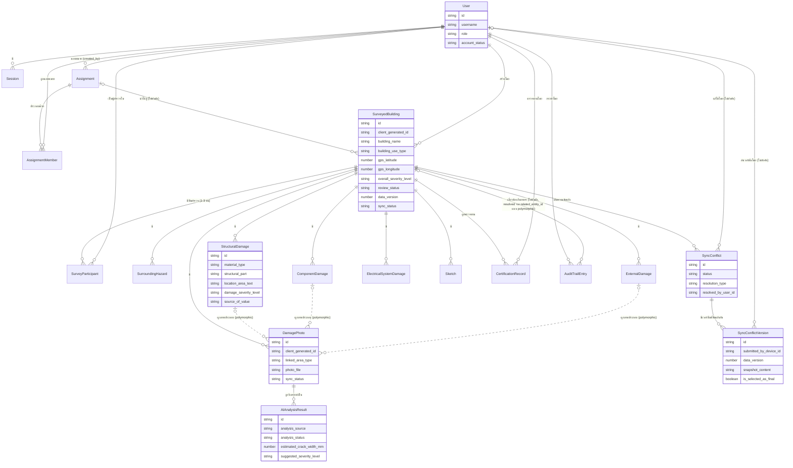

# โมเดลข้อมูล (Data Specification)

เอกสารนี้อธิบายโมเดลข้อมูลระดับ **logical/conceptual** (entity, attribute, ความสัมพันธ์) ของระบบสำรวจความเสียหายขั้นต้นของโครงสร้างอาคารหลังอุทกภัย โดยอิงจาก [[architecture]] (7 logical component), [[feature-list]] (17 ฟีเจอร์ / 43 รหัส FR-NFR) และ [[backlog]]

> **หมายเหตุสำคัญ**: [[technology-stack]] มีเนื้อหาแล้ว (อัปเดตล่าสุด 2026-09-03) — Primary Data Store ถูกตัดสินใจเป็น **MySQL/MariaDB** (relational) แล้ว ([[technology-stack#3. การตัดสินใจรายชั้น|technology-stack หัวข้อ 3]]) ประเด็น "เป็น SQL หรือ NoSQL" จึงถือว่า**ปิดแล้ว** อย่างไรก็ตาม การเลือกชนิดข้อมูลจริงระดับ column (เช่น `VARCHAR`, `INT`, `TIMESTAMP`) รวมถึงเวอร์ชันของ engine ยังไม่ถูกตัดสินใจ (เป็นงานระดับ implementation) เอกสารนี้จึงยังคงจงใจไม่ระบุชนิดข้อมูลแบบ SQL และไม่ระบุเวอร์ชัน/รายละเอียด engine ใดๆ ทั้งสิ้น ใช้เฉพาะ **ชนิดข้อมูลเชิงตรรกะ** ตามที่นิยามในหัวข้อ 0 เท่านั้น ประเด็นเชิงเทคนิคที่ยังไม่ตัดสินใจถูกรวบรวมไว้ในหัวข้อ 11

คู่กับเอกสารนี้เสมอ: [[api-spec]] — operation ทุกตัวที่รับ/คืนค่าของ entity ใดในเอกสารนี้ ต้องใช้ชื่อ attribute (canonical name) ตรงกันทุกประการ

## 0. ชนิดข้อมูลเชิงตรรกะที่ใช้ในเอกสารนี้

| ชนิด | ความหมาย |
|---|---|
| ตัวระบุเฉพาะ | ค่าที่ใช้อ้างอิงระเบียนแบบไม่ซ้ำกัน (ไม่ระบุรูปแบบ/อัลกอริทึมการสร้าง) |
| ข้อความ | ข้อความอิสระความยาวไม่จำกัดตายตัว |
| ตัวเลข | จำนวนเต็มหรือทศนิยม (ไม่ระบุความละเอียด/ขนาด) |
| วันที่-เวลา | ค่าวันที่และเวลา |
| จริง/เท็จ | ค่าความจริงสองสถานะ |
| ค่าเลือกจากรายการ | ค่าที่จำกัดอยู่ในชุดตัวเลือกที่กำหนดไว้ล่วงหน้า (แจกแจงตัวเลือกไว้ในวงเล็บ) |
| ไฟล์อ้างอิง | ตัวชี้ไปยังไฟล์สื่อ (ภาพถ่าย/ภาพวาด/ลายเซ็น) ที่เก็บแยกจากข้อมูลเชิงโครงสร้าง |
| อ้างอิงถึง Entity อื่น | ความสัมพันธ์ไปยังระเบียนของ entity อื่น |

## 1. ภาพรวมกลุ่ม Entity

| กลุ่ม | Entity | ฟีเจอร์/FR-NFR ที่เกี่ยวข้อง |
|---|---|---|
| ผู้ใช้และการเข้าสู่ระบบ | [[#2.1 User\|User]], [[#2.2 Session\|Session]] | [[feature-list#9. จัดการผู้ใช้และสิทธิ์การเข้าถึง\|ฟีเจอร์ 9]], [[feature-list#14. ยืนยันตัวตนและเข้าสู่ระบบ\|ฟีเจอร์ 14]] |
| การมอบหมายงาน | [[#3.1 Assignment\|Assignment]], [[#3.2 AssignmentMember\|AssignmentMember]] | [[feature-list#8. มอบหมายงานสำรวจให้ทีม\|ฟีเจอร์ 8]] |
| แกนกลางการสำรวจ | [[#4.1 SurveyedBuilding\|SurveyedBuilding]], [[#4.2 SurveyParticipant\|SurveyParticipant]] | [[feature-list#1. บันทึกข้อมูลอาคารและสภาพแวดล้อม\|ฟีเจอร์ 1]], [[feature-list#6. บันทึกข้อมูลผู้สำรวจและระยะเวลาการสำรวจ\|ฟีเจอร์ 6]] |
| ความเสียหายแยกหมวด | [[#5.1 SurroundingHazard\|SurroundingHazard]], [[#5.2 ExternalDamage\|ExternalDamage]], [[#5.3 StructuralDamage\|StructuralDamage]], [[#5.4 ComponentDamage\|ComponentDamage]], [[#5.5 ElectricalSystemDamage\|ElectricalSystemDamage]] | [[feature-list#2. ประเมินความเสียหายโครงสร้างและส่วนประกอบอาคารแยกตามหมวด\|ฟีเจอร์ 2]], [[feature-list#3. สรุปผลประเมินเป็น 3 ระดับสีพร้อมเกณฑ์อ้างอิงคู่มือ\|ฟีเจอร์ 3]] |
| ภาพประกอบและ AI | [[#6.1 DamagePhoto\|DamagePhoto]], [[#6.2 AIAnalysisResult\|AIAnalysisResult]], [[#6.3 Sketch\|Sketch]] | [[feature-list#4. ถ่ายภาพและประเมินรอยร้าวด้วย AI พร้อมทางเลือกกรอกเอง (Human-in-the-loop)\|ฟีเจอร์ 4]], [[feature-list#5. วาดภาพประกอบเพิ่มเติม\|ฟีเจอร์ 5]] |
| การรับรองผลและ audit | [[#7.1 CertificationRecord\|CertificationRecord]], [[#7.2 AuditTrailEntry\|AuditTrailEntry]] | [[feature-list#7. ตรวจทานและรับรองผลสำรวจด้วยลายเซ็นดิจิทัล\|ฟีเจอร์ 7]], [[feature-list#16. เรียกดูประวัติการแก้ไขผลประเมินรายอาคาร (Audit Trail รายอาคาร)\|ฟีเจอร์ 16]], [[feature-list#17. ค้นหา/กรองประวัติการแก้ไขทั่วทั้งระบบ (Audit Trail ระดับหน่วยงาน)\|ฟีเจอร์ 17]] |
| การแก้ไขความขัดแย้งของข้อมูลจากการซิงค์ | [[#8.1 SyncConflict\|SyncConflict]], [[#8.2 SyncConflictVersion\|SyncConflictVersion]] | [[feature-list#15. แก้ไขความขัดแย้งของข้อมูลจากการซิงค์ด้วยมือ (Manual Conflict Resolution)\|ฟีเจอร์ 15]] |

รวม **18 entity** ครอบคลุมทั้ง 17 ฟีเจอร์ (ฟีเจอร์ 10 "Dashboard", 11 "ส่งออกรายงาน", 12 "ค้นหา/กรอง", 13 "ออฟไลน์และซิงค์" เป็นการ**อ่าน/ประมวลผลข้อมูลของ entity ที่มีอยู่แล้ว** ไม่ต้องมี entity เฉพาะเพิ่ม ยกเว้น attribute ด้าน sync/conflict ที่ฝังอยู่ใน `SurveyedBuilding`/`DamagePhoto`/`Sketch` ตามหัวข้อ 10 — ฟีเจอร์ 15 ใช้ entity เฉพาะเพิ่ม 2 ตัวตามหัวข้อ 8 — ฟีเจอร์ 16/17 (เพิ่มเข้ามา 2026-09-02) เป็นการ**อ่าน/ค้นหา**ข้อมูล `AuditTrailEntry` ที่มีอยู่แล้วเช่นกัน ไม่มี entity ใหม่ แต่ต้องเพิ่ม attribute เสริม 1 ตัวใน `AuditTrailEntry` เพื่อให้สืบย้อนไปยังอาคารได้โดยตรง — ดูหัวข้อ 7.2)

## 2. ผู้ใช้และการเข้าสู่ระบบ

### 2.1 User

รองรับ [[feature-list#9. จัดการผู้ใช้และสิทธิ์การเข้าถึง|FR-21]], [[feature-list#14. ยืนยันตัวตนและเข้าสู่ระบบ|FR-25, FR-26]], [[architecture#5. Mapping NFR ไปยัง Component|NFR-08]]

| Attribute | ชนิด | จำเป็น | คำอธิบาย |
|---|---|---|---|
| id | ตัวระบุเฉพาะ | ใช่ | รหัสผู้ใช้ |
| username | ข้อความ | ใช่ | ชื่อบัญชีที่ใช้เข้าสู่ระบบ ไม่ซ้ำกัน |
| full_name | ข้อความ | ใช่ | ชื่อ-นามสกุล |
| credential_secret | ข้อความ | ใช่ | ข้อมูลยืนยันตัวตน (เก็บในรูปแบบเข้ารหัส — วิธีเข้ารหัสเป็นประเด็นรอตัดสินใจ ดูหัวข้อ 11) |
| phone_number | ข้อความ | ไม่ | เบอร์โทรศัพท์ |
| agency_name | ข้อความ | ไม่ | หน่วยงาน/สังกัด |
| position | ข้อความ | ไม่ | ตำแหน่ง |
| role | ค่าเลือกจากรายการ (ผู้สำรวจภาคสนาม / หัวหน้าผู้สำรวจ / ผู้ดูแลระบบ / หน่วยงานส่วนกลาง-ผู้บริหาร) | ใช่ | บทบาทที่กำหนดสิทธิ์การเข้าถึง (FR-21, NFR-08) |
| account_status | ค่าเลือกจากรายการ (ใช้งานได้ / ปิดใช้งาน) | ใช่ | สถานะบัญชี |
| created_by_user_id | อ้างอิงถึง Entity อื่น (User) | ไม่ | ผู้ดูแลระบบที่สร้างบัญชีนี้ |
| created_at | วันที่-เวลา | ใช่ | เวลาที่สร้างบัญชี |

### 2.2 Session

รองรับ [[feature-list#14. ยืนยันตัวตนและเข้าสู่ระบบ|FR-25, FR-27, NFR-09, NFR-11]]

**เพิ่มเข้ามา 2026-09-03 (NFR-11)**: `cached_pin_secret` และ `failed_pin_attempt_count` มีความหมายเฉพาะเมื่อ `is_offline_cached = true` และต้องอยู่ในพื้นที่จัดเก็บเดียวกับ session/credential ที่แคชไว้ ซึ่งแยกจากพื้นที่จัดเก็บข้อมูลแบบสำรวจ (`SurveyedBuilding` และ entity ย่อย) อย่างชัดเจนตั้งแต่ระดับโครงสร้าง (ดู [[architecture#6.8 แยกพื้นที่จัดเก็บ credential/PIN ออกจากข้อมูลแบบสำรวจในเครื่อง (NFR-11)|architecture §6.8]]) — `failed_pin_attempt_count` **นับและเก็บอยู่บนอุปกรณ์เท่านั้น ไม่ถูกส่ง/ซิงค์ขึ้นเซิร์ฟเวอร์เลย** เพราะเหตุการณ์กรอก PIN ผิดเกิดขึ้นขณะออฟไลน์เสมอ

| Attribute | ชนิด | จำเป็น | คำอธิบาย |
|---|---|---|---|
| id | ตัวระบุเฉพาะ | ใช่ | รหัส session |
| user_id | อ้างอิงถึง Entity อื่น (User) | ใช่ | เจ้าของ session |
| device_id | ข้อความ | ใช่ | ตัวระบุอุปกรณ์ที่ออก session นี้ |
| issued_at | วันที่-เวลา | ใช่ | เวลาที่ออก session |
| expires_at | วันที่-เวลา | ใช่ | เวลาหมดอายุ (NFR-09 — โดยเฉพาะ session แบบแคชไว้ออฟไลน์ต้องมีอายุจำกัด) |
| is_offline_cached | จริง/เท็จ | ใช่ | เป็น session ที่แคชไว้ใช้ขณะออฟไลน์หรือไม่ (FR-27) |
| cached_pin_secret | ข้อความ | ไม่ (จำเป็นเมื่อ is_offline_cached = true) | PIN ที่ผู้สำรวจภาคสนามตั้ง/ยืนยันไว้สำหรับปลดล็อกออฟไลน์บนอุปกรณ์นี้ (FR-25) เก็บในรูปแบบเข้ารหัสแยกต่างหากจาก `User.credential_secret` เสมอ (วิธีเข้ารหัสเป็นประเด็นรอตัดสินใจ ดูหัวข้อ 11) — ถูกล้างทันทีเมื่อเกิด lockout ตาม NFR-11 |
| failed_pin_attempt_count | ตัวเลข | ไม่ (จำเป็นเมื่อ is_offline_cached = true) | จำนวนครั้งที่กรอก PIN ผิดติดต่อกันล่าสุดบนอุปกรณ์นี้ (NFR-11) เพิ่มค่าทุกครั้งที่กรอกผิด รีเซ็ตเป็น 0 ทันทีที่ปลดล็อกด้วย PIN สำเร็จหรือเข้าสู่ระบบด้วยรหัสผ่านสำเร็จใหม่ — เมื่อครบจำนวนสูงสุดที่กำหนด (ตัวเลขจริงยังไม่ยืนยัน ดูหัวข้อ 11 **ห้ามเดา**) ต้องล้างค่านี้พร้อม `cached_pin_secret` ทันที |
| last_verified_online_at | วันที่-เวลา | ไม่ | ครั้งล่าสุดที่ยืนยันตัวตนกับฝั่งเซิร์ฟเวอร์สำเร็จ |
| status | ค่าเลือกจากรายการ (ใช้งานอยู่ / หมดอายุ / ถูกเพิกถอน) | ใช่ | สถานะ session ปัจจุบัน — ค่า "ถูกเพิกถอน" ครอบคลุมทั้งกรณีผู้ดูแลระบบปิดบัญชี (2.3) และกรณี lockout จากกรอก PIN ผิดครบจำนวนครั้งสูงสุด (NFR-11) |

## 3. การมอบหมายงาน

### 3.1 Assignment

รองรับ [[feature-list#8. มอบหมายงานสำรวจให้ทีม|FR-20]]

| Attribute | ชนิด | จำเป็น | คำอธิบาย |
|---|---|---|---|
| id | ตัวระบุเฉพาะ | ใช่ | รหัสงานมอบหมาย |
| created_by_user_id | อ้างอิงถึง Entity อื่น (User) | ใช่ | หัวหน้าผู้สำรวจที่มอบหมายงาน |
| title_text | ข้อความ | ใช่ | ชื่อ/หัวข้องาน |
| target_area_description | ข้อความ | ใช่ | คำอธิบายอาคาร/พื้นที่ที่ต้องสำรวจ |
| status | ค่าเลือกจากรายการ (มอบหมายแล้ว / กำลังดำเนินการ / เสร็จสิ้น) | ใช่ | สถานะความคืบหน้า |
| due_date | วันที่-เวลา | ไม่ | กำหนดวันที่ควรสำรวจให้แล้วเสร็จ |
| created_at | วันที่-เวลา | ใช่ | เวลาที่สร้างงานมอบหมาย |

### 3.2 AssignmentMember

Junction entity ระหว่าง Assignment และ User (N:M) — รองรับ FR-20

| Attribute | ชนิด | จำเป็น | คำอธิบาย |
|---|---|---|---|
| id | ตัวระบุเฉพาะ | ใช่ | รหัสระเบียน |
| assignment_id | อ้างอิงถึง Entity อื่น (Assignment) | ใช่ | งานที่ถูกมอบหมาย |
| user_id | อ้างอิงถึง Entity อื่น (User) | ใช่ | ผู้สำรวจภาคสนามที่ได้รับมอบหมาย |

## 4. แกนกลางการสำรวจ

### 4.1 SurveyedBuilding

Aggregate root ของแบบสำรวจ 1 ฉบับ (1 อาคาร) รวมข้อมูลทั่วไป+กายภาพ (ฟีเจอร์ 1) และผลสรุป (ฟีเจอร์ 3) รองรับ [[feature-list#1. บันทึกข้อมูลอาคารและสภาพแวดล้อม|FR-01–FR-04]], [[feature-list#3. สรุปผลประเมินเป็น 3 ระดับสีพร้อมเกณฑ์อ้างอิงคู่มือ|FR-10]], [[architecture#5. Mapping NFR ไปยัง Component|NFR-01, NFR-02, NFR-03, NFR-06]]

**เป็น entity ที่ต้องรองรับ offline-first/sync/conflict ตามข้อจำกัดสถาปัตยกรรมข้อ 1-2 ใน [[architecture]] โดยตรง** ดูหลักการเต็มที่หัวข้อ 10

| Attribute | ชนิด | จำเป็น | คำอธิบาย |
|---|---|---|---|
| id | ตัวระบุเฉพาะ | ไม่ (จำเป็นหลังซิงค์สำเร็จ) | รหัสที่ฝั่งเซิร์ฟเวอร์กำหนดให้หลังซิงค์สำเร็จ |
| client_generated_id | ตัวระบุเฉพาะ | ใช่ | รหัสที่สร้างบนอุปกรณ์ขณะกรอกแบบสำรวจ (ก่อนซิงค์) ใช้เป็น natural key เพื่อกันระเบียนซ้ำเมื่อซิงค์ (NFR-01–NFR-03) |
| device_id | ข้อความ | ใช่ | อุปกรณ์ที่สร้าง/แก้ไขระเบียนนี้ล่าสุด |
| assignment_id | อ้างอิงถึง Entity อื่น (Assignment) | ไม่ | งานมอบหมายที่นำมาสู่การสำรวจนี้ (ถ้ามี) |
| created_by_user_id | อ้างอิงถึง Entity อื่น (User) | ใช่ | ผู้สำรวจที่เริ่มต้นแบบสำรวจนี้ |
| building_name | ข้อความ | ใช่ | ชื่ออาคาร/สถานที่ |
| owner_name | ข้อความ | ไม่ | ชื่อเจ้าของอาคาร |
| address_text | ข้อความ | ใช่ | ที่อยู่ |
| sub_district / district / province | ข้อความ | ใช่ | เขตการปกครอง |
| building_use_type | ค่าเลือกจากรายการ (13 ประเภทตามแบบฟอร์ม DPT) | ใช่ | การใช้สอยอาคาร |
| ownership_type | ค่าเลือกจากรายการ | ไม่ | ประเภทกรรมสิทธิ์ |
| gps_latitude / gps_longitude | ตัวเลข | ใช่ | พิกัด GPS |
| gps_accuracy_meters | ตัวเลข | ไม่ | ความแม่นยำของพิกัดขณะบันทึก (NFR-06) |
| floor_count | ตัวเลข | ไม่ | จำนวนชั้น |
| total_floor_area_sqm | ตัวเลข | ไม่ | พื้นที่ใช้สอยรวม |
| primary_structure_type | ค่าเลือกจากรายการ (ไม้ / คอนกรีตเสริมเหล็ก / เหล็กรูปพรรณ / อื่นๆ) | ไม่ | ชนิดโครงสร้างหลัก |
| wall_material | ค่าเลือกจากรายการ | ไม่ | วัสดุผนัง |
| survey_start_at | วันที่-เวลา | ไม่ | เวลาเริ่มสำรวจ (FR-17) |
| survey_completed_at | วันที่-เวลา | ไม่ | เวลาสำรวจแล้วเสร็จ (FR-17) |
| overall_severity_level | ค่าเลือกจากรายการ (เขียว / เหลือง / แดง) | ไม่ (จำเป็นก่อนส่งตรวจทาน) | ผลสรุป 3 ระดับสี (FR-10) |
| severity_recommendation_note | ข้อความ | ไม่ | ข้อแนะนำเพิ่มเติมประกอบผลสรุป (FR-10) |
| review_status | ค่าเลือกจากรายการ (ฉบับร่าง / รอตรวจทาน / ส่งกลับแก้ไข / รับรองแล้ว) | ใช่ | สถานะการตรวจทาน/รับรอง (FR-19) |
| data_version | ตัวเลข | ใช่ | เพิ่มค่าทุกครั้งที่มีการแก้ไข ใช้เทียบเวอร์ชันตรวจจับความขัดแย้ง (NFR-03) |
| last_modified_at | วันที่-เวลา | ใช่ | เวลาที่แก้ไขล่าสุด (ไม่ว่าจากอุปกรณ์ใด) ใช้ตรวจจับความขัดแย้ง (NFR-03) |
| last_modified_by_device_id | ข้อความ | ใช่ | อุปกรณ์ที่แก้ไขล่าสุด |
| sync_status | ค่าเลือกจากรายการ (ยังไม่ซิงค์ / กำลังซิงค์ / ซิงค์สำเร็จ / มีความขัดแย้งรอแก้ไข) | ใช่ | สถานะการซิงค์ปัจจุบัน (NFR-01, NFR-02) |
| synced_at | วันที่-เวลา | ไม่ | เวลาที่ซิงค์สำเร็จล่าสุด |
| created_on_device_at | วันที่-เวลา | ใช่ | เวลาที่สร้างระเบียนบนอุปกรณ์ (ก่อนซิงค์) |

### 4.2 SurveyParticipant

Junction entity ระหว่าง SurveyedBuilding และ User แทนรายชื่อผู้สำรวจ/หัวหน้าของแบบสำรวจแต่ละฉบับ — รองรับ [[feature-list#6. บันทึกข้อมูลผู้สำรวจและระยะเวลาการสำรวจ|FR-16]]

| Attribute | ชนิด | จำเป็น | คำอธิบาย |
|---|---|---|---|
| id | ตัวระบุเฉพาะ | ไม่ (จำเป็นหลังซิงค์) | รหัสระเบียนฝั่งเซิร์ฟเวอร์ |
| client_generated_id | ตัวระบุเฉพาะ | ใช่ | รหัสที่สร้างบนอุปกรณ์ขณะออฟไลน์ — ใช้เพื่อ idempotent upsert และเป็นจุดอ้างอิงที่เสถียรเมื่อระเบียนอื่นอ้างถึง (ดูหัวข้อ 10 ข้อ 2 เรื่องขอบเขตการตรวจจับความขัดแย้ง) |
| surveyedbuilding_id | อ้างอิงถึง Entity อื่น (SurveyedBuilding) | ใช่ | แบบสำรวจที่เกี่ยวข้อง |
| user_id | อ้างอิงถึง Entity อื่น (User) | ใช่ | ผู้สำรวจ |
| role_in_team | ค่าเลือกจากรายการ (หัวหน้าผู้สำรวจ / ผู้สำรวจร่วม) | ใช่ | บทบาทในทีมสำรวจครั้งนี้ |
| sequence_order | ตัวเลข | ใช่ | ลำดับ (1-3 ตามข้อจำกัดฟอร์ม — บังคับที่ระดับ business rule ไม่ใช่โครงสร้างข้อมูล) |

**กฎทางธุรกิจ**: แต่ละ `SurveyedBuilding` ต้องมี `SurveyParticipant` ที่ `role_in_team = หัวหน้าผู้สำรวจ` อย่างน้อย 1 คนก่อนเข้าสถานะ "รอตรวจทาน" และมีจำนวนผู้สำรวจรวมไม่เกิน 3 คน (ตรวจสอบระดับ operation ใน [[api-spec]] ไม่ใช่ constraint เชิงโครงสร้าง)

## 5. ความเสียหายแยกหมวด

### 5.1 SurroundingHazard

รองรับ [[feature-list#1. บันทึกข้อมูลอาคารและสภาพแวดล้อม|FR-01–FR-04]]

| Attribute | ชนิด | จำเป็น | คำอธิบาย |
|---|---|---|---|
| id | ตัวระบุเฉพาะ | ไม่ (จำเป็นหลังซิงค์) | รหัสระเบียนฝั่งเซิร์ฟเวอร์ |
| client_generated_id | ตัวระบุเฉพาะ | ใช่ | รหัสที่สร้างบนอุปกรณ์ขณะออฟไลน์ (idempotent upsert — ดูหัวข้อ 10 ข้อ 2) |
| surveyedbuilding_id | อ้างอิงถึง Entity อื่น (SurveyedBuilding) | ใช่ | อาคารที่เกี่ยวข้อง |
| hazard_type | ค่าเลือกจากรายการ (อาคารข้างเคียงเสี่ยง / ลาดเชิงเขา / ดินทรุดตัว / อื่นๆ) | ใช่ | ประเภทอันตรายโดยรอบ |
| description | ข้อความ | ไม่ | รายละเอียดเพิ่มเติม |

### 5.2 ExternalDamage

รองรับ [[feature-list#2. ประเมินความเสียหายโครงสร้างและส่วนประกอบอาคารแยกตามหมวด|FR-05–FR-09]]

| Attribute | ชนิด | จำเป็น | คำอธิบาย |
|---|---|---|---|
| id | ตัวระบุเฉพาะ | ไม่ (จำเป็นหลังซิงค์) | รหัสระเบียนฝั่งเซิร์ฟเวอร์ |
| client_generated_id | ตัวระบุเฉพาะ | ใช่ | รหัสที่สร้างบนอุปกรณ์ขณะออฟไลน์ (idempotent upsert — ดูหัวข้อ 10 ข้อ 2) |
| surveyedbuilding_id | อ้างอิงถึง Entity อื่น (SurveyedBuilding) | ใช่ | อาคารที่เกี่ยวข้อง |
| location_area_text | ข้อความ | ใช่ | "บริเวณ" ตำแหน่งความเสียหายภายนอกที่พบ |
| damage_description | ข้อความ | ไม่ | รายละเอียดความเสียหาย |
| damage_severity_level | ค่าเลือกจากรายการ (ตามเกณฑ์คู่มืออ้างอิง) | ไม่ | ระดับความรุนแรง |

### 5.3 StructuralDamage

รองรับ [[feature-list#2. ประเมินความเสียหายโครงสร้างและส่วนประกอบอาคารแยกตามหมวด|FR-05–FR-09]] — เป็น entity ที่ต้องแยก **"ผลที่ AI เสนอ" ออกจาก "ผลที่ผู้สำรวจยืนยัน"** ตามหลัก human-in-the-loop (ดูหัวข้อ 10)

| Attribute | ชนิด | จำเป็น | คำอธิบาย |
|---|---|---|---|
| id | ตัวระบุเฉพาะ | ไม่ (จำเป็นหลังซิงค์) | รหัสระเบียนฝั่งเซิร์ฟเวอร์ |
| client_generated_id | ตัวระบุเฉพาะ | ใช่ | รหัสที่สร้างบนอุปกรณ์ขณะออฟไลน์ — ใช้เพื่อ idempotent upsert และเป็นจุดอ้างอิงที่เสถียรให้ `DamagePhoto.linked_area_id` ชี้มา (ดูหัวข้อ 10 ข้อ 2) |
| surveyedbuilding_id | อ้างอิงถึง Entity อื่น (SurveyedBuilding) | ใช่ | อาคารที่เกี่ยวข้อง |
| material_type | ค่าเลือกจากรายการ (ไม้ / คอนกรีตเสริมเหล็ก / เหล็กรูปพรรณ) | ใช่ | ชนิดวัสดุโครงสร้าง |
| structural_part | ค่าเลือกจากรายการ (พื้น / คาน / เสา / กำแพง / โครงหลังคา) | ใช่ | ส่วนของโครงสร้างที่ประเมิน |
| location_area_text | ข้อความ | ใช่ | "บริเวณ" ตำแหน่งเฉพาะของความเสียหาย |
| damage_severity_level | ค่าเลือกจากรายการ (ตามเกณฑ์คู่มืออ้างอิง) | ใช่ (ก่อนบันทึกจริง) | **ระดับความเสียหายที่ยืนยันแล้ว** — ค่าจริงที่ใช้สรุปผล ไม่ใช่ค่าที่ AI เสนอโดยตรง |
| source_of_value | ค่าเลือกจากรายการ (กรอกเอง / ยืนยันผลจาก AI ตรงตามที่เสนอ / แก้ไขจากผลที่ AI เสนอ) | ใช่ | ที่มาของ `damage_severity_level` — ใช้แยกเส้นทาง FR-13/14 ออกจาก FR-29 |
| damage_description | ข้อความ | ไม่ | รายละเอียดเพิ่มเติม |

### 5.4 ComponentDamage

รองรับ FR-05–FR-09 — โครงสร้าง attribute เหมือน `StructuralDamage` แต่สำหรับส่วนประกอบอาคาร

| Attribute | ชนิด | จำเป็น | คำอธิบาย |
|---|---|---|---|
| id | ตัวระบุเฉพาะ | ไม่ (จำเป็นหลังซิงค์) | รหัสระเบียนฝั่งเซิร์ฟเวอร์ |
| client_generated_id | ตัวระบุเฉพาะ | ใช่ | รหัสที่สร้างบนอุปกรณ์ขณะออฟไลน์ — ใช้เพื่อ idempotent upsert และเป็นจุดอ้างอิงที่เสถียรให้ `DamagePhoto.linked_area_id` ชี้มา (ดูหัวข้อ 10 ข้อ 2) |
| surveyedbuilding_id | อ้างอิงถึง Entity อื่น (SurveyedBuilding) | ใช่ | อาคารที่เกี่ยวข้อง |
| component_type | ค่าเลือกจากรายการ (ผนัง / ฝ้าเพดาน / วัสดุมุงหลังคา) | ใช่ | ชนิดส่วนประกอบ |
| location_area_text | ข้อความ | ใช่ | "บริเวณ" ตำแหน่งเฉพาะ |
| damage_severity_level | ค่าเลือกจากรายการ | ใช่ (ก่อนบันทึกจริง) | ระดับความเสียหายที่ยืนยันแล้ว |
| source_of_value | ค่าเลือกจากรายการ (กรอกเอง / ยืนยันผลจาก AI ตรงตามที่เสนอ / แก้ไขจากผลที่ AI เสนอ) | ใช่ | ที่มาของค่า |
| damage_description | ข้อความ | ไม่ | รายละเอียดเพิ่มเติม |

### 5.5 ElectricalSystemDamage

รองรับ FR-05–FR-09

| Attribute | ชนิด | จำเป็น | คำอธิบาย |
|---|---|---|---|
| id | ตัวระบุเฉพาะ | ไม่ (จำเป็นหลังซิงค์) | รหัสระเบียนฝั่งเซิร์ฟเวอร์ |
| client_generated_id | ตัวระบุเฉพาะ | ใช่ | รหัสที่สร้างบนอุปกรณ์ขณะออฟไลน์ (idempotent upsert — ดูหัวข้อ 10 ข้อ 2) |
| surveyedbuilding_id | อ้างอิงถึง Entity อื่น (SurveyedBuilding) | ใช่ | อาคารที่เกี่ยวข้อง |
| issue_location_text | ข้อความ | ไม่ | จุด/ตำแหน่งที่พบปัญหา |
| issue_description | ข้อความ | ไม่ | ลักษณะความเสียหาย |
| risk_level | ค่าเลือกจากรายการ | ไม่ | ระดับความเสี่ยง |

## 6. ภาพประกอบและ AI

### 6.1 DamagePhoto

รองรับ [[feature-list#4. ถ่ายภาพและประเมินรอยร้าวด้วย AI พร้อมทางเลือกกรอกเอง (Human-in-the-loop)|FR-12]], [[architecture#5. Mapping NFR ไปยัง Component|NFR-02, NFR-06]]

| Attribute | ชนิด | จำเป็น | คำอธิบาย |
|---|---|---|---|
| id | ตัวระบุเฉพาะ | ไม่ (จำเป็นหลังซิงค์) | รหัสฝั่งเซิร์ฟเวอร์ |
| client_generated_id | ตัวระบุเฉพาะ | ใช่ | รหัสที่สร้างบนอุปกรณ์ขณะถ่ายภาพ (natural key กันซ้ำเมื่อซิงค์) |
| surveyedbuilding_id | อ้างอิงถึง Entity อื่น (SurveyedBuilding) | ใช่ | อาคารที่เกี่ยวข้อง |
| linked_area_type | ค่าเลือกจากรายการ (ความเสียหายโครงสร้าง / ความเสียหายส่วนประกอบ / ความเสียหายภายนอก / ทั่วไป) | ใช่ | ประเภทบริเวณที่ภาพนี้ผูกอยู่ (FR-12) |
| linked_area_id | อ้างอิงถึง Entity อื่น (StructuralDamage / ComponentDamage / ExternalDamage ตามค่า `linked_area_type` — polymorphic) | ไม่ | ระเบียนความเสียหายเฉพาะที่ภาพนี้ผูกอยู่ |
| area_description_text | ข้อความ | ไม่ | คำอธิบายบริเวณสำรอง กรณีไม่ผูกกับระเบียนใดโดยตรง |
| photo_file | ไฟล์อ้างอิง | ใช่ | ไฟล์ภาพถ่าย |
| captured_at | วันที่-เวลา | ใช่ | เวลาที่ถ่ายภาพ |
| gps_latitude / gps_longitude | ตัวเลข | ไม่ | พิกัดขณะถ่ายภาพ (NFR-06) |
| image_quality_check_status | ค่าเลือกจากรายการ (ผ่าน / ไม่ผ่าน-ภาพเบลอ / ไม่ผ่าน-แสงไม่พอ) | ไม่ | ผลตรวจสอบคุณภาพภาพก่อนยอมรับ (NFR-06) |
| sync_status | ค่าเลือกจากรายการ (ยังไม่ซิงค์ / กำลังซิงค์ / ซิงค์สำเร็จ / มีความขัดแย้งรอแก้ไข) | ใช่ | สถานะการซิงค์ไฟล์ภาพ (NFR-02) |
| upload_session_id | ตัวระบุเฉพาะ | ไม่ (จำเป็นเมื่อ sync_status = กำลังซิงค์) | รหัสรอบการอัปโหลดไฟล์นี้ปัจจุบัน ใช้แยกรอบอัปโหลดที่กำลังส่งต่อจากรอบที่ต้องล้างแล้วเริ่มใหม่ (NFR-02 — เพิ่มเข้ามาเพื่อรองรับ resumable upload บน local filesystem ดูกฎทางธุรกิจข้อ 8 ในหัวข้อ 10) |
| total_file_size_bytes | ตัวเลข | ใช่ | ขนาดไฟล์ทั้งหมด (หน่วยไบต์) ที่ทราบแล้วบนอุปกรณ์ก่อนเริ่มอัปโหลด ใช้เป็นตัวส่วนเทียบกับ `uploaded_bytes` เพื่อรู้ว่าส่งสำเร็จไปเท่าไรแล้ว |
| uploaded_bytes | ตัวเลข | ไม่ (จำเป็นเมื่อ sync_status = กำลังซิงค์) | จำนวนไบต์ของไฟล์นี้ที่เซิร์ฟเวอร์ยืนยันว่าได้รับสำเร็จแล้วในรอบการอัปโหลด (`upload_session_id`) ปัจจุบัน ใช้เป็นตำแหน่งกลับมาส่งต่อเมื่อสัญญาณกลับมา (NFR-02) |
| last_chunk_received_at | วันที่-เวลา | ไม่ (จำเป็นเมื่อ sync_status = กำลังซิงค์) | เวลาที่เซิร์ฟเวอร์ได้รับส่วนของไฟล์นี้ล่าสุดสำเร็จ ใช้ตรวจจับรอบอัปโหลดที่ค้างนานเกินควร (stale) ตามกฎทางธุรกิจข้อ 8 ในหัวข้อ 10 |

### 6.2 AIAnalysisResult

รองรับ [[feature-list#4. ถ่ายภาพและประเมินรอยร้าวด้วย AI พร้อมทางเลือกกรอกเอง (Human-in-the-loop)|FR-13, FR-14, FR-28]] — **entity นี้เป็น append-only/snapshot ห้ามแก้ไขค่าเดิม** เพื่อรักษาความแตกต่างระหว่าง "ผลที่ AI เสนอ" กับ "ผลที่ผู้สำรวจยืนยัน" (ค่ายืนยันจริงอยู่ที่ `StructuralDamage.damage_severity_level` / `ComponentDamage.damage_severity_level`)

| Attribute | ชนิด | จำเป็น | คำอธิบาย |
|---|---|---|---|
| id | ตัวระบุเฉพาะ | ไม่ (จำเป็นหลังซิงค์) | รหัสระเบียนฝั่งเซิร์ฟเวอร์ |
| client_generated_id | ตัวระบุเฉพาะ | ใช่ | รหัสที่สร้างบนอุปกรณ์ขณะวิเคราะห์แบบออฟไลน์ (idempotent upsert เช่นเดียวกับ `DamagePhoto`/`Sketch` — เป็น leaf record ที่สร้างแบบ append-only ไม่ใช่ detail-row ของ `SurveyedBuilding`) |
| damagephoto_id | อ้างอิงถึง Entity อื่น (DamagePhoto) | ใช่ | ภาพที่ถูกวิเคราะห์ |
| analysis_source | ค่าเลือกจากรายการ (on-device / server-side) | ใช่ | แหล่งที่ทำการวิเคราะห์ (อ้างอิง [[architecture#2. Logical Component\|โมดูลวิเคราะห์รอยร้าวบนอุปกรณ์ / Server-side AI Analysis]]) |
| analysis_status | ค่าเลือกจากรายการ (สำเร็จ / ไม่สำเร็จ) | ใช่ | ผลการวิเคราะห์ (FR-13) |
| failure_reason | ข้อความ | ไม่ | สาเหตุที่วิเคราะห์ไม่สำเร็จ เช่น ภาพเบลอ/แสงไม่พอ/ไม่พบรอยร้าว (FR-28) |
| estimated_crack_width_mm | ตัวเลข | ไม่ | ความกว้างรอยร้าวที่ AI ประมาณ (หน่วยมิลลิเมตร) |
| suggested_severity_level | ค่าเลือกจากรายการ | ไม่ | ระดับความเสียหายที่ AI **เสนอ** เป็นค่าตั้งต้น (ไม่ใช่ค่าที่บันทึกจริง) |
| analyzed_at | วันที่-เวลา | ใช่ | เวลาที่วิเคราะห์ |

### 6.3 Sketch

รองรับ [[feature-list#5. วาดภาพประกอบเพิ่มเติม|FR-15]]

| Attribute | ชนิด | จำเป็น | คำอธิบาย |
|---|---|---|---|
| id | ตัวระบุเฉพาะ | ไม่ (จำเป็นหลังซิงค์) | รหัสฝั่งเซิร์ฟเวอร์ |
| client_generated_id | ตัวระบุเฉพาะ | ใช่ | รหัสที่สร้างบนอุปกรณ์ |
| surveyedbuilding_id | อ้างอิงถึง Entity อื่น (SurveyedBuilding) | ใช่ | อาคารที่เกี่ยวข้อง |
| sketch_file | ไฟล์อ้างอิง | ใช่ | ไฟล์ภาพวาดประกอบ |
| caption_text | ข้อความ | ไม่ | คำอธิบายภาพวาด |
| created_on_device_at | วันที่-เวลา | ใช่ | เวลาที่สร้างบนอุปกรณ์ |
| sync_status | ค่าเลือกจากรายการ (ยังไม่ซิงค์ / กำลังซิงค์ / ซิงค์สำเร็จ / มีความขัดแย้งรอแก้ไข) | ใช่ | สถานะการซิงค์ (NFR-02) |
| upload_session_id | ตัวระบุเฉพาะ | ไม่ (จำเป็นเมื่อ sync_status = กำลังซิงค์) | รหัสรอบการอัปโหลดไฟล์นี้ปัจจุบัน ใช้แยกรอบอัปโหลดที่กำลังส่งต่อจากรอบที่ต้องล้างแล้วเริ่มใหม่ (NFR-02 — เพิ่มเข้ามาเพื่อรองรับ resumable upload บน local filesystem ดูกฎทางธุรกิจข้อ 8 ในหัวข้อ 10) |
| total_file_size_bytes | ตัวเลข | ใช่ | ขนาดไฟล์ทั้งหมด (หน่วยไบต์) ที่ทราบแล้วบนอุปกรณ์ก่อนเริ่มอัปโหลด ใช้เป็นตัวส่วนเทียบกับ `uploaded_bytes` เพื่อรู้ว่าส่งสำเร็จไปเท่าไรแล้ว |
| uploaded_bytes | ตัวเลข | ไม่ (จำเป็นเมื่อ sync_status = กำลังซิงค์) | จำนวนไบต์ของไฟล์นี้ที่เซิร์ฟเวอร์ยืนยันว่าได้รับสำเร็จแล้วในรอบการอัปโหลด (`upload_session_id`) ปัจจุบัน ใช้เป็นตำแหน่งกลับมาส่งต่อเมื่อสัญญาณกลับมา (NFR-02) |
| last_chunk_received_at | วันที่-เวลา | ไม่ (จำเป็นเมื่อ sync_status = กำลังซิงค์) | เวลาที่เซิร์ฟเวอร์ได้รับส่วนของไฟล์นี้ล่าสุดสำเร็จ ใช้ตรวจจับรอบอัปโหลดที่ค้างนานเกินควร (stale) ตามกฎทางธุรกิจข้อ 8 ในหัวข้อ 10 |

## 7. การรับรองผลและ audit trail

### 7.1 CertificationRecord

รองรับ [[feature-list#7. ตรวจทานและรับรองผลสำรวจด้วยลายเซ็นดิจิทัล|FR-18, FR-19]]

| Attribute | ชนิด | จำเป็น | คำอธิบาย |
|---|---|---|---|
| id | ตัวระบุเฉพาะ | ใช่ | รหัสระเบียน |
| surveyedbuilding_id | อ้างอิงถึง Entity อื่น (SurveyedBuilding) | ใช่ | อาคารที่ถูกตรวจทาน |
| reviewed_by_user_id | อ้างอิงถึง Entity อื่น (User) | ใช่ | หัวหน้าผู้สำรวจที่ตรวจทาน (FR-19) |
| review_result | ค่าเลือกจากรายการ (รับรอง / ส่งกลับแก้ไข) | ใช่ | ผลการตรวจทาน |
| review_comment | ข้อความ | ไม่ | ความเห็นประกอบ (จำเป็นในทางปฏิบัติเมื่อ `review_result = ส่งกลับแก้ไข`) |
| digital_signature_file | ไฟล์อ้างอิง | ไม่ (จำเป็นเมื่อ `review_result = รับรอง`) | ลายมือชื่อดิจิทัล (FR-18) |
| reviewed_at | วันที่-เวลา | ใช่ | เวลาที่ดำเนินการ |

### 7.2 AuditTrailEntry

รองรับ [[architecture#5. Mapping NFR ไปยัง Component|NFR-05]] — บันทึกทุกการแก้ไขผล AI (FR-14), การรับรอง/ส่งกลับแก้ไข (FR-18, FR-19), **ผลการซิงค์ข้อมูล (NFR-02, NFR-03)**, การแก้ไขความขัดแย้ง (FR-30, FR-31) และการเปลี่ยนแปลงบัญชีผู้ใช้ (FR-21) — ครอบคลุมทั้ง 4 กรณีตาม [[architecture#5.5 Cross-cutting concerns|architecture §5.5 Cross-cutting concerns]] — **ตั้งแต่ 2026-09-02 เอกสารนี้ยังต้องรองรับการอ่าน/ค้นหาประวัติที่เก็บไว้ตาม [[feature-list#16. เรียกดูประวัติการแก้ไขผลประเมินรายอาคาร (Audit Trail รายอาคาร)|FR-32]] และ [[feature-list#17. ค้นหา/กรองประวัติการแก้ไขทั่วทั้งระบบ (Audit Trail ระดับหน่วยงาน)|FR-33]] ด้วย (ดู operation ที่ [[api-spec#15.5 เรียกดู/ค้นหาประวัติการแก้ไข (Audit Trail)|api-spec หัวข้อ 15.5]])**

| Attribute | ชนิด | จำเป็น | คำอธิบาย |
|---|---|---|---|
| id | ตัวระบุเฉพาะ | ใช่ | รหัสระเบียน |
| related_entity_name | ค่าเลือกจากรายการ (ชื่อ entity ที่เกี่ยวข้อง เช่น StructuralDamage, ComponentDamage, SurveyedBuilding, User, SyncConflict) | ใช่ | entity ที่ถูกกระทำ |
| related_entity_id | อ้างอิงถึง Entity อื่น (ขึ้นกับ `related_entity_name` — polymorphic) | ใช่ | ระเบียนที่ถูกกระทำ |
| related_surveyedbuilding_id | อ้างอิงถึง Entity อื่น (SurveyedBuilding) | ไม่ (จำเป็นเมื่อ `related_entity_name` เป็น entity ที่สืบย้อนไปถึงอาคารได้ เช่น SurveyedBuilding, StructuralDamage, ComponentDamage, ExternalDamage, SyncConflict) | อาคารต้นทางที่เหตุการณ์นี้เกี่ยวข้อง แม้ `related_entity_id` จะชี้ไปที่ entity ย่อยของอาคาร (เช่น `StructuralDamage`) ก็ตาม เป็น attribute เสริมที่ resolve ไว้ล่วงหน้าตอนสร้างระเบียน เพื่อให้ (1) ดึงประวัติรายอาคารครบทุกเหตุการณ์รวมถึงเหตุการณ์ที่เกิดกับ entity ย่อยได้โดยตรง (FR-32) และ (2) กรองตามพื้นที่/จังหวัดได้โดย join ไปยัง `SurveyedBuilding.province`/`district` เพียงครั้งเดียว (FR-33) โดยไม่ต้องไล่ตรวจ `related_entity_name` ทีละชนิดทุกครั้งที่อ่าน — ไม่มีค่าเมื่อ `related_entity_name = User` (เหตุการณ์เกี่ยวกับบัญชีผู้ใช้ไม่ผูกกับอาคารใด) — เพิ่มเข้ามา 2026-09-02 |
| action_type | ค่าเลือกจากรายการ (แก้ไขผลประเมินความเสียหาย / รับรองผล / ส่งกลับแก้ไข / สร้างบัญชีผู้ใช้ / แก้ไขบัญชีผู้ใช้ / ปิดการใช้งานบัญชีผู้ใช้ / เปิดใช้งานบัญชีผู้ใช้คืน / ซิงค์ข้อมูลสำเร็จ / ตรวจพบความขัดแย้งของข้อมูล / แก้ไขความขัดแย้งของข้อมูล / อื่นๆ) | ใช่ | ประเภทการกระทำ (ค่า `ซิงค์ข้อมูลสำเร็จ`/`ตรวจพบความขัดแย้งของข้อมูล` รองรับผลการซิงค์ตาม [[api-spec#14. การทำงานออฟไลน์และซิงค์ข้อมูลภาคสนาม|api-spec หัวข้อ 14]]; ค่า `แก้ไขความขัดแย้งของข้อมูล` รองรับฟีเจอร์ 15 — ดูหัวข้อ 8; ใช้เป็นเงื่อนไขกรองประเภทการกระทำใน FR-33 ด้วย) |
| performed_by_user_id | อ้างอิงถึง Entity อื่น (User) | ไม่ (จำเป็นเมื่อ `action_type` ไม่ใช่ `ซิงค์ข้อมูลสำเร็จ` หรือ `ตรวจพบความขัดแย้งของข้อมูล`) | ผู้กระทำ (ไม่บังคับเมื่อผู้กระทำคือระบบภายในเอง เช่น `action_type = ซิงค์ข้อมูลสำเร็จ`/`ตรวจพบความขัดแย้งของข้อมูล` ที่ Sync & Conflict Resolution Service เป็นผู้บันทึก ไม่ใช่ผู้ใช้คนใดโดยตรง — ใช้ `related_entity_id`/`note` ระบุ `device_id` ต้นทางแทน) — ใช้เป็นเงื่อนไขกรอง "ผู้แก้ไข" ใน FR-33 ด้วย |
| value_before | ข้อความ | ไม่ | ค่าก่อนแก้ไข |
| value_after | ข้อความ | ไม่ | ค่าหลังแก้ไข |
| performed_at | วันที่-เวลา | ใช่ | เวลาที่กระทำ — ใช้เป็นลำดับการแสดงผลของ FR-32 และเงื่อนไขกรอง "ช่วงเวลา" ของ FR-33 |
| note | ข้อความ | ไม่ | หมายเหตุเพิ่มเติม |

## 8. การแก้ไขความขัดแย้งของข้อมูลจากการซิงค์ (Manual Conflict Resolution)

รองรับฟีเจอร์ใหม่ [[feature-list#15. แก้ไขความขัดแย้งของข้อมูลจากการซิงค์ด้วยมือ (Manual Conflict Resolution)|ฟีเจอร์ 15]] ([[20260828-01-flood-damage-survey#4.7 การแก้ไขความขัดแย้งของข้อมูลจากการซิงค์ (Manual Conflict Resolution)|FR-30, FR-31]], [[architecture#5. Mapping NFR ไปยัง Component|NFR-10]]) — ทำงานร่วมกับ [[architecture#2. Logical Component|Sync & Conflict Resolution Service]] เมื่อไม่สามารถ merge อัตโนมัติได้ ต้องเก็บ**ทุกเวอร์ชันที่ขัดแย้งกัน**ไว้เปรียบเทียบก่อนให้มนุษย์ตัดสินใจ

### 8.1 SyncConflict

ระเบียนความขัดแย้ง 1 รายการต่อ `SurveyedBuilding` 1 อาคารที่ merge อัตโนมัติไม่ได้

| Attribute | ชนิด | จำเป็น | คำอธิบาย |
|---|---|---|---|
| id | ตัวระบุเฉพาะ | ใช่ | รหัสระเบียนความขัดแย้ง |
| surveyedbuilding_id | อ้างอิงถึง Entity อื่น (SurveyedBuilding) | ใช่ | อาคารที่ข้อมูลขัดแย้งกัน |
| status | ค่าเลือกจากรายการ (รอแก้ไขด้วยมือ / แก้ไขแล้ว) | ใช่ | สถานะของความขัดแย้งนี้ — ใช้ค่าเดียวกับที่ [[architecture#3. Component Diagram\|architecture]] อ้างถึง |
| detected_at | วันที่-เวลา | ใช่ | เวลาที่ Sync Service ตรวจพบว่า merge อัตโนมัติไม่ได้ |
| resolution_type | ค่าเลือกจากรายการ (เลือกทั้งเวอร์ชันใดเวอร์ชันหนึ่ง / รวมค่าเป็นรายฟิลด์ด้วยมือ) | ไม่ (จำเป็นเมื่อ `status = แก้ไขแล้ว`) | วิธีที่ผู้แก้ไขเลือกใช้ |
| resolution_note | ข้อความ | ไม่ | หมายเหตุประกอบการตัดสินใจ |
| resolved_by_user_id | อ้างอิงถึง Entity อื่น (User) | ไม่ (จำเป็นเมื่อ `status = แก้ไขแล้ว`) | หัวหน้าผู้สำรวจ/ผู้ดูแลระบบที่แก้ไข (FR-31) |
| resolved_at | วันที่-เวลา | ไม่ (จำเป็นเมื่อ `status = แก้ไขแล้ว`) | เวลาที่แก้ไขเสร็จ |

### 8.2 SyncConflictVersion

เก็บ**ทุกเวอร์ชัน**ของข้อมูลที่ส่งเข้ามาจนเกิดความขัดแย้ง (โดยทั่วไป 2 เวอร์ชันขึ้นไป — 1 เวอร์ชันต่อ 1 อุปกรณ์ที่ส่งค่าต่างกันเข้ามา) เพื่อให้เปรียบเทียบแบบเคียงข้างกันได้ตาม FR-31

| Attribute | ชนิด | จำเป็น | คำอธิบาย |
|---|---|---|---|
| id | ตัวระบุเฉพาะ | ใช่ | รหัสระเบียน |
| syncconflict_id | อ้างอิงถึง Entity อื่น (SyncConflict) | ใช่ | ความขัดแย้งที่เวอร์ชันนี้เป็นส่วนหนึ่ง |
| submitted_by_device_id | ข้อความ | ใช่ | อุปกรณ์ที่ส่งเวอร์ชันนี้เข้ามา |
| submitted_by_user_id | อ้างอิงถึง Entity อื่น (User) | ไม่ | ผู้สำรวจที่บันทึกค่านี้บนอุปกรณ์ |
| submitted_at | วันที่-เวลา | ใช่ | เวลาที่บันทึกค่านี้บนอุปกรณ์ต้นทาง |
| data_version | ตัวเลข | ใช่ | ค่า `SurveyedBuilding.data_version` ที่อุปกรณ์นี้อ้างอิงตอนส่งเข้ามา |
| snapshot_content | ข้อความ | ใช่ | ค่าที่บันทึกของอาคารและระเบียนย่อยที่เกี่ยวข้อง ณ เวลานั้น ในรูปแบบข้อความเชิงโครงสร้าง (รูปแบบ/format จริงเป็นประเด็นรอตัดสินใจ ดูหัวข้อ 11) |
| is_selected_as_final | จริง/เท็จ | ใช่ | เวอร์ชันนี้ถูกเลือกเป็นค่าสุดท้ายหลังแก้ไขความขัดแย้งหรือไม่ |

**กฎทางธุรกิจ**: เมื่อ `SyncConflict.status` เปลี่ยนเป็น "แก้ไขแล้ว" ต้องมี `AuditTrailEntry` ใหม่เสมอ (`related_entity_name = SyncConflict`, `action_type = แก้ไขความขัดแย้งของข้อมูล`) และ `SurveyedBuilding.sync_status` ต้องเปลี่ยนจาก "มีความขัดแย้งรอแก้ไข" เป็น "ซิงค์สำเร็จ" ในธุรกรรมเดียวกัน — ก่อนหน้านั้น (`status = รอแก้ไขด้วยมือ`) ห้ามอาคารนี้ไหลเข้า dashboard/รายงาน/ค้นหา (NFR-10)

## 9. ER Diagram

หมายเหตุ: ความสัมพันธ์แบบ `polymorphic` (เส้นประระหว่าง `DamagePhoto` กับ `StructuralDamage`/`ComponentDamage`/`ExternalDamage`) เป็นข้อจำกัดที่ตั้งใจของโมเดลเชิง logical — attribute `linked_area_type` เป็นตัวกำหนดว่า `linked_area_id` อ้างอิงไปยัง entity ใดจริง ไม่ใช่ foreign key คงที่เพียง entity เดียว

## 10. กฎทางธุรกิจที่กระทบโครงสร้างข้อมูล

1. **แยก "ผลที่ AI เสนอ" ออกจาก "ผลที่ผู้สำรวจยืนยัน" เสมอ (human-in-the-loop, FR-13/14/28/29)**: `AIAnalysisResult.suggested_severity_level` เป็น snapshot ที่เขียนครั้งเดียว (append-only) ไม่ถูกแก้ไขย้อนหลัง ส่วนค่าที่ใช้บันทึกผลจริงคือ `StructuralDamage.damage_severity_level` / `ComponentDamage.damage_severity_level` เท่านั้น พร้อม attribute `source_of_value` ระบุที่มา (กรอกเอง/ยืนยันตรงตาม AI/แก้ไขจาก AI) — ทุกครั้งที่ `source_of_value = แก้ไขจากผลที่ AI เสนอ` ต้องมี `AuditTrailEntry` คู่กันเสมอ (NFR-05) เทียบเคียงกับหลัก "Price Snapshot" ในระบบทั่วไป คือค่าที่ผูกกับผลลัพธ์จริงต้องไม่ใช่ reference ไปยังค่าที่เปลี่ยนแปลงได้ของ AI
2. **Offline-first + การกันข้อมูลซ้ำเมื่อซิงค์ (NFR-01, NFR-02)**: ทุก entity ที่ถูกสร้างบนอุปกรณ์มี `client_generated_id` เป็น natural key ที่สร้างขึ้นตอนออฟไลน์ แยกจาก `id` ที่ฝั่งเซิร์ฟเวอร์ยืนยันให้หลังซิงค์สำเร็จ — Sync & Conflict Resolution Service ใช้ `client_generated_id` ในการตรวจว่าระเบียนนี้เคยถูกส่งมาแล้วหรือไม่ (idempotency) — **ระเบียนที่มี `client_generated_id` แบ่งเป็น 2 กลุ่มโดยตั้งใจ** (ตัดสินใจรอบนี้เพื่อปิดช่องว่างที่ `nfr-review` รายงาน): (ก) **aggregate root + detail-row ของแบบสำรวจ** — `SurveyedBuilding` (root) และ `SurveyParticipant`, `SurroundingHazard`, `ExternalDamage`, `StructuralDamage`, `ComponentDamage`, `ElectricalSystemDamage` (ลูก) ถูกกรอกโดยทีมเดียวบนอุปกรณ์เดียวในช่วงเวลาเดียวกันเป็นแบบฟอร์มเดียว จึงมี `client_generated_id` ของตัวเองเพื่อ **idempotent upsert และเป็นจุดอ้างอิงที่เสถียรให้ `DamagePhoto.linked_area_id` ชี้มาได้ตั้งแต่ตอนออฟไลน์** เท่านั้น ไม่ได้มีไว้เพื่อตรวจจับความขัดแย้งเป็นรายแถว (ข) **leaf record แบบ append-only** — `DamagePhoto`, `AIAnalysisResult`, `Sketch` มี `client_generated_id` เพื่อกันไฟล์/ผลวิเคราะห์ซ้ำเมื่อซิงค์ซ้ำเช่นกัน แต่ไม่มีแนวคิดเรื่อง "เวอร์ชันขัดแย้งกัน" เพราะเป็นการเพิ่มระเบียนใหม่ ไม่ใช่แก้ไขค่าเดิม
3. **ขอบเขตการตรวจจับ/แก้ไขความขัดแย้งอยู่ที่ระดับ `SurveyedBuilding` (aggregate) เท่านั้น ไม่ใช่รายแถวของ entity ย่อย (NFR-03, NFR-07)**: `SurveyedBuilding` มี `data_version`, `last_modified_at`, `last_modified_by_device_id` ให้ Sync Service เทียบเวอร์ชันจากหลายอุปกรณ์ก่อนตัดสินใจ merge/แจ้งเตือน — การแก้ไข entity ย่อยใดๆ ก็ตามจะทำให้ `data_version` ของ `SurveyedBuilding` แม่เพิ่มขึ้นเสมอ เมื่อ merge อัตโนมัติไม่ได้ ระบบตั้ง `sync_status = มีความขัดแย้งรอแก้ไข` และสร้าง `SyncConflict` + `SyncConflictVersion` (ดูหัวข้อ 8) เก็บทุกเวอร์ชันที่ส่งเข้ามาไว้เปรียบเทียบ จนกว่าหัวหน้าผู้สำรวจ/ผู้ดูแลระบบจะแก้ไขด้วยมือผ่าน FR-30/FR-31
4. **ห้ามระเบียนที่ยังขัดแย้งค้างอยู่ไหลเข้า dashboard/รายงาน/ค้นหา (NFR-10)**: operation ทุกตัวที่อ่านข้อมูลเพื่อสรุปผล/ส่งออก/ค้นหา (ดู [[api-spec#11. Dashboard ภาพรวมผลสำรวจ|api-spec หัวข้อ 11]], [[api-spec#12. ส่งออกรายงานผลการสำรวจ|12]], [[api-spec#13. ค้นหา/กรองรายการอาคารที่สำรวจแล้ว|13]]) ต้องกรอง `SurveyedBuilding.sync_status ≠ มีความขัดแย้งรอแก้ไข` เสมอ จนกว่า `SyncConflict.status` ที่เกี่ยวข้องจะเป็น "แก้ไขแล้ว"
5. **ความสมบูรณ์ก่อนรับรองผล (FR-18/19)**: `CertificationRecord.review_result = รับรอง` ต้องมี `digital_signature_file` เสมอ และ `SurveyedBuilding.review_status` ต้องเป็น "รับรองแล้ว" ก็ต่อเมื่อมี `CertificationRecord` ที่ผลเป็น "รับรอง" อย่างน้อย 1 รายการ
6. **ทีมสำรวจ 1-3 คน + หัวหน้า (FR-16)**: บังคับที่ระดับ operation ใน [[api-spec]] ว่า `SurveyParticipant` ต่อ `SurveyedBuilding` หนึ่งชุดต้องมีอย่างน้อย 1 รายการที่ `role_in_team = หัวหน้าผู้สำรวจ` และรวมไม่เกิน 3 รายการ
7. **ภาพถ่ายผูกกับบริเวณที่ตรวจสอบ (FR-12)**: `DamagePhoto.linked_area_type` + `linked_area_id` ต้องสอดคล้องกัน (เช่นถ้า `linked_area_type = ความเสียหายโครงสร้าง` ต้องอ้างอิงระเบียนใน `StructuralDamage` เท่านั้น) — ถ้าไม่ผูกกับบริเวณใดโดยตรง ให้ใช้ `linked_area_type = ทั่วไป` และ `area_description_text` แทน
8. **การทำต่อได้ของการอัปโหลดไฟล์ขนาดใหญ่ (Resumable upload, NFR-02) — เพิ่มเข้ามา 2026-09-03**: `DamagePhoto` และ `Sketch` แต่ละระเบียนมี `upload_session_id` / `total_file_size_bytes` / `uploaded_bytes` / `last_chunk_received_at` เพื่อให้ระบบตอบได้ว่าไฟล์นี้ส่งสำเร็จไปเท่าไรแล้วและอ้างอิงรอบการอัปโหลดใด — จำเป็นเพราะ [[technology-stack#3. การตัดสินใจรายชั้น|technology-stack หัวข้อ 3]] เลือก **Local filesystem บนเซิร์ฟเวอร์** เป็น Media/Object Storage ซึ่งไม่มีความสามารถ resumable upload มาให้พร้อมใช้เหมือน object storage จึงต้องออกแบบไว้ในโมเดลข้อมูลเอง เมื่ออุปกรณ์กลับมาส่งไฟล์ต่อ ต้องอ้างอิง `upload_session_id` เดิมและส่งต่อจากตำแหน่ง `uploaded_bytes` ที่เซิร์ฟเวอร์ยืนยันไว้เท่านั้น **ห้าม**เริ่มนับใหม่จาก 0 เว้นแต่เข้าเงื่อนไขใดเงื่อนไขหนึ่งต่อไปนี้: (ก) `upload_session_id` ที่อุปกรณ์ถืออยู่ไม่ตรงกับที่เซิร์ฟเวอร์บันทึกไว้ล่าสุดสำหรับ `client_generated_id` นั้น (เช่น แอป/ที่เก็บข้อมูลบนอุปกรณ์ถูกล้าง) หรือ (ข) `last_chunk_received_at` เก่ากว่าเกณฑ์เวลาที่ถือว่าค้างนานเกินควร (stale — ตัวเลขเกณฑ์จริงเป็นประเด็นรอตัดสินใจ ดูหัวข้อ 11) — ทั้งสองกรณีต้องล้าง `upload_session_id` / `uploaded_bytes` / `last_chunk_received_at` แล้วออก `upload_session_id` ใหม่เริ่มนับจาก 0 ก่อนรับไฟล์ต่อ; ตั้ง `sync_status = ซิงค์สำเร็จ` ได้ก็ต่อเมื่อ `uploaded_bytes = total_file_size_bytes` และบันทึกไฟล์สมบูรณ์แล้วเท่านั้น (ดู [[api-spec#14.1 ซิงค์ข้อมูลแบบสำรวจที่ค้างจากอุปกรณ์|api-spec 14.1]])
9. **`AuditTrailEntry.related_surveyedbuilding_id` ต้องถูก resolve ให้ถูกต้องเสมอทุกครั้งที่สร้างระเบียน (FR-32, FR-33) — เพิ่มเข้ามา 2026-09-02**: operation ทุกตัวที่สร้าง `AuditTrailEntry` (ดู [[api-spec#2.2 แก้ไขข้อมูล/บทบาทผู้ใช้|2.2]]–[[api-spec#2.4 เปิดใช้งานบัญชีผู้ใช้คืน|2.4]], [[api-spec#7.3 ยืนยัน/แก้ไขผลวิเคราะห์ AI ก่อนบันทึกจริง|7.3]], [[api-spec#10.2 ตรวจทานผลสำรวจ (ส่งกลับแก้ไข)|10.2]]–[[api-spec#10.3 ลงลายมือชื่อดิจิทัลรับรองผล|10.3]], [[api-spec#14.1 ซิงค์ข้อมูลแบบสำรวจที่ค้างจากอุปกรณ์|14.1]]–[[api-spec#14.2 ตรวจสอบ/แก้ไขความขัดแย้งของข้อมูลที่ซิงค์|14.2]], [[api-spec#15.2 เปรียบเทียบเวอร์ชันข้อมูลที่ขัดแย้งกันและเลือก/รวมค่าด้วยมือ|15.2]]) ต้องกำหนดค่านี้ตามกฎ: ถ้า `related_entity_name = SurveyedBuilding` ให้เท่ากับ `related_entity_id` โดยตรง; ถ้าเป็น `StructuralDamage`/`ComponentDamage`/`ExternalDamage` ให้ใช้ค่า `surveyedbuilding_id` ของระเบียนนั้น; ถ้าเป็น `SyncConflict` ให้ใช้ค่า `SyncConflict.surveyedbuilding_id`; ถ้าเป็น `User` ให้ปล่อยว่าง — กฎนี้ทำให้ [[api-spec#15.5 เรียกดู/ค้นหาประวัติการแก้ไข (Audit Trail)|api-spec หัวข้อ 15.5]] (FR-32 ดึงประวัติรายอาคารครบทุกเหตุการณ์รวม entity ย่อย, FR-33 กรองตามพื้นที่) ทำงานได้ถูกต้องโดยไม่ต้อง join ตาม `related_entity_name` ทีละชนิดทุกครั้งที่อ่าน
10. **จำกัดจำนวนครั้งที่กรอก PIN ผิดขณะปลดล็อกออฟไลน์ (NFR-11) — เพิ่มเข้ามา 2026-09-03**: `Session.failed_pin_attempt_count` นับเฉพาะบนอุปกรณ์ที่ `is_offline_cached = true` เท่านั้น เพิ่มค่าทุกครั้งที่กรอก `cached_pin_secret` ผิดผ่าน [[api-spec#1.3 เข้าสู่ระบบด้วย credential ที่แคชไว้ขณะออฟไลน์|api-spec 1.3]] และรีเซ็ตเป็น 0 ทันทีที่ปลดล็อกสำเร็จหรือเข้าสู่ระบบด้วยรหัสผ่านสำเร็จใหม่ผ่าน [[api-spec#1.1 เข้าสู่ระบบ|1.1]] — เมื่อค่าครบจำนวนสูงสุดที่กำหนด (ยังไม่ยืนยันตัวเลข ดูหัวข้อ 11 **ห้ามเดา**) ต้องล้าง `cached_pin_secret`/`failed_pin_attempt_count` ของ `Session` นั้นทันทีในธุรกรรมเดียว พร้อมตั้ง `status = ถูกเพิกถอน` — **ห้ามการล้างนี้กระทบ `SurveyedBuilding`/entity ย่อยของแบบสำรวจหรือคิวรอซิงค์บนอุปกรณ์เดียวกันเด็ดขาด** (NFR-01) เพราะพื้นที่จัดเก็บ credential/PIN/session แยกจากพื้นที่จัดเก็บข้อมูลแบบสำรวจตั้งแต่ระดับโครงสร้าง ไม่ใช่พึ่งพา logic คัดกรองฟิลด์ (ดู [[architecture#6.8 แยกพื้นที่จัดเก็บ credential/PIN ออกจากข้อมูลแบบสำรวจในเครื่อง (NFR-11)|architecture §6.8]]); ค่า `failed_pin_attempt_count` ไม่ถูกส่ง/ซิงค์ขึ้นเซิร์ฟเวอร์เลย

## 11. ประเด็นรอตัดสินใจ

[[technology-stack]] มีเนื้อหาแล้ว (ตัดสินใจ 5 ชั้น รวม Primary Data Store = MySQL/MariaDB — ดู [[technology-stack#3. การตัดสินใจรายชั้น|technology-stack หัวข้อ 3]]) **ประเด็น "เป็น SQL หรือ NoSQL" ปิดแล้ว** (relational ยืนยันแล้ว) แต่รายการด้านล่างนี้เป็นการตัดสินใจระดับ implementation ที่ละเอียดกว่านั้นและ**ยังไม่ปิดสักข้อ** รอการตัดสินใจเพิ่มเติม:

- อัลกอริทึม/รูปแบบการสร้าง `client_generated_id` (เช่น UUID v4 หรือรูปแบบอื่น) และวิธีเข้ารหัส `credential_secret`/`Session.cached_pin_secret` — ยังไม่ปิด
- **จำนวนครั้งสูงสุดที่ยอมให้กรอก `Session.cached_pin_secret` ผิดติดต่อกันก่อนล้าง credential/PIN (NFR-11) — เพิ่มเข้ามา 2026-09-03**: spec ต้นทางเสนอไว้เป็นช่วง 5-10 ครั้ง แต่ผู้ใช้ยังไม่ยืนยันตัวเลขที่แน่นอน ([[20260828-01-flood-damage-survey#6. ข้อสมมติ / ประเด็นค้างพิจารณา|ข้อสมมติข้อ 11]]) — เป็นประเด็นนโยบาย/โดเมน ไม่ใช่ประเด็น tech stack เอกสารนี้จึงจงใจไม่ระบุตัวเลขตายตัวลงในโครงสร้างข้อมูลหรือกฎทางธุรกิจ (ดูหัวข้อ 10 ข้อ 10) **ห้ามเดาค่าตัวเลขนี้** — ยังไม่ปิด
- กลไก **merge อัตโนมัติ** ก่อนจะถือว่า "merge ไม่ได้" และส่งต่อให้มนุษย์แก้ไขผ่าน FR-30/FR-31 (เช่น last-write-wins สำหรับบาง field ที่ไม่ขัดแย้งจริง ก่อนเหลือเฉพาะ field ที่ขัดแย้งจริงให้มนุษย์ตัดสินใจ) — ปัจจุบันโมเดลข้อมูลออกแบบเส้นทาง manual resolution ไว้ครบแล้ว (หัวข้อ 8) แต่ยังไม่ตัดสินใจว่าจะมี auto-merge บางส่วนก่อนหรือส่งให้มนุษย์ตัดสินใจทั้งหมดทุกครั้งที่ตรวจพบความขัดแย้ง — ยังไม่ปิด
- รูปแบบ/format จริงของ `SyncConflictVersion.snapshot_content` (เช่น โครงสร้างคล้าย JSON หรือรูปแบบอื่น) — เป็นการตัดสินใจเชิงเทคนิคที่ยังไม่ปิด (การที่ Primary Data Store เป็น MySQL/MariaDB ยังไม่ได้กำหนดว่าจะเก็บเป็นคอลัมน์ข้อความ/JSON หรือรูปแบบอื่น)
- ขนาด/ความละเอียดของชนิด "ตัวเลข" และ "ข้อความ" แต่ละ attribute (เช่น ทศนิยมกี่ตำแหน่งของ GPS) — ยังไม่ปิด
- รูปแบบการจัดเก็บ `credential_secret` และ mechanism ของ RBAC จริง (ตาราง permission แยกหรือฝังในตัว `role`) — ยังไม่ปิด
- **เกณฑ์เวลาที่ถือว่ารอบการอัปโหลดไฟล์ค้างนานเกินควร (stale) สำหรับ `DamagePhoto.last_chunk_received_at`/`Sketch.last_chunk_received_at` และขนาด chunk ที่แบ่งส่งจริงของ resumable upload — เพิ่มเข้ามา 2026-09-03**: โครงสร้างข้อมูลรองรับการทำต่อได้ของการอัปโหลดแล้ว (`upload_session_id`/`total_file_size_bytes`/`uploaded_bytes`/`last_chunk_received_at` — ดูกฎทางธุรกิจข้อ 8 ในหัวข้อ 10) แต่ตัวเลขเกณฑ์เวลา stale และขนาด chunk ต่อครั้งยังไม่ถูกกำหนด เป็นการตัดสินใจระดับ implementation ที่ต้องทำร่วมกับฝั่ง [[api-spec#16. ประเด็นรอตัดสินใจ|api-spec หัวข้อ 16]] — ยังไม่ปิด **ห้ามเดาค่าตัวเลข**
- **นโยบายเก็บรักษา/archive ข้อมูล `AuditTrailEntry` ระยะยาว (retention policy) — เพิ่มเข้ามา 2026-09-02**: spec สมมติไว้ก่อนว่า "เก็บไว้ตลอดอายุของระเบียนที่เกี่ยวข้อง ไม่มีการลบอัตโนมัติในเฟสนี้" ([[20260828-01-flood-damage-survey#6. ข้อสมมติ / ประเด็นค้างพิจารณา|ข้อสมมติข้อ 10]], [[architecture#7. ข้อสมมติ|architecture §7 ข้อสมมติ 6]]) เอกสารนี้จึงยังไม่ออกแบบกลไก archive/purge ใดๆ ให้ `AuditTrailEntry` รอผู้ใช้ยืนยันนโยบายเก็บรักษาข้อมูลของหน่วยงานราชการก่อน — ถ้าในอนาคตมีการกำหนดระยะเวลาที่ชัดเจน จะกระทบโครงสร้างข้อมูลส่วนนี้โดยตรง (ต้องเพิ่ม attribute สถานะ archive และ/หรือกลไกย้ายข้อมูลเก่าออก) — ยังไม่ปิด (เป็นประเด็นนโยบาย ไม่ใช่ tech stack)
- กลยุทธ์การทำดัชนี/ค้นหาที่มีประสิทธิภาพสำหรับ `AuditTrailEntry` เมื่อข้อมูลสะสมมากขึ้นเรื่อยๆ โดยไม่มีการลบอัตโนมัติ (รองรับการค้นหา/กรองของ FR-33) — **ยังไม่ปิด โดยตั้งใจ**: [[technology-stack#6. เกณฑ์ที่จะทำให้ต้องทบทวนการตัดสินใจนี้ใหม่|technology-stack หัวข้อ 6 ข้อ 6]] และ [[architecture#8. ประเด็นรอตัดสินใจ|architecture §8]] เปิดประเด็นนี้ไว้ตรงกัน ให้พิจารณาตอนออกแบบดัชนีจริงของ `AuditTrailEntry` (ไม่ใช่รอบนี้)

## เอกสารที่เกี่ยวข้อง

- [[api-spec]] — operation contract ที่ใช้ entity/attribute ชุดนี้ทั้งหมด
- [[architecture]] — component ที่เป็นเจ้าของ entity แต่ละกลุ่ม (Primary Data Store, Media/Object Storage)
- [[feature-list]] — ฟีเจอร์ทั้ง 17 รายการที่โมเดลนี้ต้องรองรับ
- [[backlog]] — รายการ FR/NFR ต้นทาง
