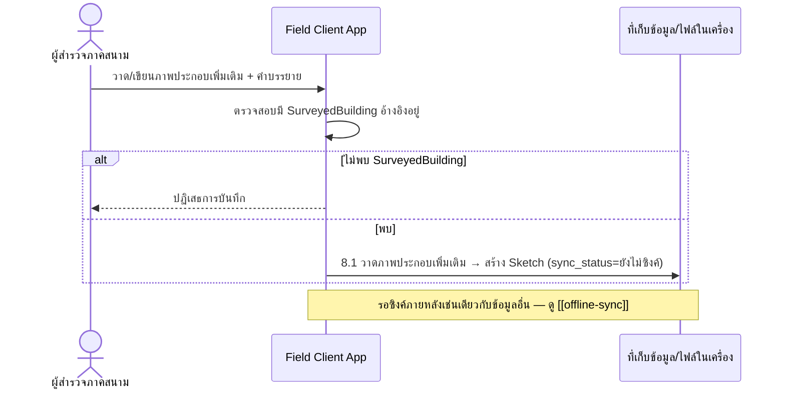

# Component Design: วาดภาพประกอบเพิ่มเติม

รองรับ [[feature-list#5. วาดภาพประกอบเพิ่มเติม|ฟีเจอร์ 5]] (Should have) — อ้างอิง operation จาก [[api-spec#8. วาดภาพประกอบเพิ่มเติม|api-spec หัวข้อ 8]] และ entity [[db-spec#6.3 Sketch|Sketch]]

เป็นส่วนเสริมนอกเหนือจากภาพถ่ายใน [[ai-crack-photo-analysis]] ต้องมี [[db-spec#4.1 SurveyedBuilding|SurveyedBuilding]] จาก [[building-environment-info]] อยู่ก่อนเสมอ

## 1. Sequence Diagram

## 2. Operation ↔ Entity ที่กระทบ

| Operation ([[api-spec#8. วาดภาพประกอบเพิ่มเติม\|api-spec 8.x]]) | Entity ที่กระทบ | การกระทำ | ลำดับ/เงื่อนไข |
|---|---|---|---|
| 8.1 วาดภาพประกอบเพิ่มเติม | [[db-spec#6.3 Sketch\|Sketch]] | สร้าง | ต้องมี `SurveyedBuilding` อยู่ก่อน (จาก [[building-environment-info]]); ไม่บังคับ (Should have) |

## 3. State Transition

`Sketch.sync_status` ใช้ค่าเลือกจากรายการชุดเดียวกับ `SurveyedBuilding`/`DamagePhoto` — ไม่ออกแบบซ้ำในไฟล์นี้ ดู lifecycle เต็มที่ [[offline-sync#3. State Diagram: sync_status|offline-sync]]

## 4. Edge Case และวิธีจัดการ

| Edge Case | วิธีจัดการ | อ้างอิง |
|---|---|---|
| ไม่พบ `SurveyedBuilding` ที่อ้างอิง | ปฏิเสธการบันทึก | [[api-spec#8. วาดภาพประกอบเพิ่มเติม\|api-spec 8.1]] |

## เอกสารที่เกี่ยวข้อง

- [[api-spec]], [[db-spec]], [[feature-list]], [[user-journey]]
- [[building-environment-info]] — ที่มาของ `SurveyedBuilding` ที่ต้องมีก่อน
- [[ai-crack-photo-analysis]] — ภาพประกอบหลัก (ภาพถ่าย) ที่ฟีเจอร์นี้เป็นส่วนเสริม
- [[offline-sync]] — วงจรซิงค์ของ `Sketch`
