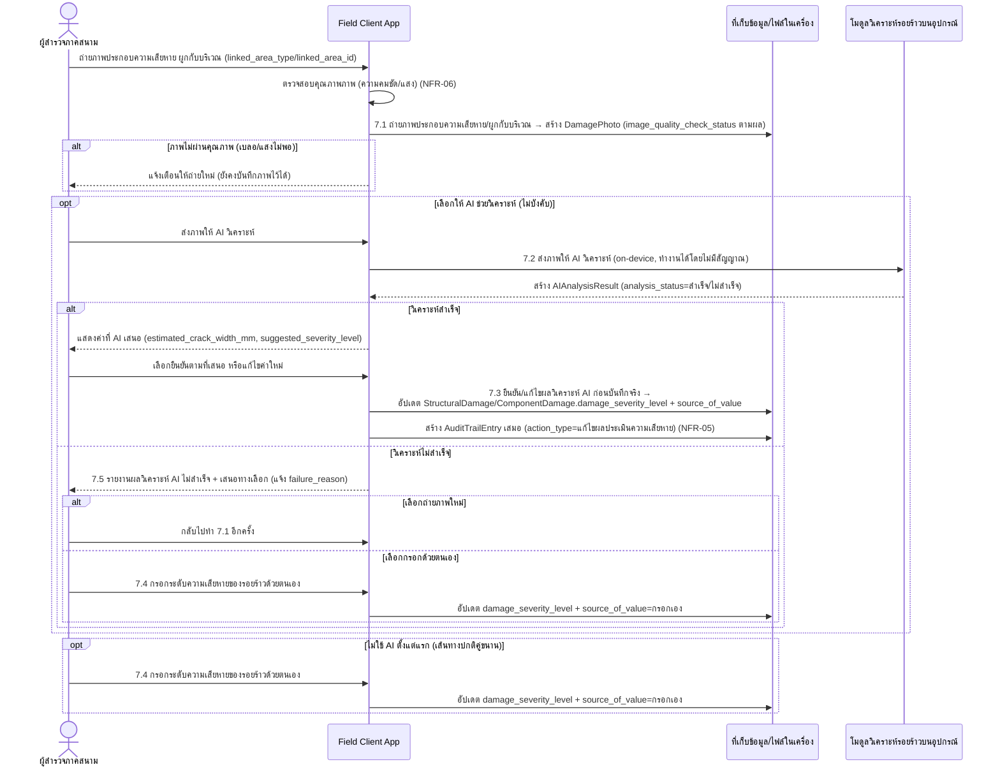
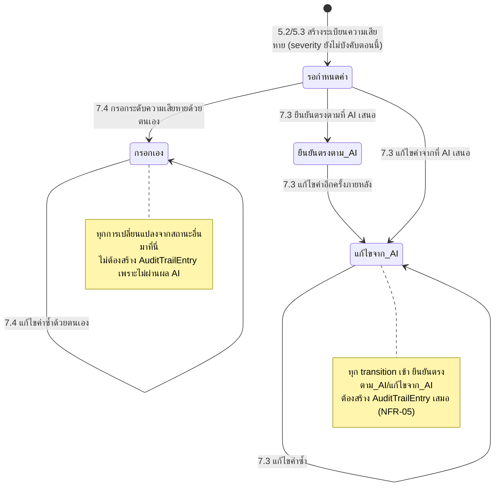
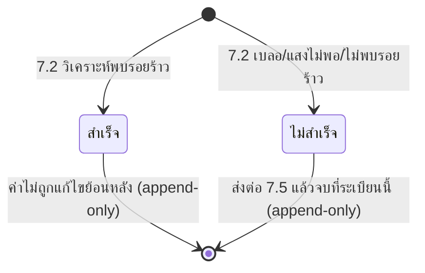

# Component Design: ถ่ายภาพและประเมินรอยร้าวด้วย AI พร้อมทางเลือกกรอกเอง (Human-in-the-loop)

รองรับ [[feature-list#4. ถ่ายภาพและประเมินรอยร้าวด้วย AI พร้อมทางเลือกกรอกเอง (Human-in-the-loop)|ฟีเจอร์ 4]] (Must have) — อ้างอิง operation จาก [[api-spec#7. ถ่ายภาพและประเมินรอยร้าวด้วย AI พร้อมทางเลือกกรอกเอง (Human-in-the-loop)|api-spec หัวข้อ 7]] และ entity จาก [[db-spec#6.1 DamagePhoto|DamagePhoto]], [[db-spec#6.2 AIAnalysisResult|AIAnalysisResult]], [[db-spec#5.3 StructuralDamage|StructuralDamage]], [[db-spec#5.4 ComponentDamage|ComponentDamage]], [[db-spec#7.2 AuditTrailEntry|AuditTrailEntry]]

ทำงานบน [[architecture#2. Logical Component|โมดูลวิเคราะห์รอยร้าวบนอุปกรณ์ (On-device AI Analysis Module)]] เป็นเส้นทางหลัก การกรอกเอง (7.4) เป็น**เส้นทางปกติคู่ขนาน ไม่ใช่ทางออกฉุกเฉิน** ตามข้อจำกัดสถาปัตยกรรมข้อ 3 ใน [[architecture]] — ต่อเนื่องจาก [[structural-damage-assessment]] (ต้องมีระเบียน `StructuralDamage`/`ComponentDamage` อยู่ก่อนจึงจะยืนยัน/กรอกค่าได้)

## 1. Sequence Diagram

## 2. Operation ↔ Entity ที่กระทบ

| Operation ([[api-spec#7. ถ่ายภาพและประเมินรอยร้าวด้วย AI พร้อมทางเลือกกรอกเอง (Human-in-the-loop)\|api-spec 7.x]]) | Entity ที่กระทบ | การกระทำ | ลำดับ/เงื่อนไข |
|---|---|---|---|
| 7.1 ถ่ายภาพประกอบความเสียหาย/ผูกกับบริเวณ | [[db-spec#6.1 DamagePhoto\|DamagePhoto]] | สร้าง | ต้องมี `SurveyedBuilding` อยู่ก่อน; ถ้า `linked_area_type ≠ ทั่วไป` ต้องมีระเบียนความเสียหายปลายทางอยู่ก่อนจาก [[structural-damage-assessment]] |
| 7.2 ส่งภาพให้ AI วิเคราะห์ (on-device) | [[db-spec#6.2 AIAnalysisResult\|AIAnalysisResult]] | สร้าง (append-only) | ต้องมี `DamagePhoto` อยู่ก่อน (7.1); ไม่บังคับเรียก |
| 7.3 ยืนยัน/แก้ไขผลวิเคราะห์ AI ก่อนบันทึกจริง | [[db-spec#5.3 StructuralDamage\|StructuralDamage]] / [[db-spec#5.4 ComponentDamage\|ComponentDamage]] (แก้ไข) + [[db-spec#7.2 AuditTrailEntry\|AuditTrailEntry]] (สร้าง) | แก้ไข + สร้าง | ต้องมี `AIAnalysisResult.analysis_status = สำเร็จ` มาก่อน (7.2); ต้องมีระเบียนความเสียหายปลายทางจาก [[structural-damage-assessment]] อยู่ก่อน |
| 7.4 กรอกระดับความเสียหายของรอยร้าวด้วยตนเอง | [[db-spec#5.3 StructuralDamage\|StructuralDamage]] / [[db-spec#5.4 ComponentDamage\|ComponentDamage]] | แก้ไข | ใช้ได้เสมอไม่ว่าจะเคยเรียก AI มาก่อนหรือไม่ — ไม่ต้องพึ่ง 7.2/7.3 |
| 7.5 รายงานผลวิเคราะห์ AI ไม่สำเร็จ+เสนอถ่ายใหม่ | อ่าน [[db-spec#6.2 AIAnalysisResult\|AIAnalysisResult]] เท่านั้น | อ่าน | เป็นเส้นทางจัดการ error ของ 7.2 เอง ไม่สร้าง/แก้ entity ใหม่ |

## 3. State Diagram

### 3.1 ที่มาของค่า `damage_severity_level` (source_of_value)

### 3.2 AIAnalysisResult.analysis_status (append-only snapshot)

ทุกครั้งที่วิเคราะห์ใหม่ (เช่น ถ่ายภาพใหม่แล้ววิเคราะห์ซ้ำ) ระบบสร้าง `AIAnalysisResult` ระเบียนใหม่เสมอ ไม่แก้ไขระเบียนเดิม — สอดคล้องกับกฎ 1 ใน [[db-spec#10. กฎทางธุรกิจที่กระทบโครงสร้างข้อมูล|db-spec หัวข้อ 10]]

## 4. Edge Case และวิธีจัดการ

| Edge Case | วิธีจัดการ | อ้างอิง |
|---|---|---|
| ภาพเบลอ/แสงไม่พอเกินเกณฑ์ | ยังคงบันทึกภาพได้ แต่แจ้งเตือนให้ถ่ายใหม่ (ไม่บล็อก) | [[api-spec#7. ถ่ายภาพและประเมินรอยร้าวด้วย AI พร้อมทางเลือกกรอกเอง (Human-in-the-loop)\|api-spec 7.1]], NFR-06 |
| `linked_area_id` ไม่ตรงประเภทกับ `linked_area_type` | ปฏิเสธการบันทึกภาพ | [[api-spec#7. ถ่ายภาพและประเมินรอยร้าวด้วย AI พร้อมทางเลือกกรอกเอง (Human-in-the-loop)\|api-spec 7.1]], [[db-spec#10. กฎทางธุรกิจที่กระทบโครงสร้างข้อมูล\|db-spec กฎ 6]] |
| AI วิเคราะห์ไม่สำเร็จ (เบลอ/แสงไม่พอ/ไม่พบรอยร้าว) | บันทึก `analysis_status=ไม่สำเร็จ` พร้อม `failure_reason` แล้วส่งต่อ 7.5 ให้เลือกถ่ายใหม่หรือกรอกเอง | [[api-spec#7. ถ่ายภาพและประเมินรอยร้าวด้วย AI พร้อมทางเลือกกรอกเอง (Human-in-the-loop)\|api-spec 7.2, 7.5]], FR-28 |
| พยายามยืนยันผล AI (7.3) ทั้งที่ `analysis_status = ไม่สำเร็จ` | ปฏิเสธ — ไม่มีค่าให้ยืนยัน ต้องใช้ 7.4 แทน | [[api-spec#7. ถ่ายภาพและประเมินรอยร้าวด้วย AI พร้อมทางเลือกกรอกเอง (Human-in-the-loop)\|api-spec 7.3]] |
| ผู้สำรวจยืนยันตรงตามที่ AI เสนอ (ไม่ได้แก้ไขค่า) | ยังคงต้องสร้าง `AuditTrailEntry` เสมอ เพื่อ auditability ครบถ้วน (ไม่ใช่แค่กรณีแก้ไข) | [[api-spec#7. ถ่ายภาพและประเมินรอยร้าวด้วย AI พร้อมทางเลือกกรอกเอง (Human-in-the-loop)\|api-spec 7.3]], NFR-05 |
| ไม่พบระเบียนความเสียหายปลายทางที่อ้างอิงตอนกรอกเอง (7.4) | ปฏิเสธการบันทึก | [[api-spec#7. ถ่ายภาพและประเมินรอยร้าวด้วย AI พร้อมทางเลือกกรอกเอง (Human-in-the-loop)\|api-spec 7.4]] |

## 5. Edge Case เพิ่มเติมสำหรับการใช้งานกลางแจ้งในพื้นที่ภัยพิบัติ (NFR-04)

ระบุตาม `nfr-review.md` ที่พบว่า NFR-04 ยังไม่มี edge case รองรับในชั้น detailed-design — ฟีเจอร์นี้เป็นจุดที่ผู้สำรวจต้องถ่ายภาพ+อ่านผล AI+กดยืนยัน/แก้ไขค่ากลางแจ้งบ่อยที่สุด:

| Edge Case | วิธีจัดการ | อ้างอิง |
|---|---|---|
| อ่านค่าที่ AI เสนอ (`estimated_crack_width_mm`, `suggested_severity_level`) บนหน้าจอกลางแดดจ้าไม่ชัด แล้วกดยืนยัน/แก้ไขผิดพลาด | ค่าที่ AI เสนอและตัวเลือกยืนยัน/แก้ไขต้องแสดงด้วยความคมชัด/คอนทราสต์สูง และมีขั้นตอนให้ตรวจทานค่าอีกครั้งก่อนกดยืนยันจริง เพื่อลดผลกระทบจากการอ่านผิดกลางแจ้ง | NFR-04 |
| ผู้สำรวจสวมถุงมือ/มือเปียกขณะกดถ่ายภาพหรือเลือกระดับความเสียหายด้วยตนเอง (7.4) | ปุ่มถ่ายภาพและตัวเลือกระดับความเสียหายต้องมีขนาดสัมผัสใหญ่พอ ลดโอกาสกดพลาด/เลือกค่าผิดโดยไม่ตั้งใจ | NFR-04 |
| แอปถูกปิด/เครื่องดับกลางคันระหว่างรอผล AI วิเคราะห์ (7.2) หรือระหว่างกรอกค่ายืนยัน/แก้ไข (7.3/7.4) | ภาพที่ถ่ายแล้วและผลวิเคราะห์ที่ได้แล้วต้องถูกบันทึกไว้ในที่เก็บข้อมูล/ไฟล์ในเครื่องทันที ไม่สูญหายเมื่อเปิดแอปใหม่ — ผู้สำรวจกลับมาทำต่อจากจุดเดิม (ยืนยัน/แก้ไข/ถ่ายใหม่) ได้โดยไม่ต้องเริ่มกระบวนการใหม่ทั้งหมด | NFR-04, NFR-01 |

## เอกสารที่เกี่ยวข้อง

- [[api-spec]], [[db-spec]], [[feature-list]], [[user-journey]], [[architecture]]
- [[structural-damage-assessment]] — ที่มาของระเบียนความเสียหายปลายทางที่ฟีเจอร์นี้แก้ไขค่า
- [[additional-sketch]] — ทางเลือกภาพประกอบเพิ่มเติมนอกเหนือจากภาพถ่าย
- [[offline-sync]] — การซิงค์ `DamagePhoto`/`AIAnalysisResult` ขึ้นเซิร์ฟเวอร์ภายหลัง
