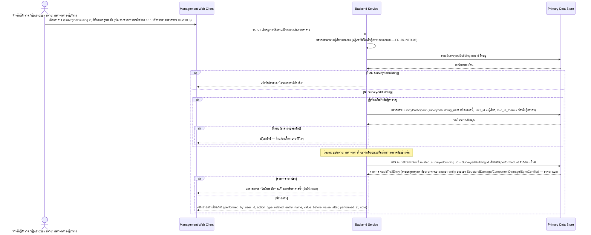

# Component Design: เรียกดูประวัติการแก้ไขผลประเมินรายอาคาร (Audit Trail รายอาคาร)

รองรับ [[feature-list#16. เรียกดูประวัติการแก้ไขผลประเมินรายอาคาร (Audit Trail รายอาคาร)|ฟีเจอร์ 16]] (Should have) — อ้างอิง operation จาก [[api-spec#15.5.1 เรียกดูประวัติการแก้ไขผลประเมินรายอาคาร|api-spec 15.5.1]] และ entity [[db-spec#7.2 AuditTrailEntry|AuditTrailEntry]] (อ่านเท่านั้น), [[db-spec#4.1 SurveyedBuilding|SurveyedBuilding]] (อ่าน — ตรวจสอบว่ามีจริง), [[db-spec#4.2 SurveyParticipant|SurveyParticipant]] (อ่าน — ใช้ตรวจสอบขอบเขตสิทธิ์)

ใช้งานผ่าน [[architecture#2. Logical Component|Management Web Client]] (ต้องมีสัญญาณอินเทอร์เน็ต) โดยหัวหน้าผู้สำรวจ (เฉพาะทีม/อาคารของตน), ผู้ดูแลระบบ, หน่วยงานส่วนกลาง/ผู้บริหาร — **ไม่รวมผู้สำรวจภาคสนาม** (FR-26) — เพิ่มเข้ามา 2026-09-02 หลัง `prototype-auditor` พบว่า NFR-05 กำหนดให้เก็บ `AuditTrailEntry` ไว้ "เพื่อการตรวจสอบย้อนหลัง" แต่ไม่เคยมีช่องทางอ่านมาก่อน (ดู [[architecture#6.7 ไม่มี component ใหม่และไม่มีไดอะแกรมใหม่สำหรับความสามารถเรียกดู/ค้นหาประวัติการแก้ไข (FR-32, FR-33)|architecture §6.7]]) ไม่มี component/entity ใหม่ อ่านข้อมูลของ `AuditTrailEntry` ที่มีอยู่แล้วเท่านั้น

ขอบเขตสิทธิ์ของหัวหน้าผู้สำรวจใช้ **ownership-based scoping ผ่าน `SurveyParticipant`** ซึ่งเป็น pattern เดียวกับที่ใช้ใน [[search-filter-buildings]] (13.1) และ [[manual-conflict-resolution]] (15.1) — ไม่ใช่ `Assignment`/FR-20 (ดูหมายเหตุความคลาดเคลื่อนเล็กน้อยของ [[architecture#5.5 Cross-cutting concerns|architecture §5.5]] ที่ตั้งข้อสมมติไว้ว่าจะพึ่ง FR-20 — เอกสารนี้ยึดตาม [[api-spec#15.5.1 เรียกดูประวัติการแก้ไขผลประเมินรายอาคาร|api-spec]]/[[db-spec#4.2 SurveyParticipant|db-spec]] ที่เป็นชั้นใกล้ตัวกว่า)

## 1. Sequence Diagram

## 2. Operation ↔ Entity ที่กระทบ

| Operation ([[api-spec#15.5.1 เรียกดูประวัติการแก้ไขผลประเมินรายอาคาร\|api-spec 15.5.1]]) | Entity ที่กระทบ | การกระทำ | ลำดับ/เงื่อนไข |
|---|---|---|---|
| 15.5.1 เรียกดูประวัติการแก้ไขผลประเมินรายอาคาร | [[db-spec#4.1 SurveyedBuilding\|SurveyedBuilding]] (อ่าน) | อ่าน | ต้องพบระเบียนก่อน มิฉะนั้นปฏิเสธทันที |
| 15.5.1 เรียกดูประวัติการแก้ไขผลประเมินรายอาคาร | [[db-spec#4.2 SurveyParticipant\|SurveyParticipant]] (อ่าน — เฉพาะเมื่อผู้เรียกเป็นหัวหน้าผู้สำรวจ) | อ่าน | ตรวจสอบว่าผู้เรียกมีระเบียน `role_in_team = หัวหน้าผู้สำรวจ` ผูกกับอาคารนี้หรือไม่ — **ต้องตรวจสอบขอบเขตนี้ก่อนส่งคืนผลลัพธ์เสมอ ไม่ใช่กรองหลังอ่านข้อมูลแล้ว** (ownership-based scoping pattern เดียวกับ [[search-filter-buildings#2. Operation ↔ Entity ที่กระทบ\|13.1]]/[[manual-conflict-resolution#2. Operation ↔ Entity ที่กระทบ\|15.1]]) |
| 15.5.1 เรียกดูประวัติการแก้ไขผลประเมินรายอาคาร | [[db-spec#7.2 AuditTrailEntry\|AuditTrailEntry]] (อ่าน) | อ่าน | กรองด้วย `related_surveyedbuilding_id = SurveyedBuilding.id` เรียงจากเก่า→ใหม่ตาม `performed_at` — ครอบคลุมเหตุการณ์ที่เกิดกับ entity ย่อยของอาคาร (`StructuralDamage`/`ComponentDamage`/`ExternalDamage`/`SyncConflict`) ได้โดยตรงเพราะ attribute นี้ถูก resolve ไว้ล่วงหน้าตอนสร้างระเบียนตาม [[db-spec#10. กฎทางธุรกิจที่กระทบโครงสร้างข้อมูล|db-spec §10 ข้อ 8]] ไม่ต้องไล่ตรวจ `related_entity_name` ทีละชนิด |

## 3. State Transition

ไม่มี — เป็นการอ่านประวัติที่มีอยู่แล้วอย่างเดียว ไม่มี state ของตัวเอง (สถานะที่เกี่ยวข้องอยู่ที่ต้นทางของแต่ละเหตุการณ์ เช่น `SurveyedBuilding.review_status`/`sync_status`, `SyncConflict.status` — ดู lifecycle เต็มที่ [[survey-review-signature]], [[offline-sync]], [[manual-conflict-resolution]])

## 4. Edge Case และวิธีจัดการ

| Edge Case | วิธีจัดการ | อ้างอิง |
|---|---|---|
| อาคารไม่เคยมีเหตุการณ์แก้ไขผลใดๆ เลย (ประวัติว่างเปล่า) | แสดงสถานะ "ไม่มีประวัติการแก้ไขสำหรับอาคารนี้" อย่างชัดเจน — **ถือเป็นสถานะปกติ ไม่ใช่ error** และไม่ใช่หน้าว่างเปล่าที่สับสน | [[api-spec#15.5.1 เรียกดูประวัติการแก้ไขผลประเมินรายอาคาร\|api-spec 15.5.1]], acceptance-criteria FR-32 AC-5 |
| ผู้สำรวจภาคสนามพยายามเรียก operation นี้ (แม้เป็นอาคารที่ตนเองสำรวจ) | ปฏิเสธสิทธิ์ทันที และไม่แสดงจุดเข้าถึง (เมนู/ปุ่ม) ไปยังความสามารถนี้เลยในส่วนต่อประสานของบทบาทนี้ | [[api-spec#15.5.1 เรียกดูประวัติการแก้ไขผลประเมินรายอาคาร\|api-spec 15.5.1]] (FR-26), acceptance-criteria FR-32 AC-2 |
| หัวหน้าผู้สำรวจพยายามเปิดดูประวัติของอาคารนอกทีม/ความรับผิดชอบของตน | อาคารนั้นไม่ปรากฏเป็นตัวเลือก และปฏิเสธการเข้าถึงหากพยายามเข้าถึงโดยตรง (ตรวจสอบขอบเขตก่อนคืนผลลัพธ์เสมอ) | [[api-spec#15.5.1 เรียกดูประวัติการแก้ไขผลประเมินรายอาคาร\|api-spec 15.5.1]], acceptance-criteria FR-32 AC-3 |
| ผู้ดูแลระบบ/หน่วยงานส่วนกลางเปิดดูอาคารใดก็ได้ | อนุญาตเสมอ ไม่จำกัดขอบเขตทีมเหมือนหัวหน้าผู้สำรวจ | [[api-spec#15.5.1 เรียกดูประวัติการแก้ไขผลประเมินรายอาคาร\|api-spec 15.5.1]], acceptance-criteria FR-32 AC-4 |
| ไม่พบ `SurveyedBuilding` ที่อ้างอิง | แจ้งข้อผิดพลาด "ไม่พบอาคาร" ก่อนตรวจสิทธิ์ต่อ | [[api-spec#15.5.1 เรียกดูประวัติการแก้ไขผลประเมินรายอาคาร\|api-spec 15.5.1]] |
| รายการประวัติที่ผู้กระทำเป็นระบบ ไม่ใช่มนุษย์ (`action_type = ซิงค์ข้อมูลสำเร็จ` / `ตรวจพบความขัดแย้งของข้อมูล` ซึ่ง `performed_by_user_id` ว่างได้) | แสดงผู้กระทำเป็น "ระบบ" อย่างชัดเจน (ไม่ใช่ช่องว่าง/"ไม่ระบุ" ที่ดูเหมือนข้อมูลขาดหาย) พร้อมอ้างอิง `device_id` ต้นทางที่เก็บไว้ใน `note` ของระเบียนนั้น เพื่อให้ผู้อ่านเข้าใจว่าเป็นผลจาก [[offline-sync#2. Operation ↔ Entity ที่กระทบ\|14.1/14.2]] ไม่ใช่ข้อมูลบกพร่อง | [[db-spec#7.2 AuditTrailEntry\|db-spec 7.2]] (`performed_by_user_id` ไม่บังคับเมื่อ `action_type` เป็น 2 ค่านี้) |

## 5. ประเด็นที่ยังไม่ตัดสินใจ (ส่งต่อจาก db-spec/architecture)

- **Retention policy ของ `AuditTrailEntry`**: ยังไม่กำหนดระยะเวลาเก็บรักษา/archive ที่ชัดเจน (สมมติไว้ก่อนว่า "เก็บตลอดอายุของระเบียนที่เกี่ยวข้อง") — ถ้ามีการกำหนดนโยบายในอนาคต อาจกระทบว่าประวัติบางช่วงเวลาจะยังคงดึงมาแสดงในหน้านี้ได้ครบหรือไม่ ไม่ใช่สิ่งที่ไฟล์นี้ตัดสินใจเอง ดู [[db-spec#11. ประเด็นรอตัดสินใจ|db-spec §11]]
- กลยุทธ์การทำดัชนี/ค้นหาที่มีประสิทธิภาพเมื่อข้อมูล `AuditTrailEntry` สะสมมากขึ้น เป็นการตัดสินใจเชิงเทคนิคที่ต้องรอ `technology-stack.md` (ดู [[architecture#8. ประเด็นรอตัดสินใจ|architecture §8]])

## เอกสารที่เกี่ยวข้อง

- [[api-spec]], [[db-spec]], [[feature-list]], [[user-journey]], [[architecture]]
- [[audit-trail-search]] — ความสามารถค้นหาประวัติทั่วทั้งระบบ (ฟีเจอร์ 17) ใช้ entity เดียวกันแต่คนละขอบเขตสิทธิ์/ผู้ใช้
- [[search-filter-buildings]], [[manual-conflict-resolution]] — ที่มาของ ownership-based scoping pattern ผ่าน `SurveyParticipant` ที่ใช้ซ้ำในไฟล์นี้
- [[ai-crack-photo-analysis]], [[survey-review-signature]], [[offline-sync]] — ที่มาของเหตุการณ์ `AuditTrailEntry` ที่ปรากฏในประวัติของอาคาร
