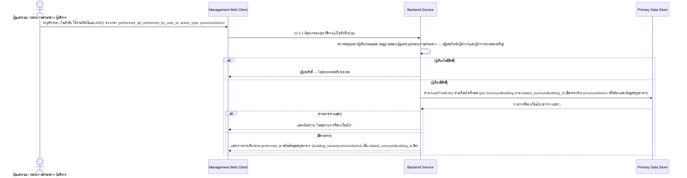

# Component Design: ค้นหา/กรองประวัติการแก้ไขทั่วทั้งระบบ (Audit Trail ระดับหน่วยงาน)

รองรับ [[feature-list#17. ค้นหา/กรองประวัติการแก้ไขทั่วทั้งระบบ (Audit Trail ระดับหน่วยงาน)|ฟีเจอร์ 17]] (Should have) — อ้างอิง operation จาก [[api-spec#15.5.2 ค้นหา/กรองประวัติการแก้ไขทั่วทั้งระบบ|api-spec 15.5.2]] และ entity [[db-spec#7.2 AuditTrailEntry|AuditTrailEntry]] (อ่านเท่านั้น), [[db-spec#4.1 SurveyedBuilding|SurveyedBuilding]] (อ่าน — ใช้กรองพื้นที่/แสดงข้อมูลสรุป)

ใช้งานผ่าน [[architecture#2. Logical Component|Management Web Client]] (ต้องมีสัญญาณอินเทอร์เน็ต) โดย**ผู้ดูแลระบบ, หน่วยงานส่วนกลาง/ผู้บริหาร เท่านั้น** — **ไม่รวมหัวหน้าผู้สำรวจ** (ขอบเขตกว้างกว่าทีม/อาคารที่ตนรับผิดชอบ ให้ใช้ [[audit-trail-building]] แบบรายอาคารในขอบเขตทีมตนเองแทน) และ**ไม่รวมผู้สำรวจภาคสนาม** (FR-26) — เพิ่มเข้ามา 2026-09-02 พร้อมฟีเจอร์ 16 ด้วยเหตุผลเดียวกัน (ดู [[audit-trail-building]] และ [[architecture#6.7 ไม่มี component ใหม่และไม่มีไดอะแกรมใหม่สำหรับความสามารถเรียกดู/ค้นหาประวัติการแก้ไข (FR-32, FR-33)|architecture §6.7]]) ไม่มี component/entity ใหม่ อ่านข้อมูลของ `AuditTrailEntry` ที่มีอยู่แล้วเท่านั้น

## 1. Sequence Diagram

## 2. Operation ↔ Entity ที่กระทบ

| Operation ([[api-spec#15.5.2 ค้นหา/กรองประวัติการแก้ไขทั่วทั้งระบบ\|api-spec 15.5.2]]) | Entity ที่กระทบ | การกระทำ | ลำดับ/เงื่อนไข |
|---|---|---|---|
| 15.5.2 ค้นหา/กรองประวัติการแก้ไขทั่วทั้งระบบ | [[db-spec#7.2 AuditTrailEntry\|AuditTrailEntry]] (อ่าน) | อ่าน | กรองตามช่วงเวลา (`performed_at`), `performed_by_user_id`, `action_type` — ตัวกรองทั้งหมดใช้ร่วมกันแบบ AND ได้; ต้องตรวจสอบสิทธิ์ผู้เรียก (ผู้ดูแลระบบ/หน่วยงานส่วนกลางเท่านั้น) ก่อนประมวลผลเสมอ (NFR-08) |
| 15.5.2 ค้นหา/กรองประวัติการแก้ไขทั่วทั้งระบบ | [[db-spec#4.1 SurveyedBuilding\|SurveyedBuilding]] (อ่าน — เมื่อกรองด้วย `province`/`district` หรือต้องแสดงข้อมูลสรุป) | อ่าน | join ผ่าน `AuditTrailEntry.related_surveyedbuilding_id`; รายการที่ `related_surveyedbuilding_id` เป็นค่าว่าง (เช่น `related_entity_name = User`) จะไม่มีพื้นที่ให้ join จึงถูกตัดออกโดยอัตโนมัติเมื่อใช้ตัวกรองพื้นที่ |

## 3. State Transition

ไม่มี — เป็นการค้นหา/กรองข้อมูลที่มีอยู่แล้วอย่างเดียว ไม่มี state ของตัวเอง

## 4. Edge Case และวิธีจัดการ

| Edge Case | วิธีจัดการ | อ้างอิง |
|---|---|---|
| ค้นหา/กรองแล้วไม่พบผลลัพธ์ตรงเงื่อนไข | แสดงข้อความชัดเจนว่า "ไม่พบรายการที่ตรงเงื่อนไข" แทนที่จะแสดงหน้าว่างเปล่าโดยไม่มีคำอธิบาย | [[api-spec#15.5.2 ค้นหา/กรองประวัติการแก้ไขทั่วทั้งระบบ\|api-spec 15.5.2]], acceptance-criteria FR-33 AC-4 |
| หัวหน้าผู้สำรวจพยายามเข้าถึงความสามารถนี้ | ปฏิเสธสิทธิ์ (ขอบเขตกว้างกว่าทีม/อาคารที่ตนรับผิดชอบ) — ไม่แสดงจุดเข้าถึงในส่วนต่อประสานของบทบาทนี้ ให้ใช้ [[audit-trail-building]] แทน | [[api-spec#15.5.2 ค้นหา/กรองประวัติการแก้ไขทั่วทั้งระบบ\|api-spec 15.5.2]], acceptance-criteria FR-33 AC-2 |
| ผู้สำรวจภาคสนามพยายามเข้าถึงความสามารถนี้ | ปฏิเสธสิทธิ์ทันที (FR-26) — ไม่แสดงจุดเข้าถึงในส่วนต่อประสานของบทบาทนี้เลย | [[api-spec#15.5.2 ค้นหา/กรองประวัติการแก้ไขทั่วทั้งระบบ\|api-spec 15.5.2]], acceptance-criteria FR-33 AC-3 |
| กรองด้วยเงื่อนไข "พื้นที่" แต่มีบางรายการ `related_surveyedbuilding_id` เป็นค่าว่าง (เช่นเหตุการณ์เกี่ยวกับ `User`) | รายการเหล่านั้นไม่ปรากฏในผลลัพธ์เพราะไม่มีพื้นที่ให้อ้างอิง — ไม่ใช่ error เป็นผลลัพธ์ที่คาดหวังของการกรองแบบ AND | [[api-spec#15.5.2 ค้นหา/กรองประวัติการแก้ไขทั่วทั้งระบบ\|api-spec 15.5.2]] |
| ประวัติที่ผู้กระทำเป็นระบบ ไม่ใช่มนุษย์ (`action_type = ซิงค์ข้อมูลสำเร็จ` / `ตรวจพบความขัดแย้งของข้อมูล` ซึ่ง `performed_by_user_id` ว่างได้) | แสดงผู้กระทำเป็น "ระบบ" อย่างชัดเจนในผลลัพธ์ (ไม่ใช่ช่องว่างที่ดูเหมือนข้อมูลขาดหาย); เมื่อกรองด้วย `performed_by_user_id` เจาะจงคน รายการเหล่านี้จะไม่ตรงเงื่อนไขและถูกตัดออกตามปกติ ไม่ถือเป็น error | [[db-spec#7.2 AuditTrailEntry\|db-spec 7.2]] (`performed_by_user_id` ไม่บังคับเมื่อ `action_type` เป็น 2 ค่านี้) |

## 5. ประเด็นที่ยังไม่ตัดสินใจ (ส่งต่อจาก db-spec/architecture)

- **Retention policy ของ `AuditTrailEntry`**: เช่นเดียวกับ [[audit-trail-building#5. ประเด็นที่ยังไม่ตัดสินใจ (ส่งต่อจาก db-spec/architecture)|audit-trail-building]] — ยังไม่กำหนดระยะเวลาเก็บรักษา/archive ที่ชัดเจน ดู [[db-spec#11. ประเด็นรอตัดสินใจ|db-spec §11]]
- **กลยุทธ์การทำดัชนี/ค้นหาที่มีประสิทธิภาพ**: ความสามารถนี้ค้นหาข้าม `AuditTrailEntry` ทั้งระบบ (ไม่จำกัดรายอาคารเหมือน [[audit-trail-building]]) จึงกระทบโดยตรงมากที่สุดเมื่อข้อมูลสะสมมากขึ้นเรื่อยๆ โดยไม่มีการลบอัตโนมัติ — เป็นการตัดสินใจเชิงเทคนิคที่ต้องรอ `technology-stack.md` (ดู [[architecture#8. ประเด็นรอตัดสินใจ|architecture §8]])

## เอกสารที่เกี่ยวข้อง

- [[api-spec]], [[db-spec]], [[feature-list]], [[user-journey]], [[architecture]]
- [[audit-trail-building]] — ความสามารถเรียกดูประวัติรายอาคาร (ฟีเจอร์ 16) ใช้ entity เดียวกันแต่คนละขอบเขตสิทธิ์/ผู้ใช้ (รวมหัวหน้าผู้สำรวจแบบจำกัดทีม)
- [[ai-crack-photo-analysis]], [[survey-review-signature]], [[offline-sync]], [[manual-conflict-resolution]] — ที่มาของเหตุการณ์ `AuditTrailEntry` ที่ปรากฏในผลการค้นหา
