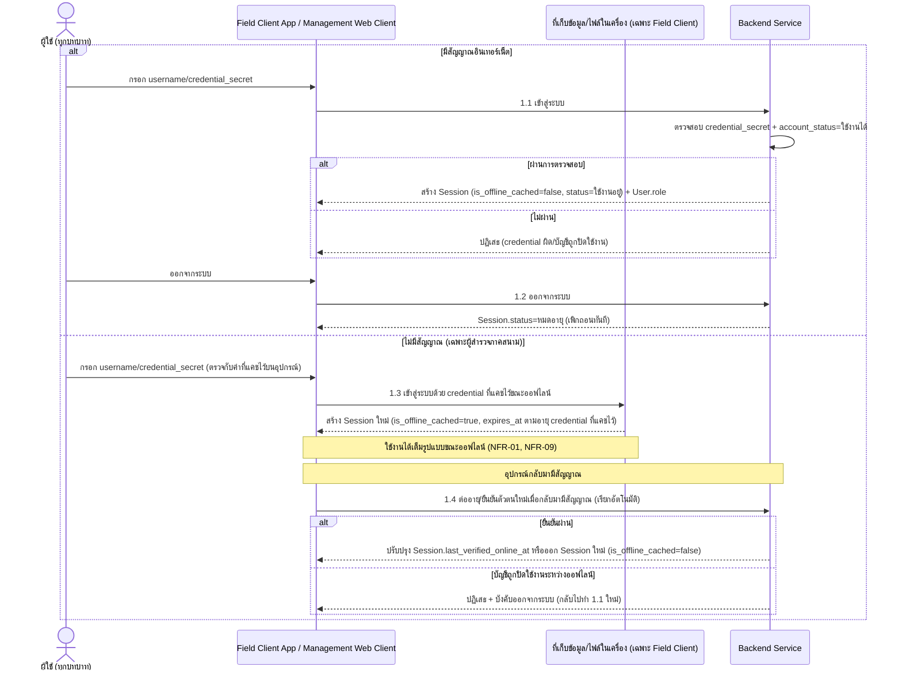
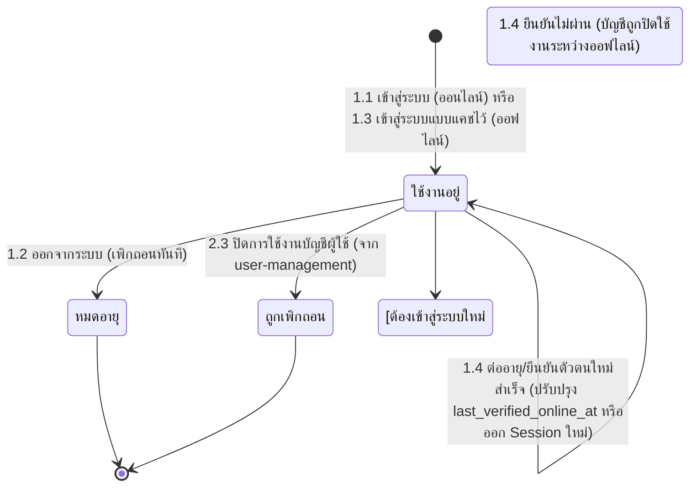

# Component Design: ยืนยันตัวตนและเข้าสู่ระบบ

รองรับ [[feature-list#14. ยืนยันตัวตนและเข้าสู่ระบบ|ฟีเจอร์ 14]] (Must have) — อ้างอิง operation จาก [[api-spec#1. ยืนยันตัวตนและเข้าสู่ระบบ|api-spec หัวข้อ 1]] และ entity [[db-spec#2.1 User|User]], [[db-spec#2.2 Session|Session]]

เป็นจุดเริ่มต้นของทุก journey ตาม [[user-journey]] — `User.role` ที่กำหนดใน [[user-management]] เป็นตัวกำหนดสิทธิ์เข้าถึงเมนู/หน้าจอหลังเข้าสู่ระบบสำเร็จ (NFR-08) FR-27/NFR-09 เกี่ยวข้องเฉพาะผู้สำรวจภาคสนามที่ทำงานออฟไลน์บน [[architecture#2. Logical Component|Field Client App]]

## 1. Sequence Diagram

## 2. Operation ↔ Entity ที่กระทบ

| Operation ([[api-spec#1. ยืนยันตัวตนและเข้าสู่ระบบ\|api-spec 1.x]]) | Entity ที่กระทบ | การกระทำ | ลำดับ/เงื่อนไข |
|---|---|---|---|
| 1.1 เข้าสู่ระบบ | [[db-spec#2.2 Session\|Session]] (สร้าง), [[db-spec#2.1 User\|User]] (อ่าน) | สร้าง + อ่าน | ต้องมี `User` จาก [[user-management]] อยู่ก่อน; `account_status = ใช้งานได้` เท่านั้น |
| 1.2 ออกจากระบบ | [[db-spec#2.2 Session\|Session]] | แก้ไข (`status=หมดอายุ`) | ต้องมี `Session` ที่ใช้งานอยู่จาก 1.1/1.3 |
| 1.3 เข้าสู่ระบบด้วย credential ที่แคชไว้ขณะออฟไลน์ | [[db-spec#2.2 Session\|Session]] | สร้าง (`is_offline_cached=true`) | ใช้ได้เฉพาะไม่มีสัญญาณ; ต้องเคยเข้าสู่ระบบสำเร็จบนอุปกรณ์นี้มาก่อน (มี credential แคชไว้) |
| 1.4 ต่ออายุ/ยืนยันตัวตนใหม่เมื่อกลับมามีสัญญาณ | [[db-spec#2.2 Session\|Session]] | แก้ไข/สร้างใหม่ | ต้องมี `Session` ที่ `is_offline_cached=true` จาก 1.3 อยู่ก่อน; ต้องเรียกทันทีที่กลับมามีสัญญาณ |

## 3. State Diagram: Session.status

หมายเหตุ: transition สุดท้าย ("ต้องเข้าสู่ระบบใหม่ 1.1") เป็นสถานะบังคับ re-authenticate ไม่ใช่ค่า `status` ใหม่ใน [[db-spec]] — เขียนไว้เพื่อสื่อ flow บังคับเท่านั้น

## 4. Edge Case และวิธีจัดการ

| Edge Case | วิธีจัดการ | อ้างอิง |
|---|---|---|
| ชื่อบัญชี/รหัสผ่านไม่ถูกต้อง | ปฏิเสธการเข้าสู่ระบบ | [[api-spec#1. ยืนยันตัวตนและเข้าสู่ระบบ\|api-spec 1.1]] |
| บัญชีถูกปิดใช้งาน (`account_status = ปิดใช้งาน`) | ปฏิเสธการเข้าสู่ระบบ | [[api-spec#1. ยืนยันตัวตนและเข้าสู่ระบบ\|api-spec 1.1]] |
| session ไม่พบ/ถูกเพิกถอนไปแล้วตอนออกจากระบบ | ถือว่าออกจากระบบสำเร็จแล้ว ไม่ error ซ้ำ | [[api-spec#1. ยืนยันตัวตนและเข้าสู่ระบบ\|api-spec 1.2]] |
| credential ที่แคชไว้หมดอายุแล้ว | ต้องเชื่อมต่อเซิร์ฟเวอร์เพื่อเข้าสู่ระบบใหม่ (1.1) | [[api-spec#1. ยืนยันตัวตนและเข้าสู่ระบบ\|api-spec 1.3]], NFR-09 |
| ไม่เคยเข้าสู่ระบบสำเร็จบนอุปกรณ์นี้มาก่อน | ไม่มี credential ให้แคช ไม่สามารถเข้าสู่ระบบออฟไลน์ได้ | [[api-spec#1. ยืนยันตัวตนและเข้าสู่ระบบ\|api-spec 1.3]] |
| บัญชีถูกปิดใช้งานระหว่างที่ออฟไลน์อยู่ | ปฏิเสธการต่ออายุ + บังคับออกจากระบบเมื่อกลับมามีสัญญาณ | [[api-spec#1. ยืนยันตัวตนและเข้าสู่ระบบ\|api-spec 1.4]] |

## เอกสารที่เกี่ยวข้อง

- [[api-spec]], [[db-spec]], [[feature-list]], [[user-journey]], [[architecture]]
- [[user-management]] — ที่มาของ `User.role`/`account_status` ที่ฟีเจอร์นี้ตรวจสอบ
- [[offline-sync]] — กลไกออฟไลน์ที่เกี่ยวข้อง (คนละเรื่องกับ session แต่ใช้หลักการ offline-first เดียวกัน)
