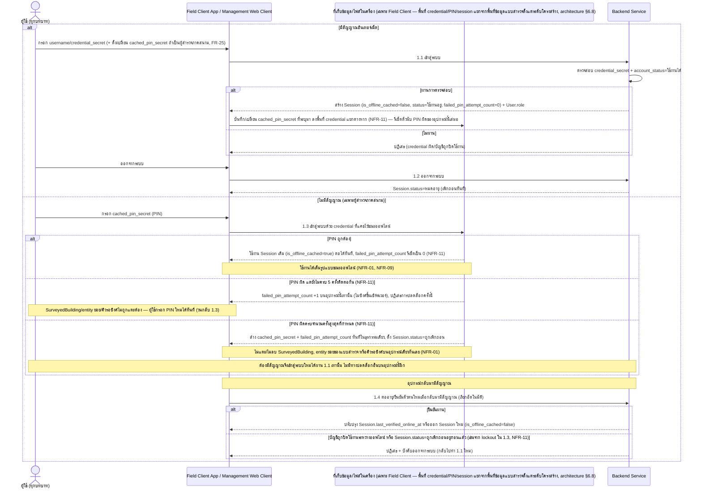
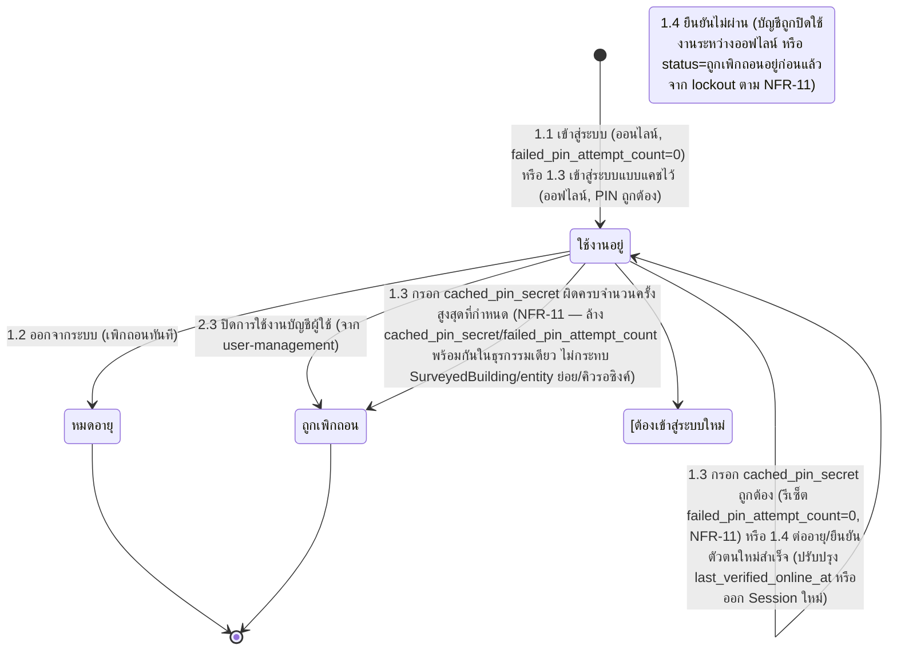

# Component Design: ยืนยันตัวตนและเข้าสู่ระบบ

รองรับ [[feature-list#14. ยืนยันตัวตนและเข้าสู่ระบบ|ฟีเจอร์ 14]] (Must have) — อ้างอิง operation จาก [[api-spec#1. ยืนยันตัวตนและเข้าสู่ระบบ|api-spec หัวข้อ 1]] และ entity [[db-spec#2.1 User|User]], [[db-spec#2.2 Session|Session]]

เป็นจุดเริ่มต้นของทุก journey ตาม [[user-journey]] — `User.role` ที่กำหนดใน [[user-management]] เป็นตัวกำหนดสิทธิ์เข้าถึงเมนู/หน้าจอหลังเข้าสู่ระบบสำเร็จ (NFR-08) FR-27/NFR-09 เกี่ยวข้องเฉพาะผู้สำรวจภาคสนามที่ทำงานออฟไลน์บน [[architecture#2. Logical Component|Field Client App]]

**เพิ่มเข้ามา 2026-09-03 (NFR-11 — Security, PIN Attempt Lockout)**: เมื่อผู้สำรวจภาคสนามกรอก `cached_pin_secret` ผิดติดต่อกัน**ครบ 5 ครั้ง** (ยืนยันแล้ว 2026-09-04 — ปิดข้อสมมติหมวด 6 ข้อ 11 ดู [[api-spec#16. ประเด็นรอตัดสินใจ|api-spec หัวข้อ 16]]) ต้องล้าง `Session.cached_pin_secret`/`Session.failed_pin_attempt_count` ทันทีพร้อมตั้ง `Session.status = ถูกเพิกถอน` — **ห้ามกระทบ `SurveyedBuilding`/entity ย่อยของแบบสำรวจ/คิวรอซิงค์บนอุปกรณ์เดียวกันเด็ดขาด** (NFR-01) เพราะพื้นที่จัดเก็บ credential/PIN/session แยกจากพื้นที่ข้อมูลแบบสำรวจตั้งแต่ระดับโครงสร้าง (ดู [[architecture#6.8 แยกพื้นที่จัดเก็บ credential/PIN ออกจากข้อมูลแบบสำรวจในเครื่อง (NFR-11)|architecture §6.8]]) — รายละเอียดเต็มอยู่ที่ [[api-spec#1.3 เข้าสู่ระบบด้วย credential ที่แคชไว้ขณะออฟไลน์|api-spec 1.3]] และ [[db-spec#10. กฎทางธุรกิจที่กระทบโครงสร้างข้อมูล|db-spec หัวข้อ 10 ข้อ 10]]

## 1. Sequence Diagram

## 2. Operation ↔ Entity ที่กระทบ

| Operation ([[api-spec#1. ยืนยันตัวตนและเข้าสู่ระบบ\|api-spec 1.x]]) | Entity ที่กระทบ | การกระทำ | ลำดับ/เงื่อนไข |
|---|---|---|---|
| 1.1 เข้าสู่ระบบ | [[db-spec#2.2 Session\|Session]] (สร้าง — `failed_pin_attempt_count=0` เสมอ, `cached_pin_secret` บันทึกถ้าระบุมา), [[db-spec#2.1 User\|User]] (อ่าน) | สร้าง + อ่าน | ต้องมี `User` จาก [[user-management]] อยู่ก่อน; `account_status = ใช้งานได้` เท่านั้น; ถ้าระบุ `cached_pin_secret` มาด้วยให้บันทึกทันทีเพื่อใช้ปลดล็อกออฟไลน์ครั้งถัดไป (FR-25) — การเข้าสู่ระบบสำเร็จรีเซ็ตตัวนับ PIN ผิดของอุปกรณ์นี้เสมอไม่ว่าจะเคย lockout มาก่อนหรือไม่ (NFR-11) |
| 1.2 ออกจากระบบ | [[db-spec#2.2 Session\|Session]] | แก้ไข (`status=หมดอายุ`) | ต้องมี `Session` ที่ใช้งานอยู่จาก 1.1/1.3 |
| 1.3 เข้าสู่ระบบด้วย credential ที่แคชไว้ขณะออฟไลน์ | [[db-spec#2.2 Session\|Session]] (แก้ไข `failed_pin_attempt_count`/`cached_pin_secret`/`status` ตาม 3 กรณีผลลัพธ์) | แก้ไข | ใช้ได้เฉพาะไม่มีสัญญาณ; ต้องเคยเข้าสู่ระบบสำเร็จบนอุปกรณ์นี้มาก่อน (มี `cached_pin_secret` แคชไว้); **3 กรณีผลลัพธ์ (NFR-11)**: (ก) PIN ถูก → ใช้ `Session` เดิมต่อ + รีเซ็ต `failed_pin_attempt_count=0` (ข) PIN ผิดยังไม่ครบจำนวน → `failed_pin_attempt_count +1` (ค) PIN ผิดครบ 5 ครั้งติดต่อกัน → ล้าง `cached_pin_secret`+`failed_pin_attempt_count` พร้อมตั้ง `status=ถูกเพิกถอน` ในธุรกรรมเดียว — **ห้ามกระทบ `SurveyedBuilding`/entity ย่อย/คิวรอซิงค์บนอุปกรณ์เดียวกันเด็ดขาด** (NFR-01) |
| 1.4 ต่ออายุ/ยืนยันตัวตนใหม่เมื่อกลับมามีสัญญาณ | [[db-spec#2.2 Session\|Session]] | แก้ไข/สร้างใหม่ | ต้องมี `Session` ที่ `is_offline_cached=true` จาก 1.3 อยู่ก่อน; ต้องเรียกทันทีที่กลับมามีสัญญาณ; ถ้า `Session.status = ถูกเพิกถอน` อยู่ก่อนแล้ว (เช่นจาก lockout ใน 1.3 ตาม NFR-11) ต้องปฏิเสธและบังคับเข้าสู่ระบบใหม่ทั้งหมดผ่าน 1.1 เท่านั้น ไม่สามารถต่ออายุ session ที่ถูกเพิกถอนแล้วได้ |

## 3. State Diagram: Session.status

หมายเหตุ: transition สุดท้าย ("ต้องเข้าสู่ระบบใหม่ 1.1") เป็นสถานะบังคับ re-authenticate ไม่ใช่ค่า `status` ใหม่ใน [[db-spec]] — เขียนไว้เพื่อสื่อ flow บังคับเท่านั้น — กรณี 1.3 กรอก `cached_pin_secret` ผิดแต่**ยังไม่ครบ**จำนวนครั้งสูงสุด **ไม่เปลี่ยน** `Session.status` (ยังคงเป็น "ใช้งานอยู่" เดิม มีเพียง `failed_pin_attempt_count` ที่เพิ่มค่าขึ้นภายใน ไม่ปรากฏเป็น transition แยกในไดอะแกรมนี้เพราะไม่ใช่การเปลี่ยนสถานะ)

## 4. Edge Case และวิธีจัดการ

| Edge Case | วิธีจัดการ | อ้างอิง |
|---|---|---|
| ชื่อบัญชี/รหัสผ่านไม่ถูกต้อง | ปฏิเสธการเข้าสู่ระบบ | [[api-spec#1. ยืนยันตัวตนและเข้าสู่ระบบ\|api-spec 1.1]] |
| บัญชีถูกปิดใช้งาน (`account_status = ปิดใช้งาน`) | ปฏิเสธการเข้าสู่ระบบ | [[api-spec#1. ยืนยันตัวตนและเข้าสู่ระบบ\|api-spec 1.1]] |
| session ไม่พบ/ถูกเพิกถอนไปแล้วตอนออกจากระบบ | ถือว่าออกจากระบบสำเร็จแล้ว ไม่ error ซ้ำ | [[api-spec#1. ยืนยันตัวตนและเข้าสู่ระบบ\|api-spec 1.2]] |
| credential ที่แคชไว้หมดอายุแล้ว | ต้องเชื่อมต่อเซิร์ฟเวอร์เพื่อเข้าสู่ระบบใหม่ (1.1) | [[api-spec#1. ยืนยันตัวตนและเข้าสู่ระบบ\|api-spec 1.3]], NFR-09 |
| ไม่เคยเข้าสู่ระบบสำเร็จบนอุปกรณ์นี้มาก่อน | ไม่มี credential ให้แคช ไม่สามารถเข้าสู่ระบบออฟไลน์ได้ | [[api-spec#1. ยืนยันตัวตนและเข้าสู่ระบบ\|api-spec 1.3]] |
| บัญชีถูกปิดใช้งานระหว่างที่ออฟไลน์อยู่ | ปฏิเสธการต่ออายุ + บังคับออกจากระบบเมื่อกลับมามีสัญญาณ | [[api-spec#1. ยืนยันตัวตนและเข้าสู่ระบบ\|api-spec 1.4]] |
| **(NFR-11) กรอก `cached_pin_secret` ผิด แต่ยังไม่ครบจำนวนครั้งสูงสุดที่กำหนด** | เพิ่ม `Session.failed_pin_attempt_count` อีก 1 บนอุปกรณ์นี้เท่านั้น (นับต่อเนื่อง ไม่ซิงค์ขึ้นเซิร์ฟเวอร์) ปฏิเสธการปลดล็อกครั้งนี้ — ผู้ใช้กรอก PIN ใหม่ได้ทันที (วนกลับ 1.3) ไม่มีข้อมูลใดถูกแตะต้อง | [[api-spec#1.3 เข้าสู่ระบบด้วย credential ที่แคชไว้ขณะออฟไลน์\|api-spec 1.3]], NFR-11 |
| **(NFR-11 — จุดอันตรายที่สุด) กรอก `cached_pin_secret` ผิดครบ 5 ครั้งติดต่อกัน** | ล้าง `Session.cached_pin_secret` + `Session.failed_pin_attempt_count` ทันทีในธุรกรรมเดียว ตั้ง `Session.status = ถูกเพิกถอน` — **สิ่งที่ถูกลบ**: เฉพาะ credential/PIN ที่แคชไว้และ session นี้เท่านั้น — **สิ่งที่ห้ามลบเด็ดขาด**: `SurveyedBuilding`, entity ย่อยทั้งหมดของแบบสำรวจ (`SurroundingHazard`/`ExternalDamage`/`StructuralDamage`/`ComponentDamage`/`ElectricalSystemDamage`/`DamagePhoto`/`AIAnalysisResult`/`Sketch`/`SurveyParticipant`) และคิวรอซิงค์บนอุปกรณ์เดียวกัน เพราะเก็บอยู่คนละพื้นที่จัดเก็บตั้งแต่ระดับโครงสร้าง ไม่ใช่พึ่งพา logic คัดกรองฟิลด์ (architecture §6.8) — ข้อมูลแบบสำรวจที่กรอกไว้ก่อนหน้ายังคงอยู่ครบและซิงค์ได้ตามปกติทันทีที่เข้าสู่ระบบใหม่สำเร็จ | [[api-spec#1.3 เข้าสู่ระบบด้วย credential ที่แคชไว้ขณะออฟไลน์\|api-spec 1.3]], [[db-spec#10. กฎทางธุรกิจที่กระทบโครงสร้างข้อมูล\|db-spec หัวข้อ 10 ข้อ 10]], [[architecture#6.8 แยกพื้นที่จัดเก็บ credential/PIN ออกจากข้อมูลแบบสำรวจในเครื่อง (NFR-11)\|architecture §6.8]], NFR-01, NFR-11 |
| **(NFR-11) ครบจำนวนครั้งขณะยังไม่มีสัญญาณอินเทอร์เน็ต (ผู้สำรวจติดอยู่กลางพื้นที่ภัยพิบัติ)** | ผู้ใช้**ทำอะไรได้**: เปิดแอปดูข้อมูลที่กรอกไว้ก่อนหน้าได้ตามปกติ (ข้อมูลไม่หาย) แต่**ทำอะไรไม่ได้**: ไม่สามารถปลดล็อก session เพื่อกรอก/แก้ไขข้อมูลแบบสำรวจใหม่บนอุปกรณ์นี้ต่อได้ จนกว่าจะกลับมามีสัญญาณและเข้าสู่ระบบใหม่ด้วยรหัสผ่านผ่าน 1.1 สำเร็จเท่านั้น (ไม่มีทางปลดล็อกอื่นบนอุปกรณ์นี้อีก ต้องมีสัญญาณจึงเข้าสู่ระบบใหม่ได้) — เป็นความเสี่ยงที่ยอมรับตามเจตนารมณ์ของ NFR-09/NFR-11 (แลกกับการปิดช่องโหว่ไล่เดา PIN ภายในกรอบเวลา 7 วัน) | [[api-spec#1.3 เข้าสู่ระบบด้วย credential ที่แคชไว้ขณะออฟไลน์\|api-spec 1.3]] กฎทางธุรกิจ, NFR-01, NFR-09, NFR-11 |
| **(NFR-11) ตัวนับ `failed_pin_attempt_count` รีเซ็ตเมื่อใด** | รีเซ็ตเป็น 0 ทันทีที่เกิดเหตุการณ์ใดเหตุการณ์หนึ่งต่อไปนี้เท่านั้น: (ก) ปลดล็อกด้วย `cached_pin_secret` ถูกต้องสำเร็จผ่าน 1.3 หรือ (ข) เข้าสู่ระบบด้วยรหัสผ่านสำเร็จใหม่ผ่าน 1.1 (ไม่ว่าอุปกรณ์นี้จะเคยเกิด lockout มาก่อนหรือไม่ก็ตาม) — ไม่มีกลไกรีเซ็ตด้วยวิธีอื่นใด | [[db-spec#2.2 Session\|db-spec 2.2 Session]], [[db-spec#10. กฎทางธุรกิจที่กระทบโครงสร้างข้อมูล\|db-spec หัวข้อ 10 ข้อ 10]], NFR-11 |
| **(NFR-11) Session ถูกเพิกถอนจาก lockout แล้วอุปกรณ์กลับมามีสัญญาณ** | 1.4 ต้องปฏิเสธการต่ออายุทันทีเพราะ `Session.status = ถูกเพิกถอน` อยู่ก่อนแล้ว ไม่สามารถต่ออายุ session ที่ถูกเพิกถอนแล้วได้ ต้องบังคับเข้าสู่ระบบใหม่ทั้งหมดผ่าน 1.1 เท่านั้น | [[api-spec#1.4 ต่ออายุ/ยืนยันตัวตนใหม่เมื่อกลับมามีสัญญาณ\|api-spec 1.4]], NFR-11 |

## เอกสารที่เกี่ยวข้อง

- [[api-spec]], [[db-spec]], [[feature-list]], [[user-journey]], [[architecture]]
- [[user-management]] — ที่มาของ `User.role`/`account_status` ที่ฟีเจอร์นี้ตรวจสอบ
- [[offline-sync]] — กลไกออฟไลน์ที่เกี่ยวข้อง (คนละเรื่องกับ session แต่ใช้หลักการ offline-first เดียวกัน) — ยืนยันแล้วว่าไม่กระทบกันแม้เกิด lockout ตาม NFR-11 เพราะแยกพื้นที่จัดเก็บกันตั้งแต่ระดับโครงสร้าง
- [[architecture#6.8 แยกพื้นที่จัดเก็บ credential/PIN ออกจากข้อมูลแบบสำรวจในเครื่อง (NFR-11)|architecture §6.8]] — เหตุผลเชิงสถาปัตยกรรมของการแยกพื้นที่จัดเก็บที่ทำให้ NFR-11 ไม่กระทบข้อมูลแบบสำรวจ
