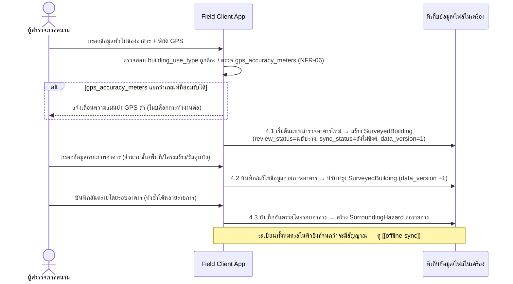
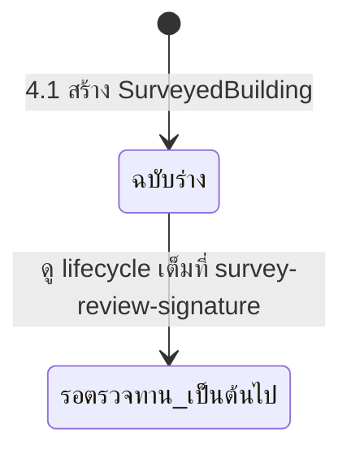

# Component Design: บันทึกข้อมูลอาคารและสภาพแวดล้อม

รองรับ [[feature-list#1. บันทึกข้อมูลอาคารและสภาพแวดล้อม|ฟีเจอร์ 1]] (Must have) — อ้างอิง operation จาก [[api-spec#4. บันทึกข้อมูลอาคารและสภาพแวดล้อม|api-spec หัวข้อ 4]] และ entity จาก [[db-spec#4.1 SurveyedBuilding|SurveyedBuilding]], [[db-spec#5.1 SurroundingHazard|SurroundingHazard]] ดู journey เต็มที่ [[user-journey]]

ทำงานทั้งหมดขณะออฟไลน์ได้ (NFR-01) บน [[architecture#2. Logical Component|Field Client App]] — ดูรายละเอียดวงจรซิงค์เต็มที่ [[offline-sync]]

## 1. Sequence Diagram

## 2. Operation ↔ Entity ที่กระทบ

| Operation ([[api-spec#4. บันทึกข้อมูลอาคารและสภาพแวดล้อม\|api-spec 4.x]]) | Entity ที่กระทบ | การกระทำ | ลำดับ/เงื่อนไข |
|---|---|---|---|
| 4.1 เริ่มต้นแบบสำรวจอาคารใหม่ | [[db-spec#4.1 SurveyedBuilding\|SurveyedBuilding]] | สร้าง | ต้องทำก่อนเสมอ — `client_generated_id` ที่ได้เป็นตัวอ้างอิงของทุก operation ถัดไปในฟีเจอร์ 1-9 |
| 4.2 บันทึก/แก้ไขข้อมูลกายภาพอาคาร | [[db-spec#4.1 SurveyedBuilding\|SurveyedBuilding]] | แก้ไข | ทำได้ซ้ำหลายครั้งหลัง 4.1 จนกว่า `review_status = รับรองแล้ว` |
| 4.3 บันทึกอันตรายโดยรอบอาคาร | [[db-spec#5.1 SurroundingHazard\|SurroundingHazard]] | สร้าง (1 อาคาร : N รายการ) | ทำได้หลัง 4.1 เท่านั้น (ต้องมี `SurveyedBuilding.client_generated_id` อยู่ก่อน) |

## 3. State ที่เริ่มต้นในฟีเจอร์นี้ (ไม่ใช่ lifecycle เต็ม)

ฟีเจอร์นี้เป็นจุด**กำเนิด** ของสถานะสองชุดที่ถูกจัดการเต็มรูปแบบในเอกสารอื่น — แสดงเฉพาะจุดเริ่มต้นที่นี่:

- `SurveyedBuilding.review_status` เริ่มที่ `ฉบับร่าง` เสมอเมื่อสร้างด้วย 4.1 — lifecycle เต็ม (รวมช่องว่างที่พบใน api-spec) อยู่ที่ [[survey-review-signature#3. State Diagram: review_status|survey-review-signature]]
- `SurveyedBuilding.sync_status` เริ่มที่ `ยังไม่ซิงค์` เสมอเมื่อสร้างด้วย 4.1 — lifecycle เต็มอยู่ที่ [[offline-sync#3. State Diagram sync_status|offline-sync]]

## 4. Edge Case และวิธีจัดการ

| Edge Case | วิธีจัดการ | อ้างอิง |
|---|---|---|
| `client_generated_id` ซ้ำกับระเบียนที่มีอยู่แล้วบนอุปกรณ์เดียวกัน | ปฏิเสธการสร้างซ้ำ ให้ผู้สำรวจแก้ไขระเบียนเดิมแทน | [[api-spec#4. บันทึกข้อมูลอาคารและสภาพแวดล้อม\|api-spec 4.1]] |
| ไม่มีสัญญาณ GPS ขณะเริ่มแบบสำรวจ | บันทึกไม่ได้จนกว่าจะได้พิกัด (GPS เป็น field จำเป็น) — ต้องรอสัญญาณ GPS ของอุปกรณ์เอง ไม่เกี่ยวกับสัญญาณอินเทอร์เน็ต | [[api-spec#4. บันทึกข้อมูลอาคารและสภาพแวดล้อม\|api-spec 4.1]] |
| `gps_accuracy_meters` แย่กว่าเกณฑ์ที่ยอมรับได้ | แจ้งเตือนผู้สำรวจก่อนยอมรับการบันทึก แต่ไม่บล็อกการทำงานต่อขณะออฟไลน์ (เกณฑ์ตัวเลขจริงยังไม่กำหนด — รอ `technology-stack.md`) | NFR-06, [[api-spec#15. ประเด็นรอตัดสินใจ\|api-spec หัวข้อ 15]] |
| พยายามแก้ไขข้อมูลกายภาพของระเบียนที่ `review_status = รับรองแล้ว` | ปฏิเสธการแก้ไข | [[api-spec#4. บันทึกข้อมูลอาคารและสภาพแวดล้อม\|api-spec 4.2]] |
| บันทึกอันตรายโดยรอบอาคารโดยไม่พบ `SurveyedBuilding` ที่อ้างอิง | ปฏิเสธการบันทึก | [[api-spec#4. บันทึกข้อมูลอาคารและสภาพแวดล้อม\|api-spec 4.3]] |

## เอกสารที่เกี่ยวข้อง

- [[api-spec]], [[db-spec]], [[feature-list]], [[user-journey]], [[architecture]]
- [[offline-sync]] — วงจรซิงค์เต็มของ `sync_status`
- [[survey-review-signature]] — วงจรเต็มของ `review_status`
