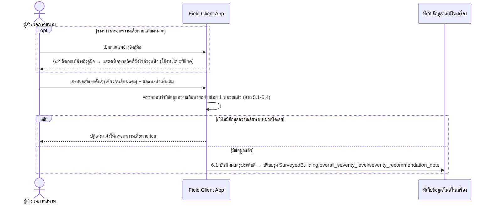

# Component Design: สรุปผลประเมินเป็น 3 ระดับสีพร้อมเกณฑ์อ้างอิงคู่มือ

รองรับ [[feature-list#3. สรุปผลประเมินเป็น 3 ระดับสีพร้อมเกณฑ์อ้างอิงคู่มือ|ฟีเจอร์ 3]] (Must have) — อ้างอิง operation จาก [[api-spec#6. สรุปผลประเมินเป็น 3 ระดับสีพร้อมเกณฑ์อ้างอิงคู่มือ|api-spec หัวข้อ 6]] และ entity [[db-spec#4.1 SurveyedBuilding|SurveyedBuilding]] (attribute `overall_severity_level`/`severity_recommendation_note`)

ต่อเนื่องจาก [[structural-damage-assessment]] — ต้องกรอกความเสียหายอย่างน้อย 1 หมวดมาก่อนจึงจะสรุปผลได้ เกณฑ์อ้างอิงคู่มือ (6.2) เป็นเนื้อหาสถิตที่ต้องฝังไว้ล่วงหน้าใน Field Client App ตาม [[architecture]]

## 1. Sequence Diagram

## 2. Operation ↔ Entity ที่กระทบ

| Operation ([[api-spec#6. สรุปผลประเมินเป็น 3 ระดับสีพร้อมเกณฑ์อ้างอิงคู่มือ\|api-spec 6.x]]) | Entity ที่กระทบ | การกระทำ | ลำดับ/เงื่อนไข |
|---|---|---|---|
| 6.1 บันทึกผลสรุประดับสี | [[db-spec#4.1 SurveyedBuilding\|SurveyedBuilding]] | แก้ไข | ต้องมีความเสียหายอย่างน้อย 1 หมวดจาก [[structural-damage-assessment]] มาก่อน |
| 6.2 ดึงเกณฑ์อ้างอิงคู่มือ | ไม่มี (เนื้อหาอ้างอิงสถิต ไม่ใช่ entity ใน [[db-spec]]) | อ่าน | ใช้ได้ทุกจุดระหว่างกรอกหมวดต่างๆ |

## 3. ความเชื่อมโยงกับ review_status

[[api-spec#6. สรุปผลประเมินเป็น 3 ระดับสีพร้อมเกณฑ์อ้างอิงคู่มือ|api-spec 6.1]] ระบุว่าต้องมีค่า `overall_severity_level` ก่อนเปลี่ยน `review_status` เป็น "รอตรวจทาน" — transition นี้ทำผ่าน operation [[api-spec#10. ตรวจทานและรับรองผลสำรวจด้วยลายเซ็นดิจิทัล|10.1 ส่งแบบสำรวจเข้าสู่คิวตรวจทาน]] (เพิ่มโดย `api-db-writer` ปิดช่องว่างที่เคยรายงานไว้แล้ว) — ดู state diagram เต็มที่ [[survey-review-signature#3. State Diagram: review_status|survey-review-signature หัวข้อ 3]]

## 4. Edge Case และวิธีจัดการ

| Edge Case | วิธีจัดการ | อ้างอิง |
|---|---|---|
| ยังไม่มีข้อมูลความเสียหายหมวดใดเลย | ปฏิเสธการบันทึกผลสรุป | [[api-spec#6. สรุปผลประเมินเป็น 3 ระดับสีพร้อมเกณฑ์อ้างอิงคู่มือ\|api-spec 6.1]] |
| ไม่มีเกณฑ์อ้างอิงสำหรับหมวดที่ระบุ | แจ้งไม่พบเนื้อหาอ้างอิงสำหรับหมวดนั้น | [[api-spec#6. สรุปผลประเมินเป็น 3 ระดับสีพร้อมเกณฑ์อ้างอิงคู่มือ\|api-spec 6.2]] |
| ต้องใช้งาน 6.2 ได้ขณะออฟไลน์ | เนื้อหาคู่มือต้องฝังไว้ใน Field Client App ล่วงหน้า ไม่ใช่เรียกจากเซิร์ฟเวอร์ | [[api-spec#6. สรุปผลประเมินเป็น 3 ระดับสีพร้อมเกณฑ์อ้างอิงคู่มือ\|api-spec 6.2]], NFR-01 |

## เอกสารที่เกี่ยวข้อง

- [[api-spec]], [[db-spec]], [[feature-list]], [[user-journey]]
- [[structural-damage-assessment]] — ที่มาของข้อมูลความเสียหายที่ต้องมีก่อนสรุปผล
- [[survey-review-signature]] — ขั้นตอนถัดไปหลังสรุปผล (พบช่องว่างการเปลี่ยนสถานะ ดูหัวข้อ 3)
