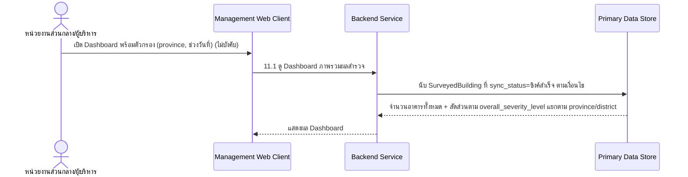

# Component Design: Dashboard ภาพรวมผลสำรวจ

รองรับ [[feature-list#10. Dashboard ภาพรวมผลสำรวจ|ฟีเจอร์ 10]] (Must have) — อ้างอิง operation จาก [[api-spec#11. Dashboard ภาพรวมผลสำรวจ|api-spec หัวข้อ 11]] และ entity [[db-spec#4.1 SurveyedBuilding|SurveyedBuilding]] (อ่านเท่านั้น ไม่มี entity ใหม่)

เป็นฟีเจอร์แบบอ่านอย่างเดียว (read-only) ไม่มี state transition ของตัวเอง — อ่านข้อมูลที่ถูกสร้างจากฟีเจอร์ 1-7 ([[building-environment-info]] ถึง [[survey-review-signature]]) ผ่าน [[architecture#2. Logical Component|Management Web Client]]

## 1. Sequence Diagram

## 2. Operation ↔ Entity ที่กระทบ

| Operation ([[api-spec#11. Dashboard ภาพรวมผลสำรวจ\|api-spec 11.x]]) | Entity ที่กระทบ | การกระทำ | ลำดับ/เงื่อนไข |
|---|---|---|---|
| 11.1 ดู Dashboard ภาพรวมผลสำรวจ | [[db-spec#4.1 SurveyedBuilding\|SurveyedBuilding]] | อ่าน (นับ/จัดกลุ่ม) | นับเฉพาะระเบียนที่ `sync_status = ซิงค์สำเร็จ` เท่านั้น |

## 3. State Transition

ไม่มี — เป็นการอ่าน/รวมข้อมูลอย่างเดียว ไม่มี state ของตัวเอง

## 4. Edge Case และวิธีจัดการ

| Edge Case | วิธีจัดการ | อ้างอิง |
|---|---|---|
| ไม่มีข้อมูลตรงเงื่อนไขตัวกรอง | คืนค่าว่าง/ศูนย์ทุกหมวด ไม่ถือเป็น error | [[api-spec#11. Dashboard ภาพรวมผลสำรวจ\|api-spec 11.1]] |
| มีระเบียนที่ `sync_status ≠ ซิงค์สำเร็จ` (เช่นยังไม่ซิงค์/มีความขัดแย้ง) | ไม่นับรวมใน Dashboard จนกว่าจะซิงค์สำเร็จ — ดู [[offline-sync]] | [[api-spec#11. Dashboard ภาพรวมผลสำรวจ\|api-spec 11.1]] |

## เอกสารที่เกี่ยวข้อง

- [[api-spec]], [[db-spec]], [[feature-list]], [[user-journey]]
- [[search-filter-buildings]] — ฟีเจอร์ที่ใช้ตัวกรองคล้ายกันในระดับรายการอาคารแทนภาพรวม
- [[offline-sync]] — เงื่อนไข `sync_status = ซิงค์สำเร็จ` ที่กรองข้อมูลนับใน Dashboard
