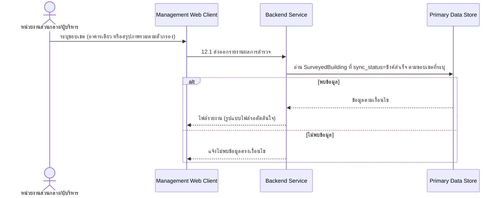

# Component Design: ส่งออกรายงานผลการสำรวจ

รองรับ [[feature-list#11. ส่งออกรายงานผลการสำรวจ|ฟีเจอร์ 11]] (Should have) — อ้างอิง operation จาก [[api-spec#12. ส่งออกรายงานผลการสำรวจ|api-spec หัวข้อ 12]] และ entity [[db-spec#4.1 SurveyedBuilding|SurveyedBuilding]] (อ่านเท่านั้น)

เป็นฟีเจอร์แบบอ่านอย่างเดียว ใช้งานผ่าน [[architecture#2. Logical Component|Management Web Client]] โดยหน่วยงานส่วนกลาง/ผู้บริหาร

## 1. Sequence Diagram

## 2. Operation ↔ Entity ที่กระทบ

| Operation ([[api-spec#12. ส่งออกรายงานผลการสำรวจ\|api-spec 12.x]]) | Entity ที่กระทบ | การกระทำ | ลำดับ/เงื่อนไข |
|---|---|---|---|
| 12.1 ส่งออกรายงานผลการสำรวจ | [[db-spec#4.1 SurveyedBuilding\|SurveyedBuilding]] | อ่าน | รวมเฉพาะข้อมูลที่ `sync_status = ซิงค์สำเร็จ` — ดู [[offline-sync]] · **ต้องกรองระเบียนที่ `sync_status = มีความขัดแย้งรอแก้ไข` ออกเสมอ (NFR-10)** |

## 3. State Transition

ไม่มี — เป็นการอ่าน/ส่งออกข้อมูลอย่างเดียว ไม่มี state ของตัวเอง

## 4. Edge Case และวิธีจัดการ

| Edge Case | วิธีจัดการ | อ้างอิง |
|---|---|---|
| ไม่พบข้อมูลตรงเงื่อนไข | แจ้งไม่พบข้อมูล ไม่สร้างไฟล์รายงานเปล่า | [[api-spec#12. ส่งออกรายงานผลการสำรวจ\|api-spec 12.1]] |
| รูปแบบไฟล์ที่ใช้ส่งออกยังไม่กำหนด | รอ `technology-stack.md` ตัดสินใจ — ไม่ระบุในเอกสารระดับ logical นี้ | [[api-spec#16. ประเด็นรอตัดสินใจ\|api-spec หัวข้อ 16]] |
| ระเบียนอยู่ในสถานะ `sync_status = มีความขัดแย้งรอแก้ไข` | ไม่รวมในรายงานจนกว่าจะแก้ไขความขัดแย้งเสร็จผ่าน [[manual-conflict-resolution]] (NFR-10) | [[api-spec#12. ส่งออกรายงานผลการสำรวจ\|api-spec 12.1]] |

## เอกสารที่เกี่ยวข้อง

- [[api-spec]], [[db-spec]], [[feature-list]], [[user-journey]]
- [[dashboard-overview]], [[search-filter-buildings]] — ใช้ตัวกรองลักษณะเดียวกันในการเลือกขอบเขตข้อมูล
- [[offline-sync]], [[manual-conflict-resolution]] — เงื่อนไข `sync_status = ซิงค์สำเร็จ` ที่กรองข้อมูลก่อนส่งออก
