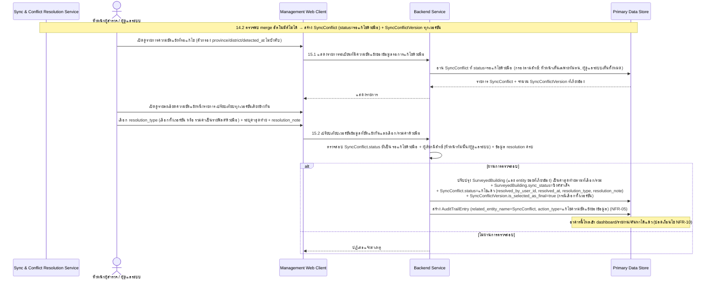
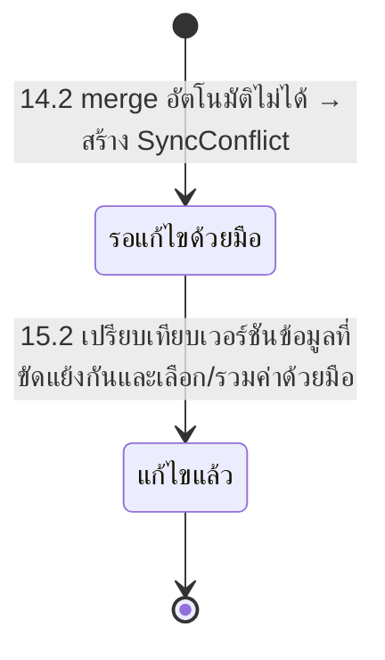

# Component Design: แก้ไขความขัดแย้งของข้อมูลจากการซิงค์ด้วยมือ (Manual Conflict Resolution)

รองรับ [[feature-list#15. แก้ไขความขัดแย้งของข้อมูลจากการซิงค์ด้วยมือ (Manual Conflict Resolution)|ฟีเจอร์ 15]] (Must have) — อ้างอิง operation จาก [[api-spec#15. การแก้ไขความขัดแย้งของข้อมูลจากการซิงค์ (Manual Conflict Resolution)|api-spec หัวข้อ 15]] และ entity จาก [[db-spec#8.1 SyncConflict|SyncConflict]], [[db-spec#8.2 SyncConflictVersion|SyncConflictVersion]]

เป็นขั้นตอนต่อเนื่องจาก [[offline-sync#3. State Diagram: sync_status|offline-sync]] เมื่อ operation 14.2 ตรวจพบว่า merge อัตโนมัติไม่ได้ ใช้งานผ่าน [[architecture#2. Logical Component|Management Web Client]] (ต้องมีสัญญาณอินเทอร์เน็ต) โดยหัวหน้าผู้สำรวจ/ผู้ดูแลระบบ ปิดช่องว่างที่เคยรายงานไว้ในรอบก่อน (ไม่มีกลไกแก้ไขความขัดแย้งด้วยมือ) การแก้ไขสำเร็จเป็นเงื่อนไขที่ปลดล็อกให้อาคารไหลเข้า [[dashboard-overview]]/[[export-report]]/[[search-filter-buildings]] ได้ตาม NFR-10

## 1. Sequence Diagram

## 2. Operation ↔ Entity ที่กระทบ

| Operation ([[api-spec#15. การแก้ไขความขัดแย้งของข้อมูลจากการซิงค์ (Manual Conflict Resolution)\|api-spec 15.x]]) | Entity ที่กระทบ | การกระทำ | ลำดับ/เงื่อนไข |
|---|---|---|---|
| 15.1 แสดงรายการระเบียนที่มีความขัดแย้งของข้อมูลรอการแก้ไขด้วยมือ | [[db-spec#8.1 SyncConflict\|SyncConflict]] (อ่าน) | อ่าน | ต้องมี `SyncConflict.status = รอแก้ไขด้วยมือ` ที่ถูกสร้างจาก [[offline-sync#2. Operation ↔ Entity ที่กระทบ\|14.2]] มาก่อน |
| 15.2 เปรียบเทียบเวอร์ชันข้อมูลที่ขัดแย้งกันและเลือก/รวมค่าด้วยมือ | [[db-spec#4.1 SurveyedBuilding\|SurveyedBuilding]] (แก้ไข + `sync_status`), [[db-spec#8.1 SyncConflict\|SyncConflict]] (แก้ไข), [[db-spec#8.2 SyncConflictVersion\|SyncConflictVersion]] (แก้ไข `is_selected_as_final`), [[db-spec#7.2 AuditTrailEntry\|AuditTrailEntry]] (สร้าง) | แก้ไข + แก้ไข + แก้ไข + สร้าง | ต้องมี `SyncConflict.status = รอแก้ไขด้วยมือ` อยู่ก่อน; ต้องเป็นหัวหน้าผู้สำรวจของทีมนั้นหรือผู้ดูแลระบบ; ทุกครั้งต้องสร้าง `AuditTrailEntry` (NFR-05) |

## 3. State Diagram: SyncConflict.status

การเปลี่ยนสถานะนี้เกิดขึ้นพร้อมกันในธุรกรรมเดียวกับ `SurveyedBuilding.sync_status: มีความขัดแย้งรอแก้ไข → ซิงค์สำเร็จ` เสมอ (ตาม [[db-spec#8.2 SyncConflictVersion|db-spec หัวข้อ 8]] กฎทางธุรกิจ) — ดู lifecycle เต็มของ `sync_status` ที่ [[offline-sync#3. State Diagram: sync_status|offline-sync]]

## 4. Edge Case และวิธีจัดการ

| Edge Case | วิธีจัดการ | อ้างอิง |
|---|---|---|
| ไม่มีความขัดแย้งตรงเงื่อนไขตัวกรอง (15.1) | คืนรายการว่าง ไม่ถือเป็น error | [[api-spec#15. การแก้ไขความขัดแย้งของข้อมูลจากการซิงค์ (Manual Conflict Resolution)\|api-spec 15.1]] |
| `SyncConflict.status = แก้ไขแล้ว` อยู่ก่อนแล้ว | ปฏิเสธ ห้ามแก้ไขซ้ำ | [[api-spec#15. การแก้ไขความขัดแย้งของข้อมูลจากการซิงค์ (Manual Conflict Resolution)\|api-spec 15.2]] |
| ผู้เรียกไม่ใช่หัวหน้าผู้สำรวจของทีมนั้นและไม่ใช่ผู้ดูแลระบบ | ปฏิเสธการแก้ไข | [[api-spec#15. การแก้ไขความขัดแย้งของข้อมูลจากการซิงค์ (Manual Conflict Resolution)\|api-spec 15.2]] |
| ระบุ `resolution_type` ไม่ครบตามข้อมูลที่ต้องใช้ (เช่นเลือก "รวมค่าด้วยมือ" แต่ไม่ระบุค่าฟิลด์ใดเลย) | ปฏิเสธการบันทึก | [[api-spec#15. การแก้ไขความขัดแย้งของข้อมูลจากการซิงค์ (Manual Conflict Resolution)\|api-spec 15.2]] |

## 5. ข้อจำกัดที่ทราบอยู่แล้ว

กลยุทธ์ **auto-merge** ที่เป็นรูปธรรมก่อนตัดสินว่า "merge ไม่ได้" ใน [[offline-sync#2. Operation ↔ Entity ที่กระทบ|14.2]] (last-write-wins บางส่วน / field-level merge) ยังไม่ตัดสินใจ รอ `technology-stack.md` — เส้นทาง manual resolution ในไฟล์นี้ออกแบบครบแล้วโดยไม่ขึ้นกับการตัดสินใจนั้น รูปแบบ/format จริงของ `SyncConflictVersion.snapshot_content` ก็เป็นประเด็นรอตัดสินใจเช่นกัน (ดู [[api-spec#16. ประเด็นรอตัดสินใจ|api-spec หัวข้อ 16]], [[db-spec#11. ประเด็นรอตัดสินใจ|db-spec หัวข้อ 11]])

## เอกสารที่เกี่ยวข้อง

- [[api-spec]], [[db-spec]], [[feature-list]], [[user-journey]], [[architecture]]
- [[offline-sync]] — ที่มาของ `SyncConflict`/`SyncConflictVersion` จาก operation 14.2
- [[dashboard-overview]], [[export-report]], [[search-filter-buildings]] — ใช้เงื่อนไข NFR-10 ที่ปลดล็อกหลังแก้ไขความขัดแย้งสำเร็จในไฟล์นี้
