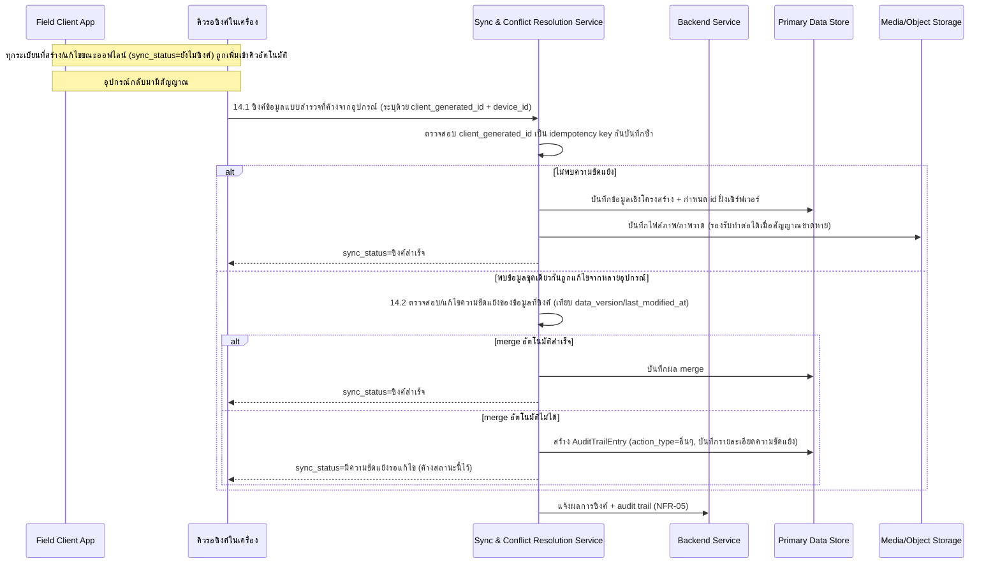
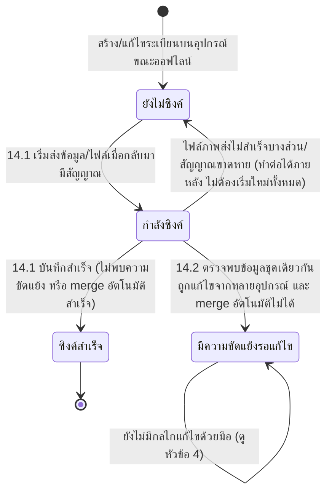

# Component Design: การทำงานออฟไลน์และซิงค์ข้อมูลภาคสนาม

รองรับ [[feature-list#13. การทำงานออฟไลน์และซิงค์ข้อมูลภาคสนาม|ฟีเจอร์ 13]] (Must have) — อ้างอิง operation จาก [[api-spec#14. การทำงานออฟไลน์และซิงค์ข้อมูลภาคสนาม|api-spec หัวข้อ 14]] ดำเนินการโดย [[architecture#2. Logical Component|Sync & Conflict Resolution Service]]

เป็นกลไก cross-cutting ที่รองรับทุกฟีเจอร์ที่สร้างข้อมูลบนอุปกรณ์ขณะออฟไลน์: [[building-environment-info]], [[structural-damage-assessment]], [[ai-crack-photo-analysis]], [[additional-sketch]], [[surveyor-info-duration]] — ไฟล์นี้เป็นแหล่งอ้างอิงหลัก (single source) ของ lifecycle `sync_status`

## 1. Sequence Diagram

## 2. Operation ↔ Entity ที่กระทบ

| Operation ([[api-spec#14. การทำงานออฟไลน์และซิงค์ข้อมูลภาคสนาม\|api-spec 14.x]]) | Entity ที่กระทบ | การกระทำ | ลำดับ/เงื่อนไข |
|---|---|---|---|
| 14.1 ซิงค์ข้อมูลแบบสำรวจที่ค้างจากอุปกรณ์ | [[db-spec#4.1 SurveyedBuilding\|SurveyedBuilding]], [[db-spec#6.1 DamagePhoto\|DamagePhoto]], [[db-spec#6.3 Sketch\|Sketch]] (มี `client_generated_id`/`sync_status` ชัดเจน) + [[db-spec#5.1 SurroundingHazard\|SurroundingHazard]], [[db-spec#5.2 ExternalDamage\|ExternalDamage]], [[db-spec#5.3 StructuralDamage\|StructuralDamage]], [[db-spec#5.4 ComponentDamage\|ComponentDamage]], [[db-spec#5.5 ElectricalSystemDamage\|ElectricalSystemDamage]], [[db-spec#6.2 AIAnalysisResult\|AIAnalysisResult]], [[db-spec#4.2 SurveyParticipant\|SurveyParticipant]] (ดูช่องว่างหัวข้อ 4) | สร้าง/กำหนด id ฝั่งเซิร์ฟเวอร์ | ใช้ `client_generated_id` เป็น idempotency key กันบันทึกซ้ำ; ต้องทำหลังระเบียนต้นทางถูกสร้างในฟีเจอร์ 1/2/4/5/6 แล้ว |
| 14.2 ตรวจสอบ/แก้ไขความขัดแย้งของข้อมูลที่ซิงค์ | [[db-spec#4.1 SurveyedBuilding\|SurveyedBuilding]] (เทียบ `data_version`/`last_modified_at`) + [[db-spec#7.2 AuditTrailEntry\|AuditTrailEntry]] (สร้าง) | เปรียบเทียบ + สร้าง | ทำงานเป็นส่วนหนึ่งของ 14.1 เมื่อพบความขัดแย้งเท่านั้น ไม่มีผู้ใช้เรียกตรง |

## 3. State Diagram: sync_status

## 4. ข้อจำกัดที่ทราบอยู่แล้ว (ตามที่ตกลงไว้ล่วงหน้า — ไม่ต้องแก้ในรอบนี้)

- **กลไกแก้ไขความขัดแย้งด้วยมือเมื่อ `sync_status = มีความขัดแย้งรอแก้ไข`** ยังไม่มี FR รองรับ (ผู้ใช้ตัดสินใจเลื่อนไปรอบถัดไป) — สถานะนี้จึงเป็นสถานะค้าง (terminal-like) จนกว่าจะมีการเพิ่ม FR/operation ใหม่ ออกแบบเท่าที่ NFR-03 และ operation 14.2 ที่มีอยู่รองรับได้เท่านั้น
- **กลยุทธ์ merge ที่เป็นรูปธรรม** (last-write-wins / field-level merge) ยังไม่ตัดสินใจ รอ `technology-stack.md` ตาม [[api-spec#15. ประเด็นรอตัดสินใจ|api-spec หัวข้อ 15]] และ [[db-spec#10. ประเด็นรอตัดสินใจ|db-spec หัวข้อ 10]]

## 5. ช่องว่างที่พบเพิ่มเติม (รายงานเพื่อรัน `sync-api-db`)

[[api-spec#14. การทำงานออฟไลน์และซิงค์ข้อมูลภาคสนาม|api-spec 14.1]] ระบุ input ว่าต้องระบุ `SurroundingHazard`, `ExternalDamage`, `StructuralDamage`, `ComponentDamage`, `ElectricalSystemDamage`, `AIAnalysisResult`, `SurveyParticipant` "ด้วย `client_generated_id` ของแต่ละระเบียน" แต่เมื่อตรวจ [[db-spec]] พบว่า**เฉพาะ `SurveyedBuilding`, `DamagePhoto`, `Sketch` เท่านั้นที่มี attribute `client_generated_id`/`sync_status` จริง** (ตาม [[db-spec#1. ภาพรวมกลุ่ม Entity|db-spec หัวข้อ 1]] ที่ระบุชัดว่า attribute ด้าน sync ฝังอยู่ใน 3 entity นี้เท่านั้น) — entity ย่อยอื่นๆ (`SurroundingHazard` ฯลฯ) ไม่มี field ให้ระบุ natural key ของตัวเองเวลาซิงค์ ปัจจุบันออกแบบโดยสมมติว่า**ระเบียนย่อยเหล่านี้ถูกซิงค์รวมไปกับ `SurveyedBuilding` แม่ในคราวเดียว** (ไม่มี `client_generated_id`/`sync_status` แยกของตัวเอง) แต่นี่เป็นสมมติฐานที่ยังไม่ยืนยันจาก [[api-spec]]/[[db-spec]] — ควรรัน `sync-api-db` เพื่อเพิ่ม attribute หรือชี้แจงกลไก idempotency ของ entity ย่อยเหล่านี้ให้ชัดเจน

## 6. Edge Case และวิธีจัดการ

| Edge Case | วิธีจัดการ | อ้างอิง |
|---|---|---|
| ไฟล์ภาพส่งไม่สำเร็จบางส่วน (สัญญาณขาดหาย) | ต้องส่งต่อได้โดยไม่ต้องเริ่มใหม่ทั้งหมด (NFR-02) | [[api-spec#14. การทำงานออฟไลน์และซิงค์ข้อมูลภาคสนาม\|api-spec 14.1]] |
| พบข้อมูลชุดเดียวกันถูกแก้ไขจากหลายอุปกรณ์ | ส่งต่อไปยัง 14.2 เพื่อตรวจจับ/แก้ไขความขัดแย้ง | [[api-spec#14. การทำงานออฟไลน์และซิงค์ข้อมูลภาคสนาม\|api-spec 14.1, 14.2]] |
| ไม่สามารถ merge อัตโนมัติได้ | คงสถานะ `มีความขัดแย้งรอแก้ไข` ไว้จนกว่าจะมีการแก้ไข (กลไกแก้ไขด้วยมือยังไม่ถูกออกแบบ — ดูหัวข้อ 4) | [[api-spec#14. การทำงานออฟไลน์และซิงค์ข้อมูลภาคสนาม\|api-spec 14.2]] |
| หลายทีมซิงค์พร้อมกันจำนวนมากหลังเกิดเหตุ | ต้องไม่บล็อกการทำงานอื่นของ Field Client (NFR-07) | [[api-spec#14. การทำงานออฟไลน์และซิงค์ข้อมูลภาคสนาม\|api-spec 14.1]] |

## เอกสารที่เกี่ยวข้อง

- [[api-spec]], [[db-spec]], [[feature-list]], [[user-journey]], [[architecture]]
- [[building-environment-info]], [[structural-damage-assessment]], [[ai-crack-photo-analysis]], [[additional-sketch]], [[surveyor-info-duration]] — ฟีเจอร์ต้นทางของข้อมูลที่ต้องซิงค์
- [[survey-review-signature]], [[dashboard-overview]], [[search-filter-buildings]] — ใช้เงื่อนไข `sync_status = ซิงค์สำเร็จ` ก่อนดำเนินการ
