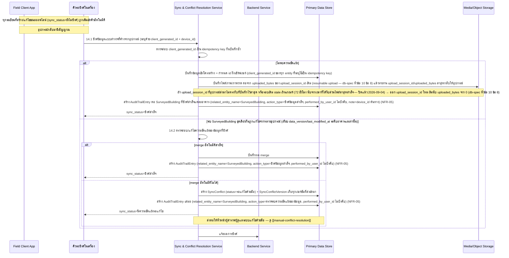
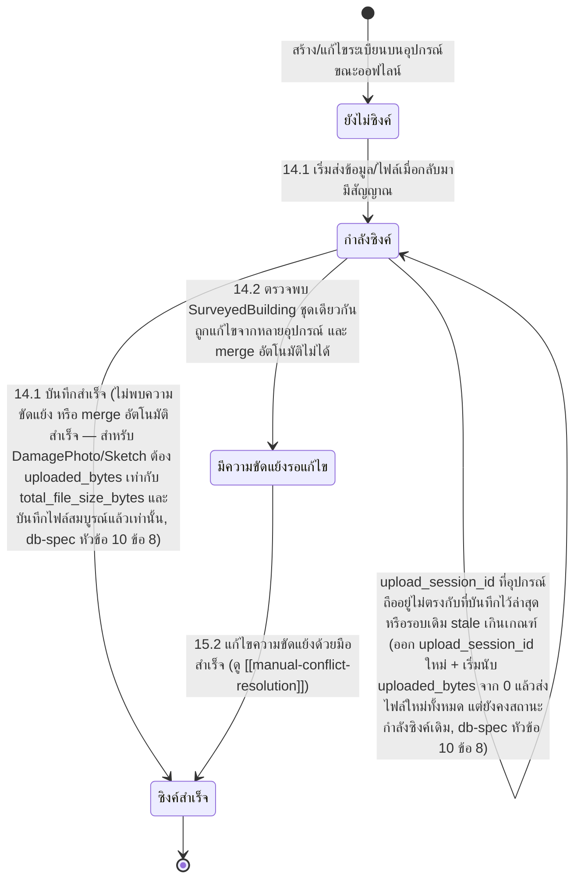

# Component Design: การทำงานออฟไลน์และซิงค์ข้อมูลภาคสนาม

รองรับ [[feature-list#13. การทำงานออฟไลน์และซิงค์ข้อมูลภาคสนาม|ฟีเจอร์ 13]] (Must have) — อ้างอิง operation จาก [[api-spec#14. การทำงานออฟไลน์และซิงค์ข้อมูลภาคสนาม|api-spec หัวข้อ 14]] ดำเนินการโดย [[architecture#2. Logical Component|Sync & Conflict Resolution Service]]

เป็นกลไก cross-cutting ที่รองรับทุกฟีเจอร์ที่สร้างข้อมูลบนอุปกรณ์ขณะออฟไลน์: [[building-environment-info]], [[structural-damage-assessment]], [[ai-crack-photo-analysis]], [[additional-sketch]], [[surveyor-info-duration]] — ไฟล์นี้เป็นแหล่งอ้างอิงหลัก (single source) ของ lifecycle `sync_status`

## 1. Sequence Diagram

## 2. Operation ↔ Entity ที่กระทบ

| Operation ([[api-spec#14. การทำงานออฟไลน์และซิงค์ข้อมูลภาคสนาม\|api-spec 14.x]]) | Entity ที่กระทบ | การกระทำ | ลำดับ/เงื่อนไข |
|---|---|---|---|
| 14.1 ซิงค์ข้อมูลแบบสำรวจที่ค้างจากอุปกรณ์ | [[db-spec#4.1 SurveyedBuilding\|SurveyedBuilding]], [[db-spec#6.1 DamagePhoto\|DamagePhoto]], [[db-spec#6.3 Sketch\|Sketch]] (มี `client_generated_id`/`sync_status` ของตัวเอง + `upload_session_id`/`total_file_size_bytes`/`uploaded_bytes`/`last_chunk_received_at` สำหรับ resumable upload — ดู [[db-spec#10. กฎทางธุรกิจที่กระทบโครงสร้างข้อมูล\|db-spec หัวข้อ 10 ข้อ 8]]) + [[db-spec#4.2 SurveyParticipant\|SurveyParticipant]], [[db-spec#5.1 SurroundingHazard\|SurroundingHazard]], [[db-spec#5.2 ExternalDamage\|ExternalDamage]], [[db-spec#5.3 StructuralDamage\|StructuralDamage]], [[db-spec#5.4 ComponentDamage\|ComponentDamage]], [[db-spec#5.5 ElectricalSystemDamage\|ElectricalSystemDamage]] (มี `client_generated_id` เพื่อ idempotent upsert เท่านั้น — ไม่มี `sync_status` ของตัวเอง ดูหัวข้อ 5), [[db-spec#7.2 AuditTrailEntry\|AuditTrailEntry]] (สร้างต่อ `SurveyedBuilding` ที่ซิงค์สำเร็จแต่ละอาคาร — `action_type = ซิงค์ข้อมูลสำเร็จ`, `performed_by_user_id` ไม่บังคับเพราะระบบเป็นผู้บันทึกเอง) | สร้าง/กำหนด id ฝั่งเซิร์ฟเวอร์ + สร้าง audit entry | ใช้ `client_generated_id` เป็น idempotency key กันบันทึกซ้ำสำหรับทุก entity ที่ระบุ; ต้องทำหลังระเบียนต้นทางถูกสร้างในฟีเจอร์ 1/2/4/5/6 แล้ว; audit entry ถูกสร้างหลังบันทึกข้อมูล/ไฟล์สำเร็จเสมอ (NFR-05); สำหรับ `DamagePhoto`/`Sketch` ต้องส่งต่อจาก `uploaded_bytes` ของ `upload_session_id` เดิมก่อนเสมอ (resumable upload, NFR-02) เว้นแต่เข้าเงื่อนไขต้องเริ่มรอบใหม่ตาม [[db-spec#10. กฎทางธุรกิจที่กระทบโครงสร้างข้อมูล\|db-spec หัวข้อ 10 ข้อ 8]] |
| 14.2 ตรวจสอบ/แก้ไขความขัดแย้งของข้อมูลที่ซิงค์ | [[db-spec#4.1 SurveyedBuilding\|SurveyedBuilding]] (เทียบ `data_version`/`last_modified_at` — **ระดับ aggregate เท่านั้น**), [[db-spec#8.1 SyncConflict\|SyncConflict]] (สร้างเมื่อ merge อัตโนมัติไม่ได้), [[db-spec#8.2 SyncConflictVersion\|SyncConflictVersion]] (สร้างต่อเวอร์ชันที่ขัดแย้ง), [[db-spec#7.2 AuditTrailEntry\|AuditTrailEntry]] (สร้างเสมอทั้ง 2 กรณี — merge อัตโนมัติสำเร็จ: `action_type = ซิงค์ข้อมูลสำเร็จ`; merge ไม่ได้: `action_type = ตรวจพบความขัดแย้งของข้อมูล`; `performed_by_user_id` ไม่บังคับทั้งคู่เพราะระบบเป็นผู้บันทึกเอง) | เปรียบเทียบ + สร้าง | ทำงานเป็นส่วนหนึ่งของ 14.1 เมื่อพบความขัดแย้งเท่านั้น ไม่มีผู้ใช้เรียกตรง; เมื่อ merge ไม่ได้ ส่งต่อให้มนุษย์ตัดสินใจผ่าน [[manual-conflict-resolution]] เสมอ; audit entry ต้องถูกสร้างเสมอไม่ว่าผลจะเป็นแบบใด (NFR-05) |

## 3. State Diagram: sync_status

## 4. ขอบเขตของ conflict detection (ปิดช่องว่างเดิมแล้ว)

ช่องว่างที่เคยรายงานไว้ 2 จุด **ถูกปิดแล้วโดย `api-db-writer`**:

1. **กลไกแก้ไขความขัดแย้งด้วยมือ** — เพิ่ม FR-30/FR-31 และ operation 15.1/15.2 ครบแล้ว ดูรายละเอียดเต็มที่ [[manual-conflict-resolution]] (แทนที่จะเป็นสถานะค้างถาวรตามที่เคยระบุไว้)
2. **`client_generated_id` ของ entity ย่อย** — เพิ่มให้ `SurveyParticipant`/`SurroundingHazard`/`ExternalDamage`/`StructuralDamage`/`ComponentDamage`/`ElectricalSystemDamage` แล้ว **แต่ขอบเขตถูกจำกัดชัดเจน**: ใช้เพื่อ idempotent upsert (กันบันทึกซ้ำเมื่อซิงค์) และเป็นจุดอ้างอิงที่เสถียรให้ `DamagePhoto.linked_area_id` ชี้มาเท่านั้น **entity ย่อยเหล่านี้ไม่มี `sync_status` ของตัวเองและไม่ถูกตรวจจับความขัดแย้งเป็นรายระเบียน** — conflict detection (การเทียบ `data_version`/`last_modified_at`) ยังอยู่ที่ระดับ `SurveyedBuilding` (aggregate) เพียงจุดเดียวเท่านั้นตามที่ [[db-spec#10. กฎทางธุรกิจที่กระทบโครงสร้างข้อมูล|db-spec หัวข้อ 10]] ระบุไว้เดิม ไม่ได้ขยายเป็นการตรวจ conflict รายระเบียนย่อยแต่อย่างใด

กลยุทธ์ **auto-merge** ที่เป็นรูปธรรม (ก่อนตัดสินว่า "merge ไม่ได้" ต้องส่งต่อ 15) **ปิดแล้วเมื่อ 2026-09-04**: ไม่ทำ auto-merge ระดับฟิลด์ใดๆ ใน Phase นี้ — คำว่า "merge อัตโนมัติสำเร็จ" ในไดอะแกรม §1/§3 ข้างต้นหมายถึง**เฉพาะกรณีที่การเทียบเวอร์ชันระดับ aggregate (`data_version`/`last_modified_at`/`last_modified_by_device_id`) ไม่พบการชนกันเลย (fast-forward — เช่น อุปกรณ์อ้างอิง `data_version` ฐานตรงกับค่าปัจจุบันบนเซิร์ฟเวอร์ ไม่มีอุปกรณ์อื่นแก้ไขคั่นกลาง) เท่านั้น** ไม่ใช่การ merge ระดับฟิลด์จริงแต่อย่างใด — **เมื่อเวอร์ชันระดับ aggregate ชนกันจากหลายอุปกรณ์ ทุกกรณีต้องส่งให้มนุษย์ตัดสินใจเสมอผ่าน 14.2 → [[manual-conflict-resolution]] รวมถึงกรณีที่ทั้งสองอุปกรณ์บังเอิญแก้ไขคนละฟิลด์กัน หรือค่าที่แก้ไขบังเอิญตรงกัน ซึ่งในทางทฤษฎี merge อัตโนมัติได้** เพราะ Phase นี้ไม่มีกลไกเปรียบเทียบระดับฟิลด์ให้แยกแยะกรณีเหล่านี้ออกจากความขัดแย้งจริง (ดู [[db-spec#10. กฎทางธุรกิจที่กระทบโครงสร้างข้อมูล|db-spec หัวข้อ 10 ข้อ 3]]) — นี่คือขอบเขตที่ตั้งใจของ Phase 1 ไม่ใช่การมองข้าม (ผู้ใช้ยืนยันเมื่อ 2026-09-04) ผลคือ **NFR-03 รองรับบางส่วน**ในเฟสนี้ (กลไกเปรียบเทียบระดับฟิลด์เป็นรายการเปิด) ดู [[api-spec#16. ประเด็นรอตัดสินใจ|api-spec หัวข้อ 16]], [[architecture#6.9 กลยุทธ์การจัดการความขัดแย้งของข้อมูล เมื่อ merge อัตโนมัติไม่ได้ (NFR-03)|architecture §6.9]]

## 5. Edge Case และวิธีจัดการ

| Edge Case | วิธีจัดการ | อ้างอิง |
|---|---|---|
| ไฟล์ภาพ/ภาพวาดส่งไม่สำเร็จบางส่วน (สัญญาณขาดหายระหว่างอัปโหลด) และ `upload_session_id` ที่อุปกรณ์ถืออยู่ยังตรงกับที่เซิร์ฟเวอร์บันทึกไว้ล่าสุด + ยังไม่ stale | ส่งต่อจาก `uploaded_bytes` ของ `upload_session_id` เดิม ไม่ต้องเริ่มใหม่ทั้งไฟล์ (NFR-02); `sync_status` คงสถานะ "กำลังซิงค์" ไว้ ไม่ถอยกลับ "ยังไม่ซิงค์" เพราะตำแหน่งที่ส่งสำเร็จถูกเก็บไว้ในระเบียนแล้ว | [[db-spec#10. กฎทางธุรกิจที่กระทบโครงสร้างข้อมูล\|db-spec หัวข้อ 10 ข้อ 8]], [[api-spec#14. การทำงานออฟไลน์และซิงค์ข้อมูลภาคสนาม\|api-spec 14.1]] |
| `upload_session_id` ที่อุปกรณ์ถืออยู่ไม่ตรงกับที่เซิร์ฟเวอร์บันทึกไว้ล่าสุด (เช่นแอป/ที่เก็บข้อมูลบนอุปกรณ์ถูกล้าง) หรือรอบเดิมค้างนานเกินเกณฑ์ stale (72 ชั่วโมง นับจากเวลาที่ได้รับส่วนไฟล์ล่าสุดสำเร็จ — ปิดแล้ว 2026-09-04) | เซิร์ฟเวอร์ต้องล้าง `upload_session_id`/`uploaded_bytes`/`last_chunk_received_at` เดิม แล้วออก `upload_session_id` ใหม่เริ่มนับ `uploaded_bytes` จาก 0 ก่อนรับไฟล์ต่อ — อุปกรณ์ต้องส่งไฟล์นี้ใหม่ทั้งหมดในรอบใหม่ แต่ `sync_status` ยังคงเป็น "กำลังซิงค์" เช่นเดิม ไม่ถือเป็นการเริ่มรอบซิงค์ทั้งชุดใหม่ | [[db-spec#10. กฎทางธุรกิจที่กระทบโครงสร้างข้อมูล\|db-spec หัวข้อ 10 ข้อ 8]], [[api-spec#14. การทำงานออฟไลน์และซิงค์ข้อมูลภาคสนาม\|api-spec 14.1]] |
| พบข้อมูลชุดเดียวกันถูกแก้ไขจากหลายอุปกรณ์ | ส่งต่อไปยัง 14.2 เพื่อตรวจจับ/แก้ไขความขัดแย้ง | [[api-spec#14. การทำงานออฟไลน์และซิงค์ข้อมูลภาคสนาม\|api-spec 14.1, 14.2]] |
| ไม่สามารถ merge อัตโนมัติได้ | สร้าง `SyncConflict`+`SyncConflictVersion` แล้วส่งต่อให้หัวหน้าผู้สำรวจ/ผู้ดูแลระบบแก้ไขด้วยมือผ่าน [[manual-conflict-resolution]] | [[api-spec#14. การทำงานออฟไลน์และซิงค์ข้อมูลภาคสนาม\|api-spec 14.2]] |
| หลายทีมซิงค์พร้อมกันจำนวนมากหลังเกิดเหตุ | ต้องไม่บล็อกการทำงานอื่นของ Field Client (NFR-07) เข้าคิวผ่าน Server-side Sync Intake Queue ก่อนประมวลผล — กลไกจำกัดอัตราปิดแล้วเมื่อ 2026-09-04: token bucket ต่อ `device_id` ร่วมกับจำกัดจำนวน worker ที่ทำงานพร้อมกันฝั่งเซิร์ฟเวอร์ (**ตัวเลขจริง — ขนาด token bucket/จำนวน worker สูงสุด — ยังไม่ปิด ต้องจูนจาก load test ห้ามเดาตัวเลข**) | [[api-spec#14. การทำงานออฟไลน์และซิงค์ข้อมูลภาคสนาม\|api-spec 14.1]], [[architecture#6.12 กลไกจัดคิว/จำกัดอัตราคำขอซิงค์ต่ออุปกรณ์ (NFR-07)\|architecture §6.12]] |
| อุปกรณ์ส่งคำขอซิงค์เกินโควตาที่กำหนด (rate limit ต่อ `device_id`) — **เพิ่มเข้ามา 2026-09-04** | เซิร์ฟเวอร์ปฏิเสธคำขอนั้นชั่วคราว ตอบสถานะ "ขอมากเกินไป" พร้อมระยะเวลาที่แนะนำให้ลองใหม่ (กลไกปิดแล้ว ตัวเลขระยะเวลาแนะนำจริงยังไม่ปิด) — ไม่ถือเป็นความล้มเหลวของการซิงค์ อุปกรณ์ต้องลองซิงค์ระเบียนเดิมใหม่ตามเวลาที่แนะนำ | [[api-spec#14. การทำงานออฟไลน์และซิงค์ข้อมูลภาคสนาม\|api-spec 14.1]], [[architecture#6.12 กลไกจัดคิว/จำกัดอัตราคำขอซิงค์ต่ออุปกรณ์ (NFR-07)\|architecture §6.12]] |
| แอปถูกปิด/เครื่องดับกลางคันระหว่างที่มีระเบียนค้างในคิวรอซิงค์ (สภาพแวดล้อมกลางแจ้งพื้นที่ภัยพิบัติ, NFR-04) | ระเบียนที่บันทึกแล้วในที่เก็บข้อมูล/ไฟล์ในเครื่องต้องคงอยู่ครบถ้วนหลังเปิดแอปใหม่ (ไม่สูญหาย) และคิวรอซิงค์ต้องกลับมาทำงานต่อจากจุดเดิมได้เองโดยผู้สำรวจไม่ต้องกรอกซ้ำ | NFR-04, NFR-01 |

## เอกสารที่เกี่ยวข้อง

- [[api-spec]], [[db-spec]], [[feature-list]], [[user-journey]], [[architecture]]
- [[building-environment-info]], [[structural-damage-assessment]], [[ai-crack-photo-analysis]], [[additional-sketch]], [[surveyor-info-duration]] — ฟีเจอร์ต้นทางของข้อมูลที่ต้องซิงค์
- [[survey-review-signature]], [[dashboard-overview]], [[search-filter-buildings]] — ใช้เงื่อนไข `sync_status = ซิงค์สำเร็จ` ก่อนดำเนินการ
- [[manual-conflict-resolution]] — ขั้นตอนต่อเนื่องเมื่อ merge อัตโนมัติไม่ได้
