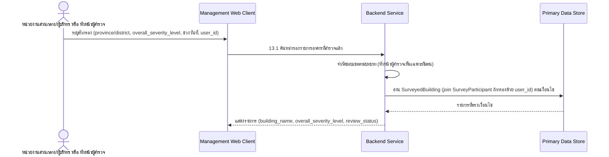

# Component Design: ค้นหา/กรองรายการอาคารที่สำรวจแล้ว

รองรับ [[feature-list#12. ค้นหา/กรองรายการอาคารที่สำรวจแล้ว|ฟีเจอร์ 12]] (Should have) — อ้างอิง operation จาก [[api-spec#13. ค้นหา/กรองรายการอาคารที่สำรวจแล้ว|api-spec หัวข้อ 13]] และ entity [[db-spec#4.1 SurveyedBuilding|SurveyedBuilding]], [[db-spec#4.2 SurveyParticipant|SurveyParticipant]] (อ่านเท่านั้น)

ใช้งานผ่าน [[architecture#2. Logical Component|Management Web Client]] โดยหน่วยงานส่วนกลาง/ผู้บริหาร และหัวหน้าผู้สำรวจ (ติดตามความคืบหน้าของทีม)

## 1. Sequence Diagram

## 2. Operation ↔ Entity ที่กระทบ

| Operation ([[api-spec#13. ค้นหา/กรองรายการอาคารที่สำรวจแล้ว\|api-spec 13.x]]) | Entity ที่กระทบ | การกระทำ | ลำดับ/เงื่อนไข |
|---|---|---|---|
| 13.1 ค้นหา/กรองรายการอาคารที่สำรวจแล้ว | [[db-spec#4.1 SurveyedBuilding\|SurveyedBuilding]] (อ่าน), [[db-spec#4.2 SurveyParticipant\|SurveyParticipant]] (อ่านเมื่อกรองด้วย `user_id`) | อ่าน | หัวหน้าผู้สำรวจเห็นเฉพาะอาคารของทีมตน; หน่วยงานส่วนกลางเห็นเฉพาะที่ `sync_status = ซิงค์สำเร็จ` — ดู [[offline-sync]] |

## 3. State Transition

ไม่มี — เป็นการอ่าน/กรองข้อมูลอย่างเดียว ไม่มี state ของตัวเอง

## 4. Edge Case และวิธีจัดการ

| Edge Case | วิธีจัดการ | อ้างอิง |
|---|---|---|
| ไม่พบอาคารตรงเงื่อนไข | คืนรายการว่าง ไม่ถือเป็น error | [[api-spec#13. ค้นหา/กรองรายการอาคารที่สำรวจแล้ว\|api-spec 13.1]] |

## เอกสารที่เกี่ยวข้อง

- [[api-spec]], [[db-spec]], [[feature-list]], [[user-journey]]
- [[dashboard-overview]], [[export-report]] — ใช้ตัวกรองลักษณะเดียวกัน
- [[offline-sync]] — เงื่อนไข `sync_status = ซิงค์สำเร็จ` ที่กรองผลลัพธ์สำหรับหน่วยงานส่วนกลาง
