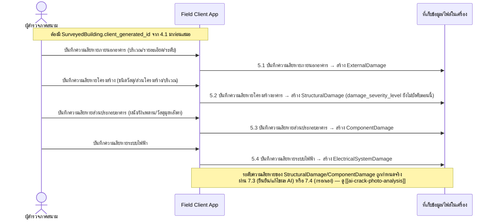

# Component Design: ประเมินความเสียหายโครงสร้างและส่วนประกอบอาคารแยกตามหมวด

รองรับ [[feature-list#2. ประเมินความเสียหายโครงสร้างและส่วนประกอบอาคารแยกตามหมวด|ฟีเจอร์ 2]] (Must have) — อ้างอิง operation จาก [[api-spec#5. ประเมินความเสียหายโครงสร้างและส่วนประกอบอาคารแยกตามหมวด|api-spec หัวข้อ 5]] และ entity จาก [[db-spec#5.2 ExternalDamage|ExternalDamage]], [[db-spec#5.3 StructuralDamage|StructuralDamage]], [[db-spec#5.4 ComponentDamage|ComponentDamage]], [[db-spec#5.5 ElectricalSystemDamage|ElectricalSystemDamage]]

ต่อเนื่องจาก [[building-environment-info]] (ต้องมี `SurveyedBuilding` อยู่ก่อนเสมอ) และเป็นข้อมูลตั้งต้นให้ [[damage-color-summary]] สรุปผลระดับสี ส่วนการกำหนดค่า `damage_severity_level` ของ `StructuralDamage`/`ComponentDamage` (ผ่าน AI หรือกรอกเอง) ออกแบบละเอียดแยกไว้ที่ [[ai-crack-photo-analysis]]

## 1. Sequence Diagram

## 2. Operation ↔ Entity ที่กระทบ

| Operation ([[api-spec#5. ประเมินความเสียหายโครงสร้างและส่วนประกอบอาคารแยกตามหมวด\|api-spec 5.x]]) | Entity ที่กระทบ | การกระทำ | ลำดับ/เงื่อนไข |
|---|---|---|---|
| 5.1 บันทึกความเสียหายภายนอกอาคาร | [[db-spec#5.2 ExternalDamage\|ExternalDamage]] | สร้าง | ต้องมี `SurveyedBuilding` อยู่ก่อน (จาก [[building-environment-info]]) |
| 5.2 บันทึกความเสียหายโครงสร้างอาคาร | [[db-spec#5.3 StructuralDamage\|StructuralDamage]] | สร้าง | เหมือนข้างต้น — `damage_severity_level`/`source_of_value` ต้องถูกเติมภายหลังผ่าน 7.3/7.4 เท่านั้น |
| 5.3 บันทึกความเสียหายส่วนประกอบอาคาร | [[db-spec#5.4 ComponentDamage\|ComponentDamage]] | สร้าง | เหมือน 5.2 |
| 5.4 บันทึกความเสียหายระบบไฟฟ้า | [[db-spec#5.5 ElectricalSystemDamage\|ElectricalSystemDamage]] | สร้าง | เหมือนข้างต้น ไม่มีข้อจำกัดเรื่อง source_of_value |

## 3. State Transition ของ damage_severity_level

ไม่ออกแบบซ้ำในไฟล์นี้ — ระเบียน `StructuralDamage`/`ComponentDamage` ที่สร้างในหัวข้อ 5.2/5.3 อยู่ในสถานะ "รอกำหนดค่าความเสียหาย" จนกว่าจะผ่าน 7.3 หรือ 7.4 ดู state diagram เต็มที่ [[ai-crack-photo-analysis#3. State Diagram|ai-crack-photo-analysis]]

## 4. Edge Case และวิธีจัดการ

| Edge Case | วิธีจัดการ | อ้างอิง |
|---|---|---|
| ไม่พบ `SurveyedBuilding` ที่อ้างอิง (ทุก operation 5.1-5.4) | ปฏิเสธการบันทึก | [[api-spec#5. ประเมินความเสียหายโครงสร้างและส่วนประกอบอาคารแยกตามหมวด\|api-spec 5.1-5.4]] |
| `source_of_value = แก้ไขจากผลที่ AI เสนอ` แต่ไม่มี `AIAnalysisResult` อ้างอิงมาก่อน (5.2/5.3) | ปฏิเสธ — ต้องผ่านเส้นทาง AI (7.2→7.3) จริงก่อนเท่านั้นจึงเลือกค่านี้ได้ | [[api-spec#5. ประเมินความเสียหายโครงสร้างและส่วนประกอบอาคารแยกตามหมวด|api-spec 5.2]] |
| `damage_severity_level` ต้องมาจากหนึ่งใน 2 เส้นทางเท่านั้น (ห้าม AI เขียนตรง) | บังคับที่ operation 7.3/7.4 เท่านั้น ไม่มี operation ใดใน 5.2/5.3 อนุญาตให้ AI เขียนค่านี้โดยตรง | [[api-spec#5. ประเมินความเสียหายโครงสร้างและส่วนประกอบอาคารแยกตามหมวด|api-spec 5.2]] |

## เอกสารที่เกี่ยวข้อง

- [[api-spec]], [[db-spec]], [[feature-list]], [[user-journey]]
- [[building-environment-info]] — ที่มาของ `SurveyedBuilding` ที่ทุก operation ในฟีเจอร์นี้อ้างอิง
- [[ai-crack-photo-analysis]] — การกำหนดค่า `damage_severity_level` จริง
- [[damage-color-summary]] — ใช้ข้อมูลจากฟีเจอร์นี้สรุปผลระดับสี
