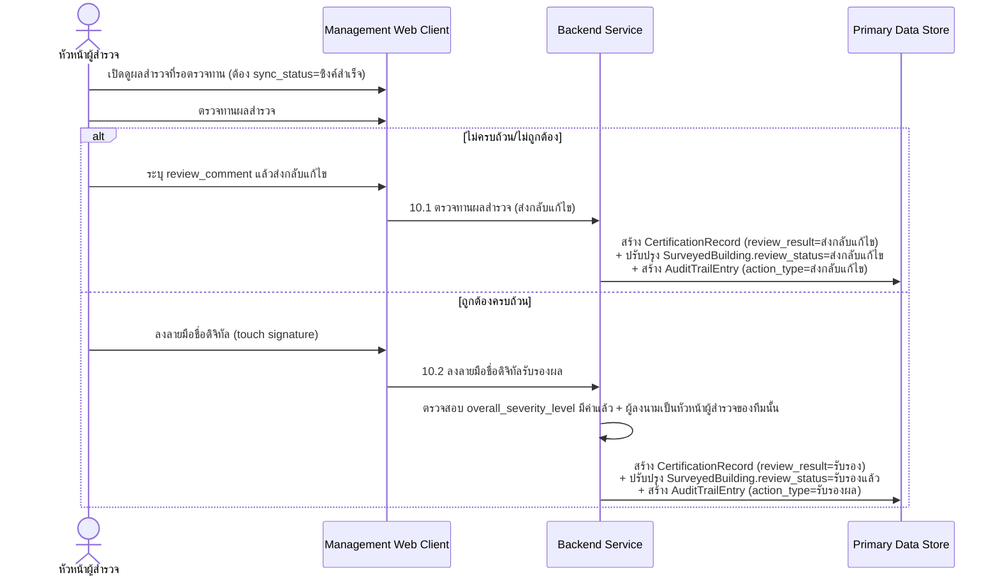
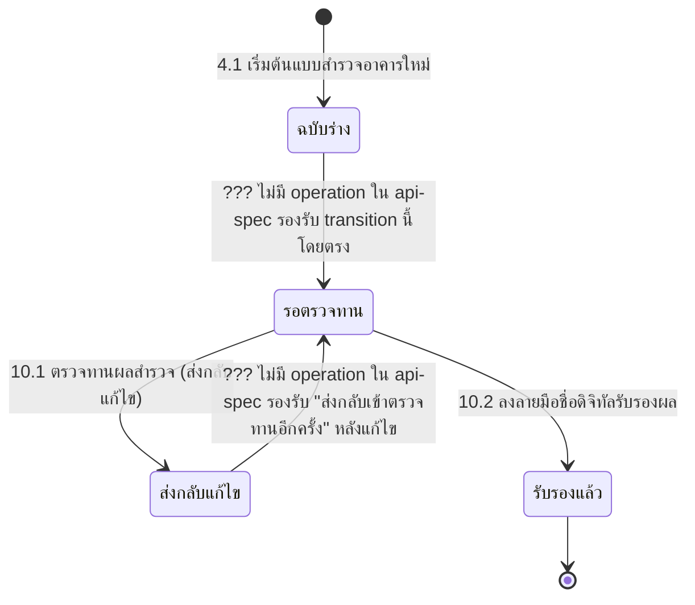

# Component Design: ตรวจทานและรับรองผลสำรวจด้วยลายเซ็นดิจิทัล

รองรับ [[feature-list#7. ตรวจทานและรับรองผลสำรวจด้วยลายเซ็นดิจิทัล|ฟีเจอร์ 7]] (Must have) — อ้างอิง operation จาก [[api-spec#10. ตรวจทานและรับรองผลสำรวจด้วยลายเซ็นดิจิทัล|api-spec หัวข้อ 10]] และ entity [[db-spec#7.1 CertificationRecord|CertificationRecord]], [[db-spec#4.1 SurveyedBuilding|SurveyedBuilding]], [[db-spec#7.2 AuditTrailEntry|AuditTrailEntry]]

ใช้งานผ่าน [[architecture#2. Logical Component|Management Web Client]] เท่านั้น — **ต้องมีสัญญาณอินเทอร์เน็ต** เพราะทำได้เฉพาะระเบียนที่ `sync_status = ซิงค์สำเร็จ` แล้ว (ดู [[offline-sync]]) ต่อเนื่องจาก [[damage-color-summary]] (ต้องมีผลสรุประดับสีแล้ว) และ [[surveyor-info-duration]] (ต้องมีหัวหน้าผู้สำรวจในทีมแล้ว)

## 1. Sequence Diagram

## 2. Operation ↔ Entity ที่กระทบ

| Operation ([[api-spec#10. ตรวจทานและรับรองผลสำรวจด้วยลายเซ็นดิจิทัล\|api-spec 10.x]]) | Entity ที่กระทบ | การกระทำ | ลำดับ/เงื่อนไข |
|---|---|---|---|
| 10.1 ตรวจทานผลสำรวจ (ส่งกลับแก้ไข) | [[db-spec#7.1 CertificationRecord\|CertificationRecord]] (สร้าง), [[db-spec#4.1 SurveyedBuilding\|SurveyedBuilding]] (แก้ไข), [[db-spec#7.2 AuditTrailEntry\|AuditTrailEntry]] (สร้าง) | สร้าง + แก้ไข + สร้าง | ทำได้เฉพาะระเบียนที่ `sync_status = ซิงค์สำเร็จ` เท่านั้น |
| 10.2 ลงลายมือชื่อดิจิทัลรับรองผล | เหมือนข้างต้น | สร้าง + แก้ไข + สร้าง | ต้องมี `overall_severity_level` แล้ว ([[damage-color-summary]]) และผู้ลงนามต้องเป็นหัวหน้าผู้สำรวจของทีมนั้น ([[surveyor-info-duration]]) |

## 3. State Diagram: review_status (พบช่องว่างใน api-spec)

**ช่องว่างที่พบ (รายงานเพื่อรัน `sync-api-db` เพิ่ม)**: [[api-spec]] หัวข้อ 6.1 ระบุว่า "ต้องมีค่า `overall_severity_level` ก่อนเปลี่ยน `review_status` เป็น 'รอตรวจทาน' (7.1)" (การอ้างอิง "(7.1)" ในข้อความต้นฉบับดูเหมือนอ้างผิดหมวด เพราะหมวด 7 คือ "ถ่ายภาพและประเมินรอยร้าวด้วย AI" ไม่ใช่หมวดตรวจทาน) แต่เมื่อไล่ operation ทั้งหมดในหมวด 10 (10.1, 10.2) พบว่า**ไม่มี operation ใดทำหน้าที่เปลี่ยน `SurveyedBuilding.review_status` จาก `ฉบับร่าง` → `รอตรวจทาน` โดยตรง** และไม่มี operation รองรับการส่งกลับเข้าตรวจทานอีกครั้งหลังทีมแก้ไขจากสถานะ `ส่งกลับแก้ไข` เช่นกัน — ทั้งสอง transition นี้จำเป็นต่อ flow การทำงานจริงตาม [[user-journey]] จึงควรเพิ่ม operation ใหม่ (เช่น "ส่งงานเข้าตรวจทาน" โดยผู้สำรวจภาคสนาม/หัวหน้าทีม) ใน [[api-spec]] ผ่าน `sync-api-db`

## 4. Edge Case และวิธีจัดการ

| Edge Case | วิธีจัดการ | อ้างอิง |
|---|---|---|
| ระเบียนยังไม่ซิงค์ขึ้นเซิร์ฟเวอร์ | ปฏิเสธการตรวจทาน/รับรอง จนกว่า `sync_status = ซิงค์สำเร็จ` | [[api-spec#10. ตรวจทานและรับรองผลสำรวจด้วยลายเซ็นดิจิทัล\|api-spec 10.1]] |
| ไม่มี `review_comment` ตอนส่งกลับแก้ไข | ปฏิเสธการบันทึก (ต้องระบุเสมอ) | [[api-spec#10. ตรวจทานและรับรองผลสำรวจด้วยลายเซ็นดิจิทัล\|api-spec 10.1]] |
| ยังไม่มีผลสรุประดับสี (`overall_severity_level`) | ปฏิเสธการลงลายมือชื่อรับรอง | [[api-spec#10. ตรวจทานและรับรองผลสำรวจด้วยลายเซ็นดิจิทัล\|api-spec 10.2]] |
| ผู้เรียกไม่ใช่หัวหน้าผู้สำรวจของทีมนั้น | ปฏิเสธการลงลายมือชื่อรับรอง | [[api-spec#10. ตรวจทานและรับรองผลสำรวจด้วยลายเซ็นดิจิทัล\|api-spec 10.2]] |
| ไม่พบ operation เปลี่ยนสถานะ `ฉบับร่าง`→`รอตรวจทาน` | ระบุเป็นช่องว่างของ api-spec (ดูหัวข้อ 3) — ไม่ประดิษฐ์ operation ใหม่เอง รอ `sync-api-db` | [[api-spec]] |

## เอกสารที่เกี่ยวข้อง

- [[api-spec]], [[db-spec]], [[feature-list]], [[user-journey]]
- [[damage-color-summary]], [[surveyor-info-duration]] — เงื่อนไขก่อนหน้าที่ต้องผ่านก่อน
- [[offline-sync]] — เงื่อนไข `sync_status = ซิงค์สำเร็จ` ที่บังคับก่อนตรวจทานได้
