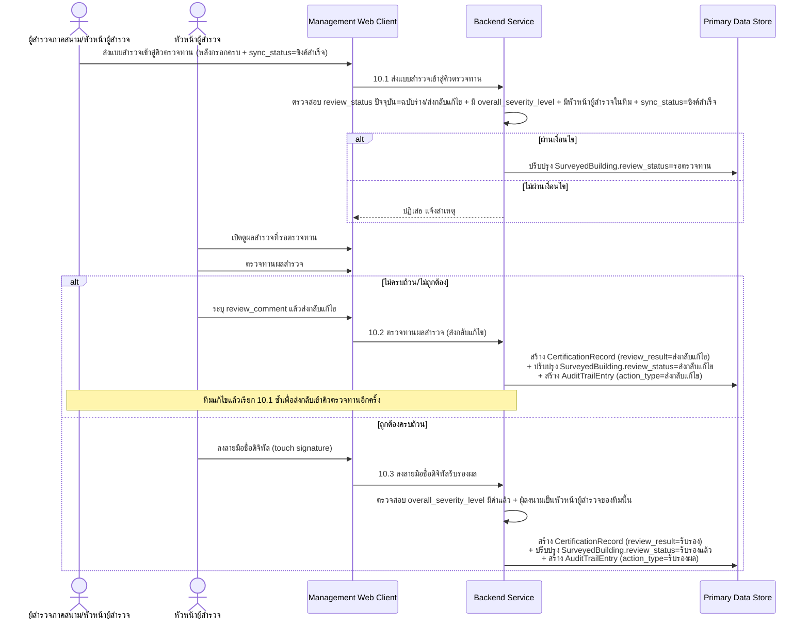
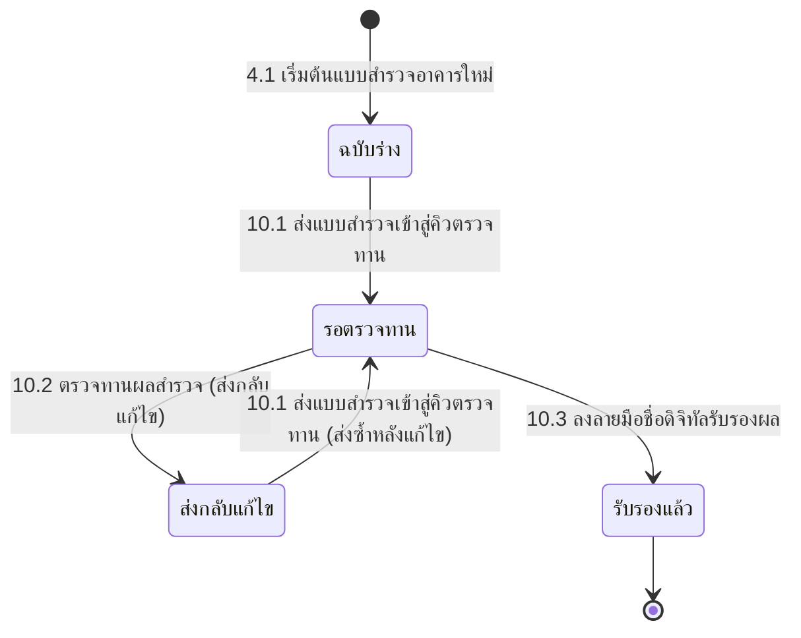

# Component Design: ตรวจทานและรับรองผลสำรวจด้วยลายเซ็นดิจิทัล

รองรับ [[feature-list#7. ตรวจทานและรับรองผลสำรวจด้วยลายเซ็นดิจิทัล|ฟีเจอร์ 7]] (Must have) — อ้างอิง operation จาก [[api-spec#10. ตรวจทานและรับรองผลสำรวจด้วยลายเซ็นดิจิทัล|api-spec หัวข้อ 10]] และ entity [[db-spec#7.1 CertificationRecord|CertificationRecord]], [[db-spec#4.1 SurveyedBuilding|SurveyedBuilding]], [[db-spec#7.2 AuditTrailEntry|AuditTrailEntry]]

ใช้งานผ่าน [[architecture#2. Logical Component|Management Web Client]] เท่านั้น — **ต้องมีสัญญาณอินเทอร์เน็ต** เพราะทำได้เฉพาะระเบียนที่ `sync_status = ซิงค์สำเร็จ` แล้ว (ดู [[offline-sync]]) ต่อเนื่องจาก [[damage-color-summary]] (ต้องมีผลสรุประดับสีแล้ว) และ [[surveyor-info-duration]] (ต้องมีหัวหน้าผู้สำรวจในทีมแล้ว)

## 1. Sequence Diagram

## 2. Operation ↔ Entity ที่กระทบ

> **หมายเหตุการเปลี่ยนเลข operation**: `api-db-writer` เพิ่ม operation ใหม่ 10.1 เข้ามาก่อนหน้า operation เดิม — operation เดิม "10.1 ตรวจทานผลสำรวจ (ส่งกลับแก้ไข)" ถูกเลื่อนเป็น **10.2** และ "10.2 ลงลายมือชื่อดิจิทัลรับรองผล" ถูกเลื่อนเป็น **10.3** ไฟล์นี้อ้างอิงเลขใหม่ทั้งหมดแล้ว

| Operation ([[api-spec#10. ตรวจทานและรับรองผลสำรวจด้วยลายเซ็นดิจิทัล\|api-spec 10.x]]) | Entity ที่กระทบ | การกระทำ | ลำดับ/เงื่อนไข |
|---|---|---|---|
| 10.1 ส่งแบบสำรวจเข้าสู่คิวตรวจทาน | [[db-spec#4.1 SurveyedBuilding\|SurveyedBuilding]] | แก้ไข (`review_status`) | ทำได้เฉพาะจาก `review_status = ฉบับร่าง` หรือ `ส่งกลับแก้ไข`; ต้องมี `overall_severity_level` แล้ว ([[damage-color-summary]]) และมีหัวหน้าผู้สำรวจในทีม ([[surveyor-info-duration]]); ต้อง `sync_status = ซิงค์สำเร็จ` (ถ้ามีความขัดแย้งรอแก้ไข ต้องแก้ผ่าน [[manual-conflict-resolution]] ก่อน) |
| 10.2 ตรวจทานผลสำรวจ (ส่งกลับแก้ไข) | [[db-spec#7.1 CertificationRecord\|CertificationRecord]] (สร้าง), [[db-spec#4.1 SurveyedBuilding\|SurveyedBuilding]] (แก้ไข), [[db-spec#7.2 AuditTrailEntry\|AuditTrailEntry]] (สร้าง) | สร้าง + แก้ไข + สร้าง | ทำได้เฉพาะระเบียนที่ `sync_status = ซิงค์สำเร็จ` เท่านั้น; ต้องเรียก 10.1 มาก่อนเพื่อเข้าสถานะ `รอตรวจทาน` |
| 10.3 ลงลายมือชื่อดิจิทัลรับรองผล | เหมือนข้างต้น | สร้าง + แก้ไข + สร้าง | ต้องมี `overall_severity_level` แล้ว และผู้ลงนามต้องเป็นหัวหน้าผู้สำรวจของทีมนั้น; ต้องอยู่ในสถานะ `รอตรวจทาน` จาก 10.1 |

## 3. State Diagram: review_status

ช่องว่างที่เคยรายงานไว้ (ไม่มี operation เปลี่ยนสถานะ `ฉบับร่าง`→`รอตรวจทาน` และ `ส่งกลับแก้ไข`→`รอตรวจทาน`) **ถูกปิดแล้ว** — `api-db-writer` เพิ่ม operation [[api-spec#10. ตรวจทานและรับรองผลสำรวจด้วยลายเซ็นดิจิทัล|10.1 ส่งแบบสำรวจเข้าสู่คิวตรวจทาน]] ที่รองรับ transition ทั้งสองทิศทางนี้ในตัวเดียว (input เดียวกัน แยกผลตาม `review_status` ปัจจุบัน)

หมายเหตุ: `sync_status = มีความขัดแย้งรอแก้ไข` เป็นเงื่อนไขขวางที่ต้องแก้ก่อนเรียก 10.1 ได้ — ดู [[offline-sync]] และ [[manual-conflict-resolution]]

## 4. Edge Case และวิธีจัดการ

| Edge Case | วิธีจัดการ | อ้างอิง |
|---|---|---|
| ยังไม่มีผลสรุประดับสี ตอนส่งเข้าคิวตรวจทาน | ปฏิเสธการส่งเข้าคิวตรวจทาน | [[api-spec#10. ตรวจทานและรับรองผลสำรวจด้วยลายเซ็นดิจิทัล\|api-spec 10.1]] |
| ไม่มีหัวหน้าผู้สำรวจในทีม ตอนส่งเข้าคิวตรวจทาน | ปฏิเสธการส่งเข้าคิวตรวจทาน | [[api-spec#10. ตรวจทานและรับรองผลสำรวจด้วยลายเซ็นดิจิทัล\|api-spec 10.1]] |
| `review_status` ปัจจุบันไม่ใช่ `ฉบับร่าง`/`ส่งกลับแก้ไข` (เช่นพยายามส่งซ้ำขณะ `รอตรวจทาน`/`รับรองแล้ว`) | ปฏิเสธการส่งเข้าคิวตรวจทาน | [[api-spec#10. ตรวจทานและรับรองผลสำรวจด้วยลายเซ็นดิจิทัล\|api-spec 10.1]] |
| ระเบียนยังไม่ซิงค์ขึ้นเซิร์ฟเวอร์ | ปฏิเสธการตรวจทาน/รับรอง จนกว่า `sync_status = ซิงค์สำเร็จ` | [[api-spec#10. ตรวจทานและรับรองผลสำรวจด้วยลายเซ็นดิจิทัล\|api-spec 10.2]] |
| ไม่มี `review_comment` ตอนส่งกลับแก้ไข | ปฏิเสธการบันทึก (ต้องระบุเสมอ) | [[api-spec#10. ตรวจทานและรับรองผลสำรวจด้วยลายเซ็นดิจิทัล\|api-spec 10.2]] |
| ยังไม่มีผลสรุประดับสี (`overall_severity_level`) ตอนลงลายมือชื่อ | ปฏิเสธการลงลายมือชื่อรับรอง | [[api-spec#10. ตรวจทานและรับรองผลสำรวจด้วยลายเซ็นดิจิทัล\|api-spec 10.3]] |
| ผู้เรียกไม่ใช่หัวหน้าผู้สำรวจของทีมนั้น | ปฏิเสธการลงลายมือชื่อรับรอง | [[api-spec#10. ตรวจทานและรับรองผลสำรวจด้วยลายเซ็นดิจิทัล\|api-spec 10.3]] |

## เอกสารที่เกี่ยวข้อง

- [[api-spec]], [[db-spec]], [[feature-list]], [[user-journey]]
- [[damage-color-summary]], [[surveyor-info-duration]] — เงื่อนไขก่อนหน้าที่ต้องผ่านก่อน
- [[offline-sync]], [[manual-conflict-resolution]] — เงื่อนไข `sync_status = ซิงค์สำเร็จ` ที่บังคับก่อนส่งเข้าคิวตรวจทานได้
