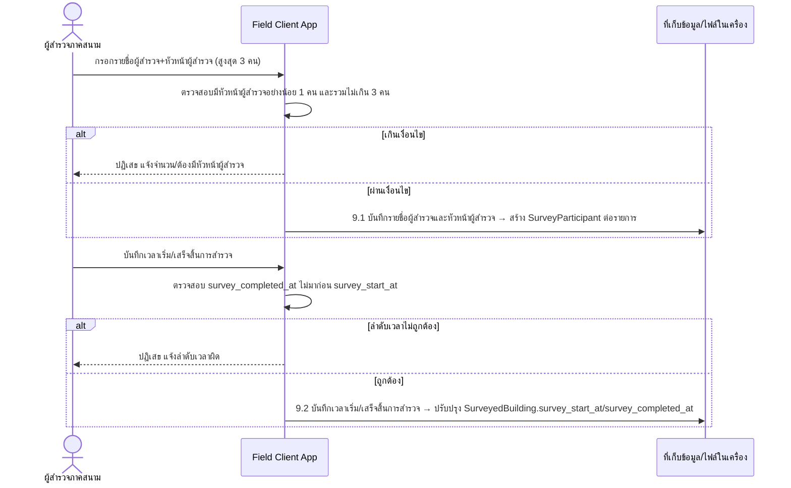

# Component Design: บันทึกข้อมูลผู้สำรวจและระยะเวลาการสำรวจ

รองรับ [[feature-list#6. บันทึกข้อมูลผู้สำรวจและระยะเวลาการสำรวจ|ฟีเจอร์ 6]] (Must have) — อ้างอิง operation จาก [[api-spec#9. บันทึกข้อมูลผู้สำรวจและระยะเวลาการสำรวจ|api-spec หัวข้อ 9]] และ entity [[db-spec#4.2 SurveyParticipant|SurveyParticipant]], [[db-spec#4.1 SurveyedBuilding|SurveyedBuilding]] (attribute `survey_start_at`/`survey_completed_at`)

ใช้ประกอบการรับรองผลใน [[survey-review-signature]] — `SurveyParticipant.role_in_team = หัวหน้าผู้สำรวจ` เป็นเงื่อนไขบังคับก่อนลงลายมือชื่อดิจิทัลได้

## 1. Sequence Diagram

## 2. Operation ↔ Entity ที่กระทบ

| Operation ([[api-spec#9. บันทึกข้อมูลผู้สำรวจและระยะเวลาการสำรวจ\|api-spec 9.x]]) | Entity ที่กระทบ | การกระทำ | ลำดับ/เงื่อนไข |
|---|---|---|---|
| 9.1 บันทึกรายชื่อผู้สำรวจและหัวหน้าผู้สำรวจ | [[db-spec#4.2 SurveyParticipant\|SurveyParticipant]] | สร้าง (สูงสุด 3 รายการ) | ต้องมี `SurveyedBuilding` อยู่ก่อน (จาก [[building-environment-info]]); ต้องมีอย่างน้อย 1 รายการที่ `role_in_team = หัวหน้าผู้สำรวจ` |
| 9.2 บันทึกเวลาเริ่ม/เสร็จสิ้นการสำรวจ | [[db-spec#4.1 SurveyedBuilding\|SurveyedBuilding]] | แก้ไข | ไม่ขึ้นกับ 9.1 โดยตรง แต่ควรทำคู่กันเพื่อความสมบูรณ์ของแบบสำรวจก่อนส่งตรวจทาน |

## 3. State Transition

ฟีเจอร์นี้ไม่มีสถานะ (status field) ของตัวเองที่เปลี่ยนแปลงเป็นลำดับขั้น — เป็นการกรอกข้อมูลประกอบ (participant list + timestamp) ที่ตรวจสอบด้วยกฎ validation ณ เวลาบันทึกเท่านั้น จึงไม่มี state diagram แยกในไฟล์นี้

## 4. Edge Case และวิธีจัดการ

| Edge Case | วิธีจัดการ | อ้างอิง |
|---|---|---|
| จำนวนผู้สำรวจเกิน 3 คน | ปฏิเสธการบันทึก | [[api-spec#9. บันทึกข้อมูลผู้สำรวจและระยะเวลาการสำรวจ\|api-spec 9.1]], [[db-spec#4.2 SurveyParticipant\|db-spec 4.2]] |
| ไม่มีหัวหน้าผู้สำรวจในรายการ | ปฏิเสธการบันทึก | [[api-spec#9. บันทึกข้อมูลผู้สำรวจและระยะเวลาการสำรวจ\|api-spec 9.1]] |
| `survey_completed_at` มาก่อน `survey_start_at` | ปฏิเสธการบันทึก | [[api-spec#9. บันทึกข้อมูลผู้สำรวจและระยะเวลาการสำรวจ\|api-spec 9.2]] |

## เอกสารที่เกี่ยวข้อง

- [[api-spec]], [[db-spec]], [[feature-list]], [[user-journey]]
- [[building-environment-info]] — ที่มาของ `SurveyedBuilding` ที่ต้องมีก่อน
- [[survey-review-signature]] — ใช้ `SurveyParticipant.role_in_team = หัวหน้าผู้สำรวจ` เป็นเงื่อนไขลงลายมือชื่อ
