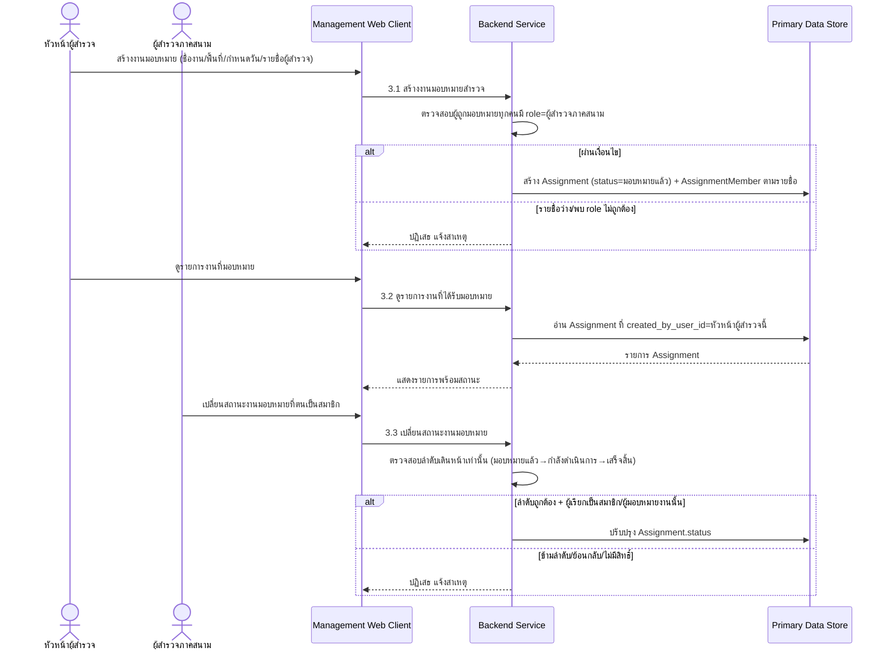
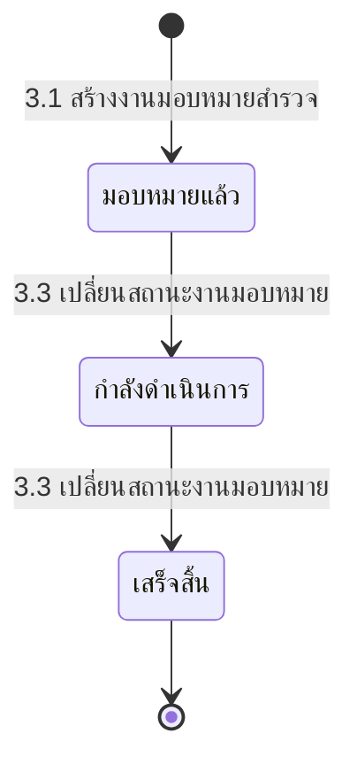

# Component Design: มอบหมายงานสำรวจให้ทีม

รองรับ [[feature-list#8. มอบหมายงานสำรวจให้ทีม|ฟีเจอร์ 8]] (Should have) — อ้างอิง operation จาก [[api-spec#3. มอบหมายงานสำรวจให้ทีม|api-spec หัวข้อ 3]] และ entity [[db-spec#3.1 Assignment|Assignment]], [[db-spec#3.2 AssignmentMember|AssignmentMember]]

เป็นจุดเริ่มต้นของ journey การสำรวจภาคสนาม (ฟีเจอร์ 1-6) ใช้งานผ่าน [[architecture#2. Logical Component|Management Web Client]] โดยหัวหน้าผู้สำรวจ — `Assignment.id` ที่ได้เป็น input ไม่บังคับของ [[building-environment-info#2. Operation ↔ Entity ที่กระทบ|4.1 เริ่มต้นแบบสำรวจอาคารใหม่]]

## 1. Sequence Diagram

## 2. Operation ↔ Entity ที่กระทบ

| Operation ([[api-spec#3. มอบหมายงานสำรวจให้ทีม\|api-spec 3.x]]) | Entity ที่กระทบ | การกระทำ | ลำดับ/เงื่อนไข |
|---|---|---|---|
| 3.1 สร้างงานมอบหมายสำรวจ | [[db-spec#3.1 Assignment\|Assignment]] (สร้าง), [[db-spec#3.2 AssignmentMember\|AssignmentMember]] (สร้างตามรายชื่อ) | สร้าง | ผู้ถูกมอบหมายทุกคนต้อง `role = ผู้สำรวจภาคสนาม` |
| 3.2 ดูรายการงานที่ได้รับมอบหมาย | [[db-spec#3.1 Assignment\|Assignment]] | อ่าน | กรองตามสิทธิ์ผู้เรียก (ผู้สำรวจเห็นเฉพาะงานตน, หัวหน้าเห็นงานที่ตนมอบหมาย) |
| 3.3 เปลี่ยนสถานะงานมอบหมาย | [[db-spec#3.1 Assignment\|Assignment]] | แก้ไข | เปลี่ยนได้เฉพาะตามลำดับเดินหน้า (`มอบหมายแล้ว` → `กำลังดำเนินการ` → `เสร็จสิ้น`) ห้ามข้ามลำดับ/ย้อนกลับ; ผู้เรียกต้องเป็นสมาชิก (`AssignmentMember`) หรือผู้มอบหมายงานนั้น |

## 3. State Diagram: Assignment.status

ช่องว่างที่เคยรายงานไว้ (ไม่มี operation เปลี่ยนสถานะ) **ถูกปิดแล้ว** — `api-db-writer` เพิ่ม operation [[api-spec#3. มอบหมายงานสำรวจให้ทีม|3.3 เปลี่ยนสถานะงานมอบหมาย]] ให้แล้ว บังคับเปลี่ยนตามลำดับเดินหน้าเท่านั้น ห้ามข้ามลำดับหรือย้อนกลับ

## 4. Edge Case และวิธีจัดการ

| Edge Case | วิธีจัดการ | อ้างอิง |
|---|---|---|
| รายชื่อผู้สำรวจว่างเปล่า | ปฏิเสธการสร้างงานมอบหมาย | [[api-spec#3. มอบหมายงานสำรวจให้ทีม\|api-spec 3.1]] |
| พบ `user_id` ที่ไม่ใช่บทบาทผู้สำรวจภาคสนาม | ปฏิเสธการสร้างงานมอบหมาย | [[api-spec#3. มอบหมายงานสำรวจให้ทีม\|api-spec 3.1]] |
| ไม่มีงานมอบหมายตรงเงื่อนไขผู้เรียก (3.2) | คืนรายการว่าง ไม่ถือเป็น error | [[api-spec#3. มอบหมายงานสำรวจให้ทีม\|api-spec 3.2]] |
| เปลี่ยนสถานะข้ามลำดับ (เช่น `มอบหมายแล้ว` → `เสร็จสิ้น` โดยตรง) หรือย้อนสถานะกลับ | ปฏิเสธการเปลี่ยนสถานะ | [[api-spec#3. มอบหมายงานสำรวจให้ทีม\|api-spec 3.3]] |
| ผู้เรียกไม่ใช่สมาชิก/ผู้มอบหมายงานนั้น | ปฏิเสธการเปลี่ยนสถานะ | [[api-spec#3. มอบหมายงานสำรวจให้ทีม\|api-spec 3.3]] |

## เอกสารที่เกี่ยวข้อง

- [[api-spec]], [[db-spec]], [[feature-list]], [[user-journey]]
- [[building-environment-info]] — ใช้ `Assignment.id` เป็น input ไม่บังคับตอนเริ่มแบบสำรวจ
