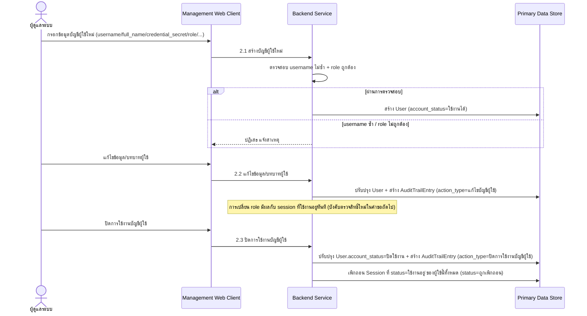
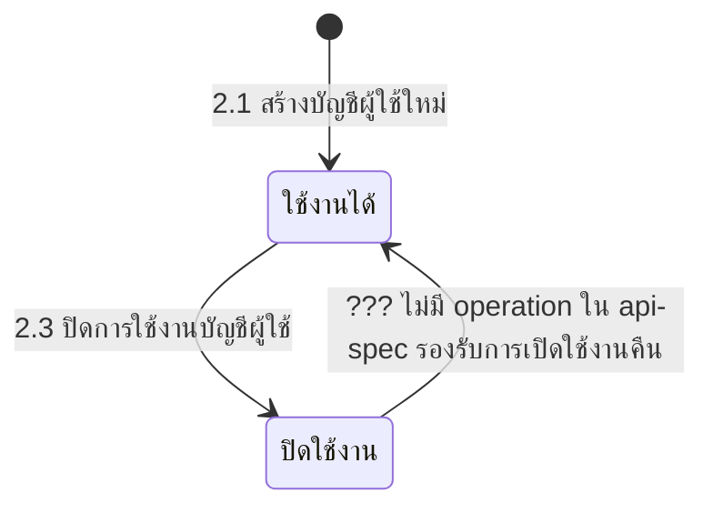

# Component Design: จัดการผู้ใช้และสิทธิ์การเข้าถึง

รองรับ [[feature-list#9. จัดการผู้ใช้และสิทธิ์การเข้าถึง|ฟีเจอร์ 9]] (Must have) — อ้างอิง operation จาก [[api-spec#2. จัดการผู้ใช้และสิทธิ์การเข้าถึง|api-spec หัวข้อ 2]] และ entity [[db-spec#2.1 User|User]], [[db-spec#2.2 Session|Session]], [[db-spec#7.2 AuditTrailEntry|AuditTrailEntry]]

ใช้งานผ่าน [[architecture#2. Logical Component|Management Web Client]] โดยผู้ดูแลระบบ — ผลลัพธ์ (`role`) เป็นฐานของการบังคับสิทธิ์ (RBAC) ที่ใช้จริงตอนเข้าสู่ระบบใน [[authentication-login]]

## 1. Sequence Diagram

## 2. Operation ↔ Entity ที่กระทบ

| Operation ([[api-spec#2. จัดการผู้ใช้และสิทธิ์การเข้าถึง\|api-spec 2.x]]) | Entity ที่กระทบ | การกระทำ | ลำดับ/เงื่อนไข |
|---|---|---|---|
| 2.1 สร้างบัญชีผู้ใช้ใหม่ | [[db-spec#2.1 User\|User]] | สร้าง | `username` ต้องไม่ซ้ำ, `role` ต้องเป็น 1 ใน 4 ค่า |
| 2.2 แก้ไขข้อมูล/บทบาทผู้ใช้ | [[db-spec#2.1 User\|User]] (แก้ไข), [[db-spec#7.2 AuditTrailEntry\|AuditTrailEntry]] (สร้าง) | แก้ไข + สร้าง | ต้องมี `User` อยู่ก่อน (2.1); ถ้าเปลี่ยน `role` กระทบ `Session` ที่ใช้งานอยู่ทันที |
| 2.3 ปิดการใช้งานบัญชีผู้ใช้ | [[db-spec#2.1 User\|User]] (แก้ไข), [[db-spec#2.2 Session\|Session]] (แก้ไขหลายรายการ), [[db-spec#7.2 AuditTrailEntry\|AuditTrailEntry]] (สร้าง) | แก้ไข + เพิกถอน + สร้าง | ต้องเพิกถอน `Session` ที่ `status = ใช้งานอยู่` ของผู้ใช้นี้ทั้งหมดทันที |

## 3. State Diagram: User.account_status (พบช่องว่างใน api-spec)

**ช่องว่างที่พบ**: [[api-spec#2. จัดการผู้ใช้และสิทธิ์การเข้าถึง|api-spec หัวข้อ 2]] มี operation ปิดการใช้งานบัญชี (2.3) แต่**ไม่มี operation สำหรับเปิดใช้งานบัญชีคืน** (`account_status: ปิดใช้งาน → ใช้งานได้`) — operation 2.2 (แก้ไขข้อมูล/บทบาทผู้ใช้) ก็ไม่ได้รวม `account_status` อยู่ใน field ที่แก้ไขได้ ถ้าองค์กรต้องการให้ผู้ดูแลระบบเปิดใช้งานบัญชีที่เคยปิดคืนได้ ควรรัน `sync-api-db` เพื่อเพิ่ม operation นี้ (ปัจจุบันยังไม่ยืนยันว่าเป็นความตั้งใจถาวรหรือเป็นช่องว่าง)

## 4. Edge Case และวิธีจัดการ

| Edge Case | วิธีจัดการ | อ้างอิง |
|---|---|---|
| `username` ซ้ำ | ปฏิเสธการสร้างบัญชี | [[api-spec#2. จัดการผู้ใช้และสิทธิ์การเข้าถึง\|api-spec 2.1]] |
| `role` ไม่ถูกต้อง (ไม่ใช่ 1 ใน 4 ค่า) | ปฏิเสธการสร้างบัญชี | [[api-spec#2. จัดการผู้ใช้และสิทธิ์การเข้าถึง\|api-spec 2.1]] |
| ไม่พบผู้ใช้ที่ต้องการแก้ไข | ปฏิเสธการแก้ไข | [[api-spec#2. จัดการผู้ใช้และสิทธิ์การเข้าถึง\|api-spec 2.2]] |
| ไม่พบผู้ใช้ที่ต้องการปิดใช้งาน / บัญชีถูกปิดใช้งานอยู่แล้ว | ปฏิเสธการดำเนินการ | [[api-spec#2. จัดการผู้ใช้และสิทธิ์การเข้าถึง\|api-spec 2.3]] |

## เอกสารที่เกี่ยวข้อง

- [[api-spec]], [[db-spec]], [[feature-list]], [[user-journey]], [[architecture]]
- [[authentication-login]] — การบังคับสิทธิ์ตาม `role` ที่กำหนดในฟีเจอร์นี้ตอนเข้าสู่ระบบจริง
