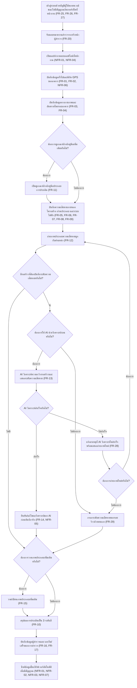
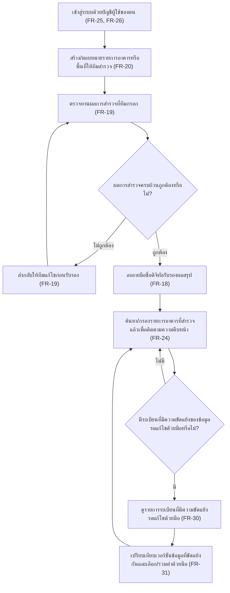
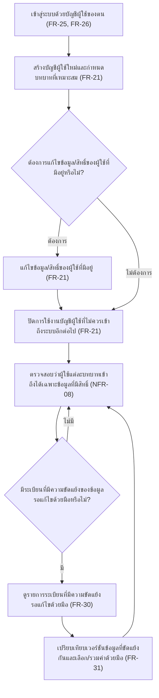
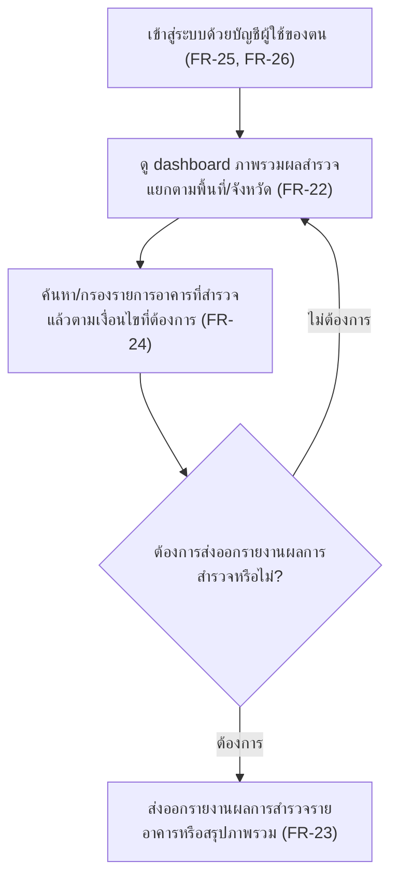

# User Journey

เอกสารนี้แมปฟีเจอร์ใน [[feature-list]] เป็น flow การใช้งานจริงตามบทบาทผู้ใช้ทั้ง 4 บทบาทที่กำหนดใน [[20260828-01-flood-damage-survey]] (อ้างอิงรวม [[backlog]]) แต่ละ journey มีแผนภาพ Mermaid flowchart กำกับก่อนรายการขั้นตอนแบบข้อความเสมอ เพื่อให้เห็นภาพรวมได้เร็วก่อนอ่านรายละเอียด

โดยแต่ละ node ในแผนภาพ = 1 ขั้นตอนในรายการข้อความด้านล่าง (ตรงกัน 1:1) และ decision node (สี่เหลี่ยมข้าวหลามตัด) ใช้แทนขั้นตอนที่เป็นเงื่อนไข/ตามสถานการณ์

## Journey: ผู้สำรวจภาคสนามลงพื้นที่สำรวจอาคาร

บทบาท: ผู้สำรวจภาคสนาม (Field Surveyor)

ขั้นตอน:

1. เข้าสู่ระบบด้วยบัญชีผู้ใช้ของตน รวมถึงกรณีไม่มีสัญญาณอินเทอร์เน็ตที่หน้างานโดยใช้ credential/session ที่แคชไว้จากการเข้าสู่ระบบครั้งล่าสุด ([[20260828-01-flood-damage-survey#4.6 การยืนยันตัวตนและการเข้าสู่ระบบ|FR-25]], [[20260828-01-flood-damage-survey#4.6 การยืนยันตัวตนและการเข้าสู่ระบบ|FR-26]], [[20260828-01-flood-damage-survey#4.6 การยืนยันตัวตนและการเข้าสู่ระบบ|FR-27]])
2. รับมอบหมายงานสำรวจอาคาร/พื้นที่จากหัวหน้าผู้สำรวจ ([[20260828-01-flood-damage-survey#4.4 ผู้สำรวจ การรับรองผล และการมอบหมายงาน|FR-20]])
3. เปิดแอปทำงานแบบออฟไลน์เต็มรูปแบบที่หน้างาน ([[20260828-01-flood-damage-survey#5. Non-Functional Requirements|NFR-01]], [[20260828-01-flood-damage-survey#5. Non-Functional Requirements|NFR-04]])
4. บันทึกข้อมูลทั่วไปและพิกัด GPS ของอาคาร ([[20260828-01-flood-damage-survey#4.1 ข้อมูลอาคารและสภาพแวดล้อม|FR-01]], [[20260828-01-flood-damage-survey#4.1 ข้อมูลอาคารและสภาพแวดล้อม|FR-02]], [[20260828-01-flood-damage-survey#5. Non-Functional Requirements|NFR-06]])
5. บันทึกข้อมูลทางกายภาพของอาคารและอันตรายของสภาพโดยรอบ ([[20260828-01-flood-damage-survey#4.1 ข้อมูลอาคารและสภาพแวดล้อม|FR-03]], [[20260828-01-flood-damage-survey#4.1 ข้อมูลอาคารและสภาพแวดล้อม|FR-04]])
6. ตรวจสอบว่าต้องการดูเกณฑ์อ้างอิงคู่มือเพิ่มเติมหรือไม่ — ถ้าต้องการ ไปขั้นตอนที่ 7 ก่อน ถ้าไม่ต้องการ ข้ามไปขั้นตอนที่ 8 ได้ทันที
7. เปิดดูเกณฑ์อ้างอิงคู่มือประกอบแต่ละหมวดการประเมินในแอปโดยตรง (เฉพาะกรณีต้องการ) ([[20260828-01-flood-damage-survey#4.2 การประเมินความเสียหายโครงสร้าง|FR-11]])
8. บันทึกความเสียหายที่สังเกตจากภายนอกอาคาร ความเสียหายโครงสร้าง (แยกตามชนิดวัสดุ/โครงหลังคา) ส่วนประกอบอาคาร และระบบไฟฟ้า ([[20260828-01-flood-damage-survey#4.2 การประเมินความเสียหายโครงสร้าง|FR-05]], [[20260828-01-flood-damage-survey#4.2 การประเมินความเสียหายโครงสร้าง|FR-06]], [[20260828-01-flood-damage-survey#4.2 การประเมินความเสียหายโครงสร้าง|FR-07]], [[20260828-01-flood-damage-survey#4.2 การประเมินความเสียหายโครงสร้าง|FR-08]], [[20260828-01-flood-damage-survey#4.2 การประเมินความเสียหายโครงสร้าง|FR-09]])
9. ถ่ายภาพประกอบความเสียหายผูกกับตำแหน่ง/บริเวณที่ระบุ ([[20260828-01-flood-damage-survey#4.3 ภาพถ่ายและ AI วิเคราะห์รอยร้าว|FR-12]])
10. ตรวจสอบว่ามีรอยร้าวที่ต้องบันทึกระดับความเสียหายหรือไม่ — ถ้ามี ไปขั้นตอนที่ 11 ถ้าไม่มี ข้ามไปขั้นตอนที่ 18 ได้ทันที
11. ตรวจสอบว่าต้องการให้ AI ช่วยวิเคราะห์ก่อนหรือไม่ (สามารถเลือกกรอกระดับความเสียหายด้วยตนเองได้เสมอ ไม่จำเป็นต้องพึ่ง AI) — ถ้าต้องการ ไปขั้นตอนที่ 12 ถ้าไม่ต้องการ ข้ามไปขั้นตอนที่ 17 ได้ทันที
12. AI วิเคราะห์ภาพถ่ายเพื่อประมาณความกว้างรอยแตกร้าวและเสนอระดับความเสียหายเป็นค่าตั้งต้น (เฉพาะกรณีเลือกให้ AI วิเคราะห์) ([[20260828-01-flood-damage-survey#4.3 ภาพถ่ายและ AI วิเคราะห์รอยร้าว|FR-13]])
13. ตรวจสอบว่า AI วิเคราะห์สำเร็จหรือไม่ — ถ้าสำเร็จ ไปขั้นตอนที่ 14 ถ้าไม่สำเร็จ ไปขั้นตอนที่ 15
14. ยืนยันหรือแก้ไขผลวิเคราะห์ของ AI ก่อนบันทึกเป็นผลจริง (human-in-the-loop) พร้อมบันทึกประวัติการแก้ไขไว้ตรวจสอบย้อนหลัง (เฉพาะกรณี AI วิเคราะห์สำเร็จ) แล้วไปขั้นตอนที่ 18 ([[20260828-01-flood-damage-survey#4.3 ภาพถ่ายและ AI วิเคราะห์รอยร้าว|FR-14]], [[20260828-01-flood-damage-survey#5. Non-Functional Requirements|NFR-05]])
15. ระบบแจ้งสาเหตุที่ AI วิเคราะห์ไม่สำเร็จ (เช่น ภาพเบลอ แสงไม่เพียงพอ ไม่พบรอยร้าวในภาพ) พร้อมเสนอทางเลือกถ่ายภาพใหม่ทันทีในหน้างานเดียวกัน (เฉพาะกรณี AI วิเคราะห์ไม่สำเร็จ) ([[20260828-01-flood-damage-survey#4.3 ภาพถ่ายและ AI วิเคราะห์รอยร้าว|FR-28]])
16. ตรวจสอบว่าต้องการถ่ายภาพใหม่หรือไม่ — ถ้าต้องการ กลับไปขั้นตอนที่ 9 ถ้าไม่ต้องการ ไปขั้นตอนที่ 17
17. กรอกระดับความเสียหายของรอยร้าวด้วยตนเองโดยไม่ต้องพึ่ง AI (เส้นทางใช้งานปกติ ไม่ใช่ทางออกฉุกเฉิน ใช้ได้ทั้งกรณีไม่เลือกให้ AI วิเคราะห์ตั้งแต่แรกและกรณี AI วิเคราะห์ไม่สำเร็จ) แล้วไปขั้นตอนที่ 18 ([[20260828-01-flood-damage-survey#4.3 ภาพถ่ายและ AI วิเคราะห์รอยร้าว|FR-29]])
18. ตรวจสอบว่าต้องการวาดภาพประกอบเพิ่มเติมนอกเหนือจากภาพถ่ายหรือไม่ — ถ้าต้องการ ไปขั้นตอนที่ 19 ก่อน ถ้าไม่ต้องการ ข้ามไปขั้นตอนที่ 20 ได้ทันที
19. วาด/เขียนภาพประกอบเพิ่มเติม (เฉพาะกรณีต้องการ) ([[20260828-01-flood-damage-survey#4.3 ภาพถ่ายและ AI วิเคราะห์รอยร้าว|FR-15]])
20. สรุปผลการประเมินความเสียหายเป็น 3 ระดับสี (เขียว/เหลือง/แดง) พร้อมข้อแนะนำเพิ่มเติม ([[20260828-01-flood-damage-survey#4.2 การประเมินความเสียหายโครงสร้าง|FR-10]])
21. บันทึกข้อมูลผู้สำรวจ หัวหน้าผู้สำรวจ และเวลาเริ่ม/เวลาแล้วเสร็จของการสำรวจ ([[20260828-01-flood-damage-survey#4.4 ผู้สำรวจ การรับรองผล และการมอบหมายงาน|FR-16]], [[20260828-01-flood-damage-survey#4.4 ผู้สำรวจ การรับรองผล และการมอบหมายงาน|FR-17]])
22. ซิงค์ข้อมูลขึ้นเซิร์ฟเวอร์อัตโนมัติเมื่ออุปกรณ์กลับมามีสัญญาณ พร้อมจัดการความขัดแย้งของข้อมูลและรองรับหลายทีมซิงค์พร้อมกัน ([[20260828-01-flood-damage-survey#5. Non-Functional Requirements|NFR-01]], [[20260828-01-flood-damage-survey#5. Non-Functional Requirements|NFR-02]], [[20260828-01-flood-damage-survey#5. Non-Functional Requirements|NFR-03]], [[20260828-01-flood-damage-survey#5. Non-Functional Requirements|NFR-07]])

## Journey: หัวหน้าผู้สำรวจตรวจทานและรับรองผลสำรวจ

บทบาท: หัวหน้าผู้สำรวจ (Survey Lead)

ขั้นตอน:

1. เข้าสู่ระบบด้วยบัญชีผู้ใช้ของตน ([[20260828-01-flood-damage-survey#4.6 การยืนยันตัวตนและการเข้าสู่ระบบ|FR-25]], [[20260828-01-flood-damage-survey#4.6 การยืนยันตัวตนและการเข้าสู่ระบบ|FR-26]])
2. สร้าง/มอบหมายรายการอาคารหรือพื้นที่ที่ต้องสำรวจให้สมาชิกทีม ([[20260828-01-flood-damage-survey#4.4 ผู้สำรวจ การรับรองผล และการมอบหมายงาน|FR-20]])
3. ตรวจทานผลการสำรวจที่ทีมกรอกในแต่ละอาคาร ([[20260828-01-flood-damage-survey#4.4 ผู้สำรวจ การรับรองผล และการมอบหมายงาน|FR-19]])
4. ตรวจสอบว่าผลการสำรวจครบถ้วนถูกต้องหรือไม่ — ถ้าไม่ถูกต้อง ไปขั้นตอนที่ 5 ถ้าถูกต้อง ไปขั้นตอนที่ 6
5. ส่งกลับให้ทีมแก้ไขก่อนรับรองอย่างเป็นทางการ แล้ววนกลับไปตรวจทานใหม่อีกครั้ง (เฉพาะกรณีไม่ถูกต้อง) ([[20260828-01-flood-damage-survey#4.4 ผู้สำรวจ การรับรองผล และการมอบหมายงาน|FR-19]])
6. ลงลายมือชื่อดิจิทัลของหัวหน้าผู้สำรวจ (touch signature) เพื่อรับรองผลสรุป (เฉพาะกรณีถูกต้อง) ([[20260828-01-flood-damage-survey#4.4 ผู้สำรวจ การรับรองผล และการมอบหมายงาน|FR-18]])
7. ค้นหา/กรองรายการอาคารที่สำรวจแล้วเพื่อติดตามความคืบหน้าของทีม ([[20260828-01-flood-damage-survey#4.5 การจัดการผู้ใช้ สิทธิ์ และภาพรวมผลสำรวจ|FR-24]])
8. ตรวจสอบว่ามีระเบียนที่มีความขัดแย้งของข้อมูล (จากการซิงค์หลายอุปกรณ์) รอแก้ไขด้วยมือหรือไม่ — ถ้ามี ไปขั้นตอนที่ 9 ถ้าไม่มี กลับไปขั้นตอนที่ 7 เพื่อติดตามความคืบหน้าต่อ
9. ดูรายการระเบียนที่มีสถานะ "รอแก้ไขความขัดแย้ง" (เฉพาะกรณีมี) ([[20260828-01-flood-damage-survey#4.7 การแก้ไขความขัดแย้งของข้อมูลจากการซิงค์ (Manual Conflict Resolution)|FR-30]])
10. เปรียบเทียบเวอร์ชันข้อมูลที่ขัดแย้งกันแบบเคียงข้างกัน แล้วเลือกเก็บค่าจากเวอร์ชันใดเวอร์ชันหนึ่งหรือรวมค่าเป็นรายฟิลด์ ก่อนบันทึกเป็นข้อมูลจริงและปลดสถานะขัดแย้ง แล้ววนกลับไปขั้นตอนที่ 7 ([[20260828-01-flood-damage-survey#4.7 การแก้ไขความขัดแย้งของข้อมูลจากการซิงค์ (Manual Conflict Resolution)|FR-31]])

## Journey: ผู้ดูแลระบบจัดการผู้ใช้และสิทธิ์

บทบาท: ผู้ดูแลระบบ (System Admin)

ขั้นตอน:

1. เข้าสู่ระบบด้วยบัญชีผู้ใช้ของตน ([[20260828-01-flood-damage-survey#4.6 การยืนยันตัวตนและการเข้าสู่ระบบ|FR-25]], [[20260828-01-flood-damage-survey#4.6 การยืนยันตัวตนและการเข้าสู่ระบบ|FR-26]])
2. สร้างบัญชีผู้ใช้ใหม่และกำหนดบทบาทที่เหมาะสม (ผู้สำรวจภาคสนาม/หัวหน้าผู้สำรวจ/ผู้ดูแลระบบ/หน่วยงานส่วนกลาง) ([[20260828-01-flood-damage-survey#4.5 การจัดการผู้ใช้ สิทธิ์ และภาพรวมผลสำรวจ|FR-21]])
3. ตรวจสอบว่าต้องการแก้ไขข้อมูล/สิทธิ์ของผู้ใช้ที่มีอยู่หรือไม่ — ถ้าต้องการ ไปขั้นตอนที่ 4 ก่อน ถ้าไม่ต้องการ ข้ามไปขั้นตอนที่ 5 ได้ทันที
4. แก้ไขข้อมูล/สิทธิ์ของผู้ใช้ที่มีอยู่ (เฉพาะกรณีต้องการ) ([[20260828-01-flood-damage-survey#4.5 การจัดการผู้ใช้ สิทธิ์ และภาพรวมผลสำรวจ|FR-21]])
5. ปิดการใช้งานบัญชีผู้ใช้ที่ไม่ควรเข้าถึงระบบอีกต่อไป ([[20260828-01-flood-damage-survey#4.5 การจัดการผู้ใช้ สิทธิ์ และภาพรวมผลสำรวจ|FR-21]])
6. ตรวจสอบว่าผู้ใช้แต่ละบทบาทเข้าถึงได้เฉพาะข้อมูลที่มีสิทธิ์ตามบทบาทเท่านั้น ([[20260828-01-flood-damage-survey#5. Non-Functional Requirements|NFR-08]])
7. ตรวจสอบว่ามีระเบียนที่มีความขัดแย้งของข้อมูล (จากการซิงค์หลายอุปกรณ์) รอแก้ไขด้วยมือหรือไม่ — ถ้ามี ไปขั้นตอนที่ 8 ถ้าไม่มี กลับไปขั้นตอนที่ 6 เพื่อดำเนินงานตรวจสอบสิทธิ์ตามปกติต่อ
8. ดูรายการระเบียนที่มีสถานะ "รอแก้ไขความขัดแย้ง" (เฉพาะกรณีมี) ([[20260828-01-flood-damage-survey#4.7 การแก้ไขความขัดแย้งของข้อมูลจากการซิงค์ (Manual Conflict Resolution)|FR-30]])
9. เปรียบเทียบเวอร์ชันข้อมูลที่ขัดแย้งกันแบบเคียงข้างกัน แล้วเลือกเก็บค่าจากเวอร์ชันใดเวอร์ชันหนึ่งหรือรวมค่าเป็นรายฟิลด์ ก่อนบันทึกเป็นข้อมูลจริงและปลดสถานะขัดแย้ง แล้ววนกลับไปขั้นตอนที่ 6 ([[20260828-01-flood-damage-survey#4.7 การแก้ไขความขัดแย้งของข้อมูลจากการซิงค์ (Manual Conflict Resolution)|FR-31]])

## Journey: หน่วยงานส่วนกลาง/ผู้บริหารติดตามภาพรวมผลสำรวจ

บทบาท: หน่วยงานส่วนกลาง/ผู้บริหาร (Central Agency / Executive)

ขั้นตอน:

1. เข้าสู่ระบบด้วยบัญชีผู้ใช้ของตน ([[20260828-01-flood-damage-survey#4.6 การยืนยันตัวตนและการเข้าสู่ระบบ|FR-25]], [[20260828-01-flood-damage-survey#4.6 การยืนยันตัวตนและการเข้าสู่ระบบ|FR-26]])
2. ดู dashboard ภาพรวมผลสำรวจ สรุปจำนวนอาคารที่สำรวจแล้วและสัดส่วนตามระดับสี แยกตามพื้นที่/จังหวัด ([[20260828-01-flood-damage-survey#4.5 การจัดการผู้ใช้ สิทธิ์ และภาพรวมผลสำรวจ|FR-22]])
3. ค้นหา/กรองรายการอาคารที่สำรวจแล้วตามเงื่อนไขที่ต้องการ (พื้นที่/ระดับสี/ช่วงวันที่/ผู้สำรวจ) ([[20260828-01-flood-damage-survey#4.5 การจัดการผู้ใช้ สิทธิ์ และภาพรวมผลสำรวจ|FR-24]])
4. ตรวจสอบว่าต้องการส่งออกรายงานผลการสำรวจหรือไม่ — ถ้าต้องการ ไปขั้นตอนที่ 5 ถ้าไม่ต้องการ กลับไปดู dashboard/ค้นหาข้อมูลอาคารอื่นต่อ (ขั้นตอนที่ 2)
5. ส่งออกรายงานผลการสำรวจรายอาคารหรือสรุปภาพรวมเป็นไฟล์ (เฉพาะกรณีต้องการ) ([[20260828-01-flood-damage-survey#4.5 การจัดการผู้ใช้ สิทธิ์ และภาพรวมผลสำรวจ|FR-23]])

## สรุปการครอบคลุมฟีเจอร์

ทั้ง 4 journey ข้างต้นครอบคลุมฟีเจอร์ทั้ง 15 รายการใน [[feature-list]] ครบถ้วน:

- Journey ผู้สำรวจภาคสนาม: ฟีเจอร์ 1, 2, 3, 4, 5, 6, 13, 14 (และอ้างถึงฟีเจอร์ 8 ในมุมของผู้รับมอบหมาย)
- Journey หัวหน้าผู้สำรวจ: ฟีเจอร์ 7, 8, 12, 14, 15
- Journey ผู้ดูแลระบบ: ฟีเจอร์ 9, 14, 15
- Journey หน่วยงานส่วนกลาง/ผู้บริหาร: ฟีเจอร์ 10, 11, 12, 14

ฟีเจอร์ 15 (แก้ไขความขัดแย้งของข้อมูลจากการซิงค์ด้วยมือ — FR-30, FR-31, NFR-10) ปรากฏเป็น decision node ท้าย journey ของหัวหน้าผู้สำรวจและผู้ดูแลระบบ (2 บทบาทเดียวที่มีสิทธิ์เข้าถึงหน้าจอนี้ตาม spec) เป็นเส้นทางตามเงื่อนไข (มีระเบียนขัดแย้งค้างอยู่หรือไม่) ที่วนกลับเข้าสู่ขั้นตอนติดตาม/ตรวจสอบปกติของแต่ละ journey เมื่อจัดการเสร็จหรือไม่มีระเบียนค้าง — ไม่ปรากฏใน journey ผู้สำรวจภาคสนามหรือหน่วยงานส่วนกลาง/ผู้บริหาร เพราะไม่มีสิทธิ์เข้าถึงหน้าจอนี้

ฟีเจอร์ 14 (ยืนยันตัวตนและเข้าสู่ระบบ — FR-25, FR-26, FR-27, NFR-09) ปรากฏเป็นขั้นตอนแรกของทุก journey เนื่องจากทุกบทบาทต้องเข้าสู่ระบบก่อนใช้งานฟังก์ชันใดๆ เสมอ โดย journey ผู้สำรวจภาคสนามอ้างอิง FR-27 เพิ่มเติม (เข้าสู่ระบบขณะออฟไลน์) เนื่องจากเป็นบทบาทเดียวที่ทำงานที่หน้างานโดยไม่มีสัญญาณอินเทอร์เน็ต ส่วน NFR-09 (อายุ credential ที่แคชไว้) เป็นคุณลักษณะเชิงคุณภาพที่รองรับ FR-27 อยู่เบื้องหลัง ไม่ได้ปรากฏเป็น node แยกในแผนภาพ (เทียบเคียงกับวิธีจัดวาง NFR อื่นๆ ในฟีเจอร์ที่เกี่ยวข้องโดยตรง)

ฟีเจอร์ 4 (ถ่ายภาพและประเมินรอยร้าวด้วย AI พร้อมทางเลือกกรอกเอง) ใน journey ผู้สำรวจภาคสนาม ขยายเพิ่มเส้นทาง FR-28 (แจ้งกรณี AI วิเคราะห์ไม่สำเร็จ + เสนอถ่ายภาพใหม่) และ FR-29 (กรอกระดับความเสียหายของรอยร้าวด้วยตนเองโดยไม่ต้องพึ่ง AI ซึ่งเป็นเส้นทางปกติเลือกได้เสมอ ไม่ใช่ทางออกฉุกเฉิน) เป็น decision node เพิ่มเติมหลังขั้นตอนถ่ายภาพ ทำให้ journey นี้ขยายจาก 17 เป็น 22 ขั้นตอน

## ข้อสมมติ/ประเด็นค้างพิจารณา

1. **FR-24 (ค้นหา/กรองรายการอาคาร)** วางไว้เป็นของทั้งหัวหน้าผู้สำรวจและหน่วยงานส่วนกลาง/ผู้บริหาร แม้ตารางบทบาทใน spec หัวข้อ 3 จะระบุ "ส่งออกรายงาน"/"ดู dashboard" เป็นความรับผิดชอบของหน่วยงานส่วนกลางเท่านั้น แต่เนื้อหา FR-24 เองไม่ได้จำกัดบทบาทไว้ และการที่หัวหน้าผู้สำรวจต้องติดตามความคืบหน้าของทีมตนเองเป็นการใช้งานที่สมเหตุสมผล จึงกำหนดให้ใช้ได้ทั้งสองบทบาท — ถ้าผู้ใช้เห็นว่าควรจำกัดเฉพาะหน่วยงานส่วนกลางเท่านั้น ให้แจ้งเพื่อปรับแก้ในรอบถัดไป
2. **FR-23 (ส่งออกรายงาน)** จำกัดไว้เฉพาะบทบาทหน่วยงานส่วนกลาง/ผู้บริหารตามตารางบทบาทในหัวข้อ 3 ของ spec โดยตรง ไม่ได้ให้หัวหน้าผู้สำรวจส่งออกรายงานได้ในเวอร์ชันนี้

(ข้อสมมติเดิมข้อ "ขั้นตอนเข้าสู่ระบบไม่มี FR รองรับ ต้องผูกกับ NFR-08 ไปพลางก่อน" ถูกลบออกจากหัวข้อนี้แล้ว เนื่องจาก backlog เพิ่ม FR-25, FR-26, FR-27 และ NFR-09 มารองรับความต้องการนี้แล้ว — ดู [[20260828-01-flood-damage-survey#4.6 การยืนยันตัวตนและการเข้าสู่ระบบ|หัวข้อ 4.6]])
